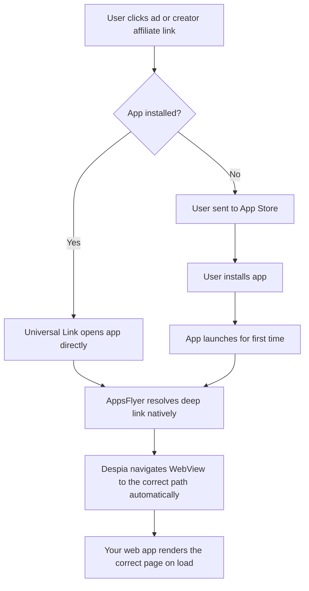

## Installation

<Tabs>
  <Tab title="Bundle">
    <CodeGroup>

    ```bash npm
    npm install despia-native
    ```

    ```bash pnpm
    pnpm add despia-native
    ```

    ```bash yarn
    yarn add despia-native
    ```

    </CodeGroup>

    ```javascript
    import despia from 'despia-native';
    ```
  </Tab>
  <Tab title="CDN">
    <CodeGroup>

    ```html UMD
    <script src="https://cdn.jsdelivr.net/npm/despia-native/index.min.js"></script>
    ```

    ```html ESM
    <script type="module">
        import despia from 'https://cdn.jsdelivr.net/npm/despia-native/+esm'
    </script>
    ```

    </CodeGroup>
  </Tab>
</Tabs>

Deep linking routes users to the correct page inside your app from an ad, campaign link, or creator affiliate link. Despia handles both cases: users who already have the app installed and users who install after clicking a link (deferred deep linking). Your web layer only needs to read the values and render the correct page.

<Info>
  Deferred deep linking works even if the user installed the app days after clicking the link. AppsFlyer stores the click data and delivers it on first launch.
</Info>

---

## How it works



<Info>
  Despia handles navigation automatically. When a deep link is resolved, the native layer navigates the WebView to the correct path directly. Your web app just renders whatever page it lands on, the same way it handles any other URL.
</Info>

<Steps>
  <Step title="Create a OneLink URL">
    In your AppsFlyer dashboard, go to **Engage > OneLink Management** and create a campaign link with `deep_link_value` and any custom params like `page_id` or `creator_code`.
  </Step>
  <Step title="Use the link in your ads or share with creators">
    Paste the generated OneLink URL into your TikTok or Meta ad creative, or give it to a content creator as their affiliate link.
  </Step>
  <Step title="Your web app renders the page">
    Despia navigates the WebView automatically. Your web router handles the path like any normal page load.
  </Step>
</Steps>

---

## Required: Map deep_link_value to a Real Route

This is the most important setup step. `deep_link_value` is not magic. It is a plain string that Despia appends to your app's base URL to build a path. If that path does not exist as a real route in your web app, the user will land on a blank page or 404.

**How the mapping works:**

```
deep_link_value = "product"
page_id         = "sneaker_42"
creator_code    = "alex123"

Despia navigates WebView to:
https://yourapp.com/product?page_id=sneaker_42&creator_code=alex123
```

Your web app must have a route at `/product` that reads `page_id` and `creator_code` from the query string and loads the correct content.

**Step 1: Decide your deep link routes**

Before creating any OneLink URLs, decide which pages you want to support as deep link destinations. Keep values short and URL-safe.

| deep_link_value | Route in your app | Use case |
|---|---|---|
| `product` | `/product` | Land on a specific product page |
| `collection` | `/collection` | Land on a curated collection |
| `profile` | `/profile` | Land on a creator or user profile |
| `offer` | `/offer` | Land on a special offer or promo page |
| `onboarding` | `/onboarding` | Start a custom onboarding flow |
| `home` | `/` | Default home screen |

**Step 2: Add the routes to your web app**

Each `deep_link_value` must have a corresponding route in your client-side router. Here is how to handle the query params:

<Tabs>
  <Tab title="React Router">
    ```javascript
    // App.jsx
    import { Routes, Route, useSearchParams } from 'react-router-dom'

    function ProductPage() {
        const [params] = useSearchParams()
        const pageId      = params.get('page_id')
        const creatorCode = params.get('creator_code')

        // load the product and apply any creator discount/tracking
        useEffect(() => {
            loadProduct(pageId)
            if (creatorCode) trackCreatorReferral(creatorCode)
        }, [pageId, creatorCode])

        return <div>...</div>
    }

    export default function App() {
        return (
            <Routes>
                <Route path="/"            element={<Home />} />
                <Route path="/product"     element={<ProductPage />} />
                <Route path="/collection"  element={<CollectionPage />} />
                <Route path="/profile"     element={<ProfilePage />} />
                <Route path="/offer"       element={<OfferPage />} />
                <Route path="/onboarding"  element={<OnboardingPage />} />
            </Routes>
        )
    }
    ```
  </Tab>
  <Tab title="Vue Router">
    ```javascript
    // router/index.js
    const routes = [
        { path: '/',           component: Home },
        { path: '/product',    component: ProductPage },
        { path: '/collection', component: CollectionPage },
        { path: '/profile',    component: ProfilePage },
        { path: '/offer',      component: OfferPage },
        { path: '/onboarding', component: OnboardingPage }
    ]

    // ProductPage.vue
    const pageId      = route.query.page_id
    const creatorCode = route.query.creator_code
    ```
  </Tab>
  <Tab title="Plain JS">
    ```javascript
    // Read path and params on any page load
    const path   = window.location.pathname
    const params = new URLSearchParams(window.location.search)
    const pageId      = params.get('page_id')
    const creatorCode = params.get('creator_code')

    if (path === '/product' && pageId) {
        loadProduct(pageId)
        if (creatorCode) trackCreatorReferral(creatorCode)
    }
    ```
  </Tab>
</Tabs>

**Step 3: Use the exact same value in your OneLink URL**

Whatever route path you set up in your web app, use the same string (without the leading slash) as `deep_link_value` in your OneLink campaign URL.

```
deep_link_value=product     ✓  matches route /product
deep_link_value=Product     ✗  wrong case, route won't match
deep_link_value=product-page ✗  wrong slug, route won't match
```

<Warning>
  `deep_link_value` is case-sensitive and must exactly match your route path without the leading slash. If the route does not exist in your web app, the user will land on your app's 404 or fallback page.
</Warning>

---

## Read Deep Link Parameters

Even though Despia navigates automatically, the full deep link data is also available in `despia.appsFlyerAttribution` on every page load. Use this to personalize content based on the campaign or creator params.

```javascript
import despia from 'despia-native';

const attr = despia.appsFlyerAttribution

const deepLinkValue = attr.deep_link_value  // e.g. "product"
const pageId        = attr.page_id          // e.g. "sneaker_42"
const creatorCode   = attr.deep_link_sub1   // e.g. "alex123"
const sub2          = attr.deep_link_sub2   // additional routing param
```

<ResponseField name="deep_link_value" type="string">
  The main routing value. Despia navigates the WebView to this path automatically, e.g. `"product"`, `"collection"`, `"offer"`
</ResponseField>

<ResponseField name="page_id" type="string">
  A specific content ID to load on the destination page, e.g. a product ID, collection ID, or profile ID
</ResponseField>

<ResponseField name="deep_link_sub1" type="string">
  General-purpose sub-parameter. Commonly used for creator or affiliate codes.
</ResponseField>

<ResponseField name="deep_link_sub2" type="string">
  General-purpose sub-parameter for additional routing context
</ResponseField>

---

## Personalize the Page on Load

```javascript
import despia from 'despia-native';

const attr = despia.appsFlyerAttribution

if (attr.page_id) {
    loadProduct(attr.page_id)
}

if (attr.deep_link_sub1) {
    // show creator welcome message or apply their promo
    showCreatorWelcome(attr.deep_link_sub1)
}
```

---

## Creator and Affiliate Links

Deep linking works great for content creator and influencer affiliate campaigns. Each creator gets their own OneLink URL with their unique code. When a user installs via a creator link, you know exactly which creator drove the install and can attribute credit, apply discounts, or personalize the welcome experience.

**Example creator link:**

```
https://yourapp.onelink.me/xxxx?pid=influencer_int&c=summer_campaign&deep_link_value=product&page_id=sneaker_42&deep_link_sub1=alex123
```

**When the user opens the app:**

```javascript
import despia from 'despia-native';

const attr = despia.appsFlyerAttribution

// deep_link_sub1 carries the creator's affiliate code
const creatorCode = attr.deep_link_sub1  // "alex123"
const productId   = attr.page_id         // "sneaker_42"

if (creatorCode) {
    // show "You were referred by Alex" welcome screen
    showCreatorWelcomeScreen(creatorCode)

    // apply creator's discount or track commission
    applyCreatorDiscount(creatorCode)

    // log the referral event back to AppsFlyer
    const referral = {
        "af_sub1": creatorCode,
        "af_content_id": productId
    }
    despia("appsflyer://log_event?event_name=creator_referral&event_values=" + encodeURIComponent(JSON.stringify(referral)))
}
```

<Tip>
  Use `deep_link_sub1` through `deep_link_sub5` for creator and affiliate parameters. These map cleanly to AppsFlyer's `af_sub1` through `af_sub5` fields which are available in raw data exports and the AppsFlyer dashboard for commission reporting.
</Tip>

---

## Re-engagements: window.onAppsFlyerDeepLink

For re-engagements, when a user who already has the app installed taps a campaign or creator link while the app is open, Despia calls `window.onAppsFlyerDeepLink` with the full click event data. Define this function to handle routing when the app is already running.

```javascript
window.onAppsFlyerDeepLink = (data) => {
    const deepLinkValue = data.deep_link_value
    const pageId        = data.page_id
    const creatorCode   = data.deep_link_sub1

    if (deepLinkValue === "product") {
        window.location.href = `/product?page_id=${pageId}&creator_code=${creatorCode}`

    } else if (deepLinkValue === "offer") {
        window.location.href = `/offer?id=${pageId}`

    } else if (deepLinkValue === "profile") {
        window.location.href = `/profile?id=${pageId}`
    }
}
```

<Tip>
  Define `window.onAppsFlyerDeepLink` as early as possible in your app, ideally at the top level of your entry file, so it is always available when Despia calls it.
</Tip>

---

## OneLink URL Structure

```
https://yourapp.onelink.me/xxxx?pid=tiktokads_int&c=summer_2025&deep_link_value=product&page_id=sneaker_42&deep_link_sub1=alex123
```

<ParamField path="deep_link_value" type="string" required>
  The main routing destination. Despia uses this to navigate the WebView to the correct path automatically.
</ParamField>

<ParamField path="page_id" type="string">
  A specific content ID to load on the destination page
</ParamField>

<ParamField path="deep_link_sub1" type="string">
  General-purpose sub-parameter. Commonly used for creator codes, affiliate IDs, or promo codes.
</ParamField>

<ParamField path="deep_link_sub2" type="string">
  General-purpose sub-parameter for additional context
</ParamField>

<ParamField path="pid" type="string">
  Media source identifier, e.g. `"tiktokads_int"`, `"facebook"`, `"influencer_int"`. Set in the AppsFlyer dashboard.
</ParamField>

<ParamField path="c" type="string">
  Campaign name for attribution and reporting
</ParamField>

---

## Despia Dashboard Setup

All deep linking configuration is handled directly in the Despia dashboard. No code changes, no native setup required.

<Steps>
  <Step title="Open AppsFlyer Integration">
    Go to **Despia > App > Settings > Integrations > AppsFlyer**
  </Step>
  <Step title="Add your OneLink URLs">
    Enter your OneLink subdomain and any OneLink URLs you want the app to handle as deep links
  </Step>
  <Step title="Add your ad platform IDs">
    Enter your Facebook App ID, TikTok App ID, AdMob App ID, and any other ad platform credentials in the same screen
  </Step>
  <Step title="Save and rebuild">
    Save the configuration and rebuild your app. Despia handles all the native plumbing automatically on both iOS and Android.
  </Step>
</Steps>

<Info>
  Despia configures Universal Links on iOS and App Links on Android automatically based on the OneLink URLs you enter in the dashboard. No entitlements files, no native developer involvement required.
</Info>

---

## Frequently Asked Questions

<AccordionGroup>
  <Accordion title="Does Despia navigate the WebView automatically?">
    Yes. When a deep link is resolved natively, Despia builds the full URL from `deep_link_value` and any custom params, then navigates the WebView to that path directly. Your web app handles it like any normal page load. You do not need to implement any navigation logic for this case.
  </Accordion>
  <Accordion title="What is window.onAppsFlyerDeepLink for?">
    This is for re-engagements only, when a user who already has the app installed taps a campaign or creator link while the app is open. In this case the page has already loaded so there is no new page load. Despia calls `window.onAppsFlyerDeepLink(data)` with the click event data so your app can respond to the new link without a full page reload.
  </Accordion>
  <Accordion title="Does deferred deep linking work if the user installs days later?">
    Yes. AppsFlyer stores the click data server-side with a configurable lookback window (default 7 days). When the user installs and opens the app within that window, the deep link parameters are delivered on first launch and Despia navigates automatically.
  </Accordion>
  <Accordion title="What if deep_link_value is null?">
    The user did not come from a deep link campaign. Despia will not navigate anywhere and the app opens to its default page normally.

    ```javascript
    if (attr.deep_link_value) {
        // came from a deep link campaign or creator link
    } else {
        // normal launch, show home screen
    }
    ```
  </Accordion>
  <Accordion title="How do I track which creator drove the most installs?">
    Give each creator a unique OneLink URL with their code in `deep_link_sub1`. In your AppsFlyer dashboard, filter raw data by `af_sub1` to see installs, events, and revenue per creator. You can also fire a custom `creator_referral` event on first launch to track conversions per creator in your own backend.
  </Accordion>
  <Accordion title="Can I pass custom parameters beyond deep_link_value?">
    Yes. Add any query parameter to your OneLink URL and it will be available in `despia.appsFlyerAttribution`. Use `deep_link_sub1` through `deep_link_sub5` for standard affiliate and creator params. For fully custom parameters, access them via `attr.raw`.
  </Accordion>
</AccordionGroup>

---

## Resources

<CardGroup cols={2}>
  <Card icon="npm" href="https://www.npmjs.com/package/despia-native" title="NPM Package">
    Install the Despia SDK
  </Card>
  <Card icon="link" href="https://support.appsflyer.com/hc/en-us/articles/208874366" title="AppsFlyer OneLink Docs">
    Create and manage OneLink campaign URLs
  </Card>
  <Card icon="envelope" href="mailto:support@despia.com" title="Support">
    Contact our support team
  </Card>
</CardGroup>