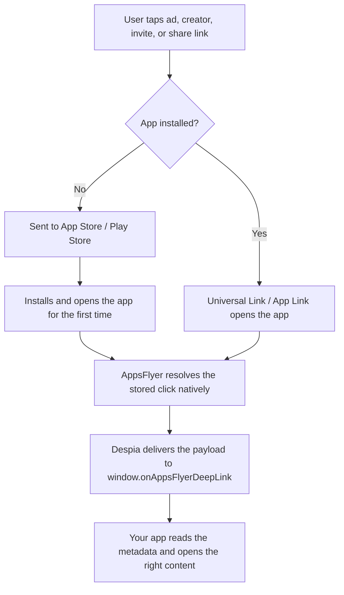

Deep linking carries the context of a click into your app. When someone taps your ad, a creator's affiliate link, an invite, or a share of a specific product or episode, the data you attached to that link (a product ID, a creator code, an invite code, an episode ID, an offer) is delivered to your app when it opens. This is the whole point of deferred deep linking: the user does not have the app yet, taps the link, gets sent to the App Store or Play Store, installs, and opens, and the original context still arrives on that first launch. Instead of dumping them on a generic home screen, you open the exact product, creator page, episode, or offer they came for.

<Info>
  Your app decides what happens with the data. Despia resolves the link natively and hands you the payload. It never navigates the WebView to a URL built from the link, so there is no 404 risk and no routing you are forced into. What you do with the metadata, redirect, fetch, or render in place, is entirely your app logic.
</Info>

## Installation

<Tabs>
  <Tab title="Bundle">
    <CodeGroup>

    ```bash npm
    npm install despia-native
    ```

    ```bash pnpm
    pnpm add despia-native
    ```

    ```bash yarn
    yarn add despia-native
    ```

    </CodeGroup>

    ```javascript
    import despia from 'despia-native';
    ```
  </Tab>
  <Tab title="CDN">
    <CodeGroup>

    ```html UMD
    <script src="https://cdn.jsdelivr.net/npm/despia-native/index.min.js"></script>
    ```

    ```html ESM
    <script type="module">
        import despia from 'https://cdn.jsdelivr.net/npm/despia-native/+esm'
    </script>
    ```

    </CodeGroup>
  </Tab>
</Tabs>

---

## How it works


```mermaid
flowchart TD
    A["User taps ad, creator, invite, or share link"] --> B{"App installed?"}
    B -->|"No"| D["Sent to App Store / Play Store"]
    D --> E["Installs and opens the app for the first time"]
    B -->|"Yes"| C["Universal Link / App Link opens the app"]
    E --> F["AppsFlyer resolves the stored click natively"]
    C --> F
    F --> G["Despia delivers the payload to window.onAppsFlyerDeepLink"]
    G --> H["Your app reads the metadata and opens the right content"]
```

You attach the context you care about to a OneLink when you create it (which product, which creator, which invite code). AppsFlyer stores that click server-side. When the app opens, the SDK resolves it and Despia calls `window.onAppsFlyerDeepLink(payload)` with that data. On a fresh install this is the deferred case: the click was stored before the app existed on the device, and it is delivered on first launch. Despia keeps registered OneLink domains out of the WebView entirely, so the user never sees a redirect page and your app never has to parse a link.

<Info>
  Deferred deep linking works even if the user installs days after clicking. AppsFlyer stores the click with a configurable lookback window (default 7 days) and delivers it on the first launch inside that window.
</Info>

---

## What arrives in the app

The callback receives a plain object: the data you put on the link, delivered intact. A typical creator campaign for a specific product looks like this:

```json
{
    "deep_link_value": "product",
    "page_id": "sneaker_42",
    "deep_link_sub1": "alex123",
    "media_source": "influencer_int",
    "campaign": "summer_2025",
    "is_first_launch": true,
    "af_status": "Non-organic"
}
```

Two fields do the routing work, and the rest is context:

`deep_link_value` tells you what kind of destination this is, for example `"product"`, `"collection"`, `"creator"`, `"episode"`, or `"offer"`. It is just a string you chose when you built the link. The `deep_link_sub1` through `deep_link_sub10` params carry the specifics, the product ID, the creator or affiliate code, the invite code, the episode ID. Along with `deep_link_value`, these ten sub params are the fields AppsFlyer guarantees on a deferred first-launch resolution, so put anything a fresh install must receive into them. You can also add your own named params like `page_id` or `episode_id`, and they arrive as top-level keys on the callback, but read the reliability note below before relying on them for deferred installs.

<Warning>
  On a deferred install, a brand-new user resolving through AppsFlyer Unified Deep Linking, only `deep_link_value` and `deep_link_sub1` through `deep_link_sub10` are guaranteed in the payload. Arbitrary custom keys are excluded from the UDL payload by design. Despia still surfaces them in practice, because it also forwards AppsFlyer's conversion-data payload on first launch and that payload carries your custom params for click-matched installs, but that is a fallback path, not the guaranteed one. For anything a fresh install must not lose, use `deep_link_sub1` through `deep_link_sub10`.
</Warning>

<Info>
  On a deferred install both native paths can fire, so your handler may be called more than once. Keep it idempotent. The session-flag dedupe shown under Cold-start fallback covers this.
</Info>

---

## Use the data

You get the object, you do whatever your app needs. There is no required pattern. The three most common:

Redirect to a page that loads its own content from the params:

```javascript
window.onAppsFlyerDeepLink = function (payload) {
    if (payload.deep_link_value) {
        // e.g. /product?id=sneaker_42&ref=alex123, and that page fetches on load
        const qs = new URLSearchParams({ id: payload.page_id, ref: payload.deep_link_sub1 })
        window.location.assign("/" + payload.deep_link_value + "?" + qs)
    }
}
```

Make the backend call right there and open the dynamic content, no navigation at all:

```javascript
window.onAppsFlyerDeepLink = async function (payload) {
    if (payload.deep_link_value === "product") {
        const product = await fetch("/api/products/" + payload.page_id).then(r => r.json())
        openProductScreen(product)
    }
    if (payload.deep_link_value === "creator") {
        const creator = await fetch("/api/creators/" + payload.page_id).then(r => r.json())
        openCreatorProfile(creator)
    }
}
```

Apply an invite or affiliate code and drop the user into the referred experience:

```javascript
window.onAppsFlyerDeepLink = function (payload) {
    const creatorCode = payload.deep_link_sub1    // guaranteed on deferred installs
    const inviteCode  = payload.deep_link_sub2    // keep critical codes in sub1-sub10

    if (creatorCode) applyCreatorReferral(creatorCode)
    if (inviteCode)  applyInvite(inviteCode)

    if (payload.page_id) openContent(payload.deep_link_value, payload.page_id)
}
```

If your app already uses a client-side router, mapping `deep_link_value` to a route is one clean way to do the same thing, but it is an option, not a requirement:

```javascript
// Optional: router-based dispatch
const ROUTES = { product: "/product", creator: "/creator", episode: "/episode", offer: "/offer" }

window.onAppsFlyerDeepLink = function (payload) {
    const path = ROUTES[payload.deep_link_value]
    if (!path) return  // unknown value, leave the user on the current screen
    navigate(path + "?id=" + payload.page_id)  // your router's navigate
}
```

Read the metadata from the callback payload, not from the page URL. The OneLink's query string is never appended to your app's own URL.

---

## Register the callback early

Define `window.onAppsFlyerDeepLink` as early as possible, ideally in an inline script in your document `<head>`, before your app bundle loads. Despia queues deep links that arrive before the page is ready and replays them roughly 300 ms after the page registers, so the handler must already exist by then. Assign it bare, outside any user agent gate, since setting a property on `window` is harmless when the app runs outside Despia.

```javascript
// index.html, before the bundle loads
<script>
  window.__pendingDeepLink = null
  window.onAppsFlyerDeepLink = (payload) => { window.__pendingDeepLink = payload }
</script>
```

```javascript
// later, once your app and data layer are ready, drain the queue and take over
function installDeepLinkHandler(handle) {
    if (window.__pendingDeepLink) {
        handle(window.__pendingDeepLink)
        window.__pendingDeepLink = null
    }
    window.onAppsFlyerDeepLink = handle
}
```

---

## When the callback fires

| Scenario | What happens |
| --- | --- |
| Fresh install (deferred) | On first launch the stored click resolves and the callback fires. `deep_link_value` and `deep_link_sub1` through `deep_link_sub10` are guaranteed; custom named params arrive when the conversion-data fallback matches the click. This is the case deep linking exists for. |
| App installed, link tapped | The link opens the app, AppsFlyer resolves it, and the callback fires with the click payload. Attribution updates to `install_type: "re-engagement"`. |
| Paid install without deep\_link\_value | The callback still fires on first launch for non-organic installs, so you can personalize onboarding from `media_source` or `campaign` even when the ad carried no routing value. |
| Organic install, no link | The callback does not fire. `despia.appsFlyerReferrer` is `"organic"`. |

<Info>
  On iOS, deferred resolution happens after the App Tracking Transparency prompt is answered (the SDK waits up to 60 seconds for it), so on a fresh install the callback can arrive well after your first page render. Keep the handler installed, do not treat it as launch-time-only.
</Info>

---

## Cold-start fallback

The last resolved deep link also persists inside the injected attribution object. If your page reloads after the callback already fired, read it from there and de-duplicate with your own one-shot flag:

```javascript
const attr = despia.appsFlyerAttribution
const dlv = attr?.deep_link_value

if (dlv && sessionStorage.getItem("dl_handled") !== dlv) {
    sessionStorage.setItem("dl_handled", dlv)
    window.onAppsFlyerDeepLink(attr.raw ?? attr)
}
```

---

## Payload reference

<ResponseField name="deep_link_value" type="string">
  The kind of destination, chosen by you when creating the OneLink, e.g. `"product"`, `"creator"`, `"episode"`, `"offer"`. Keep values short and URL-safe.
</ResponseField>

<ResponseField name="page_id" type="string">
  The specific content ID to load, e.g. a product ID, episode ID, or profile ID. A custom param, but a special-cased one: Despia also lifts `page_id` to a top-level normalized field on `despia.appsFlyerAttribution` (both platforms). Other custom keys only appear under `despia.appsFlyerAttribution.raw`. On the callback payload every key is top-level regardless.
</ResponseField>

<ResponseField name="deep_link_sub1 ... deep_link_sub10" type="string">
  Ten general-purpose values from the OneLink, commonly a creator code, affiliate code, or invite code. Along with `deep_link_value`, these are the only fields AppsFlyer guarantees on a deferred first-launch resolution, so use them for anything a fresh install must receive. `deep_link_sub1` also doubles as the `appsFlyerReferrer` fallback when `deep_link_value` is absent, so set both together.
</ResponseField>

<ResponseField name="[your custom params]" type="string">
  Any parameter you add to the OneLink (`episode_id`, `season`, `ref`, ...) arrives as a top-level key on the callback payload, and under `despia.appsFlyerAttribution.raw` on the attribution object. Reliable on direct opens and re-engagements. On a deferred install they come through the conversion-data fallback rather than the guaranteed UDL payload, so move must-have IDs into `deep_link_sub1` through `deep_link_sub10`.
</ResponseField>

<ResponseField name="media_source / campaign" type="string">
  The attributed network and campaign for this click.
</ResponseField>

<ResponseField name="is_first_launch" type="boolean">
  `true` when the payload comes from a deferred deep link on first launch.
</ResponseField>

<ResponseField name="af_status" type="string">
  `"Organic"` or `"Non-organic"` (first-launch conversion payloads only).
</ResponseField>

---

## Creator and Affiliate Links

Give each creator their own OneLink with a unique code in `deep_link_sub1` and the content they are promoting in `page_id`. When a user installs through that link, the code arrives on first launch, so you know exactly which creator drove the install and can credit them, apply their discount, and open the product they were promoting.

```text
https://yourapp.onelink.me/xxxx?pid=influencer_int&c=summer_2025&deep_link_value=product&page_id=sneaker_42&deep_link_sub1=alex123
```

```javascript
window.onAppsFlyerDeepLink = function (payload) {
    const creatorCode = payload.deep_link_sub1  // "alex123"
    const productId   = payload.page_id         // "sneaker_42"

    if (creatorCode) {
        showCreatorWelcome(creatorCode)
        applyCreatorDiscount(creatorCode)

        // report the referral back to AppsFlyer for commission tracking
        const referral = { af_sub1: creatorCode, af_content_id: productId }
        despia("appsflyer://log_event?event_name=creator_referral&event_values=" + encodeURIComponent(JSON.stringify(referral)))
    }

    if (productId) openProductScreen(productId)
}
```

Filter raw data by `af_sub1` in your AppsFlyer dashboard to see installs, events, and revenue per creator.

---

## Create the OneLink

<Steps>
  <Step title="Create a OneLink URL">
    In your AppsFlyer dashboard, go to **Engage \> OneLink Management** and create a link. Attach a `deep_link_value` and put the IDs a fresh install must receive into `deep_link_sub1` through `deep_link_sub10`. `page_id` and other named params work too, but are only guaranteed on direct opens and re-engagements, see the reliability note above.
  </Step>
  <Step title="Register the OneLink domain with your app">
    Your OneLink domain (e.g. `yourapp.onelink.me`) must be registered in your Despia app build so the OS opens the app directly and Despia keeps the URL out of the WebView. Links from unregistered domains behave like ordinary web links.
  </Step>
  <Step title="Use the link in ads or hand it to creators">
    Paste the OneLink into your TikTok or Meta ad creative, or give it to a content creator as their affiliate link.
  </Step>
  <Step title="Read the payload in your app">
    Your `onAppsFlyerDeepLink` handler receives the metadata and opens the right content. That is the whole contract.
  </Step>
</Steps>

<Warning>
  Adding or changing OneLink domains and ad platform IDs in the Despia Editor requires a fresh native build. Until you rebuild and users install the new version, the OS will not open your app from those links and the metadata will not be delivered.
</Warning>

---

## Frequently Asked Questions

<AccordionGroup>
  <Accordion title="What is the actual point of deferred deep linking?">
    To carry the context of a click into the app on first launch even though the user did not have the app when they clicked. They tap your ad or a creator link, install from the store, open the app, and the product, creator, invite, or episode they came for is available immediately. Without it, every install lands on a generic home screen and the campaign context is lost.
  </Accordion>

  <Accordion title="Do I have to use a router?">
    No. You receive a plain object and do whatever you want with it, redirect, run a backend call and render the result, apply a code, or open a screen in place. A router is just one convenient way to dispatch on `deep_link_value` if your app already has one.
  </Accordion>

  <Accordion title="What if deep_link_value is null?">
    The user did not come from a deep link campaign. Read `media_source` and `campaign` from the payload if you still want to personalize a paid install, otherwise show your default page.
  </Accordion>

  <Accordion title="Can I pass my own custom parameters?">
    Yes. Named params (`episode_id`, `ref`, ...) arrive as top-level keys on the callback payload and under `despia.appsFlyerAttribution.raw`. One caveat for deferred installs: AppsFlyer's Unified Deep Linking payload only guarantees `deep_link_value` and `deep_link_sub1` through `deep_link_sub10` for a brand-new user. Custom keys still tend to arrive because Despia also forwards the conversion-data payload on first launch, but that is a fallback, so put anything a fresh install must have into `deep_link_sub1` through `deep_link_sub10`.
  </Accordion>
</AccordionGroup>

---

## Resources

<CardGroup cols={2}>
  <Card title="NPM Package" icon="npm" href="https://www.npmjs.com/package/despia-native">
    despia-native
  </Card>

  <Card title="Support" icon="envelope" href="mailto:support@despia.com">
    [support@despia.com](mailto:support@despia.com)
  </Card>
</CardGroup>