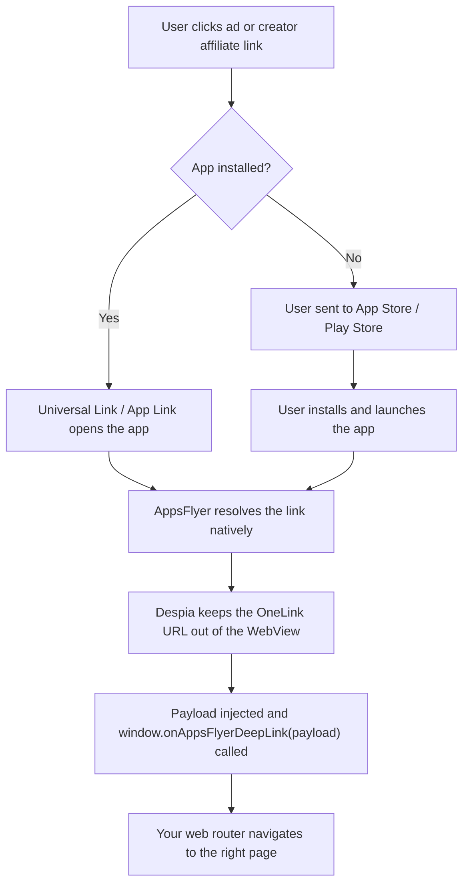

Deep linking routes users to the correct page inside your app from an ad, campaign link, or creator affiliate link. Despia handles both cases: users who already have the app installed, and users who install after clicking the link (deferred deep linking).

<Info>
  Your web app owns the navigation. Despia resolves the link natively and delivers the payload to your web layer. It never navigates the WebView to a URL built from `deep_link_value`. There is no auto-navigation and therefore no 404 risk: an unhandled deep link simply lands the user on your normal start page with the payload available in `despia.appsFlyerAttribution`.
</Info>

## Installation

<Tabs>
  <Tab title="Bundle">
    <CodeGroup>

    ```bash npm
    npm install despia-native
    ```

    ```bash pnpm
    pnpm add despia-native
    ```

    ```bash yarn
    yarn add despia-native
    ```

    </CodeGroup>

    ```javascript
    import despia from 'despia-native';
    ```
  </Tab>
  <Tab title="CDN">
    <CodeGroup>

    ```html UMD
    <script src="https://cdn.jsdelivr.net/npm/despia-native/index.min.js"></script>
    ```

    ```html ESM
    <script type="module">
        import despia from 'https://cdn.jsdelivr.net/npm/despia-native/+esm'
    </script>
    ```

    </CodeGroup>
  </Tab>
</Tabs>

---

## How it works


```mermaid
flowchart TD
    A["User clicks ad or creator affiliate link"] --> B{"App installed?"}
    B -->|"Yes"| C["Universal Link / App Link opens the app"]
    B -->|"No"| D["User sent to App Store / Play Store"]
    D --> E["User installs and launches the app"]
    C --> F["AppsFlyer resolves the link natively"]
    E --> F
    F --> G["Despia keeps the OneLink URL out of the WebView"]
    G --> H["Payload injected and window.onAppsFlyerDeepLink(payload) called"]
    H --> I["Your web router navigates to the right page"]
```

The OneLink URL itself is never loaded as a page. Despia blocks registered OneLink domains from the WebView entirely and lets the AppsFlyer SDK resolve them, so the user never sees the redirect page and your web app never has to parse a OneLink URL.

<Info>
  Deferred deep linking works even if the user installed the app days after clicking the link. AppsFlyer stores the click data and delivers it on first launch.
</Info>

---

## Handle the Deep Link Callback

This is the most important setup step. Define `window.onAppsFlyerDeepLink` as early as possible, ideally in an inline script in your document `<head>`, before your app bundle loads. Despia queues deep links that arrive before your page is ready and replays them roughly 300 ms after the page registers, so the handler must already exist by then. Assign the callback bare, outside any user agent gate, since setting a property on `window` is harmless when the app runs outside Despia.

<Tabs>
  <Tab title="React Router">
    ```javascript
    // index.html, capture early, before the bundle loads
    <script>
      window.__pendingDeepLink = null
      window.onAppsFlyerDeepLink = (payload) => { window.__pendingDeepLink = payload }
    </script>
    
    // App.jsx, consume once the router is ready
    import { useNavigate } from 'react-router-dom'
    import { useEffect } from 'react'
    
    const ROUTES = {
        product:    "/product",
        collection: "/collection",
        profile:    "/profile",
        offer:      "/offer",
    }
    
    function DeepLinkListener() {
        const navigate = useNavigate()
    
        useEffect(() => {
            const route = (payload) => {
                const path = ROUTES[payload.deep_link_value] ?? "/"
                const params = new URLSearchParams()
                if (payload.page_id)      params.set("page_id", payload.page_id)
                if (payload.creator_code) params.set("creator_code", payload.creator_code)
                navigate(path + (params.size ? "?" + params : ""))
            }
    
            if (window.__pendingDeepLink) {
                route(window.__pendingDeepLink)
                window.__pendingDeepLink = null
            }
            window.onAppsFlyerDeepLink = route
        }, [navigate])
    
        return null
    }
    ```
  </Tab>
  <Tab title="Vanilla JS">
    ```javascript
    // As early as possible in the page
    window.onAppsFlyerDeepLink = function (payload) {
        const routes = {
            product:    "/product",
            collection: "/collection",
            profile:    "/profile",
            offer:      "/offer",
        }
        const path = routes[payload.deep_link_value]
        if (!path) return  // unknown value, stay where we are
    
        const params = new URLSearchParams()
        if (payload.page_id)      params.set("page_id", payload.page_id)
        if (payload.creator_code) params.set("creator_code", payload.creator_code)
    
        window.location.assign(path + (params.size ? "?" + params : ""))
    }
    ```
  </Tab>
</Tabs>

Map each `deep_link_value` you use in your OneLinks to a route in your app, and read custom parameters like `page_id` and `creator_code` from the callback payload, not from the page URL. The OneLink's query string is never appended to your app's URL.

---

## When the callback fires

| Scenario | What happens |
| --- | --- |
| App installed, link clicked | The link opens the app, AppsFlyer Unified Deep Linking resolves it, and the callback fires with the click payload. Attribution is updated to `install_type: "re-engagement"`. |
| Fresh install (deferred) | On first launch, the stored click resolves and the callback fires with the full conversion payload, including `deep_link_value` and your custom params. |
| Paid install without deep\_link\_value | The callback still fires on first launch for non-organic installs, so you can personalize onboarding from `media_source` or `campaign` even when the ad link carried no routing value. |
| Organic install, no link | The callback does not fire. `despia.appsFlyerReferrer` is `"organic"`. |

<Info>
  On iOS, deferred resolution happens after the App Tracking Transparency prompt is answered (the SDK waits up to 60 seconds for it), so on a fresh install the callback can arrive well after your first page render. Keep the handler installed, do not treat it as launch-time-only.
</Info>

---

## Cold-start fallback

The last resolved deep link also persists inside the injected attribution object. If your page reloads after the callback already fired, read it from there and de-duplicate with your own one-shot flag:

```javascript
const attr = despia.appsFlyerAttribution
const dlv = attr?.deep_link_value

if (dlv && sessionStorage.getItem("dl_handled") !== dlv) {
    sessionStorage.setItem("dl_handled", dlv)
    window.onAppsFlyerDeepLink(attr.raw ?? attr)
}
```

---

## Payload reference

The callback receives the raw AppsFlyer click or conversion event. Typical fields:

```json
{
    "deep_link_value": "product",
    "page_id": "sneaker_42",
    "creator_code": "alex123",
    "deep_link_sub1": "alex123",
    "media_source": "influencer_int",
    "campaign": "summer_2025",
    "is_first_launch": true,
    "af_status": "Non-organic"
}
```

<ResponseField name="deep_link_value" type="string">
  Your routing value, set when creating the OneLink. Keep values short and URL-safe.
</ResponseField>

<ResponseField name="deep_link_sub1 / deep_link_sub2" type="string">
  Secondary routing values from the OneLink. Commonly used for creator or affiliate codes, and map to AppsFlyer's `af_sub1` and `af_sub2` in raw-data exports.
</ResponseField>

<ResponseField name="page_id, creator_code, ..." type="string">
  Any custom parameter you add to the OneLink appears as a top-level key in the payload.
</ResponseField>

<ResponseField name="media_source / campaign" type="string">
  The attributed network and campaign for this click.
</ResponseField>

<ResponseField name="is_first_launch" type="boolean">
  `true` when the payload comes from a deferred deep link on first launch.
</ResponseField>

<ResponseField name="af_status" type="string">
  `"Organic"` or `"Non-organic"` (first-launch conversion payloads only).
</ResponseField>

---

## Creator and Affiliate Links

Deep linking works well for creator and influencer campaigns. Give each creator their own OneLink with a unique code in `deep_link_sub1`. When a user installs through a creator link you know exactly which creator drove the install, so you can attribute credit, apply a discount, or personalize the welcome experience.

```text
https://yourapp.onelink.me/xxxx?pid=influencer_int&c=summer_2025&deep_link_value=product&page_id=sneaker_42&deep_link_sub1=alex123
```

```javascript
window.onAppsFlyerDeepLink = function (payload) {
    const creatorCode = payload.deep_link_sub1  // "alex123"
    const productId   = payload.page_id         // "sneaker_42"

    if (creatorCode) {
        showCreatorWelcomeScreen(creatorCode)
        applyCreatorDiscount(creatorCode)

        // log the referral back to AppsFlyer for commission reporting
        const referral = { af_sub1: creatorCode, af_content_id: productId }
        despia("appsflyer://log_event?event_name=creator_referral&event_values=" + encodeURIComponent(JSON.stringify(referral)))
    }
}
```

Filter raw data by `af_sub1` in your AppsFlyer dashboard to see installs, events, and revenue per creator.

---

## Create the OneLink

<Steps>
  <Step title="Create a OneLink URL">
    In your AppsFlyer dashboard, go to **Engage \> OneLink Management** and create a campaign link with a `deep_link_value` and any custom params like `page_id` or `creator_code`.
  </Step>
  <Step title="Register the OneLink domain with your app">
    Your OneLink domain (e.g. `yourapp.onelink.me`) must be registered in your Despia app build so the OS opens the app directly and Despia keeps the URL out of the WebView. Links from unregistered domains behave like ordinary URLs.
  </Step>
  <Step title="Use the link in ads or share with creators">
    Paste the OneLink URL into your TikTok or Meta ad creative, or give it to a content creator as their affiliate link.
  </Step>
  <Step title="Route in your web app">
    Your `onAppsFlyerDeepLink` handler receives the payload and navigates. That is the whole contract.
  </Step>
</Steps>

<Warning>
  Adding or changing OneLink domains and ad platform IDs in the Despia Editor requires a fresh native build. Until you rebuild and users install the new version, the OS will not open your app from those links and Despia will not keep the URL out of the WebView.
</Warning>

---

## Frequently Asked Questions

<AccordionGroup>
  <Accordion title="Does Despia navigate the WebView for me?">
    No. Despia resolves the link natively and calls `window.onAppsFlyerDeepLink(payload)`. Your web router decides where to go. This is why there is no 404 risk from an unmapped `deep_link_value`, an unhandled value simply leaves the user on your start page.
  </Accordion>

  <Accordion title="What if deep_link_value is null?">
    The user did not come from a deep link campaign. Read `media_source` and `campaign` from the payload if you still want to personalize onboarding for a paid install, otherwise show your default page.
  </Accordion>

  <Accordion title="Does deferred deep linking work if the user installs days later?">
    Yes. AppsFlyer stores the click server-side with a configurable lookback window (default 7 days). When the user installs and opens the app within that window, the deep link parameters are delivered on first launch and the callback fires.
  </Accordion>

  <Accordion title="Can I pass custom parameters beyond deep_link_value?">
    Yes. Any query parameter you add to the OneLink arrives as a top-level key on the callback payload and also appears under `despia.appsFlyerAttribution.raw`. Use `deep_link_sub1` through `deep_link_sub5` for standard affiliate and creator params.
  </Accordion>
</AccordionGroup>

---

## Resources

<CardGroup cols={2}>
  <Card title="NPM Package" icon="npm" href="https://www.npmjs.com/package/despia-native">
    despia-native
  </Card>

  <Card title="Support" icon="envelope" href="mailto:support@despia.com">
    [support@despia.com](mailto:support@despia.com)
  </Card>
</CardGroup>