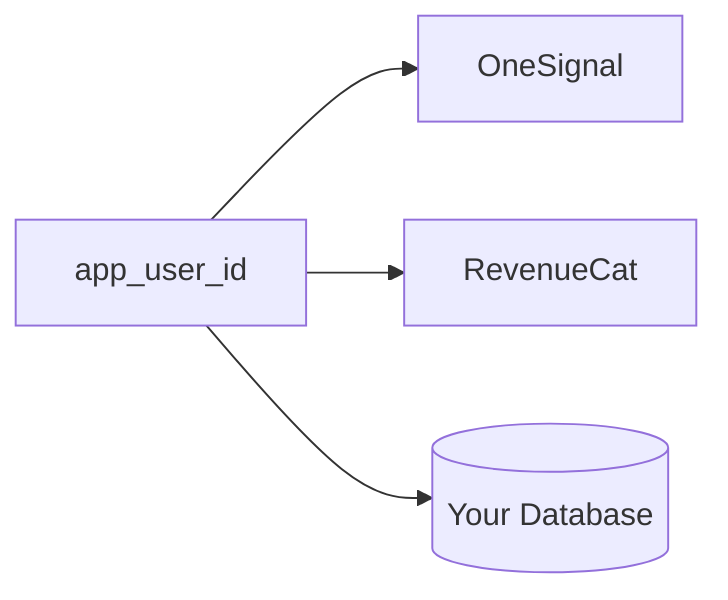
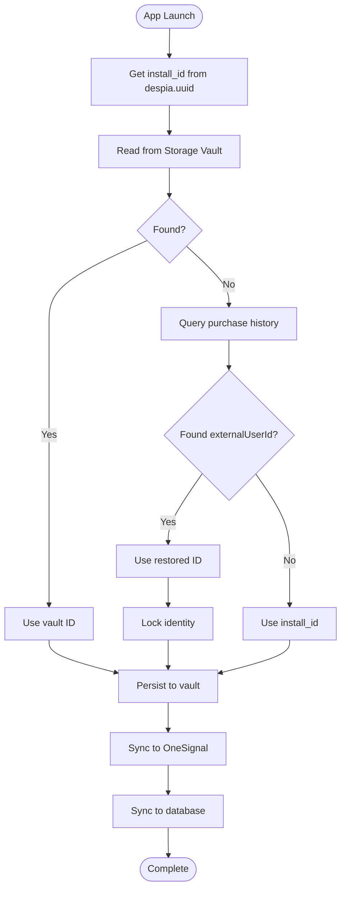
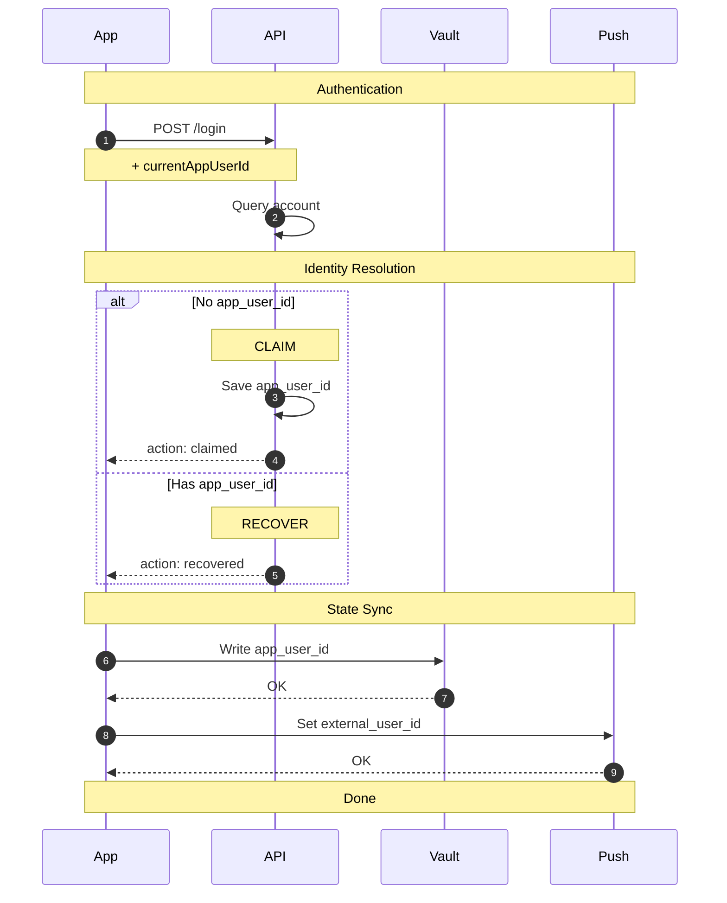
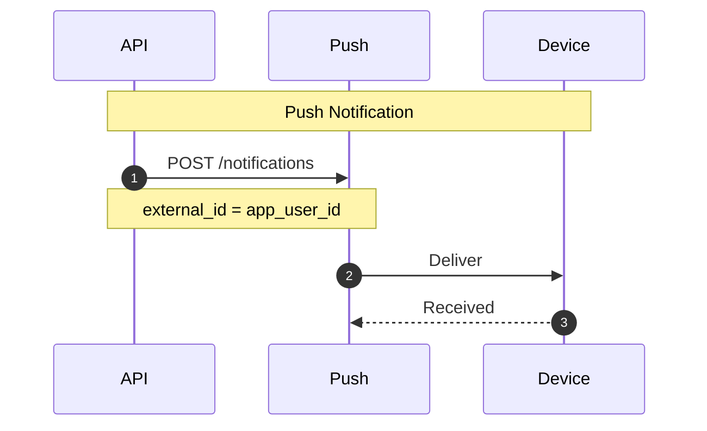

## Overview

Push notifications require linking each user to a unique identifier (`app_user_id`) that persists across sessions and devices. This identifier connects OneSignal, RevenueCat, and your backend database.



The same `app_user_id` must be used consistently across all services to ensure users receive the correct notifications.

---

## Identity Resolution

On every app launch, resolve the user's identity using the following priority:

| Priority | Source            | Description                                |
| :------- | :---------------- | :----------------------------------------- |
| 1        | Storage Vault     | Synced via iCloud/Google backup            |
| 2        | Restore Purchases | Recovers paying users via `externalUserId` |
| 3        | Install ID        | Fallback for new users (`despia.uuid`)     |



---

## Implementation

### App Startup

Execute this logic on every app launch:

```javascript
import despia from 'despia-native';

async function initializeIdentity() {
  const ua = navigator.userAgent.toLowerCase();
  if (!ua.includes('despia')) {
    return null;
  }
  
  const installId = despia.uuid;
  let appUserId = null;
  let source = 'new';
  
  // Step 1: Attempt to read from Storage Vault
  try {
    const vaultData = await despia('readvault://?key=app_user_id', ['app_user_id']);
    if (vaultData?.app_user_id) {
      appUserId = vaultData.app_user_id;
      source = 'vault';
    }
  } catch (error) {
    // Vault read failed, continue to next source
  }
  
  // Step 2: Attempt to recover from purchase history
  if (!appUserId) {
    try {
      const data = await despia('getpurchasehistory://', ['restoredData']);
      const purchases = data.restoredData || [];
      
      // Prioritize active subscriptions, then most recent purchase
      const activePurchase = purchases.find(p => p.isActive && p.externalUserId);
      const recentPurchase = purchases
        .filter(p => p.externalUserId)
        .sort((a, b) => new Date(b.purchaseDate) - new Date(a.purchaseDate))[0];
      
      const recoveredId = activePurchase?.externalUserId || recentPurchase?.externalUserId;
      
      if (recoveredId) {
        appUserId = recoveredId;
        source = 'restore';
        
        // Lock identity to prevent accidental changes
        await despia('setvault://?key=identity_locked&value=true&locked=false');
      }
    } catch (error) {
      // Purchase history unavailable, continue to fallback
    }
  }
  
  // Step 3: Fall back to install ID for new users
  if (!appUserId) {
    appUserId = installId;
    source = 'new';
  }
  
  // Step 4: Persist to Storage Vault
  try {
    await despia(`setvault://?key=app_user_id&value=${appUserId}&locked=false`);
  } catch (error) {
    // Vault write failed, continue with sync
  }
  
  // Step 5: Sync to OneSignal
  despia(`setonesignalplayerid://?user_id=${appUserId}`);
  
  // Step 6: Sync to backend database
  try {
    await fetch('/api/user/register', {
      method: 'POST',
      headers: { 'Content-Type': 'application/json' },
      body: JSON.stringify({
        appUserId,
        deviceId: installId,
        source,
        platform: ua.includes('android') ? 'android' : 'ios',
        timestamp: new Date().toISOString()
      })
    });
  } catch (error) {
    // Queue for retry on next launch
    const queue = JSON.parse(localStorage.getItem('identity_sync_queue') || '[]');
    queue.push({ appUserId, installId, source, queuedAt: Date.now() });
    localStorage.setItem('identity_sync_queue', JSON.stringify(queue));
  }
  
  return { appUserId, installId, source };
}
```

**Important:** The `setonesignalplayerid://` protocol must be called on every app launch, not only during first install. Users who were active before push notifications were implemented will not trigger login flows again. This is the only opportunity to sync their identity to OneSignal.

---

### User Login

When a user authenticates, the backend determines whether to claim the current identity or recover an existing one.



```javascript
async function handleUserLogin(accountId, credentials) {
  const response = await fetch('/api/user/login', {
    method: 'POST',
    headers: { 'Content-Type': 'application/json' },
    body: JSON.stringify({
      accountId,
      currentAppUserId: appUserId,
      credentials
    })
  });
  
  if (!response.ok) {
    throw new Error('Login failed');
  }
  
  const { appUserId: returnedId, action } = await response.json();
  
  // Update Storage Vault
  await despia(`setvault://?key=app_user_id&value=${returnedId}&locked=false`);
  
  // Sync to OneSignal
  despia(`setonesignalplayerid://?user_id=${returnedId}`);
  
  // Update local state
  appUserId = returnedId;
  
  return { appUserId: returnedId, action };
}
```

---

### User Logout

On logout, generate a new anonymous identifier. Do not reuse the device's `install_id` to prevent identity collision between users on shared devices.

```javascript
async function handleUserLogout() {
  // Generate a unique anonymous identifier
  const newAnonymousId = `${despia.uuid}-${Date.now()}`;
  
  // Clear identity lock
  await despia('setvault://?key=identity_locked&value=false&locked=false');
  
  // Write new identity to vault
  await despia(`setvault://?key=app_user_id&value=${newAnonymousId}&locked=false`);
  
  // Sync to OneSignal
  despia(`setonesignalplayerid://?user_id=${newAnonymousId}`);
  
  // Register new anonymous user with backend
  try {
    await fetch('/api/user/register', {
      method: 'POST',
      headers: { 'Content-Type': 'application/json' },
      body: JSON.stringify({
        appUserId: newAnonymousId,
        deviceId: despia.uuid,
        source: 'logout',
        timestamp: new Date().toISOString()
      })
    });
  } catch (error) {
    // Queue for retry
    const queue = JSON.parse(localStorage.getItem('identity_sync_queue') || '[]');
    queue.push({ appUserId: newAnonymousId, installId: despia.uuid, source: 'logout', queuedAt: Date.now() });
    localStorage.setItem('identity_sync_queue', JSON.stringify(queue));
  }
  
  // Update local state
  appUserId = newAnonymousId;
  
  return newAnonymousId;
}
```

---

## Push Permission

### Automatic Mode (Default)

When Manual Push Permission is disabled in Despia settings, the permission prompt displays automatically on first launch. No additional code is required.

### Manual Mode

Enable Manual Push Permission in Despia settings to control when the prompt appears:

```javascript
// Request push permission
async function requestPushPermission() {
  await despia('registerpush://');
  
  // Verify permission status
  const status = await despia('checkNativePushPermissions://', ['nativePushEnabled']);
  return status.nativePushEnabled;
}

// Check current permission status
async function checkPushPermission() {
  const status = await despia('checkNativePushPermissions://', ['nativePushEnabled']);
  return status.nativePushEnabled;
}

// Direct user to system settings (for users who denied permission)
function openSystemSettings() {
  despia('settingsapp://');
}
```

---

## Backend Implementation

### Send Push Notification



#### Single User

```javascript
const ONESIGNAL_APP_ID = process.env.ONESIGNAL_APP_ID;
const ONESIGNAL_REST_API_KEY = process.env.ONESIGNAL_REST_API_KEY;

async function sendPushNotification(appUserId, title, message, data = {}) {
  const response = await fetch('https://onesignal.com/api/v1/notifications', {
    method: 'POST',
    headers: {
      'Authorization': `Basic ${ONESIGNAL_REST_API_KEY}`,
      'Content-Type': 'application/json'
    },
    body: JSON.stringify({
      app_id: ONESIGNAL_APP_ID,
      include_aliases: { external_id: [appUserId] },
      target_channel: 'push',
      headings: { en: title },
      contents: { en: message },
      data
    })
  });
  
  if (!response.ok) {
    throw new Error(`OneSignal API error: ${response.status}`);
  }
  
  return response.json();
}
```

#### Multiple Users

```javascript
async function sendPushNotificationToMany(appUserIds, title, message, data = {}) {
  const response = await fetch('https://onesignal.com/api/v1/notifications', {
    method: 'POST',
    headers: {
      'Authorization': `Basic ${ONESIGNAL_REST_API_KEY}`,
      'Content-Type': 'application/json'
    },
    body: JSON.stringify({
      app_id: ONESIGNAL_APP_ID,
      include_aliases: { external_id: appUserIds },
      target_channel: 'push',
      headings: { en: title },
      contents: { en: message },
      data
    })
  });
  
  return response.json();
}
```

#### All Users

```javascript
async function sendPushNotificationToAll(title, message, data = {}) {
  const response = await fetch('https://onesignal.com/api/v1/notifications', {
    method: 'POST',
    headers: {
      'Authorization': `Basic ${ONESIGNAL_REST_API_KEY}`,
      'Content-Type': 'application/json'
    },
    body: JSON.stringify({
      app_id: ONESIGNAL_APP_ID,
      included_segments: ['All'],
      headings: { en: title },
      contents: { en: message },
      data
    })
  });
  
  return response.json();
}
```

---

### User Registration Endpoint

```javascript
// POST /api/user/register
async function handleUserRegistration(req, res) {
  const { appUserId, deviceId, source, platform, timestamp } = req.body;
  
  if (!appUserId || !deviceId) {
    return res.status(400).json({ error: 'appUserId and deviceId are required' });
  }
  
  try {
    await db.query(`
      INSERT INTO app_users (
        app_user_id, device_id, platform, source, created_at, last_seen
      ) VALUES ($1, $2, $3, $4, $5, $5)
      ON CONFLICT (app_user_id) DO UPDATE SET
        device_id = EXCLUDED.device_id,
        platform = EXCLUDED.platform,
        last_seen = EXCLUDED.last_seen
    `, [appUserId, deviceId, platform, source, timestamp || new Date()]);
    
    return res.json({ success: true, appUserId });
  } catch (error) {
    console.error('User registration error:', error);
    return res.status(500).json({ error: 'Registration failed' });
  }
}
```

---

### User Login Endpoint

Use row-level locking to prevent race conditions when multiple devices authenticate simultaneously.

```javascript
// POST /api/user/login
async function handleUserLogin(req, res) {
  const client = await db.connect();
  
  try {
    const { accountId, currentAppUserId, credentials } = req.body;
    
    // Validate credentials here
    // ...
    
    await client.query('BEGIN');
    
    // Lock the account row to prevent concurrent modifications
    const accountResult = await client.query(
      'SELECT app_user_id FROM accounts WHERE id = $1 FOR UPDATE',
      [accountId]
    );
    
    if (accountResult.rows.length === 0) {
      await client.query('ROLLBACK');
      return res.status(404).json({ error: 'Account not found' });
    }
    
    const existingAppUserId = accountResult.rows[0].app_user_id;
    
    if (existingAppUserId) {
      // RECOVER: Account already has an app_user_id
      await client.query('COMMIT');
      
      return res.json({
        success: true,
        action: 'recovered',
        appUserId: existingAppUserId
      });
    } else {
      // CLAIM: Assign current app_user_id to account
      await client.query(
        'UPDATE accounts SET app_user_id = $1 WHERE id = $2',
        [currentAppUserId, accountId]
      );
      
      await client.query(`
        UPDATE app_users SET account_id = $1, is_anonymous = false WHERE app_user_id = $2
      `, [accountId, currentAppUserId]);
      
      await client.query('COMMIT');
      
      return res.json({
        success: true,
        action: 'claimed',
        appUserId: currentAppUserId
      });
    }
  } catch (error) {
    await client.query('ROLLBACK');
    console.error('Login error:', error);
    return res.status(500).json({ error: 'Login failed' });
  } finally {
    client.release();
  }
}
```

---

## User-to-User Messaging

For direct messaging features, push notifications serve as a fallback when the recipient is not actively using the app. For real-time messaging, consider dedicated services such as Stream or XMPP.

```javascript
async function notifyDirectMessage(recipientAccountId, senderName, messagePreview) {
  // Look up recipient's app_user_id
  const result = await db.query(
    'SELECT app_user_id FROM app_users WHERE account_id = $1',
    [recipientAccountId]
  );
  
  const recipientAppUserId = result.rows[0]?.app_user_id;
  if (!recipientAppUserId) {
    console.log('Recipient has no app_user_id registered');
    return;
  }
  
  await fetch('https://onesignal.com/api/v1/notifications', {
    method: 'POST',
    headers: {
      'Authorization': `Basic ${ONESIGNAL_REST_API_KEY}`,
      'Content-Type': 'application/json'
    },
    body: JSON.stringify({
      app_id: ONESIGNAL_APP_ID,
      include_aliases: { external_id: [recipientAppUserId] },
      target_channel: 'push',
      headings: { en: `Message from ${senderName}` },
      contents: { en: messagePreview },
      data: {
        type: 'direct_message',
        screen: 'chat'
      }
    })
  });
}
```

---

## Database Schema

```sql
CREATE TABLE app_users (
    id SERIAL PRIMARY KEY,
    app_user_id VARCHAR(255) NOT NULL UNIQUE,
    device_id VARCHAR(255),
    platform VARCHAR(20),
    source VARCHAR(50),
    is_anonymous BOOLEAN DEFAULT true,
    account_id VARCHAR(255),
    push_enabled BOOLEAN DEFAULT true,
    created_at TIMESTAMP DEFAULT NOW(),
    last_seen TIMESTAMP NOT NULL
);

CREATE INDEX idx_app_users_app_user_id ON app_users(app_user_id);
CREATE INDEX idx_app_users_account_id ON app_users(account_id);
CREATE INDEX idx_app_users_last_seen ON app_users(last_seen);

-- Add app_user_id column to existing accounts table
ALTER TABLE accounts ADD COLUMN app_user_id VARCHAR(255) UNIQUE;
CREATE INDEX idx_accounts_app_user_id ON accounts(app_user_id);
```

---

## Offline Retry Queue

Process queued identity syncs on app launch:

```javascript
async function processRetryQueue() {
  const queue = JSON.parse(localStorage.getItem('identity_sync_queue') || '[]');
  if (queue.length === 0) return;
  
  const remaining = [];
  
  for (const item of queue) {
    try {
      await fetch('/api/user/register', {
        method: 'POST',
        headers: { 'Content-Type': 'application/json' },
        body: JSON.stringify({
          appUserId: item.appUserId,
          deviceId: item.installId,
          source: 'retry'
        })
      });
    } catch (error) {
      // Retain items less than 24 hours old
      if (Date.now() - item.queuedAt < 24 * 60 * 60 * 1000) {
        remaining.push(item);
      }
    }
  }
  
  localStorage.setItem('identity_sync_queue', JSON.stringify(remaining));
}

// Call after identity initialization
processRetryQueue();
```

---

## Protocol Reference

| Protocol                             | Purpose                        | When to Call                    |
| :----------------------------------- | :----------------------------- | :------------------------------ |
| `setonesignalplayerid://?user_id=X`  | Set OneSignal external_user_id | Every app launch, login, logout |
| `readvault://?key=app_user_id`       | Read from Storage Vault        | App startup                     |
| `setvault://?key=X&value=Y&locked=Z` | Write to Storage Vault         | After identity resolution       |
| `getpurchasehistory://`              | Get purchase history           | Identity recovery               |
| `registerpush://`                    | Request push permission        | Manual mode only                |
| `checkNativePushPermissions://`      | Check push permission status   | Settings screens                |
| `settingsapp://`                     | Open system settings           | Re-engage denied users          |

---

## Related Documentation

- [Storage Vault](https://setup.despia.com/native-features/storage-vault)
- [OneSignal Setup](https://setup.despia.com/native-features/onesignal)