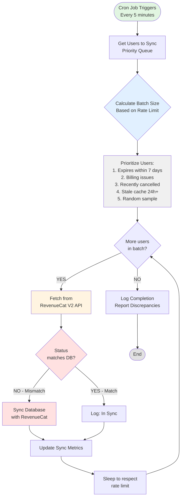

## Why You Need Cron-Based Sync

### The Problem with Webhooks Alone

Webhooks are the primary sync mechanism, but they can fail:

| Failure Scenario                     | Impact         | Probability       |
| :----------------------------------- | :------------- | :---------------- |
| Network timeout during delivery      | Webhook lost   | Low (~1-2%)       |
| Server downtime when webhook arrives | Webhook lost   | Low (~0.5%)       |
| Database transaction failure         | Data not saved | Very Low (~0.1%)  |
| Webhook processing bug               | Incorrect sync | Low (~1%)         |
| Cancellation webhook delay           | 2+ hour delay  | High (100%)       |
| RevenueCat retry exhausted           | Permanent loss | Very Low (~0.01%) |

**Result:** 1-3% of subscription changes may not sync immediately via webhooks.

### The Solution: Defense in Depth

```
Layer 1: Webhooks (Primary)          ─── 97-99% coverage
Layer 2: Cron Sync (Backup)          ─── Catches remaining 1-3%
Layer 3: User-Triggered Sync         ─── On-demand verification
```

**Combined reliability: 99.9%+ sync accuracy**

---

## Architecture Overview



---

## Rate Limit Calculation

### RevenueCat API Limits

**Hard Limit:** 480 requests per minute (8 requests per second)

### Safe Operating Parameters

```javascript
const RATE_LIMITS = {
  MAX_REQUESTS_PER_MINUTE: 480,
  SAFE_BUFFER: 0.7, // Use only 70% of limit (336 req/min)
  CRON_INTERVAL_MINUTES: 5,
  REQUESTS_PER_SECOND: 5.6, // 336 / 60 seconds
  MS_BETWEEN_REQUESTS: 179 // 1000ms / 5.6
};

// Calculate max users per cron run
const MAX_USERS_PER_RUN = Math.floor(
  RATE_LIMITS.MAX_REQUESTS_PER_MINUTE * 
  RATE_LIMITS.SAFE_BUFFER * 
  RATE_LIMITS.CRON_INTERVAL_MINUTES
);
// Result: 1,680 users per 5-minute run
```

### Why 70% Buffer?

1. **Other API usage:** Your app makes real-time API calls
2. **Webhook responses:** RevenueCat may call your webhook handlers
3. **Burst protection:** Avoid hitting rate limit spikes
4. **Multiple services:** Other systems may use the same API key

---

## Implementation

### Core Sync Function

```javascript
const REVENUECAT_API_KEY = process.env.REVENUECAT_API_KEY;
const REVENUECAT_PROJECT_ID = process.env.REVENUECAT_PROJECT_ID;

// Rate limit configuration
const RATE_LIMIT = {
  MAX_PER_MINUTE: 480,
  SAFE_BUFFER: 0.7,
  SAFE_REQUESTS_PER_MINUTE: 480 * 0.7, // 336
  MS_BETWEEN_REQUESTS: (60 * 1000) / (480 * 0.7), // ~179ms
  MAX_PER_5MIN_RUN: 336 * 5 // 1,680 users
};

/**
 * Main cron job function
 * Runs every 5 minutes
 */
async function syncSubscriptionsWithRevenueCat() {
  const startTime = Date.now();
  
  console.log(' Starting subscription sync job...');
  
  try {
    // Step 1: Get users to sync (prioritized)
    const usersToSync = await getUsersForSync(RATE_LIMIT.MAX_PER_5MIN_RUN);
    
    console.log(`Found ${usersToSync.length} users to sync`);
    
    // Step 2: Process in batches with rate limiting
    const results = {
      total: usersToSync.length,
      synced: 0,
      matched: 0,
      discrepancies: 0,
      errors: 0,
      notFound: 0
    };
    
    for (let i = 0; i < usersToSync.length; i++) {
      const user = usersToSync[i];
      
      try {
        // Fetch from RevenueCat V2
        const rcData = await fetchCustomerDataV2(
          user.app_user_id, 
          REVENUECAT_PROJECT_ID
        );
        
        if (!rcData) {
          results.notFound++;
          await logSyncResult(user.app_user_id, 'not_found');
          continue;
        }
        
        // Compare with database
        const hasDiscrepancy = await detectDiscrepancy(user, rcData);
        
        if (hasDiscrepancy) {
          // Sync database with RevenueCat
          await syncDatabaseWithRevenueCat(user.app_user_id, rcData);
          results.discrepancies++;
          results.synced++;
          
          console.log(` Synced ${user.app_user_id} - discrepancy found`);
          await logSyncResult(user.app_user_id, 'synced', hasDiscrepancy);
        } else {
          results.matched++;
          await logSyncResult(user.app_user_id, 'matched');
        }
        
      } catch (error) {
        results.errors++;
        console.error(` Error syncing ${user.app_user_id}:`, error.message);
        await logSyncError(user.app_user_id, error);
      }
      
      // Rate limiting: sleep between requests
      if (i < usersToSync.length - 1) {
        await sleep(RATE_LIMIT.MS_BETWEEN_REQUESTS);
      }
      
      // Progress logging every 100 users
      if ((i + 1) % 100 === 0) {
        console.log(`Progress: ${i + 1}/${usersToSync.length} users processed`);
      }
    }
    
    // Step 3: Log completion
    const duration = ((Date.now() - startTime) / 1000).toFixed(2);
    
    console.log(' Sync job completed', {
      duration: `${duration}s`,
      ...results,
      discrepancyRate: `${((results.discrepancies / results.total) * 100).toFixed(2)}%`
    });
    
    // Step 4: Alert if discrepancy rate is high
    const discrepancyRate = results.discrepancies / results.total;
    if (discrepancyRate > 0.05) {
      await sendAlert('High subscription discrepancy rate', {
        rate: `${(discrepancyRate * 100).toFixed(2)}%`,
        total: results.total,
        discrepancies: results.discrepancies
      });
    }
    
    // Step 5: Store metrics
    await storeSyncMetrics({
      timestamp: new Date(),
      duration_seconds: duration,
      ...results
    });
    
    return results;
    
  } catch (error) {
    console.error(' Sync job failed:', error);
    await sendAlert('Subscription sync job failed', { error: error.message });
    throw error;
  }
}

/**
 * Get users for sync - prioritized queue
 */
async function getUsersForSync(limit) {
  // Priority 1: Subscriptions expiring within 7 days
  const expiringUsers = await db.query(`
    SELECT app_user_id, is_active, expires_at, last_revenuecat_sync_at
    FROM user_subscriptions
    WHERE is_active = true
      AND expires_at IS NOT NULL
      AND expires_at BETWEEN NOW() AND NOW() + INTERVAL '7 days'
    ORDER BY expires_at ASC
    LIMIT $1
  `, [Math.floor(limit * 0.3)]); // 30% of quota
  
  // Priority 2: Billing issues
  const billingIssueUsers = await db.query(`
    SELECT app_user_id, is_active, expires_at, last_revenuecat_sync_at
    FROM user_subscriptions
    WHERE billing_issue = true
      AND is_active = true
    ORDER BY last_updated ASC
    LIMIT $1
  `, [Math.floor(limit * 0.2)]); // 20% of quota
  
  // Priority 3: Recently cancelled (within 48 hours)
  const recentlyCancelledUsers = await db.query(`
    SELECT app_user_id, is_active, expires_at, last_revenuecat_sync_at
    FROM user_subscriptions
    WHERE subscription_status = 'cancelled'
      AND cancelled_at > NOW() - INTERVAL '48 hours'
    ORDER BY cancelled_at DESC
    LIMIT $1
  `, [Math.floor(limit * 0.2)]); // 20% of quota
  
  // Priority 4: Stale cache (not synced in 24+ hours)
  const staleCacheUsers = await db.query(`
    SELECT app_user_id, is_active, expires_at, last_revenuecat_sync_at
    FROM user_subscriptions
    WHERE (last_revenuecat_sync_at IS NULL 
           OR last_revenuecat_sync_at < NOW() - INTERVAL '24 hours')
      AND is_active = true
    ORDER BY last_revenuecat_sync_at ASC NULLS FIRST
    LIMIT $1
  `, [Math.floor(limit * 0.2)]); // 20% of quota
  
  // Priority 5: Random sample of active users
  const randomUsers = await db.query(`
    SELECT app_user_id, is_active, expires_at, last_revenuecat_sync_at
    FROM user_subscriptions
    WHERE is_active = true
    ORDER BY RANDOM()
    LIMIT $1
  `, [Math.floor(limit * 0.1)]); // 10% of quota
  
  // Combine and deduplicate
  const allUsers = [
    ...expiringUsers.rows,
    ...billingIssueUsers.rows,
    ...recentlyCancelledUsers.rows,
    ...staleCacheUsers.rows,
    ...randomUsers.rows
  ];
  
  // Remove duplicates by app_user_id
  const uniqueUsers = Array.from(
    new Map(allUsers.map(user => [user.app_user_id, user])).values()
  );
  
  return uniqueUsers.slice(0, limit);
}

/**
 * Detect discrepancy between database and RevenueCat
 */
async function detectDiscrepancy(dbUser, rcData) {
  // Check if active status matches
  const dbIsActive = dbUser.is_active;
  const rcIsActive = rcData.active_entitlements?.items?.some(
    ent => ent.expires_at > Date.now()
  );
  
  if (dbIsActive !== rcIsActive) {
    return {
      type: 'active_status',
      db: dbIsActive,
      rc: rcIsActive
    };
  }
  
  // Check if entitlements match
  const dbEntitlements = dbUser.entitlements || {};
  const rcEntitlements = {};
  
  rcData.active_entitlements?.items?.forEach(ent => {
    if (ent.expires_at > Date.now()) {
      rcEntitlements[ent.entitlement_id] = ent.expires_at;
    }
  });
  
  const dbEntIds = Object.keys(dbEntitlements).sort();
  const rcEntIds = Object.keys(rcEntitlements).sort();
  
  if (JSON.stringify(dbEntIds) !== JSON.stringify(rcEntIds)) {
    return {
      type: 'entitlements',
      db: dbEntIds,
      rc: rcEntIds
    };
  }
  
  // Check if expiration dates match (within 1 minute tolerance)
  if (dbUser.expires_at && rcData.active_entitlements?.items?.length > 0) {
    const dbExpiresMs = new Date(dbUser.expires_at).getTime();
    const rcExpiresMs = Math.max(
      ...rcData.active_entitlements.items.map(ent => ent.expires_at)
    );
    
    const diffMs = Math.abs(dbExpiresMs - rcExpiresMs);
    if (diffMs > 60000) { // More than 1 minute difference
      return {
        type: 'expiration_date',
        db: new Date(dbExpiresMs).toISOString(),
        rc: new Date(rcExpiresMs).toISOString(),
        diff_minutes: (diffMs / 60000).toFixed(2)
      };
    }
  }
  
  return null; // No discrepancy
}

/**
 * Utility: Sleep function for rate limiting
 */
function sleep(ms) {
  return new Promise(resolve => setTimeout(resolve, ms));
}

/**
 * Log sync result to database
 */
async function logSyncResult(appUserId, status, discrepancy = null) {
  await db.query(`
    INSERT INTO sync_logs (
      app_user_id,
      status,
      discrepancy,
      synced_at
    ) VALUES ($1, $2, $3, NOW())
  `, [
    appUserId,
    status,
    discrepancy ? JSON.stringify(discrepancy) : null
  ]);
}

/**
 * Log sync error
 */
async function logSyncError(appUserId, error) {
  await db.query(`
    INSERT INTO sync_errors (
      app_user_id,
      error_message,
      error_stack,
      occurred_at
    ) VALUES ($1, $2, $3, NOW())
  `, [
    appUserId,
    error.message,
    error.stack
  ]);
}

/**
 * Store sync metrics for monitoring
 */
async function storeSyncMetrics(metrics) {
  await db.query(`
    INSERT INTO sync_metrics (
      timestamp,
      duration_seconds,
      total_users,
      synced_count,
      matched_count,
      discrepancies_count,
      errors_count,
      not_found_count,
      discrepancy_rate
    ) VALUES ($1, $2, $3, $4, $5, $6, $7, $8, $9)
  `, [
    metrics.timestamp,
    metrics.duration_seconds,
    metrics.total,
    metrics.synced,
    metrics.matched,
    metrics.discrepancies,
    metrics.errors,
    metrics.notFound,
    metrics.discrepancies / metrics.total
  ]);
}

/**
 * Send alert for critical issues
 */
async function sendAlert(title, details) {
  // TODO: Implement with your alerting system
  // Examples: Email, Slack, PagerDuty, etc.
  console.error(` ALERT: ${title}`, details);
  
  // Example Slack webhook:
  // await fetch(process.env.SLACK_WEBHOOK_URL, {
  //   method: 'POST',
  //   headers: { 'Content-Type': 'application/json' },
  //   body: JSON.stringify({
  //     text: ` ${title}`,
  //     attachments: [{ text: JSON.stringify(details, null, 2) }]
  //   })
  // });
}

module.exports = {
  syncSubscriptionsWithRevenueCat,
  getUsersForSync,
  detectDiscrepancy
};
```

---

## Cron Schedule Configuration

### Node.js with node-cron

```javascript
const cron = require('node-cron');
const { syncSubscriptionsWithRevenueCat } = require('./sync-job');

// Run every 5 minutes
cron.schedule('*/5 * * * *', async () => {
  console.log(' Cron job triggered:', new Date().toISOString());
  
  try {
    await syncSubscriptionsWithRevenueCat();
  } catch (error) {
    console.error('Cron job failed:', error);
  }
});

console.log(' Cron job scheduled: Every 5 minutes');
```

### System Crontab

```
# Edit crontab
crontab -e

# Add this line (runs every 5 minutes)
*/5 * * * * /usr/bin/node /path/to/your/app/sync-job.js >> /var/log/revenuecat-sync.log 2>&1
```

### Vercel Cron (Next.js)

```javascript
// vercel.json
{
  "crons": [
    {
      "path": "/api/cron/sync-subscriptions",
      "schedule": "*/5 * * * *"
    }
  ]
}

// pages/api/cron/sync-subscriptions.js
import { syncSubscriptionsWithRevenueCat } from '@/lib/sync-job';

export default async function handler(req, res) {
  // Verify cron secret
  if (req.headers.authorization !== `Bearer ${process.env.CRON_SECRET}`) {
    return res.status(401).json({ error: 'Unauthorized' });
  }
  
  try {
    const results = await syncSubscriptionsWithRevenueCat();
    return res.json({ success: true, results });
  } catch (error) {
    return res.status(500).json({ error: error.message });
  }
}
```

### AWS Lambda with EventBridge

```javascript
// handler.js
exports.handler = async (event) => {
  const { syncSubscriptionsWithRevenueCat } = require('./sync-job');
  
  try {
    const results = await syncSubscriptionsWithRevenueCat();
    
    return {
      statusCode: 200,
      body: JSON.stringify(results)
    };
  } catch (error) {
    console.error('Lambda sync failed:', error);
    
    return {
      statusCode: 500,
      body: JSON.stringify({ error: error.message })
    };
  }
};

// EventBridge rule (CloudFormation/Terraform)
// Rate: rate(5 minutes)
```

---

## Database Schema

### Sync Logs Table

```sql
CREATE TABLE sync_logs (
  id SERIAL PRIMARY KEY,
  app_user_id VARCHAR(255) NOT NULL,
  status VARCHAR(50) NOT NULL, -- matched, synced, not_found
  discrepancy JSONB,
  synced_at TIMESTAMP DEFAULT NOW()
);

CREATE INDEX idx_sync_logs_user ON sync_logs(app_user_id);
CREATE INDEX idx_sync_logs_status ON sync_logs(status);
CREATE INDEX idx_sync_logs_synced_at ON sync_logs(synced_at);
```

### Sync Errors Table

```sql
CREATE TABLE sync_errors (
  id SERIAL PRIMARY KEY,
  app_user_id VARCHAR(255) NOT NULL,
  error_message TEXT,
  error_stack TEXT,
  occurred_at TIMESTAMP DEFAULT NOW()
);

CREATE INDEX idx_sync_errors_user ON sync_errors(app_user_id);
CREATE INDEX idx_sync_errors_occurred_at ON sync_errors(occurred_at);
```

### Sync Metrics Table

```sql
CREATE TABLE sync_metrics (
  id SERIAL PRIMARY KEY,
  timestamp TIMESTAMP NOT NULL,
  duration_seconds DECIMAL(10, 2),
  total_users INTEGER,
  synced_count INTEGER,
  matched_count INTEGER,
  discrepancies_count INTEGER,
  errors_count INTEGER,
  not_found_count INTEGER,
  discrepancy_rate DECIMAL(5, 4)
);

CREATE INDEX idx_sync_metrics_timestamp ON sync_metrics(timestamp);
```

---

## Monitoring and Alerts

### Key Metrics to Track

```javascript
async function getSyncHealthMetrics() {
  // Last 24 hours
  const metrics = await db.query(`
    SELECT 
      COUNT(*) as total_runs,
      AVG(duration_seconds) as avg_duration,
      SUM(total_users) as total_users_processed,
      SUM(discrepancies_count) as total_discrepancies,
      AVG(discrepancy_rate) as avg_discrepancy_rate,
      SUM(errors_count) as total_errors
    FROM sync_metrics
    WHERE timestamp > NOW() - INTERVAL '24 hours'
  `);
  
  return metrics.rows[0];
}

// Alert thresholds
const ALERT_THRESHOLDS = {
  DISCREPANCY_RATE: 0.05, // 5%
  ERROR_RATE: 0.02, // 2%
  DURATION_SECONDS: 240, // 4 minutes (should complete in < 5 min)
  CONSECUTIVE_FAILURES: 3
};
```

### Health Check Endpoint

```javascript
// GET /api/health/sync-job
async function handleSyncHealthCheck(req, res) {
  const metrics = await getSyncHealthMetrics();
  
  const health = {
    status: 'healthy',
    metrics,
    issues: []
  };
  
  // Check discrepancy rate
  if (metrics.avg_discrepancy_rate > ALERT_THRESHOLDS.DISCREPANCY_RATE) {
    health.status = 'warning';
    health.issues.push({
      severity: 'warning',
      message: 'High discrepancy rate detected',
      value: `${(metrics.avg_discrepancy_rate * 100).toFixed(2)}%`
    });
  }
  
  // Check error rate
  const errorRate = metrics.total_errors / metrics.total_users_processed;
  if (errorRate > ALERT_THRESHOLDS.ERROR_RATE) {
    health.status = 'warning';
    health.issues.push({
      severity: 'warning',
      message: 'High error rate detected',
      value: `${(errorRate * 100).toFixed(2)}%`
    });
  }
  
  // Check if job ran recently (within 10 minutes)
  const lastRun = await db.query(`
    SELECT timestamp 
    FROM sync_metrics 
    ORDER BY timestamp DESC 
    LIMIT 1
  `);
  
  if (lastRun.rows[0]) {
    const minutesSinceLastRun = 
      (Date.now() - new Date(lastRun.rows[0].timestamp).getTime()) / 60000;
    
    if (minutesSinceLastRun > 10) {
      health.status = 'unhealthy';
      health.issues.push({
        severity: 'critical',
        message: 'Sync job not running',
        value: `Last run: ${minutesSinceLastRun.toFixed(0)} minutes ago`
      });
    }
  }
  
  return res.json(health);
}
```

---

## Best Practices

### 1. Gradual Rollout

Start with a small percentage of users:

```javascript
// Phase 1: 10% of users
const limit = Math.floor(RATE_LIMIT.MAX_PER_5MIN_RUN * 0.1);

// Phase 2: 50% of users (after 1 week)
const limit = Math.floor(RATE_LIMIT.MAX_PER_5MIN_RUN * 0.5);

// Phase 3: 100% of users (after 2 weeks)
const limit = RATE_LIMIT.MAX_PER_5MIN_RUN;
```

### 2. Avoid Peak Hours

Skip sync during high-traffic periods:

```javascript
function shouldSkipSync() {
  const hour = new Date().getUTCHours();
  
  // Skip 12pm-2pm UTC (peak usage)
  if (hour >= 12 && hour < 14) {
    console.log('  Skipping sync during peak hours');
    return true;
  }
  
  return false;
}

async function syncSubscriptionsWithRevenueCat() {
  if (shouldSkipSync()) {
    return { skipped: true, reason: 'peak_hours' };
  }
  
  // ... rest of sync logic
}
```

### 3. Circuit Breaker

Stop sync if too many errors occur:

```javascript
const CIRCUIT_BREAKER = {
  MAX_CONSECUTIVE_ERRORS: 50,
  RESET_AFTER_MS: 5 * 60 * 1000 // 5 minutes
};

let consecutiveErrors = 0;
let circuitOpenedAt = null;

async function syncWithCircuitBreaker(user) {
  // Check if circuit is open
  if (circuitOpenedAt) {
    const timeSinceOpened = Date.now() - circuitOpenedAt;
    
    if (timeSinceOpened < CIRCUIT_BREAKER.RESET_AFTER_MS) {
      throw new Error('Circuit breaker open - too many errors');
    } else {
      // Reset circuit
      circuitOpenedAt = null;
      consecutiveErrors = 0;
    }
  }
  
  try {
    const result = await syncUser(user);
    consecutiveErrors = 0; // Reset on success
    return result;
  } catch (error) {
    consecutiveErrors++;
    
    if (consecutiveErrors >= CIRCUIT_BREAKER.MAX_CONSECUTIVE_ERRORS) {
      circuitOpenedAt = Date.now();
      await sendAlert('Circuit breaker opened', {
        consecutiveErrors,
        lastError: error.message
      });
    }
    
    throw error;
  }
}
```

### 4. Exponential Backoff for Rate Limits

```javascript
async function fetchWithRetry(appUserId, projectId, maxRetries = 3) {
  for (let attempt = 0; attempt < maxRetries; attempt++) {
    try {
      return await fetchCustomerDataV2(appUserId, projectId);
    } catch (error) {
      if (error.message.includes('429') || error.message.includes('rate limit')) {
        const backoffMs = Math.pow(2, attempt) * 1000; // 1s, 2s, 4s
        console.warn(`Rate limited. Retrying in ${backoffMs}ms...`);
        await sleep(backoffMs);
      } else {
        throw error;
      }
    }
  }
  
  throw new Error('Max retries exceeded');
}
```

---

## Performance Optimization

### Batch Database Queries

```javascript
// Instead of querying one by one
for (const user of users) {
  const dbUser = await db.query('SELECT * FROM user_subscriptions WHERE app_user_id = $1', [user.app_user_id]);
  // ...
}

// Batch query
const userIds = users.map(u => u.app_user_id);
const dbUsers = await db.query(`
  SELECT * FROM user_subscriptions 
  WHERE app_user_id = ANY($1)
`, [userIds]);

const dbUserMap = new Map(dbUsers.rows.map(u => [u.app_user_id, u]));
```

### Parallel Processing (with rate limit)

```javascript
const pLimit = require('p-limit');

// Limit to 6 concurrent requests (respects ~6 req/sec)
const limit = pLimit(6);

const promises = users.map(user => 
  limit(() => syncUser(user))
);

const results = await Promise.allSettled(promises);
```

---

## Testing

### Manual Test

```javascript
// Test with single user
async function testSync(appUserId) {
  const user = await db.query(
    'SELECT * FROM user_subscriptions WHERE app_user_id = $1',
    [appUserId]
  );
  
  const rcData = await fetchCustomerDataV2(appUserId, REVENUECAT_PROJECT_ID);
  
  const discrepancy = await detectDiscrepancy(user.rows[0], rcData);
  
  console.log('Discrepancy:', discrepancy);
  
  if (discrepancy) {
    await syncDatabaseWithRevenueCat(appUserId, rcData);
    console.log('Synced!');
  }
}

testSync('user_abc123');
```

### Integration Test

```javascript
// Test full sync job with limited users
async function testSyncJob() {
  // Override limit for testing
  const originalLimit = RATE_LIMIT.MAX_PER_5MIN_RUN;
  RATE_LIMIT.MAX_PER_5MIN_RUN = 10; // Test with 10 users
  
  const results = await syncSubscriptionsWithRevenueCat();
  
  RATE_LIMIT.MAX_PER_5MIN_RUN = originalLimit;
  
  console.log('Test results:', results);
}
```

---

## Troubleshooting

### High Discrepancy Rate

**Symptom:** \> 5% of syncs show discrepancies

**Possible Causes:**

1. Webhooks not being processed
2. Database write failures
3. Race conditions in webhook handler

**Solution:**

```javascript
// Check webhook processing rate
const webhookStats = await db.query(`
  SELECT 
    COUNT(*) as total,
    COUNT(CASE WHEN processed_at IS NOT NULL THEN 1 END) as processed
  FROM processed_webhook_events
  WHERE created_at > NOW() - INTERVAL '24 hours'
`);

const processingRate = webhookStats.rows[0].processed / webhookStats.rows[0].total;
console.log('Webhook processing rate:', `${(processingRate * 100).toFixed(2)}%`);
```

### Job Taking Too Long

**Symptom:** Sync job runs longer than 5 minutes

**Solution:** Reduce batch size or increase frequency

```javascript
// Reduce to 70% capacity
const limit = Math.floor(RATE_LIMIT.MAX_PER_5MIN_RUN * 0.7);
```

### API Rate Limit Errors

**Symptom:** Getting 429 errors from RevenueCat

**Solution:** Increase sleep time between requests

```dotenv
RATE_LIMIT.MS_BETWEEN_REQUESTS = 250; // Slower (240 req/min)
```

---

## Quick Reference

### Sync Job Configuration

```javascript
const CONFIG = {
  CRON_SCHEDULE: '*/5 * * * *', // Every 5 minutes
  BATCH_SIZE: 1680, // Users per run
  RATE_LIMIT: 336, // Requests per minute (70% of 480)
  MS_BETWEEN_REQUESTS: 179, // Milliseconds
  PRIORITY_WEIGHTS: {
    EXPIRING_SOON: 0.3, // 30%
    BILLING_ISSUES: 0.2, // 20%
    RECENTLY_CANCELLED: 0.2, // 20%
    STALE_CACHE: 0.2, // 20%
    RANDOM_SAMPLE: 0.1 // 10%
  }
};
```

### Alert Thresholds

```javascript
const ALERTS = {
  DISCREPANCY_RATE: 0.05, // > 5%
  ERROR_RATE: 0.02, // > 2%
  MAX_DURATION: 240, // > 4 minutes
  STALE_JOB: 10 // No run in 10 minutes
};
```

### Priority Queue Logic

1. **Expires within 7 days** (30%) - Catch expiring subscriptions
2. **Billing issues** (20%) - Resolve payment problems
3. **Recently cancelled** (20%) - Detect un-cancellations
4. **Stale cache 24h+** (20%) - Refresh old data
5. **Random sample** (10%) - General health check

---

## Summary

**Cron job runs every 5 minutes**\
**Processes 1,680 users per run** (respects 70% rate limit buffer)\
**Prioritizes critical users** (expiring, billing issues, etc.)\
**Self-healing** - catches webhook failures automatically\
**Rate-limited** - 179ms between requests\
**Monitored** - tracks discrepancy rates and errors\
**Alerting** - notifies on high discrepancy/error rates

**Combined with webhooks: 99.9%+ sync reliability**