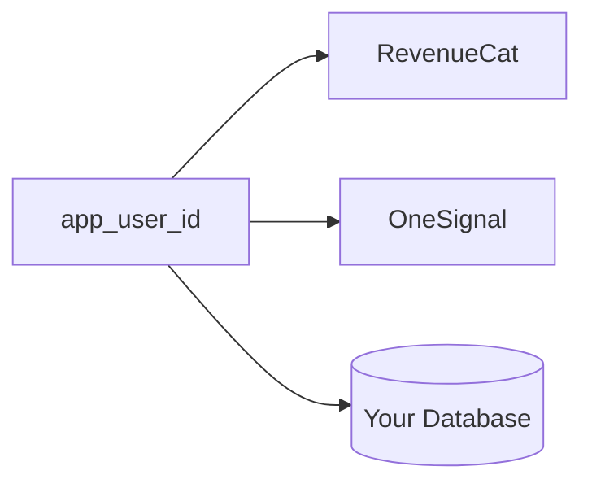
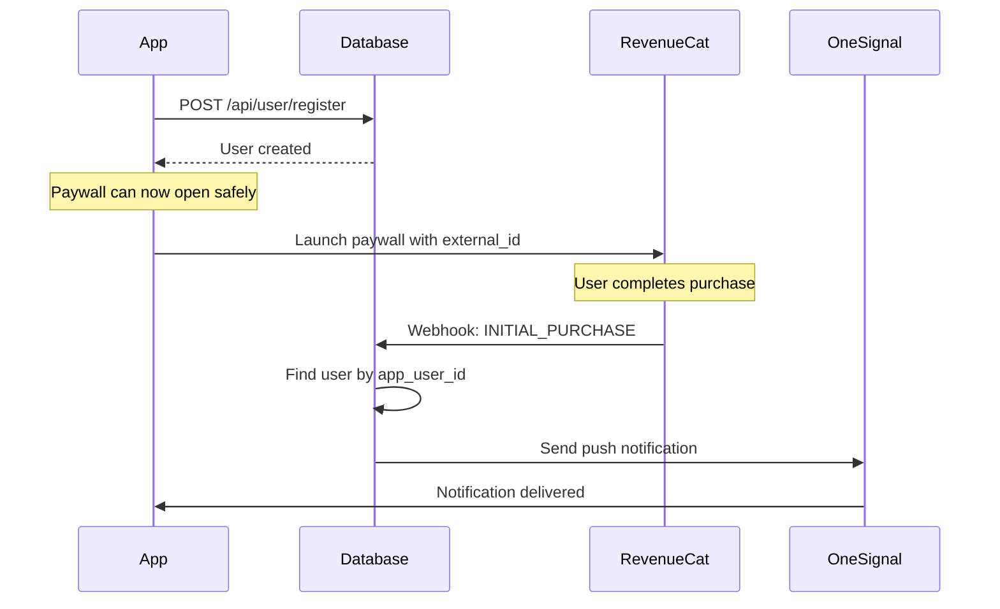
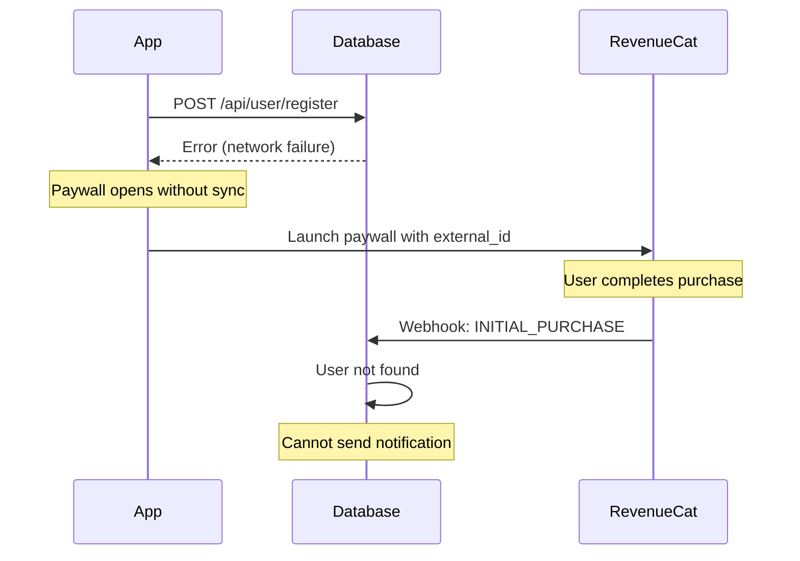
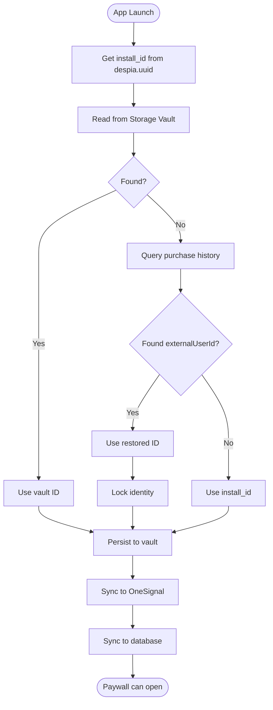

## Overview

RevenueCat requires linking each user to a unique identifier (`app_user_id`) that persists across sessions and devices. This identifier connects RevenueCat, OneSignal, and your backend database.



RevenueCat receives the user identity only when launching a paywall via the `external_id` parameter:

```javascript
despia(`revenuecat://launchPaywall?external_id=${appUserId}&offering=default`);
```

---

## Database Synchronization Requirement

The user must exist in your database before they can make a purchase. When RevenueCat sends a webhook after a purchase, your backend must be able to locate the user to send push notifications.

### Successful Flow



### Failed Flow (Database Sync Missing)



---

## Identity Resolution

On every app launch, resolve the user's identity using the following priority:

| Priority | Source            | Description                                |
| :------- | :---------------- | :----------------------------------------- |
| 1        | Storage Vault     | Synced via iCloud/Google backup            |
| 2        | Restore Purchases | Recovers paying users via `externalUserId` |
| 3        | Install ID        | Fallback for new users (`despia.uuid`)     |



---

## Implementation

### App Startup

Execute this logic on every app launch. Track both identity resolution and database synchronization status before allowing paywall access.

```javascript
import despia from 'despia-native';

// State tracking
let identityReady = false;
let databaseSynced = false;
let appUserId = null;
let installId = null;

async function initializeIdentity() {
  const ua = navigator.userAgent.toLowerCase();
  if (!ua.includes('despia')) {
    identityReady = true;
    databaseSynced = true;
    return null;
  }
  
  installId = despia.uuid;
  let source = 'new';
  
  // Step 1: Attempt to read from Storage Vault
  try {
    const vaultData = await despia('readvault://?key=app_user_id', ['app_user_id']);
    if (vaultData?.app_user_id) {
      appUserId = vaultData.app_user_id;
      source = 'vault';
    }
  } catch (error) {
    // Vault read failed, continue to next source
  }
  
  // Step 2: Attempt to recover from purchase history
  if (!appUserId) {
    try {
      const data = await despia('getpurchasehistory://', ['restoredData']);
      const purchases = data.restoredData || [];
      
      // Prioritize active subscriptions, then most recent purchase
      const activePurchase = purchases.find(p => p.isActive && p.externalUserId);
      const recentPurchase = purchases
        .filter(p => p.externalUserId)
        .sort((a, b) => new Date(b.purchaseDate) - new Date(a.purchaseDate))[0];
      
      const recoveredId = activePurchase?.externalUserId || recentPurchase?.externalUserId;
      
      if (recoveredId) {
        appUserId = recoveredId;
        source = 'restore';
        
        // Lock identity to prevent accidental changes
        await despia('setvault://?key=identity_locked&value=true&locked=false');
      }
    } catch (error) {
      // Purchase history unavailable, continue to fallback
    }
  }
  
  // Step 3: Fall back to install ID for new users
  if (!appUserId) {
    appUserId = installId;
    source = 'new';
  }
  
  // Step 4: Persist to Storage Vault
  try {
    await despia(`setvault://?key=app_user_id&value=${appUserId}&locked=false`);
  } catch (error) {
    // Vault write failed, continue with sync
  }
  
  identityReady = true;
  
  // Step 5: Sync to OneSignal
  despia(`setonesignalplayerid://?user_id=${appUserId}`);
  
  // Step 6: Sync to backend database (required for webhooks)
  try {
    await fetch('/api/user/register', {
      method: 'POST',
      headers: { 'Content-Type': 'application/json' },
      body: JSON.stringify({
        appUserId,
        deviceId: installId,
        source,
        platform: ua.includes('android') ? 'android' : 'ios',
        timestamp: new Date().toISOString()
      })
    });
    databaseSynced = true;
  } catch (error) {
    // Queue for retry on next launch
    const queue = JSON.parse(localStorage.getItem('identity_sync_queue') || '[]');
    queue.push({ appUserId, installId, source, queuedAt: Date.now() });
    localStorage.setItem('identity_sync_queue', JSON.stringify(queue));
    
    // Allow app to continue; webhook safety net will handle missing users
    databaseSynced = true;
  }
  
  return { appUserId, installId, source };
}
```

---

### Launch Paywall

Always verify that identity resolution and database synchronization are complete before opening the paywall.

```javascript
async function launchPaywall(offering = 'default') {
  // Wait for identity resolution
  while (!identityReady) {
    await new Promise(resolve => setTimeout(resolve, 50));
  }
  
  // Wait for database synchronization
  while (!databaseSynced) {
    await new Promise(resolve => setTimeout(resolve, 50));
  }
  
  // Safe to open paywall
  despia(`revenuecat://launchPaywall?external_id=${appUserId}&offering=${offering}`);
}
```

Example usage in a UI component:

```javascript
function UpgradeButton({ offering = 'premium' }) {
  const [loading, setLoading] = useState(false);
  
  const handlePress = async () => {
    setLoading(true);
    
    // Wait for identity and sync
    while (!identityReady || !databaseSynced) {
      await new Promise(resolve => setTimeout(resolve, 50));
    }
    
    despia(`revenuecat://launchPaywall?external_id=${appUserId}&offering=${offering}`);
    setLoading(false);
  };
  
  return (
    <button onClick={handlePress} disabled={loading}>
      {loading ? 'Loading...' : 'Upgrade'}
    </button>
  );
}
```

---

### Identity Locking

When a user has made purchases, lock their identity to prevent accidental changes that could orphan their purchase history.

```javascript
// Check if identity is locked on app startup
async function checkIdentityLock() {
  try {
    const lockData = await despia('readvault://?key=identity_locked', ['identity_locked']);
    return lockData?.identity_locked === 'true';
  } catch (error) {
    return false;
  }
}

// Lock identity after recovering purchases
async function lockIdentity() {
  await despia('setvault://?key=identity_locked&value=true&locked=false');
}

// Clear lock on logout
async function clearIdentityLock() {
  await despia('setvault://?key=identity_locked&value=false&locked=false');
}
```

---

### Check Subscription Status

```javascript
async function checkSubscriptionStatus() {
  try {
    const data = await despia('getpurchasehistory://', ['restoredData']);
    const purchases = data.restoredData || [];
    
    const activeSubscription = purchases.find(p => p.isActive);
    
    if (activeSubscription) {
      return {
        isSubscribed: true,
        productId: activeSubscription.productIdentifier,
        expiresAt: activeSubscription.expirationDate,
        externalUserId: activeSubscription.externalUserId
      };
    }
    
    return { isSubscribed: false };
  } catch (error) {
    console.error('Failed to check subscription status:', error);
    return { isSubscribed: false, error: error.message };
  }
}
```

---

### Restore Purchases

Provide a restore purchases button for users who need to recover their subscriptions on a new device.

```javascript
async function restorePurchases() {
  try {
    const data = await despia('getpurchasehistory://', ['restoredData']);
    const purchases = data.restoredData || [];
    
    // Find any purchase with an externalUserId
    const purchaseWithId = purchases.find(p => p.externalUserId);
    
    if (purchaseWithId) {
      const recoveredId = purchaseWithId.externalUserId;
      
      // Update Storage Vault
      await despia(`setvault://?key=app_user_id&value=${recoveredId}&locked=false`);
      await despia('setvault://?key=identity_locked&value=true&locked=false');
      
      // Sync to OneSignal
      despia(`setonesignalplayerid://?user_id=${recoveredId}`);
      
      // Update local state
      appUserId = recoveredId;
      
      // Sync to backend
      await fetch('/api/user/register', {
        method: 'POST',
        headers: { 'Content-Type': 'application/json' },
        body: JSON.stringify({
          appUserId: recoveredId,
          deviceId: installId,
          source: 'restore_button',
          timestamp: new Date().toISOString()
        })
      });
      
      return { success: true, appUserId: recoveredId };
    }
    
    return { success: false, message: 'No purchases found' };
  } catch (error) {
    return { success: false, error: error.message };
  }
}
```

---

### User Login

```javascript
async function handleUserLogin(accountId, credentials) {
  const response = await fetch('/api/user/login', {
    method: 'POST',
    headers: { 'Content-Type': 'application/json' },
    body: JSON.stringify({
      accountId,
      currentAppUserId: appUserId,
      credentials
    })
  });
  
  if (!response.ok) {
    throw new Error('Login failed');
  }
  
  const { appUserId: returnedId, action } = await response.json();
  
  // Update Storage Vault
  await despia(`setvault://?key=app_user_id&value=${returnedId}&locked=false`);
  
  // Sync to OneSignal
  despia(`setonesignalplayerid://?user_id=${returnedId}`);
  
  // Update local state
  appUserId = returnedId;
  
  return { appUserId: returnedId, action };
}
```

---

### User Logout

```javascript
async function handleUserLogout() {
  // Generate a unique anonymous identifier
  const newAnonymousId = `${despia.uuid}-${Date.now()}`;
  
  // Clear identity lock
  await despia('setvault://?key=identity_locked&value=false&locked=false');
  
  // Write new identity to vault
  await despia(`setvault://?key=app_user_id&value=${newAnonymousId}&locked=false`);
  
  // Sync to OneSignal
  despia(`setonesignalplayerid://?user_id=${newAnonymousId}`);
  
  // Register new anonymous user with backend
  await fetch('/api/user/register', {
    method: 'POST',
    headers: { 'Content-Type': 'application/json' },
    body: JSON.stringify({
      appUserId: newAnonymousId,
      deviceId: installId,
      source: 'logout',
      timestamp: new Date().toISOString()
    })
  });
  
  // Update local state
  appUserId = newAnonymousId;
  
  return newAnonymousId;
}
```

---

## Backend Implementation

### Webhook Handler

RevenueCat sends webhooks for subscription events. Your handler must be idempotent and include a safety net for missing users.

```javascript
const ONESIGNAL_APP_ID = process.env.ONESIGNAL_APP_ID;
const ONESIGNAL_REST_API_KEY = process.env.ONESIGNAL_REST_API_KEY;

// POST /api/webhooks/revenuecat
async function handleRevenueCatWebhook(req, res) {
  const { event } = req.body;
  const eventId = event.id;
  const eventType = event.type;
  const appUserId = event.app_user_id;
  
  // Idempotency check: skip if already processed
  const existingEvent = await db.query(
    'SELECT 1 FROM processed_webhook_events WHERE event_id = $1',
    [eventId]
  );
  
  if (existingEvent.rows.length > 0) {
    return res.json({ success: true, message: 'Event already processed' });
  }
  
  // Safety net: create user if missing
  await db.query(`
    INSERT INTO app_users (app_user_id, source, created_at, last_seen)
    VALUES ($1, 'webhook_safety_net', NOW(), NOW())
    ON CONFLICT (app_user_id) DO NOTHING
  `, [appUserId]);
  
  // Update subscription status
  const isActive = ['INITIAL_PURCHASE', 'RENEWAL', 'PRODUCT_CHANGE', 'UNCANCELLATION']
    .includes(eventType);
  
  await db.query(`
    INSERT INTO subscriptions (
      app_user_id, status, product_id, expires_at, billing_issue, updated_at
    ) VALUES ($1, $2, $3, $4, $5, NOW())
    ON CONFLICT (app_user_id) DO UPDATE SET
      status = EXCLUDED.status,
      product_id = EXCLUDED.product_id,
      expires_at = EXCLUDED.expires_at,
      billing_issue = EXCLUDED.billing_issue,
      updated_at = NOW()
  `, [
    appUserId,
    eventType.toLowerCase(),
    event.product_id,
    event.expiration_at_ms ? new Date(event.expiration_at_ms) : null,
    eventType === 'BILLING_ISSUE'
  ]);
  
  // Send push notification
  await sendSubscriptionNotification(appUserId, eventType);
  
  // Mark event as processed
  await db.query(`
    INSERT INTO processed_webhook_events (event_id, event_type, app_user_id, processed_at)
    VALUES ($1, $2, $3, NOW())
  `, [eventId, eventType, appUserId]);
  
  return res.json({ success: true });
}

async function sendSubscriptionNotification(appUserId, eventType) {
  const notifications = {
    'INITIAL_PURCHASE': {
      title: 'Welcome to Premium',
      message: 'Thank you for subscribing. Enjoy all premium features.'
    },
    'RENEWAL': {
      title: 'Subscription Renewed',
      message: 'Your subscription has been renewed successfully.'
    },
    'CANCELLATION': {
      title: 'Subscription Cancelled',
      message: 'Your subscription will remain active until the end of the billing period.'
    },
    'UNCANCELLATION': {
      title: 'Subscription Reactivated',
      message: 'Your subscription has been reactivated.'
    },
    'BILLING_ISSUE': {
      title: 'Payment Issue',
      message: 'There was a problem processing your payment. Please update your payment method.'
    },
    'EXPIRATION': {
      title: 'Subscription Expired',
      message: 'Your premium access has ended. Resubscribe to continue enjoying all features.'
    }
  };
  
  const notification = notifications[eventType];
  if (!notification) return;
  
  await fetch('https://onesignal.com/api/v1/notifications', {
    method: 'POST',
    headers: {
      'Authorization': `Basic ${ONESIGNAL_REST_API_KEY}`,
      'Content-Type': 'application/json'
    },
    body: JSON.stringify({
      app_id: ONESIGNAL_APP_ID,
      include_aliases: { external_id: [appUserId] },
      target_channel: 'push',
      headings: { en: notification.title },
      contents: { en: notification.message },
      data: { type: eventType, screen: 'subscription' }
    })
  });
}
```

---

### Webhook Event Types

| Event Type         | Description                              | Subscription Active |
| :----------------- | :--------------------------------------- | :------------------ |
| `INITIAL_PURCHASE` | First subscription purchase              | Yes                 |
| `RENEWAL`          | Subscription renewed                     | Yes                 |
| `PRODUCT_CHANGE`   | Upgraded or downgraded                   | Yes                 |
| `CANCELLATION`     | User cancelled (active until period end) | Yes                 |
| `UNCANCELLATION`   | User re-enabled auto-renew               | Yes                 |
| `BILLING_ISSUE`    | Payment failed                           | Yes (grace period)  |
| `EXPIRATION`       | Subscription ended                       | No                  |
| `TRANSFER`         | Transferred to different user            | Varies              |

---

### User Registration Endpoint

```javascript
// POST /api/user/register
async function handleUserRegistration(req, res) {
  const { appUserId, deviceId, source, platform, timestamp } = req.body;
  
  if (!appUserId || !deviceId) {
    return res.status(400).json({ error: 'appUserId and deviceId are required' });
  }
  
  try {
    await db.query(`
      INSERT INTO app_users (
        app_user_id, device_id, platform, source, created_at, last_seen
      ) VALUES ($1, $2, $3, $4, $5, $5)
      ON CONFLICT (app_user_id) DO UPDATE SET
        device_id = EXCLUDED.device_id,
        platform = EXCLUDED.platform,
        last_seen = EXCLUDED.last_seen
    `, [appUserId, deviceId, platform, source, timestamp || new Date()]);
    
    return res.json({ success: true, appUserId });
  } catch (error) {
    console.error('User registration error:', error);
    return res.status(500).json({ error: 'Registration failed' });
  }
}
```

---

### User Login Endpoint

Use row-level locking to prevent race conditions when multiple devices authenticate simultaneously.

```javascript
// POST /api/user/login
async function handleUserLogin(req, res) {
  const client = await db.connect();
  
  try {
    const { accountId, currentAppUserId, credentials } = req.body;
    
    // Validate credentials here
    // ...
    
    await client.query('BEGIN');
    
    // Lock the account row to prevent concurrent modifications
    const accountResult = await client.query(
      'SELECT app_user_id FROM accounts WHERE id = $1 FOR UPDATE',
      [accountId]
    );
    
    if (accountResult.rows.length === 0) {
      await client.query('ROLLBACK');
      return res.status(404).json({ error: 'Account not found' });
    }
    
    const existingAppUserId = accountResult.rows[0].app_user_id;
    
    if (existingAppUserId) {
      // RECOVER: Account already has an app_user_id
      await client.query('COMMIT');
      
      return res.json({
        success: true,
        action: 'recovered',
        appUserId: existingAppUserId
      });
    } else {
      // CLAIM: Assign current app_user_id to account
      await client.query(
        'UPDATE accounts SET app_user_id = $1 WHERE id = $2',
        [currentAppUserId, accountId]
      );
      
      await client.query(`
        UPDATE app_users SET account_id = $1, is_anonymous = false WHERE app_user_id = $2
      `, [accountId, currentAppUserId]);
      
      await client.query('COMMIT');
      
      return res.json({
        success: true,
        action: 'claimed',
        appUserId: currentAppUserId
      });
    }
  } catch (error) {
    await client.query('ROLLBACK');
    console.error('Login error:', error);
    return res.status(500).json({ error: 'Login failed' });
  } finally {
    client.release();
  }
}
```

---

## Database Schema

```sql
CREATE TABLE app_users (
    id SERIAL PRIMARY KEY,
    app_user_id VARCHAR(255) NOT NULL UNIQUE,
    device_id VARCHAR(255),
    platform VARCHAR(20),
    source VARCHAR(50),
    is_anonymous BOOLEAN DEFAULT true,
    account_id VARCHAR(255),
    created_at TIMESTAMP DEFAULT NOW(),
    last_seen TIMESTAMP NOT NULL
);

CREATE INDEX idx_app_users_app_user_id ON app_users(app_user_id);
CREATE INDEX idx_app_users_account_id ON app_users(account_id);

CREATE TABLE subscriptions (
    id SERIAL PRIMARY KEY,
    app_user_id VARCHAR(255) NOT NULL UNIQUE,
    status VARCHAR(50),
    product_id VARCHAR(255),
    expires_at TIMESTAMP,
    billing_issue BOOLEAN DEFAULT false,
    updated_at TIMESTAMP DEFAULT NOW(),
    created_at TIMESTAMP DEFAULT NOW()
);

CREATE INDEX idx_subscriptions_app_user_id ON subscriptions(app_user_id);
CREATE INDEX idx_subscriptions_status ON subscriptions(status);
CREATE INDEX idx_subscriptions_expires_at ON subscriptions(expires_at);

CREATE TABLE processed_webhook_events (
    event_id VARCHAR(255) PRIMARY KEY,
    event_type VARCHAR(100) NOT NULL,
    app_user_id VARCHAR(255) NOT NULL,
    processed_at TIMESTAMP DEFAULT NOW()
);

CREATE INDEX idx_processed_events_app_user_id ON processed_webhook_events(app_user_id);

-- Add app_user_id column to existing accounts table
ALTER TABLE accounts ADD COLUMN app_user_id VARCHAR(255) UNIQUE;
CREATE INDEX idx_accounts_app_user_id ON accounts(app_user_id);
```

---

## Debugging

Use this function to inspect the current identity state:

```javascript
async function debugIdentityState() {
  console.log('Identity State:');
  console.log('  appUserId:', appUserId);
  console.log('  installId:', installId);
  console.log('  identityReady:', identityReady);
  console.log('  databaseSynced:', databaseSynced);
  
  // Check vault
  try {
    const vaultId = await despia('readvault://?key=app_user_id', ['app_user_id']);
    const locked = await despia('readvault://?key=identity_locked', ['identity_locked']);
    console.log('Vault:');
    console.log('  app_user_id:', vaultId?.app_user_id);
    console.log('  identity_locked:', locked?.identity_locked);
  } catch (error) {
    console.log('Vault read error:', error);
  }
  
  // Check purchases
  try {
    const data = await despia('getpurchasehistory://', ['restoredData']);
    console.log('Purchases:', data.restoredData);
  } catch (error) {
    console.log('Purchase history error:', error);
  }
}
```

---

## Common Issues

| Issue                            | Cause                                      | Solution                          |
| :------------------------------- | :----------------------------------------- | :-------------------------------- |
| Webhook cannot find user         | Database sync failed before purchase       | Implement webhook safety net      |
| Wrong user receives notification | Identity changed between sync and purchase | Gate paywall on database sync     |
| Lost purchases on reinstall      | Vault not synced, restore not attempted    | Always attempt restore on startup |
| Duplicate notifications          | Webhook processed multiple times           | Use idempotency table             |

---

## Protocol Reference

| Protocol                                              | Purpose                 | When to Call                      |
| :---------------------------------------------------- | :---------------------- | :-------------------------------- |
| `revenuecat://launchPaywall?external_id=X&offering=Y` | Open paywall            | After identity and sync complete  |
| `getpurchasehistory://`                               | Get purchase history    | Identity recovery, restore button |
| `readvault://?key=app_user_id`                        | Read from Storage Vault | App startup                       |
| `setvault://?key=X&value=Y&locked=Z`                  | Write to Storage Vault  | After identity resolution         |
| `setonesignalplayerid://?user_id=X`                   | Set OneSignal ID        | Every app launch, login, logout   |

---

## Related Documentation

- [RevenueCat Webhook Template](https://setup.despia.com/best-practices/backend/revenue-cat/webhooks)
- [Storage Vault](https://setup.despia.com/native-features/storage-vault)