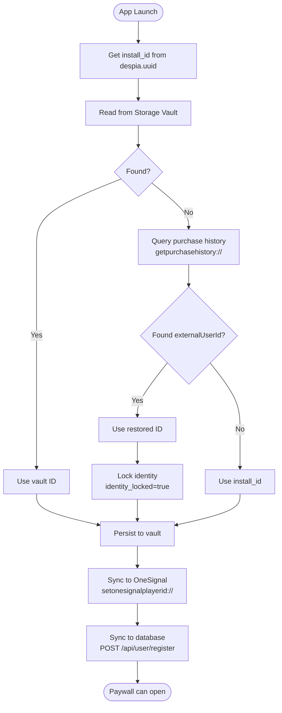
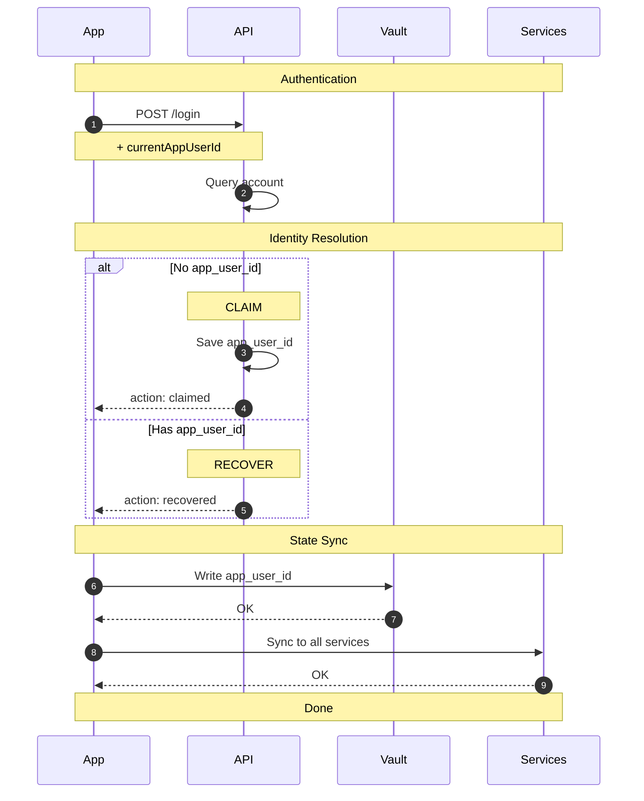

## Overview

Every Despia app needs a single, consistent user identifier (`app_user_id`) that persists across sessions and devices. This identifier connects all your services together.

```javascript
flowchart TD
    ID[app_user_id] --> RC[RevenueCat]
    ID --> OS[OneSignal]
    ID --> ST[Stripe]
    ID --> DB[(Your Database)]
```

## Identity Resolution

On every app launch, resolve the user's identity using this priority:

| Priority | Source           | Description                                                                 |
| :------- | :--------------- | :-------------------------------------------------------------------------- |
| 1        | Storage Vault    | Synced via iCloud/Google backup                                             |
| 2        | Service Recovery | Recovers users via service-specific IDs (e.g., RevenueCat `externalUserId`) |
| 3        | Install ID       | Fallback for new users (`despia.uuid`)                                      |

### Implementation

```javascript
import despia from 'despia-native';

// State tracking
let identityReady = false;
let databaseSynced = false;
let appUserId = null;
let installId = null;

async function initializeIdentity() {
  const ua = navigator.userAgent.toLowerCase();
  if (!ua.includes('despia')) {
    identityReady = true;
    databaseSynced = true;
    return null;
  }
  
  installId = despia.uuid;
  let source = 'new';
  
  // Step 1: Attempt to read from Storage Vault
  try {
    const vaultData = await despia('readvault://?key=app_user_id', ['app_user_id']);
    if (vaultData?.app_user_id) {
      appUserId = vaultData.app_user_id;
      source = 'vault';
    }
  } catch (error) {
    // Vault read failed, continue to next source
  }
  
  // Step 2: Attempt to recover from purchase history (RevenueCat)
  // ══════════════════════════════════════════════════════════════
  // REVENUECAT INTEGRATION - Comment out this block if not using RevenueCat
  // ══════════════════════════════════════════════════════════════
  if (!appUserId) {
    try {
      const data = await despia('getpurchasehistory://', ['restoredData']);
      const purchases = data.restoredData || [];
      
      // Prioritize active subscriptions, then most recent purchase
      const activePurchase = purchases.find(p => p.isActive && p.externalUserId);
      const recentPurchase = purchases
        .filter(p => p.externalUserId)
        .sort((a, b) => new Date(b.purchaseDate) - new Date(a.purchaseDate))[0];
      
      const recoveredId = activePurchase?.externalUserId || recentPurchase?.externalUserId;
      
      if (recoveredId) {
        appUserId = recoveredId;
        source = 'restore';
        
        // Lock identity to prevent accidental changes
        await despia('setvault://?key=identity_locked&value=true&locked=false');
      }
    } catch (error) {
      // Purchase history unavailable, continue to fallback
    }
  }
  // ══════════════════════════════════════════════════════════════
  // END REVENUECAT INTEGRATION
  // ══════════════════════════════════════════════════════════════
  
  // Step 3: Fall back to install ID for new users
  if (!appUserId) {
    appUserId = installId;
    source = 'new';
  }
  
  // Step 4: Persist to Storage Vault
  try {
    await despia(`setvault://?key=app_user_id&value=${appUserId}&locked=false`);
  } catch (error) {
    // Vault write failed, continue with sync
  }
  
  identityReady = true;
  
  // Step 5: Sync to OneSignal
  // ══════════════════════════════════════════════════════════════
  // ONESIGNAL INTEGRATION - Comment out if not using OneSignal
  // ══════════════════════════════════════════════════════════════
  despia(`setonesignalplayerid://?user_id=${appUserId}`);
  // ══════════════════════════════════════════════════════════════
  
  // Step 6: Sync to backend database (required for webhooks)
  try {
    await fetch('/api/user/register', {
      method: 'POST',
      headers: { 'Content-Type': 'application/json' },
      body: JSON.stringify({
        appUserId,
        deviceId: installId,
        source,
        platform: ua.includes('android') ? 'android' : 'ios',
        timestamp: new Date().toISOString()
      })
    });
    databaseSynced = true;
  } catch (error) {
    // Queue for retry on next launch
    const queue = JSON.parse(localStorage.getItem('identity_sync_queue') || '[]');
    queue.push({ appUserId, installId, source, queuedAt: Date.now() });
    localStorage.setItem('identity_sync_queue', JSON.stringify(queue));
    
    // Allow app to continue; webhook safety net will handle missing users
    databaseSynced = true;
  }
  
  return { appUserId, installId, source };
}
```

> **Important:** The RevenueCat purchase history recovery (Step 2) is critical for apps with in-app purchases. It allows paying users to recover their identity on new devices. If you're not using RevenueCat, comment out that block and the identity will fall through to the install ID.

### Flow Diagram



> **Note:** The `getpurchasehistory://` step is RevenueCat-specific. If not using RevenueCat, the flow goes directly from "Vault not found" to "Use install_id".

## Paywall Readiness

Before launching a paywall, ensure both identity resolution and database sync are complete:

```javascript
// Check readiness before opening paywall
function canOpenPaywall() {
  return identityReady && databaseSynced && appUserId;
}

// Launch paywall with identity
function launchPaywall(offering = 'default') {
  if (!canOpenPaywall()) {
    console.warn('Identity not ready, cannot open paywall');
    return;
  }
  
  despia(`revenuecat://launchPaywall?external_id=${appUserId}&offering=${offering}`);
}

// Handle purchase callback (set globally)
window.onRevenueCatPurchase = async (purchaseData) => {
  // Don't grant access immediately - wait for webhook confirmation
  // Start polling backend for status update
  pollForSubscriptionStatus(appUserId);
};
```

## User Login (Claim vs Recover)

When a user authenticates, the backend determines whether to **claim** the current identity or **recover** an existing one.

### Login Actions

| Action      | Condition                         | Result                                |
| :---------- | :-------------------------------- | :------------------------------------ |
| **CLAIM**   | Account has no `app_user_id`      | Link current `app_user_id` to account |
| **RECOVER** | Account already has `app_user_id` | Return existing `app_user_id`         |

### Client-Side Implementation

```javascript
async function handleUserLogin(accountId, credentials) {
  const response = await fetch('/api/user/login', {
    method: 'POST',
    headers: { 'Content-Type': 'application/json' },
    body: JSON.stringify({
      accountId,
      currentAppUserId: appUserId,
      credentials
    })
  });
  
  if (!response.ok) {
    throw new Error('Login failed');
  }
  
  const { appUserId: returnedId, action } = await response.json();
  
  // Update Storage Vault
  await despia(`setvault://?key=app_user_id&value=${returnedId}&locked=false`);
  
  // Sync to all services
  await syncToServices(returnedId);
  
  // Update local state
  appUserId = returnedId;
  
  return { appUserId: returnedId, action };
}
```

## Backend API Endpoints

### User Registration Endpoint

This endpoint receives identity syncs from the app on every launch:

```javascript
// POST /api/user/register
async function registerHandler(req, res) {
  const { appUserId, deviceId, source, platform, timestamp } = req.body;
  
  try {
    // Upsert user record
    await db.query(`
      INSERT INTO users (app_user_id, created_at, last_seen)
      VALUES ($1, $2, $2)
      ON CONFLICT (app_user_id) 
      DO UPDATE SET last_seen = $2
    `, [appUserId, timestamp]);
    
    // Track device
    await db.query(`
      INSERT INTO user_devices (device_id, app_user_id, platform, last_seen, created_at)
      VALUES ($1, $2, $3, $4, $4)
      ON CONFLICT (device_id) 
      DO UPDATE SET 
        app_user_id = $2,
        last_seen = $4
    `, [deviceId, appUserId, platform, timestamp]);
    
    // Log identity source for analytics
    if (source === 'restore') {
      console.log(`User ${appUserId} recovered via purchase history`);
    }
    
    res.json({ success: true });
  } catch (error) {
    console.error('Registration failed:', error);
    res.status(500).json({ error: 'Registration failed' });
  }
}
```

### User Login Endpoint

```javascript
// POST /api/user/login
async function loginHandler(req, res) {
  const { accountId, currentAppUserId, credentials } = req.body;
  
  // Authenticate user
  const account = await authenticateUser(accountId, credentials);
  if (!account) {
    return res.status(401).json({ error: 'Invalid credentials' });
  }
  
  // Identity resolution
  if (!account.app_user_id) {
    // CLAIM: Link current identity to account
    await db.accounts.update(accountId, { app_user_id: currentAppUserId });
    return res.json({ 
      appUserId: currentAppUserId, 
      action: 'claimed' 
    });
  } else {
    // RECOVER: Return existing identity
    return res.json({ 
      appUserId: account.app_user_id, 
      action: 'recovered' 
    });
  }
}
```

### Login Flow Diagram



## Syncing to Services

After identity resolution, sync the `app_user_id` to all integrated services.

### Generic Sync Pattern

```javascript
async function syncToServices(appUserId) {
  // OneSignal (push notifications)
  despia(`setonesignalplayerid://?user_id=${appUserId}`);
  
  // Your backend database
  await fetch('/api/user/sync', {
    method: 'POST',
    headers: { 'Content-Type': 'application/json' },
    body: JSON.stringify({
      appUserId,
      deviceId: despia.uuid,
      timestamp: new Date().toISOString()
    })
  });
  
  // RevenueCat: passed via external_id when launching paywall
  // Stripe: sync via backend webhook
}
```

## Restore Purchases (Required for App Store)

Provide a restore purchases button for users who need to recover their subscriptions on a new device. This is **required** by both Apple and Google.

```javascript
async function restorePurchases() {
  try {
    const data = await despia('getpurchasehistory://', ['restoredData']);
    const purchases = data.restoredData || [];
    
    // Find any purchase with an externalUserId
    const purchaseWithId = purchases.find(p => p.externalUserId);
    
    if (purchaseWithId) {
      const recoveredId = purchaseWithId.externalUserId;
      
      // Update Storage Vault
      await despia(`setvault://?key=app_user_id&value=${recoveredId}&locked=false`);
      await despia('setvault://?key=identity_locked&value=true&locked=false');
      
      // Sync to OneSignal
      despia(`setonesignalplayerid://?user_id=${recoveredId}`);
      
      // Update local state
      appUserId = recoveredId;
      
      // Sync to backend
      await fetch('/api/user/register', {
        method: 'POST',
        headers: { 'Content-Type': 'application/json' },
        body: JSON.stringify({
          appUserId: recoveredId,
          deviceId: installId,
          source: 'restore_button',
          timestamp: new Date().toISOString()
        })
      });
      
      return { success: true, appUserId: recoveredId };
    }
    
    return { success: false, message: 'No purchases found' };
  } catch (error) {
    return { success: false, error: error.message };
  }
}
```

### Where to Place the Restore Button

- Settings screen (most common)
- Paywall screen
- Account or profile screen
- Onboarding flow for returning users

## Integration Examples

### RevenueCat (In-App Purchases) — Deep Integration

RevenueCat is deeply integrated into Despia. The `app_user_id` is passed as `external_id` when launching paywalls.

```javascript
// Launch native paywall
despia(`revenuecat://launchPaywall?external_id=${appUserId}&offering=default`);

// Purchase a specific product
despia(`revenuecat://purchase?external_id=${appUserId}&product=monthly_premium`);

// Check entitlement status
async function checkPremiumAccess() {
  const history = await despia('getpurchasehistory://', ['restoredData']);
  const activeSubs = history.restoredData.filter(p => 
    p.isActive && p.entitlementId === 'premium'
  );
  return activeSubs.length > 0;
}
```

#### Purchase Response Fields

The `getpurchasehistory://` response includes:

| Field                   | Description                                      |
| :---------------------- | :----------------------------------------------- |
| `transactionId`         | Unique identifier for this transaction           |
| `originalTransactionId` | Links to original purchase (for renewals)        |
| `productId`             | Product ID from App Store Connect / Play Console |
| `type`                  | `"subscription"` or `"product"`                  |
| `entitlementId`         | The entitlement this purchase grants             |
| `isActive`              | Whether purchase currently grants access         |
| `willRenew`             | Whether subscription will auto-renew             |
| `purchaseDate`          | ISO timestamp of transaction                     |
| `expirationDate`        | When access expires (null for lifetime)          |
| `externalUserId`        | The `app_user_id` linked to this purchase        |
| `store`                 | `"app_store"` or `"play_store"`                  |

#### Hybrid Payment Example (Native + Web)

```javascript
const handleUpgrade = () => {
  if (navigator.userAgent.includes('despia')) {
    // Native: Use RevenueCat
    despia(`revenuecat://launchPaywall?external_id=${appUserId}&offering=default`);
  } else {
    // Web fallback: Redirect to Stripe
    window.location.href = `/pricing?user=${appUserId}`;
  }
};
```

### OneSignal (Push Notifications)

```javascript
// Set external user ID on every app load
despia(`setonesignalplayerid://?user_id=${appUserId}`);
```

### Stripe (Web-Based Payments)

For web-based services like Stripe, sync via your backend:

```javascript
// Client: Pass app_user_id to your backend
async function createCheckoutSession(priceId) {
  const response = await fetch('/api/stripe/checkout', {
    method: 'POST',
    headers: { 'Content-Type': 'application/json' },
    body: JSON.stringify({
      appUserId,
      priceId,
      deviceId: despia.uuid
    })
  });
  
  const { sessionUrl } = await response.json();
  window.location.href = sessionUrl;
}
```

```javascript
// Backend: Create Stripe customer with app_user_id as metadata
async function createCheckoutHandler(req, res) {
  const { appUserId, priceId, deviceId } = req.body;
  
  // Find or create Stripe customer
  let customer = await findStripeCustomerByAppUserId(appUserId);
  if (!customer) {
    customer = await stripe.customers.create({
      metadata: {
        app_user_id: appUserId,
        device_id: deviceId
      }
    });
    await saveStripeCustomerMapping(appUserId, customer.id);
  }
  
  // Create checkout session
  const session = await stripe.checkout.sessions.create({
    customer: customer.id,
    line_items: [{ price: priceId, quantity: 1 }],
    mode: 'subscription',
    success_url: 'myapp://payment/success',
    cancel_url: 'myapp://payment/cancel',
    metadata: {
      app_user_id: appUserId
    }
  });
  
  res.json({ sessionUrl: session.url });
}
```

```javascript
// Backend: Handle Stripe webhook
async function stripeWebhookHandler(req, res) {
  const event = stripe.webhooks.constructEvent(
    req.body,
    req.headers['stripe-signature'],
    webhookSecret
  );
  
  switch (event.type) {
    case 'checkout.session.completed':
      const session = event.data.object;
      const appUserId = session.metadata.app_user_id;
      
      // Update user subscription status
      await updateUserSubscription(appUserId, {
        stripeCustomerId: session.customer,
        subscriptionId: session.subscription,
        status: 'active'
      });
      break;
  }
  
  res.json({ received: true });
}
```

### Generic Web SDK Pattern

For any web-based SDK, follow this pattern:

```javascript
// 1. Client passes app_user_id to backend
await fetch('/api/service/action', {
  method: 'POST',
  body: JSON.stringify({
    appUserId,
    deviceId: despia.uuid,
    // ... service-specific params
  })
});

// 2. Backend links service's user ID to app_user_id
async function serviceHandler(req, res) {
  const { appUserId } = req.body;
  
  // Create or find service user
  const serviceUser = await service.createUser({
    externalId: appUserId,
    // or
    metadata: { app_user_id: appUserId }
  });
  
  // Store mapping
  await saveServiceMapping(appUserId, serviceUser.id);
}

// 3. Backend handles webhooks using app_user_id
async function serviceWebhook(req, res) {
  const event = req.body;
  const appUserId = event.metadata.app_user_id || 
                    await getAppUserIdFromServiceId(event.user_id);
  
  // Update your database
  await updateUser(appUserId, { /* ... */ });
}
```

## Database Schema

Store the `app_user_id` as the primary link across all tables:

```javascript
-- Users table
CREATE TABLE users (
  id UUID PRIMARY KEY DEFAULT gen_random_uuid(),
  app_user_id TEXT UNIQUE NOT NULL,
  email TEXT,
  created_at TIMESTAMP DEFAULT NOW()
);

-- Service mappings
CREATE TABLE service_mappings (
  app_user_id TEXT REFERENCES users(app_user_id),
  service_name TEXT NOT NULL,
  service_user_id TEXT NOT NULL,
  created_at TIMESTAMP DEFAULT NOW(),
  PRIMARY KEY (app_user_id, service_name)
);

-- Example: devices
CREATE TABLE user_devices (
  device_id TEXT PRIMARY KEY,
  app_user_id TEXT REFERENCES users(app_user_id),
  last_seen TIMESTAMP,
  created_at TIMESTAMP DEFAULT NOW()
);
```

## Summary

| Component     | Key                    | Purpose                                        |
| :------------ | :--------------------- | :--------------------------------------------- |
| Storage Vault | `app_user_id`          | Persistent identity across sessions/reinstalls |
| Backend DB    | `app_user_id`          | Central user record                            |
| RevenueCat    | `external_id`          | Links purchases to user                        |
| OneSignal     | `external_user_id`     | Links push notifications to user               |
| Stripe        | `metadata.app_user_id` | Links payments to user                         |
| Any SDK       | varies                 | Always map back to `app_user_id`               |

The `app_user_id` is the single source of truth. Every service integration should either accept it directly or map their internal IDs back to it via your backend.