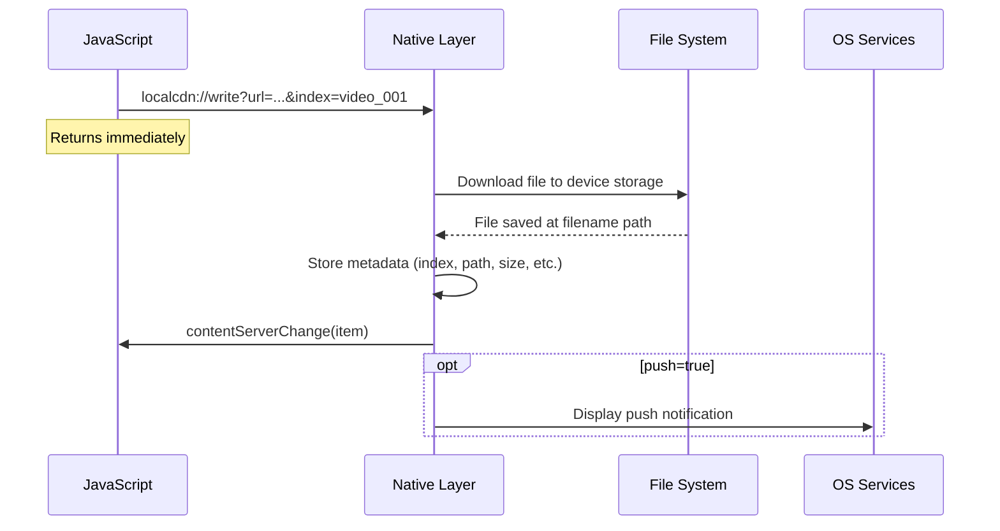
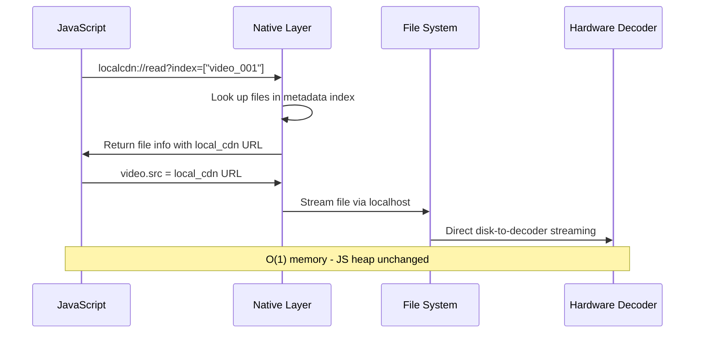
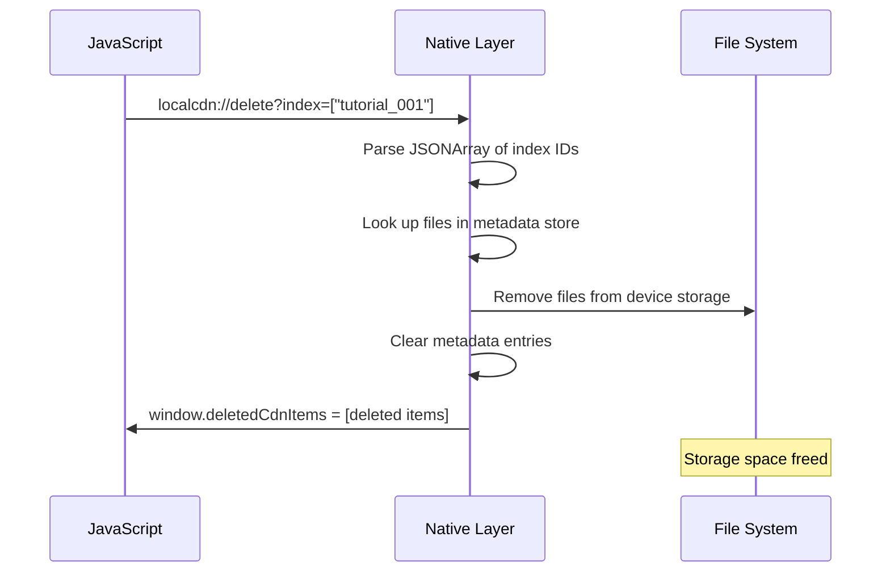
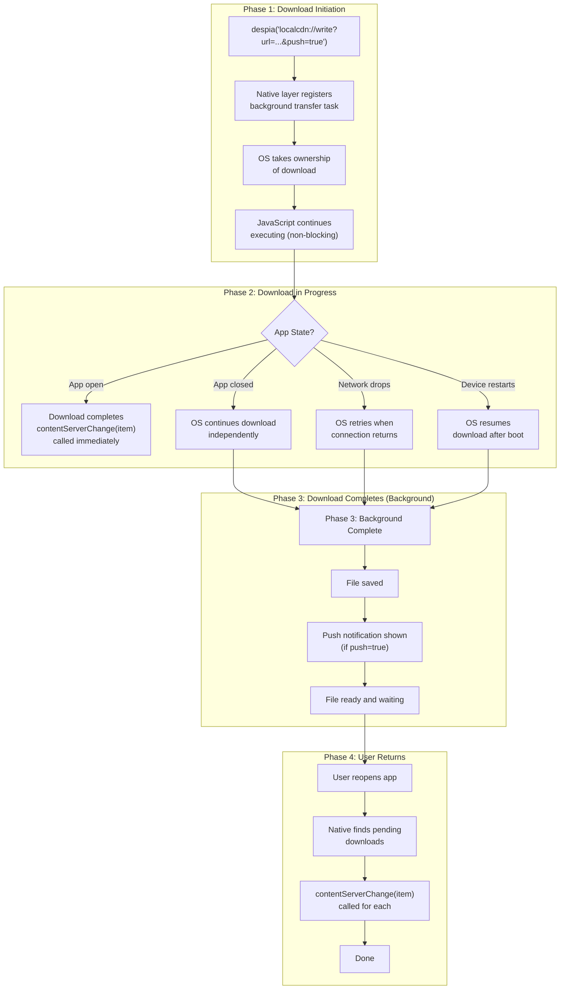
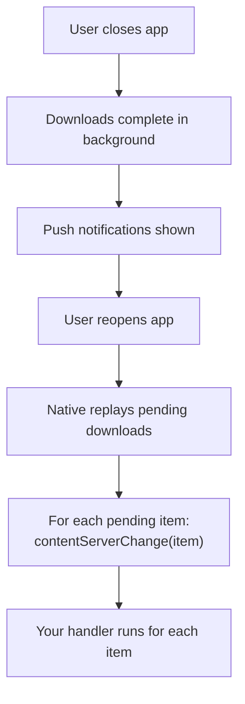
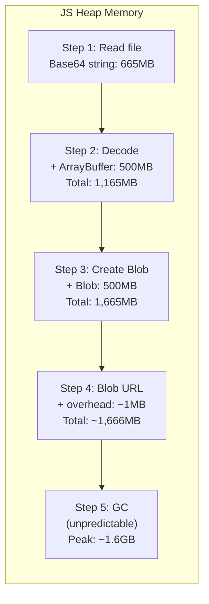
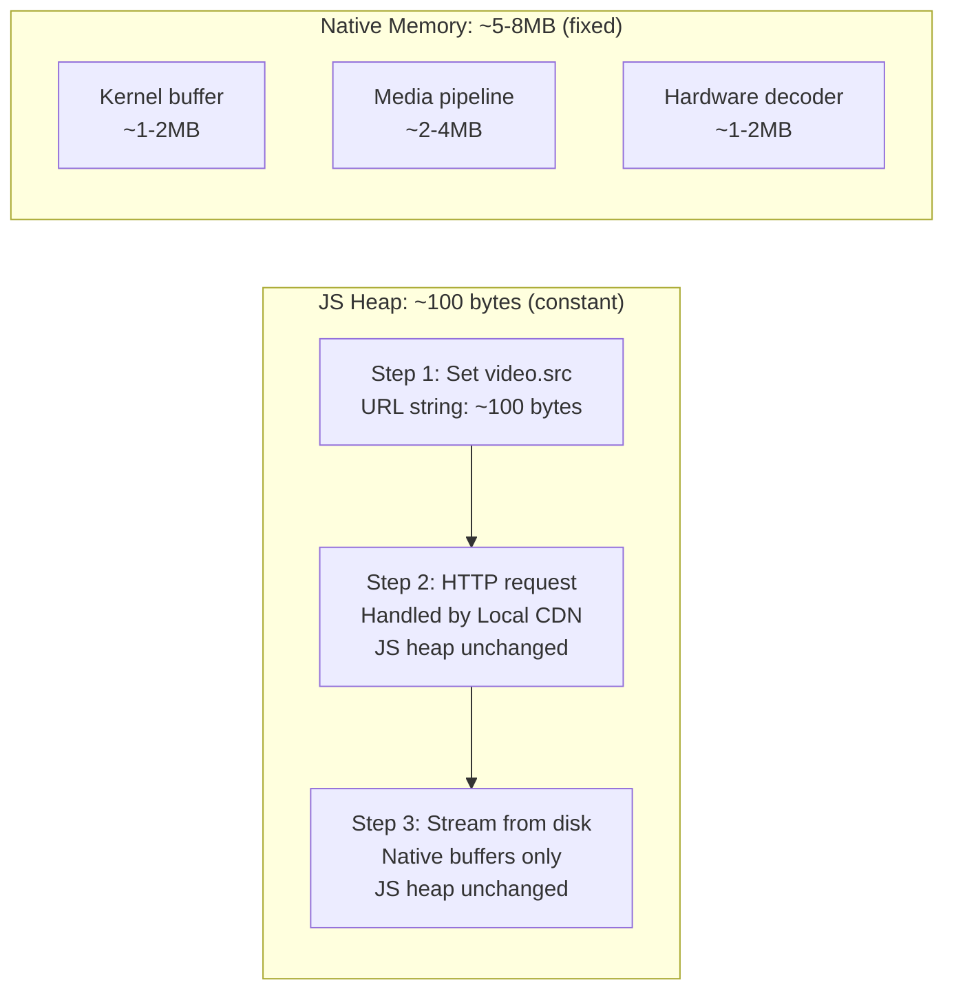

<Info>
  This feature is still in the final beta round. To request access as a beta tester, send an email to [offlinemode@despia.com](mailto:offlinemode@despia.com)
</Info>

Local CDN solves offline media caching for hybrid apps - a problem that has challenged web developers for over 15 years. Downloads continue in the background even when users close the app, powered by native background task APIs (NSURLSession on iOS, WorkManager on Android) with built-in retry mechanisms.

---

## Why we built this

Local CDN was built by web developers who love the web platform.

We wanted offline media that works the way web developers expect: set a `src` attribute, use `fetch()`, work with standard URLs. No Base64 encoding. No Blob URL workarounds. No arbitrary storage limits. And critically: downloads that continue when users close the app, just like Netflix and Spotify.

So we collaborated with native iOS and Android engineers. We studied how Spotify, Netflix, and YouTube handle offline downloads in their native apps. Then we brought that same architecture to hybrid web apps while keeping everything familiar to web developers.

The result: cache gigabytes of media with two function calls, play it back with a standard URL, and maintain O(1) memory usage independent of file size. Background downloads with native retry mechanisms. Push notifications when content is ready. And `window.contentServerChange(item)` to update your UI the moment new content is cached.

---

## Cross-platform by design

Local CDN is optimized for both iOS and Android through a unified JavaScript SDK.

Write your code once. It works identically on both platforms. No iOS-specific workarounds. No Android edge cases. The API is fully standardized so you can focus on building your app instead of handling platform differences.

```javascript
// Same code. Both platforms.
const folder = "videos";
const subfolder = "movies";
const filename = "bigbuckbunny.mp4";
const index = "movie_bigbuckbunny";

despia(`localcdn://write?url=http://commondatastorage.googleapis.com/gtv-videos-bucket/sample/BigBuckBunny.mp4&filename=${folder}/${subfolder}/${filename}&index=${index}`);
```

Under the hood, Despia handles the platform-specific implementations (Swift on iOS, Kotlin on Android) so your JavaScript stays clean and portable.

---

## Fully client-side. No cloud dependencies.

Local CDN runs entirely on the device. There is no cloud component, no proprietary backend, no special hosting requirements.

**Built on Despia Local Server.** Despia Local Server provides the HTTP infrastructure - a proprietary, production-grade localhost server that runs entirely within your app. Local CDN extends this by adding file storage and content serving capabilities through the native file system. Together, they form a complete on-device content delivery system.

**Fully maintained, fully client-side.** Both Despia Local Server and Local CDN are compiled into your app binary. No external services, no cloud dependencies, no opinionated backend architecture forced on you. Everything runs on the device.

**Use any hosting.** Cache files from any URL - your own servers, AWS S3, Cloudflare, Google Cloud Storage, or any public CDN. Local CDN does not care where files come from.

**No cloud lock-in. No data lock-in.** Your files are standard files on the device file system. Your URLs are standard HTTP URLs. Your backend, your database, your API - all remain yours. Despia never sits between you and your infrastructure.

**Runtime dependency only.** Local CDN and Despia Local Server are runtime dependencies, similar to any other SDK you include in your app. The proprietary component is the on-device localhost server and native file system integration. Your data formats, hosting choices, and backend architecture remain portable.

**No per-user fees.** Unlike cloud-based solutions that charge per monthly active user, Local CDN has zero runtime costs. Scale to millions of users without infrastructure costs scaling with them.

**Works offline completely.** Once files are cached, the entire system operates without any network connectivity. No license checks, no heartbeats, no server dependencies.

---

## Despia Local Server: The complete picture

Local CDN is one part of the Despia Local Server ecosystem. The full Local Server provides:

<CardGroup cols={2}>
  <Card title="Instant Boot" icon="rocket">
    Zero network latency. Your entire web app loads in milliseconds from localhost.
  </Card>

  <Card title="Complete Offline Support" icon="wifi-slash">
    Not "works offline sometimes" but actually works without any connectivity, forever.
  </Card>

  <Card title="OTA Updates" icon="cloud-arrow-down">
    Push web app changes live without app store approval. Updates download in the background and apply on next launch.
  </Card>

  <Card title="Your Hosting, Your Rules" icon="server">
    Keep using Netlify, Vercel, AWS, whatever you already have. No migration, no cloud lock-in, no MAU fees.
  </Card>
</CardGroup>

<Info>
  100% store compliant. Fully approved architecture for both Apple App Store and Google Play Store.
</Info>

Local CDN handles media and file caching. Despia Local Server handles your entire web application. Together, they give you native-quality performance with web development workflows.

<Card title="Learn More" icon="book" href="/local-server">
  Complete documentation on Despia Local Server including setup, OTA updates, and architecture details
</Card>

---

## Who this is for

<Note>
  Local CDN solves a specific problem for a specific type of app. It is not for everyone.
</Note>

<Tabs>
  <Tab title="This is for you if">
    - Your app caches large media files (videos, podcasts, audio courses, image libraries)
    - You need true offline playback, not just "works offline sometimes"
    - Memory constraints are a real problem - your app crashes or lags with current caching approaches
    - You are building for both iOS and Android and want one solution
    - You are comfortable with a runtime dependency in exchange for solving a hard problem
  </Tab>
  <Tab title="Probably not for you if">
    - Your app only caches small assets or text content
    - Standard browser caching and service workers cover your offline needs
    - You have no requirement for background downloads
    - File sizes are consistently under a few megabytes
  </Tab>
</Tabs>

<Info>
  The tradeoff is clear: you get O(1) memory usage, unlimited storage, and cross-platform consistency. In exchange, you take a runtime dependency on Despia Local Server.
</Info>

For apps in the top 5% - podcast players, video learning platforms, music apps, offline-first enterprise tools - that tradeoff makes sense. For simpler apps, standard web caching is probably fine.

---

## The 15-year problem

Since PhoneGap launched in 2009, hybrid web-native apps have struggled with offline media. The core issue: WebViews run in a sandboxed environment with no direct file system access.

Every framework has attempted to solve this. None have done it well.

**Cordova** required plugins and Blob URLs. Files had to be read into JavaScript memory before playback.

**Ionic** inherited Cordova's limitations. Developers worked around them with complex caching strategies that still hit browser storage quotas.

**Capacitor** improved file system access but still requires Base64 encoding to pass data through the JavaScript bridge. A 500MB video requires approximately 1.5GB of memory during the read-decode-play cycle.

**React Native** offers partial solutions, but media handling remains complex and platform-specific.

The fundamental problem across all these frameworks: everything passes through JavaScript. Files must be encoded, transferred across the bridge, decoded, and converted to Blob URLs before playback. Memory usage scales with file size. Large files crash apps.

Web developers have been forced to choose between streaming everything (no offline support), caching small files only (poor user experience), or abandoning web technologies entirely.

---

## How other frameworks handle it

### Capacitor's approach

```javascript
import { Filesystem, Directory } from '@capacitor/filesystem';

// Write requires Base64 encoding
await Filesystem.writeFile({
  path: 'videos/movie.mp4',
  data: base64Data,
  directory: Directory.Data
});

// Read returns Base64
const result = await Filesystem.readFile({
  path: 'videos/movie.mp4',
  directory: Directory.Data
});

// Playback requires Blob URL conversion
const blob = base64ToBlob(result.data);
const blobUrl = URL.createObjectURL(blob);
videoElement.src = blobUrl;
```

This approach has several limitations:

- Base64 encoding adds 33% size overhead
- Entire file must load into JavaScript memory
- Blob URL creation duplicates the memory reference
- Large files cause out-of-memory crashes
- Platform-specific quirks require additional handling

### Framework comparison

| Framework | File System | Direct Playback | Memory Efficient | Background Downloads | Offline Media |
| --- | --- | --- | --- | --- | --- |
| Cordova | Plugin required | No | No | No | Limited |
| Capacitor | Yes | No | No | No | Limited |
| React Native | Yes | Partial | Partial | Plugin required | Complex |
| Flutter | Yes | Yes | Yes | Plugin required | Not web-based |
| **Despia Local CDN** | **Yes** | **Yes** | **Yes** | **Yes (native)** | **Full support** |

---

## Our approach

Local CDN bypasses JavaScript entirely for file operations.

When you cache a file, Despia's native layer (Swift on iOS, Kotlin on Android) downloads it directly to the device file system. The file never touches the JavaScript bridge. The result is returned to a variable matching your unique `index` for promise-based success/failure handling. Optionally, trigger a push notification on completion.

**Background caching:** Downloads continue even when the user closes or backgrounds the app. Native background transfer APIs (NSURLSession on iOS, WorkManager on Android) handle this with built-in retry mechanisms. When users reopen your app - even hours later - `window.contentServerChange(item)` is called for each item that completed in the background. This is the Netflix/Spotify offline experience, now available for web apps.

When you play it back, Local CDN serves the file through Despia Local Server via `http://localhost`. Your web app uses a standard URL - the same way you would load any media from a remote CDN.

When you delete a file, it is removed from device storage immediately, freeing up space.

```javascript
import despia from 'despia-native';

// Step 1: Set up the callback FIRST
window.contentServerChange = (item) => {
  // This fires when download completes (could be seconds or minutes later)
  console.log("Cached:", item.index, item.local_cdn);
  addToDownloadsList(item);
};

// Step 2: Fire the download (no await, no second argument)
const folder = "videos";
const subfolder = "movies";
const filename = "bigbuckbunny.mp4";
const index = "movie_bigbuckbunny";
const pushMessage = "Big Buck Bunny ready for offline viewing";

despia(
  `localcdn://write?url=http://commondatastorage.googleapis.com/gtv-videos-bucket/sample/BigBuckBunny.mp4&filename=${folder}/${subfolder}/${filename}&index=${index}&push=true&pushmessage="${pushMessage}"`
);
// Returns immediately - download continues in background
// Result comes via contentServerChange callback
```

**Callback payload** - `item` received in `contentServerChange`:

```json
{
  "index_full": "videos/movies/bigbuckbunny.mp4",
  "index": "movie_bigbuckbunny",
  "extension": "mp4",
  "local_path": "/var/mobile/.../localcdn/videos/movies/bigbuckbunny.mp4",
  "local_cdn": "http://localhost:7777/localcdn/videos/movies/bigbuckbunny.mp4",
  "cdn": "http://commondatastorage.googleapis.com/gtv-videos-bucket/sample/BigBuckBunny.mp4",
  "size": "158008374",
  "status": "cached",
  "created_at": "1709856000"
}
```

```javascript
// Read - get file metadata by index ID (this one you CAN await)
const data = await despia(
  `localcdn://read?index=${encodeURIComponent(JSON.stringify(["movie_bigbuckbunny"]))}`,
  ["cdnItems"]
);

const items = data.cdnItems;
console.log(items);
```

**Read Response** - `data.cdnItems` (array of file objects):

```json
[
  {
    "index_full": "videos/movies/bigbuckbunny.mp4",
    "index": "movie_bigbuckbunny",
    "extension": "mp4",
    "local_path": "/var/mobile/.../localcdn/videos/movies/bigbuckbunny.mp4",
    "local_cdn": "http://localhost:7777/localcdn/videos/movies/bigbuckbunny.mp4",
    "cdn": "http://commondatastorage.googleapis.com/gtv-videos-bucket/sample/BigBuckBunny.mp4",
    "size": "158008374",
    "status": "cached",
    "created_at": "1709856000"
  }
]
```

```javascript
// Use the local URL for playback
videoElement.src = items[0].local_cdn;

// Delete - remove when no longer needed
despia(`localcdn://delete?index=${encodeURIComponent(JSON.stringify(["video_bigbunny"]))}`);
```

**Delete Response** - `window.deletedCdnItems` (array of deleted items):

```json
[
  {
    "index_full": "videos/samples/bigbunny.mp4",
    "index": "video_bigbunny",
    "extension": "mp4",
    "local_cdn": "http://localhost:7777/localcdn/videos/samples/bigbunny.mp4",
    "size": "5242880",
    "status": "cached"
  }
]
```

Memory usage is O(1), independent of file size. The file streams from disk to the hardware video decoder. JavaScript is only involved in setting the `src` attribute.

---

## Built for web developers

We kept everything familiar to web developers:

**Standard URLs.** The `local_cdn` value is a regular HTTP URL. Use it anywhere you would use a CDN URL: `src` attributes, `fetch()` calls, CSS `url()` values.

**No encoding.** Files stay as files. No Base64. No ArrayBuffers. No Blobs.

**No new APIs to learn.** If you know how to set `videoElement.src`, you know how to use Local CDN.

**Familiar patterns.** Write is like uploading to a CDN. Read is like querying a database. The response is JSON.

```javascript
// Works in video elements
<video src={items[0].local_cdn} />

// Works in audio elements
<audio src={items[0].local_cdn} />

// Works in image elements


// Works with fetch
fetch(items[0].local_cdn)
```

The web platform is powerful. We kept it that way.

---

## Technical architecture

### Write operation

When you call `localcdn://write`:

<Steps>
  <Step title="Set up callback first">
    ```javascript
    window.contentServerChange = (item) => {
      if (item.status === "cached") {
        console.log("Download complete:", item.local_cdn);
      }
    };
    ```
  </Step>
  <Step title="Fire the download">
    ```javascript
    // No await, no second argument - fire-and-forget
    const folder = "videos";
    const subfolder = "movies";
    const filename = "sintel.mp4";
    const index = "movie_sintel";
    const pushMessage = "Sintel ready for offline viewing";
    
    despia(
      `localcdn://write?url=http://commondatastorage.googleapis.com/gtv-videos-bucket/sample/Sintel.mp4&filename=${folder}/${subfolder}/${filename}&index=${index}&push=true&pushmessage="${pushMessage}"`
    );
    // Returns immediately - result comes via contentServerChange
    ```
  </Step>
</Steps>

<ParamField path="url" type="string" required>
  Remote file URL to download
</ParamField>

<ParamField path="filename" type="string" required>
  Local path (folder/subfolder/filename)
</ParamField>

<ParamField path="index" type="string" required>
  Your unique ID
</ParamField>

<ParamField path="push" type="boolean">
  Set to `true` to show push notification on completion
</ParamField>

<ParamField path="pushmessage" type="string">
  Notification message wrapped in quotes
</ParamField>



### Read operation

When you call `localcdn://read`:



### Delete operation

When you call `localcdn://delete`:

```javascript
// Delete single file by index ID
despia(`localcdn://delete?index=${encodeURIComponent(JSON.stringify(["tutorial_001"]))}`);

// Delete multiple files
despia(`localcdn://delete?index=${encodeURIComponent(JSON.stringify(["tutorial_001", "tutorial_002"]))}`);
```



Use delete to manage cache size and remove content users no longer need.

### Background caching

<Info>
  This is a native capability that web apps cannot replicate. Service workers and the Fetch API do not support true background downloads that survive app termination.
</Info>

Downloads continue even when users close the app. This is powered by native background task APIs with built-in retry mechanisms:

- **iOS:** NSURLSession background transfer service
- **Android:** WorkManager with automatic retry on failure
- **Both:** Resume interrupted downloads, battery-aware scheduling, network-aware execution

#### The lifecycle

When you call `localcdn://write`, here is exactly what happens:



```javascript
// contentServerChange receives ONE item at a time
// It is called once per download - both foreground completions AND background replays
window.contentServerChange = (item) => {
  console.log("Content ready:", item.index);
  console.log("Local URL:", item.local_cdn);

  addToDownloadsList(item);
  showToast(`${item.index} is ready for offline use`);
};
```

**Callback payload** - `item`:

```json
{
  "index_full": "videos/movies/bigbuckbunny.mp4",
  "index": "movie_bigbuckbunny",
  "extension": "mp4",
  "local_path": "/var/mobile/.../localcdn/videos/movies/bigbuckbunny.mp4",
  "local_cdn": "http://localhost:7777/localcdn/videos/movies/bigbuckbunny.mp4",
  "cdn": "http://commondatastorage.googleapis.com/gtv-videos-bucket/sample/BigBuckBunny.mp4",
  "size": "158008374",
  "status": "cached",
  "created_at": "1709856000"
}
```

#### How background replay works

The native layer handles everything automatically:



Just implement `contentServerChange` and it will be called for both downloads that complete while the app is open, and downloads that completed in the background and are replayed on next launch.

<Tip>
  If you need more control, you can poll via `localcdn://read` to check download status.
</Tip>

#### Example: building a download list

```javascript
import despia from 'despia-native';

const downloadedItems = [];

window.contentServerChange = (item) => {
  // Avoid duplicates (in case of replays)
  const existingIndex = downloadedItems.findIndex(i => i.index_full === item.index_full);
  if (existingIndex >= 0) {
    downloadedItems[existingIndex] = item;
  } else {
    downloadedItems.push(item);
    showToast(`${item.index} ready for offline`);
  }

  renderDownloadsList(downloadedItems);
};
```

This is the Netflix/Spotify experience: start downloads, close the app, get notified when ready.

### Content Server HTTP API

<Note>
  Only available when your app is served via Despia Local Server (not from origin/remote server).
</Note>

When your app is served from Despia Local Server, you also get an HTTP API for uploading user files. This complements the `localcdn://` protocol.

**Two approaches for different use cases:**

| Approach | Best for |
| --- | --- |
| `localcdn://write` | Remote URLs, background downloads |
| HTTP POST to `/api/upload` | User file uploads from file picker |

```javascript
// Approach 1: Download from remote URL (supports background)
despia(`localcdn://write?url=${remoteUrl}&filename=${path}&index=${id}`);

// Approach 2: Upload from file input (standard HTTP)
const fd = new FormData();
fd.append("file", fileInput.files[0]);
fetch("http://localhost:7777/api/upload", {
  method: "POST",
  body: fd
});
// Returns: { success: true, fileName: "myfile.mp4", url: "http://localhost:7777/files/myfile.mp4" }
```

Files are stored in different directories:

- `localcdn://write` stores to `/localcdn/` directory
- `/api/upload` stores to `/files/` directory

Both are served via localhost URLs.

See the [API Reference](/local-cdn/api) for complete HTTP API documentation.

### Why localhost

Despia Local Server provides the HTTP infrastructure. Local CDN stores files and serves them through this infrastructure via `http://localhost`. This architecture provides several advantages:

- Standard web APIs work without modification
- No CORS restrictions (same-origin)
- HTTP range requests enable seeking without loading entire files
- Localhost is treated as a secure context
- Hardware-accelerated decoders work with HTTP sources

---

## Memory comparison

### What O(1) means

O(1) means constant - the memory usage stays the same regardless of input size. Whether you play a 10MB file or a 10GB file, Local CDN uses the same amount of memory.

This is the opposite of traditional approaches where memory scales with file size (O(n)). Double the file size, double the memory usage. That is why large files crash apps.

### 500MB video: Capacitor vs Despia

Let us trace what happens when you play a 500MB video file.

**Capacitor (traditional approach):**



**Despia Local CDN:**



| Metric | Capacitor | Despia Local CDN |
| --- | --- | --- |
| Peak JS heap | ~1,666MB | ~100 bytes |
| System memory | ~1,666MB | ~5-8MB |
| Scales with file size | Yes | No |
| 2GB video | Crash | Works |

### Where the ~5-8MB comes from

Local CDN does not use zero memory - that would be physically impossible. Here is what actually uses memory during playback:

**Kernel read buffer (~1-2MB):** The operating system reads files in chunks, not byte-by-byte. This buffer exists for any file read operation on any platform.

**Media pipeline buffer (~2-4MB):** iOS and Android media frameworks buffer a few seconds of decoded frames for smooth playback. This is handled entirely in native code.

**Hardware decoder buffer (~1-2MB):** The video decoder chip has its own memory for processing frames. This is separate from app memory.

These buffers exist in native apps too - Spotify, Netflix, and YouTube all have them. The key difference: none of this memory is in your JavaScript heap, and none of it scales with file size.

A 100MB video and a 2GB video use the same ~5-8MB of buffer memory. That is what O(1) means in practice.

---

## Use cases

<CardGroup cols={2}>
  <Card title="Media-heavy Applications" icon="video">
    Podcast apps can cache entire libraries. Video learning platforms can download courses for offline viewing. Music apps can store playlists locally. All without memory constraints. Users start downloads on WiFi, close the app, and get notified when content is ready.
  </Card>

  <Card title="Offline-first Experiences" icon="wifi-slash">
    Field service apps, travel apps, and educational tools that must work without connectivity can cache all required media assets during initial sync. Background downloads with retry mechanisms ensure reliable delivery even on unstable connections.
  </Card>

  <Card title="User-generated Content" icon="upload">
    Apps that let users upload photos, videos, or documents can store them locally via the Content Server HTTP API. Upload from file pickers, camera roll, or any File/Blob source. Files are security-scanned and stored with the same O(1) memory efficiency.
  </Card>

  <Card title="Performance-critical Applications" icon="bolt">
    Localhost serving eliminates network latency entirely. Media plays instantly. Seeking is immediate. The experience matches native apps.
  </Card>
</CardGroup>

### Download before you go

Users queue downloads while on WiFi at home. They close the app. Downloads continue in the background with native retry mechanisms. Push notification when complete. When they open the app later - on a plane, in a subway, in the wilderness - everything is cached and ready. `window.contentServerChange` updates the UI immediately.

---

## Frequently asked questions

<AccordionGroup>
  <Accordion title="How much storage can I use?">
    The device's available storage. No artificial quotas like IndexedDB. Cache gigabytes of content.
  </Accordion>

  <Accordion title="Does this work offline?">
    Yes. Files are stored on the device file system and served from an on-device HTTP server. No network required after initial download.
  </Accordion>

  <Accordion title="What file types are supported?">
    Any file type: video (mp4, webm, mov), audio (mp3, wav, aac), images (jpg, png, webp), documents (pdf, json), and more.
  </Accordion>

  <Accordion title="Is this App Store compliant?">
    Yes. Downloading and caching media content is standard app behavior, identical to how Spotify, Netflix, and YouTube handle offline downloads.
  </Accordion>

  <Accordion title="What happens if storage is full?">
    The download will fail. Implement cache management logic to remove old files before downloading new ones using `localcdn://delete`.
  </Accordion>

  <Accordion title="How do I know if a download succeeded?">
    Use the `contentServerChange` callback. When a download completes, the native runtime calls your callback with the file data:

    ```javascript
    window.contentServerChange = (item) => {
      if (item.status === "cached") {
        console.log("Success:", item.local_cdn);
      }
    };
    
    // Fire the download (no await)
    despia(`localcdn://write?url=${url}&filename=${path}&index=${id}`);
    ```

    Do not await the write call with a key - the JS bridge has a ~30s timeout that will resolve with `null` for large files, even though the download continues. If you need more control, poll via `localcdn://read` to check status.
  </Accordion>

  <Accordion title="Do downloads continue if the user closes the app?">
    Yes. Downloads continue in the background even when the app is closed or backgrounded. This uses native OS background transfer APIs (NSURLSession on iOS, WorkManager on Android). Add `push=true` and `pushmessage` to notify users when the download completes, especially useful for large files.
  </Accordion>

  <Accordion title="Can I upload files from a file picker?">
    Yes, but only when your app is served via Despia Local Server (not from origin). POST to `http://localhost:7777/api/upload` with FormData. Works with any File/Blob source - file inputs, camera, clipboard, etc. Uploaded files are stored in the `/files/` directory.
  </Accordion>

  <Accordion title="Are uploaded files secure?">
    Yes. All uploaded files are security-scanned before storage. Malicious or corrupted files are rejected. Only safe files are kept on the device.
  </Accordion>

  <Accordion title="How do I track which downloads completed in the background?">
    You do not need to track this manually. When the app reopens after background downloads, the native layer automatically calls `contentServerChange(item)` for each item that completed while backgrounded. Just implement `contentServerChange` and it handles both foreground completions and background replays.
  </Accordion>

  <Accordion title="How do I delete cached files?">
    Call `localcdn://delete` with a JSON array of index IDs:

    ```javascript
    despia(`localcdn://delete?index=${encodeURIComponent(JSON.stringify(["my_video_123"]))}`);
    ```
  </Accordion>

  <Accordion title="Does it work the same on iOS and Android?">
    Yes. The JavaScript API is identical on both platforms. Despia handles platform-specific implementation details internally.
  </Accordion>
</AccordionGroup>

---

## Summary

<CardGroup cols={3}>
  <Card title="O(1) Memory" icon="memory">
    Fixed memory usage regardless of file size
  </Card>

  <Card title="Device Storage" icon="hard-drive">
    Use full device capacity, no artificial quotas
  </Card>

  <Card title="Complete Offline" icon="wifi-slash">
    Works without any network connectivity
  </Card>

  <Card title="Hardware Accelerated" icon="microchip">
    Native playback performance
  </Card>

  <Card title="Unified SDK" icon="code">
    Same API for iOS and Android
  </Card>

  <Card title="No Cloud Lock-in" icon="cloud">
    Runs entirely on-device
  </Card>
</CardGroup>

| Capability | Traditional Web | Local CDN |
| --- | --- | --- |
| Memory usage | Scales with file size | O(1) fixed |
| Storage limit | 50-100MB | Device capacity |
| Offline support | Unreliable | Complete |
| Playback performance | Software decoded | Hardware accelerated |
| Cross-platform | Platform quirks | Unified SDK |
| Cloud dependency | Often required | None |
| Large file support | Crashes | Works |

Local CDN brings native-quality offline media to hybrid web apps. Files live on the file system. Playback uses hardware acceleration. Memory usage is O(1) independent of file size. One SDK works across iOS and Android.

<Info>
  No cloud lock-in, no data lock-in, no per-user fees. The runtime dependency is Despia Local Server - a tradeoff that eliminates the 15-year hybrid app memory problem in exchange for a maintained, production-grade SDK.
</Info>

Combined with Despia Local Server for web app hosting and OTA updates, you get a complete offline-first infrastructure that runs entirely on-device.

---

## Resources

<CardGroup cols={2}>
  <Card title="NPM Package" icon="npm" href="https://www.npmjs.com/package/despia-native">
    Install the Despia SDK
  </Card>

  <Card title="Local CDN API Reference" icon="code" href="/local-cdn/reference">
    Quick start guide
  </Card>

  <Card title="Despia Local Server" icon="server" href="/local-server">
    Complete web app offline hosting with OTA updates
  </Card>

  <Card title="Support" icon="envelope" href="mailto:support@despia.com">
    Contact our support team
  </Card>
</CardGroup>