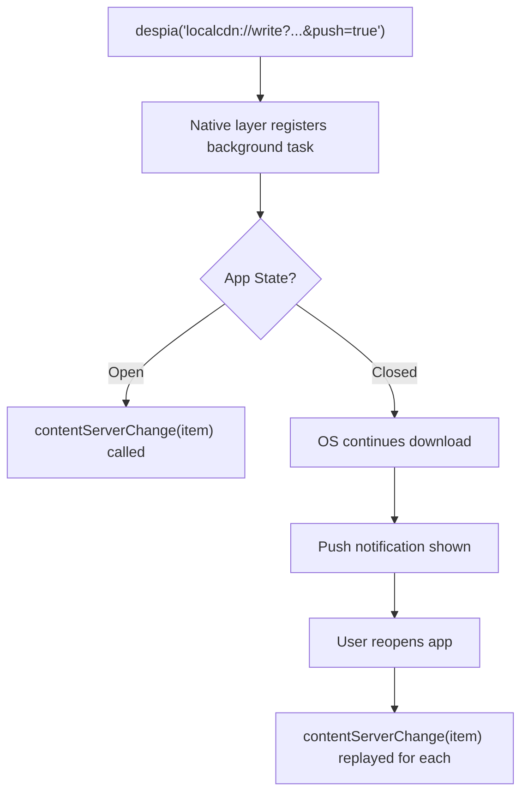

<Info>
  This feature is still in the final beta round. To request access as a beta tester, send an email to [offlinemode@despia.com](mailto:offlinemode@despia.com)
</Info>

Cache remote files locally for offline access. Background downloads continue when users close the app, using native OS transfer APIs (NSURLSession on iOS, WorkManager on Android) with built-in retry.

## Installation

<Tabs>
  <Tab title="Bundle">
    <CodeGroup>

    ```bash npm
    npm install despia-native
    ```

    ```bash pnpm
    pnpm add despia-native
    ```

    ```bash yarn
    yarn add despia-native
    ```

    </CodeGroup>

    ```javascript
    import despia from 'despia-native';
    ```
  </Tab>
  <Tab title="CDN">
    <CodeGroup>

    ```html UMD
    <script src="https://cdn.jsdelivr.net/npm/despia-native/index.min.js"></script>
    ```

    ```html ESM
    <script type="module">
        import despia from 'https://cdn.jsdelivr.net/npm/despia-native/+esm'
    </script>
    ```

    </CodeGroup>
  </Tab>
</Tabs>

---

## API Reference

### Write

Download and cache a remote file. Fire-and-forget - do not await.

<Tabs>
  <Tab title="Basic">
    ```javascript
    const remoteUrl = "http://commondatastorage.googleapis.com/gtv-videos-bucket/sample/BigBuckBunny.mp4";
    const folder = "videos";
    const subfolder = "movies";
    const filename = "bigbuckbunny.mp4";
    const uniqueId = "movie_bigbuckbunny";

    despia(
      `localcdn://write?url=${remoteUrl}&filename=${folder}/${subfolder}/${filename}&index=${uniqueId}`
    );
    ```
  </Tab>
  <Tab title="With Push">
    ```javascript
    despia(
      `localcdn://write?url=${url}&filename=${path}&index=${id}&push=true&pushmessage="${message}"`
    );
    ```
  </Tab>
</Tabs>

<Warning>
  Do not await the write call with a key. The JS bridge has a ~30s timeout. Large files will cause it to resolve with `null` even though the download continues. Use the `contentServerChange` callback instead.
</Warning>

```javascript
// WRONG: will timeout on large files
const data = await despia(
  `localcdn://write?url=${url}&filename=${path}&index=${id}`,
  [id]  // Bridge times out after ~30s
);
```

<ParamField path="url" type="string" required>
  Remote file URL to download
</ParamField>

<ParamField path="filename" type="string" required>
  Local path: `folder/subfolder/filename`
</ParamField>

<ParamField path="index" type="string" required>
  Unique ID for this file
</ParamField>

<ParamField path="push" type="boolean">
  Set to `true` to show push notification on completion
</ParamField>

<ParamField path="pushmessage" type="string">
  Notification message (wrap in quotes)
</ParamField>

<Tip>
  If you need more control, poll via `localcdn://read` to check download status instead of relying solely on the callback.
</Tip>

---

### Read

Get metadata for specific cached files by ID.

```javascript
const data = await despia(
  `localcdn://read?index=${encodeURIComponent(JSON.stringify(["video_bigbunny", "video_sintel"]))}`,
  ["cdnItems"]
);

const items = data.cdnItems; // Array of file objects
items.forEach(item => console.log(item.index, item.local_cdn));
```

<ResponseField name="cdnItems" type="array">
  Array of cached file objects
</ResponseField>

<Accordion title="Response Example">
  ```json
  [
    {
      "index_full": "videos/movies/bigbuckbunny.mp4",
      "index": "movie_bigbuckbunny",
      "extension": "mp4",
      "local_path": "/var/mobile/.../localcdn/videos/movies/bigbuckbunny.mp4",
      "local_cdn": "http://localhost:7777/localcdn/videos/movies/bigbuckbunny.mp4",
      "cdn": "http://commondatastorage.googleapis.com/gtv-videos-bucket/sample/BigBuckBunny.mp4",
      "size": "158008374",
      "status": "cached",
      "created_at": "1709856000"
    }
  ]
  ```
</Accordion>

<Accordion title="Polling Pattern">
  ```javascript
  // Poll to check if download completed (alternative to callback)
  async function checkDownloadStatus(indexId) {
    const data = await despia(
      `localcdn://read?index=${encodeURIComponent(JSON.stringify([indexId]))}`,
      ["cdnItems"]
    );
    return data.cdnItems?.[0]?.status === "cached";
  }
  ```
</Accordion>

---

### Query

Return all cached files. Use this to get a full inventory without specifying individual IDs.

```javascript
const data = await despia(
  `localcdn://query`,
  ["cdnItems"]
);

const items = data.cdnItems;
items.forEach(item => console.log(item.index, item.local_cdn));
```

<ResponseField name="cdnItems" type="array">
  Array of all cached file objects across all folders
</ResponseField>

<Accordion title="Response Example">
  ```json
  [
    {
      "index_full": "videos/movies/bigbuckbunny.mp4",
      "index": "movie_bigbuckbunny",
      "extension": "mp4",
      "local_path": "/var/mobile/.../localcdn/videos/movies/bigbuckbunny.mp4",
      "local_cdn": "http://localhost:7777/localcdn/videos/movies/bigbuckbunny.mp4",
      "cdn": "http://commondatastorage.googleapis.com/gtv-videos-bucket/sample/BigBuckBunny.mp4",
      "size": "158008374",
      "status": "cached",
      "created_at": "1709856000"
    }
  ]
  ```
</Accordion>

<Info>
  `localcdn://query` returns every item in the cache. To fetch specific files by ID, use `localcdn://read` instead.
</Info>

---

### Delete

Remove cached files.

```javascript
despia(`localcdn://delete?index=${encodeURIComponent(JSON.stringify(["video_bigbunny"]))}`);

// Result available in window.deletedCdnItems
```

---

### contentServerChange callback

Called by the native runtime when a download completes. This is where you get the file data.

```javascript
window.contentServerChange = (item) => {
  // item.local_cdn  - localhost URL for playback
  // item.cdn        - original remote URL
  // item.index      - your uniqueId from the write call
  // item.size       - file size in bytes
  // item.status     - "cached" when complete
  // item.local_path - absolute device path

  console.log("Cached:", item.index, item.local_cdn);
  addToDownloadsList(item);
};
```

<Accordion title="Callback Payload">
  ```json
  {
    "index_full": "videos/movies/bigbuckbunny.mp4",
    "index": "movie_bigbuckbunny",
    "extension": "mp4",
    "local_path": "/var/mobile/.../localcdn/videos/movies/bigbuckbunny.mp4",
    "local_cdn": "http://localhost:7777/localcdn/videos/movies/bigbuckbunny.mp4",
    "cdn": "http://commondatastorage.googleapis.com/gtv-videos-bucket/sample/BigBuckBunny.mp4",
    "size": "158008374",
    "status": "cached",
    "created_at": "1709856000"
  }
  ```
</Accordion>

The callback fires when a download completes in the foreground, and when the app reopens after background downloads completed.

---

## Response schema

<ResponseField name="index_full" type="string">
  Full file path (e.g., `videos/samples/bigbunny.mp4`)
</ResponseField>

<ResponseField name="index" type="string">
  Your unique identifier
</ResponseField>

<ResponseField name="extension" type="string">
  File extension (`mp4`, `mp3`, `json`)
</ResponseField>

<ResponseField name="local_path" type="string">
  Absolute device path
</ResponseField>

<ResponseField name="local_cdn" type="string">
  Use this for playback - localhost URL
</ResponseField>

<ResponseField name="cdn" type="string">
  Original remote URL
</ResponseField>

<ResponseField name="size" type="string">
  File size in bytes
</ResponseField>

<ResponseField name="status" type="string">
  Cache status (`"cached"`)
</ResponseField>

<ResponseField name="created_at" type="string">
  Unix timestamp
</ResponseField>

---

## Background downloads

Downloads continue when users close the app. The native OS handles retry on network failure. On iOS, a Live Activity is shown automatically with real-time download progress. On Android, a native download progress notification appears in the system tray. Both require no setup.



When the app reopens, the native layer finds any pending items and calls `contentServerChange(item)` for each completed download automatically.

---

## Playback

Use the `local_cdn` URL for offline playback:

<CodeGroup>

```javascript JavaScript
const data = await despia(
  `localcdn://read?index=${encodeURIComponent(JSON.stringify([indexId]))}`,
  ["cdnItems"]
);

if (data.cdnItems?.[0]?.status === "cached") {
  videoElement.src = data.cdnItems[0].local_cdn;
}
```

```html HTML
<video src="http://localhost:7777/localcdn/videos/movies/bigbuckbunny.mp4" controls></video>
```

</CodeGroup>

---

## HTTP upload API

<Note>
  Only available when your app is served via Despia Local Server (not from origin/remote server).
</Note>

Upload user files via HTTP POST:

```javascript
const fd = new FormData();
fd.append("file", fileInput.files[0]);

const res = await fetch("http://localhost:7777/api/upload", {
  method: "POST",
  body: fd
});

const result = await res.json();
// { success: true, fileName: "video.mp4", url: "http://localhost:7777/files/video.mp4" }
```

| Method             | Storage Path | URL Pattern                            |
| ------------------ | ------------ | -------------------------------------- |
| `localcdn://write` | `/localcdn/` | `localhost:{PORT}/localcdn/{filepath}` |
| `/api/upload`      | `/files/`    | `localhost:{PORT}/files/{filename}`    |

---

## React hook

```jsx
import { useState, useEffect, useCallback } from 'react';
import despia from 'despia-native';

function useLocalCDN() {
  const [items, setItems] = useState([]);

  useEffect(() => {
    window.contentServerChange = (item) => {
      setItems(prev => {
        const idx = prev.findIndex(i => i.index_full === item.index_full);
        if (idx >= 0) {
          const updated = [...prev];
          updated[idx] = item;
          return updated;
        }
        return [...prev, item];
      });
    };
    return () => { window.contentServerChange = null; };
  }, []);

  const download = useCallback((url, filepath, index) => {
    despia(`localcdn://write?url=${url}&filename=${filepath}&index=${index}`);
  }, []);

  const remove = useCallback((indices) => {
    const ids = Array.isArray(indices) ? indices : [indices];
    despia(`localcdn://delete?index=${encodeURIComponent(JSON.stringify(ids))}`);
    setItems(prev => prev.filter(item => !ids.includes(item.index)));
  }, []);

  return { items, download, remove };
}
```

---

## Environment check

```javascript
const isDespia = navigator.userAgent.toLowerCase().includes('despia')

if (isDespia) {
  // Use Local CDN
} else {
  // Fallback for non-Despia environment
}
```

---

## Test videos

Free sample videos for testing Local CDN (CC licensed):

<Accordion title="Available test videos">
  | Title                | URL                                                                                       | Size   |
  | -------------------- | ----------------------------------------------------------------------------------------- | ------ |
  | Big Buck Bunny       | `http://commondatastorage.googleapis.com/gtv-videos-bucket/sample/BigBuckBunny.mp4`       | ~158MB |
  | Elephant Dream       | `http://commondatastorage.googleapis.com/gtv-videos-bucket/sample/ElephantsDream.mp4`     | ~115MB |
  | Sintel               | `http://commondatastorage.googleapis.com/gtv-videos-bucket/sample/Sintel.mp4`             | ~129MB |
  | Tears of Steel       | `http://commondatastorage.googleapis.com/gtv-videos-bucket/sample/TearsOfSteel.mp4`       | ~185MB |
  | For Bigger Blazes    | `http://commondatastorage.googleapis.com/gtv-videos-bucket/sample/ForBiggerBlazes.mp4`    | ~2MB   |
  | For Bigger Escapes   | `http://commondatastorage.googleapis.com/gtv-videos-bucket/sample/ForBiggerEscapes.mp4`   | ~2MB   |
  | For Bigger Fun       | `http://commondatastorage.googleapis.com/gtv-videos-bucket/sample/ForBiggerFun.mp4`       | ~2MB   |
  | For Bigger Joyrides  | `http://commondatastorage.googleapis.com/gtv-videos-bucket/sample/ForBiggerJoyrides.mp4`  | ~2MB   |
  | For Bigger Meltdowns | `http://commondatastorage.googleapis.com/gtv-videos-bucket/sample/ForBiggerMeltdowns.mp4` | ~2MB   |
</Accordion>

<Accordion title="Quick test script">
  ```javascript
  const testVideos = [
    { url: "http://commondatastorage.googleapis.com/gtv-videos-bucket/sample/ForBiggerBlazes.mp4", id: "test_blazes" },
    { url: "http://commondatastorage.googleapis.com/gtv-videos-bucket/sample/BigBuckBunny.mp4", id: "test_bunny" },
    { url: "http://commondatastorage.googleapis.com/gtv-videos-bucket/sample/Sintel.mp4", id: "test_sintel" }
  ];

  window.contentServerChange = (item) => {
    console.log(`Downloaded: ${item.index} (${(item.size / 1024 / 1024).toFixed(1)}MB)`);
  };

  const { url, id } = testVideos[0];
  despia(`localcdn://write?url=${url}&filename=test/${id}.mp4&index=${id}`);
  ```
</Accordion>

---

## Resources

<CardGroup cols={2}>
  <Card icon="npm" href="https://www.npmjs.com/package/despia-native" title="NPM Package">
    despia-native
  </Card>
  <Card icon="envelope" href="mailto:support@despia.com" title="Support">
    support@despia.com
  </Card>
</CardGroup>