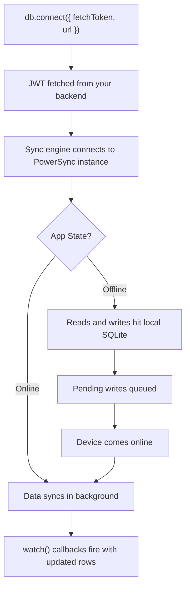

<Info>
  This feature requires Despia V4, currently in beta. Most Despia apps are running on Despia V3. To join the V4 beta, email [beta@despia.com](mailto:beta@despia.com).
</Info>

Query a local SQLite database and sync it with your backend in real time.

## Installation

<Tabs>
  <Tab title="Bundle">
    <CodeGroup>

    ```bash npm
    npm install @despia/powersync
    ```

    ```bash pnpm
    pnpm add @despia/powersync
    ```

    ```bash yarn
    yarn add @despia/powersync
    ```

    </CodeGroup>

    ```typescript
    import { db } from '@despia/powersync';
    ```
  </Tab>
  <Tab title="CDN">
    <CodeGroup>

    ```html UMD
    <script src="https://cdn.jsdelivr.net/npm/@despia/powersync/dist/umd/despia-powersync.min.js"></script>
    <script>
        const { db } = window.DespiaPowerSync
    </script>
    ```

    ```html ESM
    <script type="module">
        import { db } from 'https://cdn.jsdelivr.net/npm/@despia/powersync/+esm'
    </script>
    ```

    </CodeGroup>
  </Tab>
</Tabs>

---

## API Reference

### Connect

Establish a connection to your PowerSync instance. `fetchToken` is called whenever a new JWT is needed.

```typescript
await db.connect({
    fetchToken: async () => {
        const res = await fetch('/api/powersync-token')
        const { token } = await res.json()
        return token
    },
    url: 'https://YOUR_POWERSYNC_INSTANCE',
})
```

<ParamField path="fetchToken" type="() => Promise<string>" required>
  Returns a short-lived JWT from your backend. Called automatically when the token expires.
</ParamField>

<ParamField path="url" type="string">
  Your PowerSync instance URL.
</ParamField>


---

### Migrate

Run schema migrations on startup. The runtime tracks the installed version and only executes statements for versions higher than the current one.

```typescript
await db.migrate(1, [
    { sql: 'CREATE TABLE IF NOT EXISTS users(id INTEGER PRIMARY KEY, email TEXT)' },
    { sql: 'CREATE TABLE IF NOT EXISTS todos(id INTEGER PRIMARY KEY, title TEXT, done INTEGER DEFAULT 0)' },
])

await db.migrate(2, [
    { sql: 'ALTER TABLE users ADD COLUMN name TEXT' },
])
```

<ParamField path="version" type="number" required>
  Version number for this migration. Only runs if the installed version is lower.
</ParamField>

<ParamField path="statements" type="BatchStatement[]" required>
  Array of SQL statements to run for this version.
</ParamField>

---

### Query

Fetch multiple rows from local SQLite. Instant, no network.

<Tabs>
  <Tab title="Basic">
    ```typescript
    type User = { id: number; email: string }
    const users = await db.query<User>('SELECT id, email FROM users')
    ```
  </Tab>
  <Tab title="With params">
    ```typescript
    const active = await db.query<User>(
        'SELECT id, email FROM users WHERE active = ? AND role = ?',
        [1, 'admin']
    )
    ```
  </Tab>
</Tabs>

<ParamField path="sql" type="string" required>
  SQL SELECT statement.
</ParamField>

<ParamField path="params" type="unknown[]">
  Optional array of values bound to `?` placeholders.
</ParamField>

---

### Get

Fetch a single row. Returns `null` if no match found.

```typescript
const user = await db.get<User>('SELECT * FROM users WHERE id = ?', [userId])
if (user) console.log(user.email)
```

---

### Execute

Run a single write statement.

```typescript
const result = await db.execute(
    'INSERT INTO todos(title, done) VALUES(?, ?)',
    ['Buy milk', 0]
)
// { rowsAffected: 1, insertId: 42 }
```

<ResponseField name="rowsAffected" type="number">
  Number of rows affected.
</ResponseField>

<ResponseField name="insertId" type="number">
  Row ID of the last inserted row (INSERT only).
</ResponseField>

---

### Batch

Run multiple write statements atomically.

```typescript
await db.batch([
    { sql: 'INSERT INTO users(email) VALUES(?)', params: ['a@b.com'] },
    { sql: 'INSERT INTO users(email) VALUES(?)', params: ['c@d.com'] },
    { sql: 'UPDATE config SET value = ? WHERE key = ?', params: ['ready', 'status'] },
])
```

<ResponseField name="results" type="ExecuteResult[]">
  Array of results, one per statement.
</ResponseField>

---

### Transaction

Run a group of statements with full rollback on failure.

```typescript
await db.transaction(async (tx) => {
    await tx.execute('UPDATE accounts SET balance = balance - ? WHERE id = ?', [100, fromId])
    await tx.execute('UPDATE accounts SET balance = balance + ? WHERE id = ?', [100, toId])
})
```

If any statement throws, the entire transaction is rolled back.

---

### Watch

Subscribe to a query. Fires the callback immediately with the current result set, then again whenever matching data changes, including changes arriving from sync.

<Tabs>
  <Tab title="Without params">
    ```typescript
    type Todo = { id: number; title: string; done: 0 | 1 }
    
    const unwatch = db.watch<Todo>('SELECT * FROM todos', (rows) => {
        renderTodos(rows)
    })
    
    // Stop watching
    unwatch()
    ```
  </Tab>
  <Tab title="With params">
    ```typescript
    const unwatch = db.watch<Todo>(
        'SELECT * FROM todos WHERE done = ?',
        [0],
        (rows) => renderTodos(rows)
    )
    ```
  </Tab>
</Tabs>

---

### Sync

Trigger a manual sync.

```typescript
await db.sync()
```

---

### Disconnect

Stop the sync engine.

```typescript
await db.disconnect()
```

---

### syncStatus

Read the current sync state.

```typescript
const status = await db.syncStatus()
```

<ResponseField name="connected" type="boolean">
  Whether the sync engine is connected to the PowerSync instance.
</ResponseField>

<ResponseField name="lastSynced" type="string | null">
  ISO timestamp of the last successful sync, or `null` if never synced.
</ResponseField>

<ResponseField name="uploading" type="boolean">
  Whether local writes are currently being uploaded.
</ResponseField>

<ResponseField name="downloading" type="boolean">
  Whether data is currently being downloaded from the backend.
</ResponseField>

<Accordion title="Response Example">
  ```json
  {
    "connected": true,
    "lastSynced": "2026-04-01T09:00:00.000Z",
    "uploading": false,
    "downloading": false
  }
  ```
</Accordion>

---

### onSyncChange

Subscribe to sync state changes.

```typescript
const unsub = db.onSyncChange((status) => {
    if (!status.connected) showOfflineBanner()
    else hideOfflineBanner()
})

// Stop listening
unsub()
```

---

## Sync flow



---

## React Hook

```typescript
import { useState, useEffect, useCallback } from 'react'
import { db } from '@despia/powersync'

function useLiveQuery<T extends Record<string, unknown>>(
    sql: string,
    params?: unknown[]
) {
    const [rows, setRows] = useState<T[]>([])

    useEffect(() => {
        const unwatch = params
            ? db.watch<T>(sql, params, setRows)
            : db.watch<T>(sql, setRows)
        return unwatch
    }, [sql, JSON.stringify(params)])

    return rows
}

// Usage
function TodoList() {
    const todos = useLiveQuery<{ id: number; title: string; done: number }>(
        'SELECT * FROM todos WHERE done = ?',
        [0]
    )
    return todos.map(t => <div key={t.id}>{t.title}</div>)
}
```

---

## TypeScript types

```typescript
export type ExecuteResult = {
    rowsAffected: number
    insertId?:    number
}

export type BatchStatement = {
    sql:     string
    params?: unknown[]
}

export type BatchResult = {
    results: ExecuteResult[]
}

export type SyncStatus = {
    connected:   boolean
    lastSynced:  string | null
    uploading:   boolean
    downloading: boolean
}

export type ConnectOptions = {
    fetchToken: () => Promise<string>
    url?:       string
}
```

---

## Environment check

```typescript
if (navigator.userAgent.includes('despia')) {
    // Use PowerSync
} else {
    // Fallback for non-Despia environment (standard browser)
}
```

`@despia/powersync` requires the native bridge and will throw in a standard browser. Gate calls behind this check if your app also runs on web.

---

## Resources

<CardGroup cols={2}>
  <Card icon="npm" href="https://www.npmjs.com/package/@despia/powersync" title="NPM Package">
    @despia/powersync
  </Card>
  <Card icon="github" href="https://github.com/despia-native/despia-powersync" title="GitHub">
    despia-native/despia-powersync
  </Card>
  <Card icon="link" href="https://powersync.com" title="PowerSync">
    Backend setup, schema config, and sync rules
  </Card>
  <Card icon="envelope" href="mailto:support@despia.com" title="Support">
    support@despia.com
  </Card>
</CardGroup>