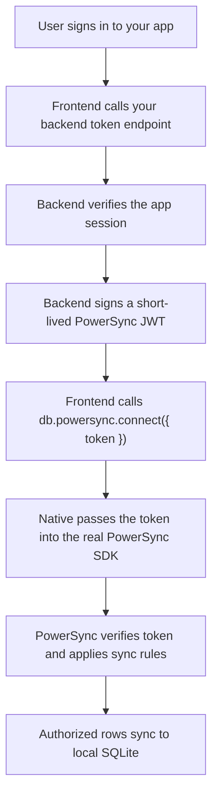
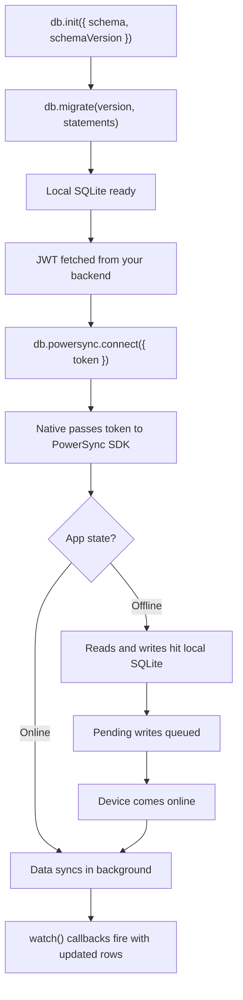

<Info>
  The PowerSync integration is fully built and production-ready. It will become publicly available when the Despia V4 editor launches shortly. To enable it for your app in the meantime, contact Despia customer support at [support@despia.com](mailto:support@despia.com).
</Info>

Query a local SQLite database, run migrations, watch live results, and optionally sync with your backend in real time.

## Installation

<Tabs>
  <Tab title="Bundle">
    <CodeGroup>

    ```bash npm
    npm install @despia/powersync
    ```

    ```bash pnpm
    pnpm add @despia/powersync
    ```

    ```bash yarn
    yarn add @despia/powersync
    ```

    </CodeGroup>

    ```typescript
    import { active, db } from '@despia/powersync';
    ```
  </Tab>
  <Tab title="CDN">
    <CodeGroup>

    ```html UMD
    <script src="https://cdn.jsdelivr.net/npm/@despia/powersync/dist/umd/despia-powersync.min.js"></script>
    <script>
        const { db, active } = window.powersync
    </script>
    ```

    ```html ESM
    <script type="module">
        import { active, db } from 'https://cdn.jsdelivr.net/npm/@despia/powersync/+esm'
    </script>
    ```

    </CodeGroup>
  </Tab>
</Tabs>

---

## Two-layer model

`@despia/powersync` exposes two layers:

- **Local SQLite** is available as soon as `db.init()` succeeds and migrations apply. No token, no network, no cloud setup required.
- **Cloud sync** lives under `db.powersync.*`. It only starts after `db.powersync.connect({ token })` is called with a valid user-scoped JWT.

Until native has an active schema and credentials, sync stays off. Local reads and writes still work.

---

## API Reference

### active

Check whether the native PowerSync bridge is available in the current runtime.

```typescript
import { active } from '@despia/powersync'

if (!active()) {
    // Standard browser, no native bridge.
    return
}
```

`active()` only checks bridge presence. It does not mean SQLite is initialized or sync is connected.

---

### db.init

Initialize the database with a schema and target schema version. Call this once at startup, before any queries, migrations, or sync calls.

```typescript
import { db, type PowerSyncSchema } from '@despia/powersync'

const SCHEMA_VERSION = 1

const SCHEMA: PowerSyncSchema = {
    users: {
        columns: {
            id:        'text',
            email:     'text',
            createdAt: 'text',
        },
        indexes: {
            users_by_email: ['email'],
        },
    },
    todos: {
        columns: {
            id:        'text',
            userId:    'text',
            title:     'text',
            done:      'integer',
            createdAt: 'text',
        },
        indexes: {
            todos_by_user: ['userId'],
        },
    },
}

await db.init({
    schema:        SCHEMA,
    schemaVersion: SCHEMA_VERSION,
    databaseName:  'mydb',
})
```

<ParamField path="schema" type="PowerSyncSchema" required>
  Describes the tables the sync engine should map. Each key is a table name. Each value declares the columns and optional indexes for that table.

  ```typescript
  type PowerSyncColumnType = 'text' | 'integer' | 'real'
  
  type PowerSyncSchema = Record<
      string,
      {
          columns: Record<string, PowerSyncColumnType>
          indexes?: Record<string, string[]>
      }
  >
  ```

  Column types map directly to SQLite affinity types: `'text'`, `'integer'`, or `'real'`. Indexes are optional and declared as a map of index name to an array of column names.
</ParamField>

<ParamField path="schemaVersion" type="number" required>
  Positive integer matching the latest migration version for this schema. Native uses this to know when to promote the pending schema to active.
</ParamField>

<ParamField path="databaseName" type="string">
  Optional database name. Defaults are handled by native if omitted.
</ParamField>

---

### db.schema

Read the currently active schema state from native. Useful for figuring out which migrations are still pending.

```typescript
const state = await db.schema()

console.log(state.schema)
console.log(state.databaseName)
console.log(state.appliedMigrationVersion)
```

<ResponseField name="schema" type="PowerSyncSchema">
  The active schema currently installed in native.
</ResponseField>

<ResponseField name="databaseName" type="string">
  The active database name.
</ResponseField>

<ResponseField name="schemaHash" type="string">
  Hash of the active schema for change detection.
</ResponseField>

<ResponseField name="schemaVersion" type="number">
  The schema version most recently passed to `db.init()`.
</ResponseField>

<ResponseField name="appliedMigrationVersion" type="number">
  The highest migration version that has been successfully applied.
</ResponseField>

<Accordion title="Response Example">
  ```json
  {
    "schema": {
      "users": {
        "columns": {
          "id": "text",
          "email": "text",
          "createdAt": "text"
        },
        "indexes": {
          "users_by_email": ["email"]
        }
      }
    },
    "databaseName": "mydb",
    "schemaHash": "2d711642b726b04401627ca9fbac32f5",
    "schemaVersion": 2,
    "appliedMigrationVersion": 2
  }
  ```
</Accordion>

---

### db.migrate

Run schema migrations on startup. The runtime tracks the installed version and only executes statements for versions higher than the current one.

When your current schema is at version `N` and the device still needs migrations `1..N`, pass all pending statements in one `db.migrate(N, statements)` call. Native commits or rolls back the full upgrade as one transaction.

```typescript
await db.migrate(1, [
    `CREATE TABLE IF NOT EXISTS users (
        id TEXT PRIMARY KEY,
        email TEXT NOT NULL,
        createdAt TEXT NOT NULL
    )`,
    'CREATE INDEX IF NOT EXISTS users_by_email ON users(email)',
])

await db.migrate(2, [
    'ALTER TABLE users ADD COLUMN displayName TEXT',
])
```

Statements can be plain SQL strings or `BatchStatement` objects with parameters.

<ParamField path="version" type="number" required>
  Target migration version. Should match `SCHEMA_VERSION`. Native uses this to decide when to promote the pending schema to active.
</ParamField>

<ParamField path="statements" type="string[] | BatchStatement[]" required>
  Array of SQL statements to run for this version.
</ParamField>

---

### db.query

Fetch multiple rows from local SQLite. Instant, no network.

<Tabs>
  <Tab title="Basic">
    ```typescript
    type User = { id: string; email: string }
    const users = await db.query<User>('SELECT id, email FROM users')
    ```
  </Tab>
  <Tab title="With params">
    ```typescript
    const active = await db.query<User>(
        'SELECT id, email FROM users WHERE active = ? AND role = ?',
        [1, 'admin']
    )
    ```
  </Tab>
</Tabs>

<ParamField path="sql" type="string" required>
  SQL SELECT statement.
</ParamField>

<ParamField path="params" type="unknown[]">
  Optional array of values bound to `?` placeholders.
</ParamField>

---

### db.get

Fetch a single row. Returns `null` if no match found.

```typescript
const user = await db.get<User>('SELECT * FROM users WHERE id = ?', [userId])
if (user) console.log(user.email)
```

---

### db.execute

Run a single write statement.

```typescript
const result = await db.execute(
    'INSERT INTO todos(id, userId, title, done, createdAt) VALUES(?, ?, ?, ?, ?)',
    ['todo_1', 'user_1', 'Buy milk', 0, new Date().toISOString()]
)
// { rowsAffected: 1 }
```

<ResponseField name="rowsAffected" type="number">
  Number of rows affected.
</ResponseField>

<ResponseField name="insertId" type="number">
  Row ID of the last inserted row (INSERT only, when applicable).
</ResponseField>

---

### db.batch

Run multiple write statements atomically.

```typescript
await db.batch([
    {
        sql: 'INSERT INTO users(id, email, createdAt) VALUES(?, ?, ?)',
        params: ['u1', 'a@b.com', new Date().toISOString()],
    },
    {
        sql: 'INSERT INTO users(id, email, createdAt) VALUES(?, ?, ?)',
        params: ['u2', 'c@d.com', new Date().toISOString()],
    },
    {
        sql: 'UPDATE config SET value = ? WHERE key = ?',
        params: ['ready', 'status'],
    },
])
```

<ResponseField name="results" type="ExecuteResult[]">
  Array of results, one per statement.
</ResponseField>

---

### db.transaction

Run a group of statements with full rollback on failure.

```typescript
await db.transaction(async (tx) => {
    await tx.execute('UPDATE accounts SET balance = balance - ? WHERE id = ?', [100, fromId])
    await tx.execute('UPDATE accounts SET balance = balance + ? WHERE id = ?', [100, toId])
})
```

If any statement throws, the entire transaction is rolled back.

---

### db.watch

Subscribe to a query. Fires the callback immediately with the current result set, then again whenever matching data changes, including changes arriving from sync.

<Tabs>
  <Tab title="Without params">
    ```typescript
    type Todo = { id: string; title: string; done: 0 | 1 }
    
    const unwatch = db.watch<Todo>('SELECT * FROM todos', (rows) => {
        renderTodos(rows)
    })
    
    // Stop watching
    unwatch()
    ```
  </Tab>
  <Tab title="With params">
    ```typescript
    const unwatch = db.watch<Todo>(
        'SELECT * FROM todos WHERE done = ?',
        [0],
        (rows) => renderTodos(rows)
    )
    ```
  </Tab>
</Tabs>

---

### db.powersync.connect

Start cloud sync. Pass a short-lived JWT minted by your backend for the signed-in user.

```typescript
const token = await getPowerSyncToken()
await db.powersync.connect({ token })
```

Native reads the static PowerSync app ID and instance URL from native config. You only pass a user-scoped token. See [PowerSync auth and tokens](#powersync-auth-and-tokens) below for the token flow.

<ParamField path="token" type="string" required>
  A short-lived JWT signed by your backend. Identifies the user to PowerSync.
</ParamField>

---

### db.powersync.sync

Trigger a manual sync.

```typescript
await db.powersync.sync()

const status = await db.powersync.status()
console.log(status)
```

Sync usually completes asynchronously. Treat `db.powersync.sync()` as a trigger, then read status with `db.powersync.status()` or subscribe with `db.powersync.events.status()`.

---

### db.powersync.status

Read the current sync state.

```typescript
const status = await db.powersync.status()
```

<ResponseField name="connected" type="boolean">
  Whether the sync engine is connected to the PowerSync instance.
</ResponseField>

<ResponseField name="lastSynced" type="string | null">
  ISO timestamp of the last successful sync, or `null` if never synced.
</ResponseField>

<ResponseField name="uploading" type="boolean">
  Whether local writes are currently being uploaded.
</ResponseField>

<ResponseField name="downloading" type="boolean">
  Whether data is currently being downloaded from the backend.
</ResponseField>

<Accordion title="Response Example">
  ```json
  {
    "connected": true,
    "lastSynced": "2026-04-29T08:30:00.000Z",
    "uploading": false,
    "downloading": false
  }
  ```
</Accordion>

---

### db.powersync.events.status

Subscribe to sync state changes.

```typescript
const unsubscribe = db.powersync.events.status((status) => {
    if (!status.connected) showOfflineBanner()
    else hideOfflineBanner()
})

// Stop listening
unsubscribe()
```

Use this for sync state UI (syncing indicators, offline banners, last-synced timestamps). For row data, use `db.watch()` instead.

---

## PowerSync auth and tokens

`db.powersync.connect({ token })` gives the native PowerSync engine a token for the current signed-in user. It does not log the user into your app, and it does not create the token.

Three separate pieces are involved:

1. **Your app auth** decides who the user is.
2. **PowerSync Client Auth** verifies the token native sends to PowerSync.
3. **PowerSync sync rules** decide which rows that verified user can sync.

The token identifies the user. It does not contain all user data, and it does not automatically protect rows by itself. If a row syncs into local SQLite, your frontend can query it. Private data must be blocked by PowerSync sync rules before it reaches the device.

### Token flow



Your backend signs the JWT with the key or secret configured in PowerSync **Client Auth**. The native PowerSync SDK then connects to PowerSync with that token, and PowerSync verifies signature, `kid`, audience, expiry, and subject.

### PowerSync dashboard setup

In the PowerSync dashboard, configure auth before expecting real sync to work:

- Open your PowerSync project.
- Go to **Client Auth** and configure the same JWT verification method your backend uses.
- Configure sync rules or streams that use the authenticated user identity.

For custom JWT auth, PowerSync expects a signed JWT with fields like:

```json
{
    "sub":    "user_123",
    "aud":    "https://your-powersync-instance-url",
    "iat":    1710000000,
    "exp":    1710000900,
    "userId": "user_123"
}
```

The header should include the configured key id:

```json
{
    "alg": "HS256",
    "kid": "your-key-id"
}
```

| Field | Purpose |
| --- | --- |
| `sub` | The application user ID. PowerSync rules use this as the user identity. |
| `aud` | Must match the PowerSync instance URL or configured audience. |
| `iat` / `exp` | Token issue and expiry times. Keep expiry short. |
| `kid` | Header key id. Must match the key configured in PowerSync Client Auth. |
| custom claims | Optional app data such as team, role, or project claims if your rules need them. |

For production, asymmetric JWT signing with JWKS is usually preferred because PowerSync can verify tokens with a public key while your backend keeps the private signing key. HS256 can work for development or simpler deployments if it exactly matches your PowerSync Client Auth configuration.

### Sync rules

PowerSync verifies who the user is from the token. Your sync rules decide what that user can sync.

A simple rule is conceptually:

```sql
SELECT * FROM todos WHERE user_id = auth.user_id()
```

If the JWT has `sub = "user_123"`, rules should only sync rows authorized for `user_123`. For team, organization, or project data, include the required claims in the token or resolve membership in your backend or PowerSync rules. Do not issue broad tokens that allow every user to sync every row unless that is truly intended.

Before shipping, test with two users and confirm user A never receives user B's private rows.

### Client code

```typescript
import { db } from '@despia/powersync'

async function getPowerSyncToken() {
    const response = await fetch('/api/powersync-token', {
        method:      'POST',
        credentials: 'include',
        headers: {
            'Content-Type': 'application/json',
        },
    })

    if (!response.ok) {
        throw new Error('Could not get PowerSync token')
    }

    const data = (await response.json()) as {
        token:     string
        expiresAt?: string
    }

    return data.token
}

const token = await getPowerSyncToken()
await db.powersync.connect({ token })
```

### Backend token endpoint

This example uses HS256 because it is compact. Match the algorithm, `kid`, secret or key, audience, and claims to your own PowerSync Client Auth settings.

```typescript
import express from 'express'
import { SignJWT } from 'jose'

const app = express()
app.use(express.json())

app.post('/api/powersync-token', async (req, res) => {
    const user = await getUserFromSession(req)

    if (!user) {
        return res.status(401).json({ error: 'not_authenticated' })
    }

    const secret    = Buffer.from(process.env.POWERSYNC_JWT_SECRET!, 'base64url')
    const expiresAt = Math.floor(Date.now() / 1000) + 15 * 60

    const token = await new SignJWT({
        userId: user.id,
    })
        .setProtectedHeader({
            alg: 'HS256',
            kid: process.env.POWERSYNC_JWT_KID!,
        })
        .setSubject(user.id)
        .setIssuer(process.env.POWERSYNC_JWT_ISSUER!)
        .setAudience(process.env.POWERSYNC_URL!)
        .setIssuedAt()
        .setExpirationTime(expiresAt)
        .sign(secret)

    return res.json({
        token,
        expiresAt: new Date(expiresAt * 1000).toISOString(),
    })
})
```

Keep signing keys and secrets on the server. The frontend should receive only a short-lived token for the authenticated user.

### Supabase and Firebase

If your app already uses Supabase Auth or Firebase Auth, you may not need a custom token endpoint. PowerSync can be configured to verify those provider JWTs directly when Client Auth, audience, and JWKS settings match your provider.

- [PowerSync Custom Authentication](https://docs.powersync.com/installation/authentication-setup/custom)
- [PowerSync Supabase Auth](https://docs.powersync.com/installation/authentication-setup/supabase-auth)
- [PowerSync Firebase Auth](https://docs.powersync.com/installation/authentication-setup/firebase-auth)

Native does not implement row-level authorization itself. Native passes the token into the real PowerSync SDK and reports real sync status and errors. Row-level authorization belongs in your PowerSync sync rules.

---

## Migrations

Schema describes the expected shape. Migration SQL changes the actual SQLite file. You usually need both.

Keep schema and migrations together:

```typescript
import type { PowerSyncSchema } from '@despia/powersync'

export const DATABASE_NAME  = 'mydb'
export const SCHEMA_VERSION = 2

export const CURRENT_SCHEMA: PowerSyncSchema = {
    users: {
        columns: {
            id:        'text',
            email:     'text',
            createdAt: 'text',
        },
        indexes: {
            users_by_email: ['email'],
        },
    },
    posts: {
        columns: {
            id:        'text',
            userId:    'text',
            title:     'text',
            body:      'text',
            createdAt: 'text',
        },
        indexes: {
            posts_by_user: ['userId'],
        },
    },
}

export const MIGRATIONS = [
    {
        version: 1,
        statements: [
            `CREATE TABLE IF NOT EXISTS users (
                id TEXT PRIMARY KEY,
                email TEXT NOT NULL,
                createdAt TEXT NOT NULL
            )`,
            'CREATE INDEX IF NOT EXISTS users_by_email ON users(email)',
        ],
    },
    {
        version: 2,
        statements: [
            `CREATE TABLE IF NOT EXISTS posts (
                id TEXT PRIMARY KEY,
                userId TEXT NOT NULL,
                title TEXT NOT NULL,
                body TEXT,
                createdAt TEXT NOT NULL
            )`,
            'CREATE INDEX IF NOT EXISTS posts_by_user ON posts(userId)',
        ],
    },
]
```

When schema changes:

- Update `CURRENT_SCHEMA`.
- Increase `SCHEMA_VERSION`.
- Add a migration with the new version.
- Run all pending migration statements with `db.migrate(SCHEMA_VERSION, pendingStatements)`.
- Only then run queries or sync that depend on the new shape.

### Add a column

```typescript
await db.migrate(3, [
    'ALTER TABLE users ADD COLUMN displayName TEXT',
])
```

### Add a table

```typescript
await db.migrate(4, [
    `CREATE TABLE IF NOT EXISTS comments (
        id TEXT PRIMARY KEY,
        postId TEXT NOT NULL,
        body TEXT NOT NULL
    )`,
    'CREATE INDEX IF NOT EXISTS comments_by_post ON comments(postId)',
])
```

### Rename or reshape a table

Use copy-and-swap:

```typescript
await db.migrate(5, [
    `CREATE TABLE users_new (
        id TEXT PRIMARY KEY,
        email TEXT NOT NULL,
        displayName TEXT,
        createdAt TEXT NOT NULL
    )`,
    `INSERT INTO users_new (id, email, displayName, createdAt)
     SELECT id, email, NULL, createdAt FROM users`,
    'DROP TABLE users',
    'ALTER TABLE users_new RENAME TO users',
])
```

---

## Errors and validation

`db.init()`, `db.migrate()`, and other methods throw a `PowerSyncError` when validation fails. Inspect `code` and `details` to handle errors.

```typescript
type PowerSyncErrorDetail = {
    path?:     string
    reason?:   string
    expected?: string | string[]
    received?: string
    [key: string]: unknown
}

type PowerSyncError = Error & {
    code?:        string
    details?:     PowerSyncErrorDetail[]
    nativeError?: string
}
```

Example handling:

```typescript
try {
    await db.migrate(3, MIGRATION_3)
} catch (error) {
    const err = error as { code?: string; details?: Array<Record<string, unknown>> }

    if (err.code === 'invalid_schema') {
        for (const detail of err.details ?? []) {
            const expected = Array.isArray(detail.expected)
                ? detail.expected.join(', ')
                : detail.expected
            console.error(`${detail.path}: expected ${expected}, received ${detail.received}`)
        }
    }

    throw error
}
```

### Error codes

| Code | Source | Meaning | Typical fix |
| --- | --- | --- | --- |
| `schema_required` | SDK or native | Missing or empty schema, or no active schema for a schema-dependent native operation. | Call `db.init({ schema, schemaVersion })`, apply migrations, then retry. |
| `invalid_schema` | SDK or native | Schema shape is malformed. | Check `error.details[]` and fix the listed paths. |
| `invalid_options` | SDK or native | Method options are malformed. | Pass the documented options object and valid field types. |
| `credentials_required` | Native | Sync needs a token. | Call `db.powersync.connect({ token })`. |
| `sync_not_configured` | Native | Native PowerSync app ID or URL config is missing. | Fix native PowerSync config. |
| `sync_not_initialized` | Native | Native sync engine could not start or is not ready. | Ensure active schema, migrations, credentials, and native SDK setup are complete. |
| `migration_validation_failed` | Native | Migration SQL failed or expected schema shape was not reached. | Fix SQL or schema before retrying `db.migrate()`. |
| `database_not_initialized` | Native | Native SQLite database is not open. | Check native bridge and database setup. |
| `request_timeout` | SDK | Native did not respond to a bridge request within the timeout. | Ensure native completes requests promptly. |

### Validation reasons

The `received` column shows examples of bad input that trigger each error.

| Reason | Path example | Expected | Example received |
| --- | --- | --- | --- |
| `missing_or_invalid_schema` | `schema` | non-empty object | `undefined`, `null`, array |
| `empty_schema` | `schema` | object with at least one table | empty object |
| `empty_table_name` | `schema` | non-empty table name | empty string |
| `invalid_table_definition` | `schema.users` | object with `columns` map | string, array, null |
| `invalid_columns` | `schema.users.columns` | non-empty object | string, array, null |
| `empty_columns` | `schema.users.columns` | object with at least one column | empty object |
| `empty_column_name` | `schema.users.columns` | non-empty column name | empty string |
| `invalid_column_type` | `schema.users.columns.age` | `["text", "integer", "real"]` | `varchar`, `number`, `boolean` |
| `invalid_indexes` | `schema.users.indexes` | object mapping index names to column arrays | string, array, null |
| `empty_index_name` | `schema.users.indexes` | non-empty index name | empty string |
| `invalid_index_columns` | `schema.users.indexes.by_email` | non-empty string array | empty array, string, null |
| `invalid_index_column_name` | `schema.users.indexes.by_email` | non-empty string | empty string, number |
| `unknown_index_column` | `schema.users.indexes.by_row` | existing column name | `row` |
| `invalid_schema_version` | `options.schemaVersion` | positive integer | `0`, `1.5`, string |
| `invalid_database_name` | `options.databaseName` | non-empty string | empty string, number |
| `invalid_migration_version` | `version` | positive integer | `0`, `1.5`, string |
| `invalid_migration_statements` | `statements` | non-empty string array or `BatchStatement[]` | empty array, null |
| `invalid_migration_sql` | `statements.0` | non-empty SQL string | empty string, number |
| `empty_migration_sql` | `statements.0.sql` | non-empty SQL string | empty string |
| `invalid_token` | `config.token` | non-empty string | empty string, undefined |
| `invalid_url` | `config.url` | non-empty string | empty string, number |

### Fallback flow

If a schema upgrade fails, do not start sync with the new schema. Fall back to the active schema state if you can run against it.

```typescript
async function setupDatabase(token?: string) {
    await db.init({
        schema:        CURRENT_SCHEMA,
        schemaVersion: SCHEMA_VERSION,
        databaseName:  DATABASE_NAME,
    })

    try {
        const activeSchema      = await db.schema().catch(() => null)
        const appliedVersion    = activeSchema?.appliedMigrationVersion ?? 0
        const pendingMigrations = MIGRATIONS.filter((m) => m.version > appliedVersion)

        if (pendingMigrations.length > 0) {
            await db.migrate(
                SCHEMA_VERSION,
                pendingMigrations.flatMap((m) => m.statements)
            )
        }

        if (token) await db.powersync.connect({ token })

        return { mode: 'ready' as const }
    } catch (error) {
        console.error('Database setup failed:', error)

        try {
            const state = await db.schema()
            return {
                mode:         'fallback' as const,
                schema:       state.schema,
                databaseName: state.databaseName,
            }
        } catch {
            return { mode: 'blocked' as const }
        }
    }
}
```

Fallback mode is only safe if your current app can run against the active schema returned by `db.schema()`.

---

## Sync flow



---

## React Hook

```typescript
import { useState, useEffect } from 'react'
import { db } from '@despia/powersync'

function useLiveQuery<T extends Record<string, unknown>>(
    sql: string,
    params?: unknown[]
) {
    const [rows, setRows] = useState<T[]>([])

    useEffect(() => {
        const unwatch = params
            ? db.watch<T>(sql, params, setRows)
            : db.watch<T>(sql, setRows)
        return unwatch
    }, [sql, JSON.stringify(params)])

    return rows
}

// Usage
function TodoList() {
    const todos = useLiveQuery<{ id: string; title: string; done: number }>(
        'SELECT * FROM todos WHERE done = ?',
        [0]
    )
    return todos.map(t => <div key={t.id}>{t.title}</div>)
}
```

---

## TypeScript types

```typescript
export type PowerSyncColumnType = 'text' | 'integer' | 'real'

export type PowerSyncTableSchema = {
    columns:  Record<string, PowerSyncColumnType>
    indexes?: Record<string, string[]>
}

export type PowerSyncSchema = Record<string, PowerSyncTableSchema>

export type PowerSyncInitOptions = {
    schema:        PowerSyncSchema
    schemaVersion: number
    databaseName?: string
}

export type PowerSyncSchemaState = {
    schema:                  PowerSyncSchema
    databaseName:            string
    schemaHash:              string
    schemaVersion:           number
    appliedMigrationVersion: number
}

export type PowerSyncConfig = {
    token: string
}

export type ExecuteResult = {
    rowsAffected: number
    insertId?:    number
}

export type BatchStatement = {
    sql:     string
    params?: unknown[]
}

export type BatchResult = {
    results: ExecuteResult[]
}

export type SyncStatus = {
    connected:   boolean
    lastSynced:  string | null
    uploading:   boolean
    downloading: boolean
}

export type PowerSyncErrorDetail = {
    path?:     string
    reason?:   string
    expected?: string | string[]
    received?: string
    [key: string]: unknown
}

export type PowerSyncError = Error & {
    code?:        string
    details?:     PowerSyncErrorDetail[]
    nativeError?: string
}
```

---

## Environment check

```typescript
import { active } from '@despia/powersync'

if (active()) {
    // Use PowerSync
} else {
    // Fallback for non-Despia environment (standard browser)
}
```

`@despia/powersync` requires the native bridge and will throw in a standard browser. Gate calls behind this check if your app also runs on web.

---

## Resources

<CardGroup cols={2}>
  <Card title="NPM Package" icon="npm" href="https://www.npmjs.com/package/@despia/powersync">
    @despia/powersync
  </Card>

  <Card title="GitHub" icon="github" href="https://github.com/despia-native/despia-powersync">
    despia-native/despia-powersync
  </Card>

  <Card title="PowerSync" icon="link" href="https://powersync.com">
    Backend setup, schema config, and sync rules
  </Card>

  <Card title="Support" icon="envelope" href="mailto:support@despia.com">
    [support@despia.com](mailto:support@despia.com)
  </Card>
</CardGroup>