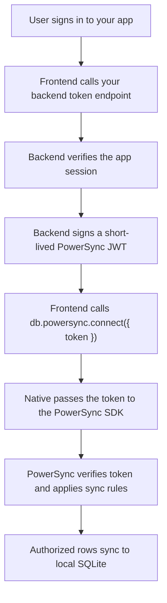

<Info>
  **The PowerSync integration is fully built and production-ready.** The cloud sync component will become publicly available when the Despia V4 editor launches. To enable it already contact our support via the Despia live chat and share your PowerSync URL \+ Bundle ID.
</Info>

## Installation

<Tabs>
  <Tab title="Bundle">
    <CodeGroup>

    ```bash npm
    npm install @despia/powersync
    ```

    ```bash pnpm
    pnpm add @despia/powersync
    ```

    ```bash yarn
    yarn add @despia/powersync
    ```

    </CodeGroup>

    ```typescript
    import { active, db } from '@despia/powersync';
    ```
  </Tab>
  <Tab title="CDN">
    <CodeGroup>

    ```html UMD
    <script src="https://cdn.jsdelivr.net/npm/@despia/powersync/dist/umd/despia-powersync.min.js"></script>
    <script>
        const { db, active } = window.powersync
    </script>
    ```

    ```html ESM
    <script type="module">
        import { active, db } from 'https://cdn.jsdelivr.net/npm/@despia/powersync/+esm'
    </script>
    ```

    </CodeGroup>
  </Tab>
</Tabs>

---

## Check for the native runtime

Returns `true` when the native PowerSync runtime is present, `false` in a standard browser. Use this to guard all database calls when your web app also runs outside Despia.

```typescript
import { active } from '@despia/powersync'

if (!active()) {
    return // standard browser, no native runtime
}
```

`active()` only confirms runtime presence. It does not mean SQLite is initialized or sync is connected.

---

## Initialize the database

Call once at startup, before any queries, migrations, or sync calls. Registers the schema and target version with native as pending state.

```typescript
import { db, type PowerSyncSchema } from '@despia/powersync'

const SCHEMA_VERSION = 1

const SCHEMA: PowerSyncSchema = {
    users: {
        columns: {
            id:        'text',
            email:     'text',
            createdAt: 'text',
        },
        indexes: {
            users_by_email: ['email'],
        },
    },
    todos: {
        columns: {
            id:        'text',
            userId:    'text',
            title:     'text',
            done:      'integer',
            createdAt: 'text',
        },
        indexes: {
            todos_by_user: ['userId'],
        },
    },
}

await db.init({
    schema:        SCHEMA,
    schemaVersion: SCHEMA_VERSION,
    databaseName:  'mydb',
})
```

| Parameter | Required | Description |
| --- | --- | --- |
| `schema` | Yes | Describes the tables and columns native PowerSync should map. Column types must be exactly `"text"`, `"integer"`, or `"real"`. Indexes are optional and map an index name to an array of column names that exist in the same table. |
| `schemaVersion` | Yes | Positive integer matching the latest migration version for this schema. Native promotes the pending schema to active only after migrations reach this version. |
| `databaseName` | No | Optional database name. Native uses a default if omitted. |

`db.init()` validates the schema object before calling native. If validation fails it throws a `PowerSyncError` with `code: "invalid_schema"` and a `details` array listing every path that failed.

---

## Read the active schema state

Returns the schema currently active in native. Use this to determine which migrations are still pending.

```typescript
const state = await db.schema()

console.log(state.schema)
console.log(state.appliedMigrationVersion)
```

| Return field | Type | Description |
| --- | --- | --- |
| `schema` | `PowerSyncSchema` | The active schema installed in native. |
| `databaseName` | `string` | The active database name. |
| `schemaHash` | `string` | Hash of the active schema, useful for change detection. |
| `schemaVersion` | `number` | The schema version most recently passed to `db.init()`. |
| `appliedMigrationVersion` | `number` | The highest migration version that has been successfully applied. |

<Accordion title="Response example">
  ```json
  {
    "schema": {
      "users": {
        "columns": { "id": "text", "email": "text", "createdAt": "text" },
        "indexes": { "users_by_email": ["email"] }
      }
    },
    "databaseName": "mydb",
    "schemaHash": "2d711642b726b04401627ca9fbac32f5",
    "schemaVersion": 2,
    "appliedMigrationVersion": 2
  }
  ```
</Accordion>

---

## Run migrations

Apply pending SQL statements to the SQLite file. Native tracks the installed version and only executes statements for versions higher than the current one. Pass all pending statements for a version in a single call so native can commit or roll back the full upgrade as one transaction.

```typescript
await db.migrate(1, [
    `CREATE TABLE IF NOT EXISTS users (
        id TEXT PRIMARY KEY,
        email TEXT NOT NULL,
        createdAt TEXT NOT NULL
    )`,
    'CREATE INDEX IF NOT EXISTS users_by_email ON users(email)',
])

await db.migrate(2, [
    'ALTER TABLE users ADD COLUMN displayName TEXT',
])
```

| Parameter | Required | Description |
| --- | --- | --- |
| `version` | Yes | Target migration version. Should match `SCHEMA_VERSION`. Native promotes the pending schema to active when this version matches `schemaVersion`. |
| `statements` | Yes | Array of SQL strings or `BatchStatement` objects to run for this version. Must be non-empty. |

When your schema is at version `N` and the device needs migrations `1` through `N`, pass all pending statements in one `db.migrate(N, statements)` call rather than calling `migrate()` once per version.

---

## Query multiple rows

Fetches all matching rows from local SQLite. Instant, no network.

```typescript
type User = { id: string; email: string }

const users = await db.query<User>(
    'SELECT id, email FROM users WHERE active = ? AND role = ?',
    [1, 'admin']
)
```

| Parameter | Required | Description |
| --- | --- | --- |
| `sql` | Yes | SQL SELECT statement. |
| `params` | No | Array of values bound to `?` placeholders in order. |

---

## Query a single row

Fetches the first matching row from local SQLite. Returns `null` if no row matches.

```typescript
const user = await db.get<User>('SELECT * FROM users WHERE id = ?', [userId])
if (user) console.log(user.email)
```

---

## Write a single row

Runs one INSERT, UPDATE, or DELETE statement.

```typescript
const result = await db.execute(
    'INSERT INTO todos(id, userId, title, done, createdAt) VALUES(?, ?, ?, ?, ?)',
    ['todo_1', 'user_1', 'Buy milk', 0, new Date().toISOString()]
)
// { rowsAffected: 1 }
```

| Return field | Type | Description |
| --- | --- | --- |
| `rowsAffected` | `number` | Number of rows affected by the statement. |
| `insertId` | `number` | Row ID of the last inserted row. Present for INSERT statements when applicable. |

---

## Write multiple rows atomically

Runs an array of write statements as one batch. All statements succeed or none do.

```typescript
await db.batch([
    {
        sql:    'INSERT INTO users(id, email, createdAt) VALUES(?, ?, ?)',
        params: ['u1', 'a@b.com', new Date().toISOString()],
    },
    {
        sql:    'INSERT INTO users(id, email, createdAt) VALUES(?, ?, ?)',
        params: ['u2', 'c@d.com', new Date().toISOString()],
    },
])
```

Returns `{ results: ExecuteResult[] }`, one result per statement.

---

## Run a transaction

Runs a group of statements with full rollback on any failure.

```typescript
await db.transaction(async (tx) => {
    await tx.execute('UPDATE accounts SET balance = balance - ? WHERE id = ?', [100, fromId])
    await tx.execute('UPDATE accounts SET balance = balance + ? WHERE id = ?', [100, toId])
})
```

If any statement throws, the entire transaction is rolled back. The `tx` object exposes the same `execute` API as `db.execute`.

---

## Subscribe to a live query

Fires the callback immediately with the current result set, then again whenever matching data changes, including rows updated by sync.

```typescript
type Todo = { id: string; title: string; done: 0 | 1 }

// Without params
const unwatch = db.watch<Todo>('SELECT * FROM todos', (rows) => {
    renderTodos(rows)
})

// With params
const unwatch = db.watch<Todo>(
    'SELECT * FROM todos WHERE done = ?',
    [0],
    (rows) => renderTodos(rows)
)

// Stop watching
unwatch()
```

Call the returned function to stop the subscription. Always call it when the subscribing component or screen unmounts.

---

## Connect to cloud sync

Starts sync for the signed-in user. Pass a short-lived JWT minted by your backend. Native reads the static PowerSync app ID and instance URL from native config.

```typescript
const token = await getPowerSyncToken()
await db.powersync.connect({ token })
```

| Parameter | Required | Description |
| --- | --- | --- |
| `token` | Yes | A short-lived JWT signed by your backend. Identifies the signed-in user to PowerSync. See [PowerSync auth and tokens](#powersync-auth-and-tokens). |

Do not call this before `db.init()` and migrations. Sync will fail silently or throw if no active schema exists.

---

## Trigger a manual sync

Schedules an immediate sync cycle. Sync completes asynchronously.

```typescript
await db.powersync.sync()

const status = await db.powersync.status()
console.log(status)
```

Treat `db.powersync.sync()` as a trigger, then read the result with `db.powersync.status()` or subscribe with `db.powersync.events.status()`.

---

## Read current sync state

Returns a snapshot of the sync engine state.

```typescript
const status = await db.powersync.status()
```

| Return field | Type | Description |
| --- | --- | --- |
| `connected` | `boolean` | Whether the sync engine is connected to the PowerSync instance. |
| `lastSynced` | `string | null` | ISO timestamp of the last successful sync, or `null` if never synced. |
| `uploading` | `boolean` | Whether local writes are currently being uploaded. |
| `downloading` | `boolean` | Whether data is currently being downloaded. |

<Accordion title="Response example">
  ```json
  {
    "connected": true,
    "lastSynced": "2026-04-29T08:30:00.000Z",
    "uploading": false,
    "downloading": false
  }
  ```
</Accordion>

---

## Subscribe to sync state changes

Fires the callback whenever sync state changes. Use this for sync indicators, offline banners, and last-synced timestamps. For row data, use `db.watch()` instead.

```typescript
const unsubscribe = db.powersync.events.status((status) => {
    if (!status.connected) showOfflineBanner()
    else hideOfflineBanner()
})

// Stop listening
unsubscribe()
```

---

## Upload local writes to your backend

Register a handler that native calls when it has pending CRUD writes to send to your backend. Use this when your upload runs in JavaScript.

```typescript
const unsubscribe = db.powersync.events.upload(async ({ crud }) => {
    await fetch('/api/powersync-upload', {
        method:      'POST',
        credentials: 'include',
        headers:     { 'Content-Type': 'application/json' },
        body:        JSON.stringify({ crud }),
    })
})

// Stop listening when tearing down the session
unsubscribe()
```

If the handler resolves, the SDK tells native `upload_complete` and the native queue is finalized. If the handler throws, the SDK reports the error back to native and PowerSync retries later. Calling `events.upload()` again replaces the previous handler, so register one handler per session.

---

## Create a search index

Creates or updates a native full-text index on a table. Resolves when the index is fully built, including asynchronous builds on large tables. Native validates that the source table and columns exist.

```typescript
await db.search.index({
    name:    'postsSearch',
    table:   'posts',
    columns: ['title', 'body'],
})
```

| Parameter | Required | Description |
| --- | --- | --- |
| `name` | Yes | Unique name for this search index. |
| `table` | Yes | The SQLite table to index. Must exist. |
| `columns` | Yes | Non-empty array of column names to include. Each must exist in the table. |

Native uses SQLite FTS5 for full-text and prefix search, and native trigram/edit-distance ranking for `mode: "fuzzy"` when supported by the app build.

---

## Check search index build state

Returns the current native build state for a search index. Useful for showing progress while a large index builds.

```typescript
const status = await db.search.index.status('postsSearch')
```

Also available as `db.search.indexStatus('postsSearch')` for compatibility.

| Return field | Type | Description |
| --- | --- | --- |
| `name` | `string` | The index name. |
| `state` | `PowerSyncSearchIndexState` | One of `"pending"`, `"building"`, `"ready"`, or `"failed"`. |
| `processed` | `number` | Rows processed so far during an active build. |
| `total` | `number` | Total rows to process. |
| `percent` | `number` | Build progress as an integer percentage (0 to 100). |

<Accordion title="Response example">
  ```json
  {
    "name": "postsSearch",
    "state": "building",
    "processed": 12345,
    "total": 500000,
    "percent": 2
  }
  ```
</Accordion>

---

## Subscribe to search index build events

Subscribe to the native async build lifecycle. Useful for showing progress in the UI while `db.search.index()` or `db.search.rebuildIndex()` waits.

```typescript
const offProgress = db.search.index.events.progress(({ name, percent }) => {
    console.log(`Indexing ${name}: ${percent}%`)
})

const offBuilt = db.search.index.events.built(({ name }) => {
    console.log(`${name} is ready`)
})

const offFailed = db.search.index.events.failed(({ name, received }) => {
    console.error(`${name} failed:`, received)
})

// Stop listening
offProgress()
offBuilt()
offFailed()
```

`db.search.events.index.progress`, `db.search.events.index.built`, and `db.search.events.index.failed` are aliases for compatibility.

---

## List search indexes

Returns all native search indexes registered for the database.

```typescript
const indexes = await db.search.indexes()
// [{ name: 'postsSearch', table: 'posts', columns: ['title', 'body'] }]
```

---

## Query a search index

Queries a native search index with plain, prefix, or fuzzy matching.

```typescript
type PostRow = { id: string; title: string; body: string | null }

const rows = await db.search.query<PostRow>({
    index: 'postsSearch',
    text:  'ofline sycn',
    mode:  'fuzzy',
    limit: 20,
})
```

| Parameter | Required | Description |
| --- | --- | --- |
| `index` | Yes | Name of the search index to query. |
| `text` | Yes | Search text. Capped at 256 characters. |
| `mode` | Yes | `"plain"` for exact term matching, `"prefix"` for prefix matching, `"fuzzy"` for typo-tolerant ranking when supported by the app build. |
| `limit` | No | Maximum rows to return. Capped at 1000. |

---

## Rebuild a search index

Rebuilds the index from the current table data. Resolves when the rebuild is complete. Use this after large migrations or data repairs.

```typescript
await db.search.rebuildIndex({ name: 'postsSearch' })
```

---

## Drop a search index

Removes a search index permanently.

```typescript
await db.search.dropIndex({ name: 'postsSearch' })
```

---

## PowerSync auth and tokens

`db.powersync.connect({ token })` gives the native sync engine a token for the current signed-in user. It does not log the user into your app and does not create the token. Three separate pieces are involved: your app auth decides who the user is, PowerSync Client Auth verifies the token native sends to PowerSync, and PowerSync sync rules decide which rows that verified user can sync.

The token identifies the user. If a row syncs into local SQLite, your app can query it. Private rows must be blocked by sync rules before they reach the device.

### Token flow



Your backend signs the JWT with the key or secret configured in PowerSync Client Auth. PowerSync verifies the signature, `kid`, audience, expiry, and subject.

### PowerSync dashboard setup

<Steps>
  <Step title="Open your PowerSync project">
    Go to [powersync.com](https://powersync.com) and open your project or instance.
  </Step>
  <Step title="Configure Client Auth">
    Go to **Client Auth** and configure the same JWT verification method your backend uses.
  </Step>
  <Step title="Configure sync rules">
    Set up sync rules or streams that use the authenticated user identity to control which rows each user can sync.
  </Step>
</Steps>

For custom JWT auth, PowerSync expects a signed JWT:

```json
{
    "sub":    "user_123",
    "aud":    "https://your-powersync-instance-url",
    "iat":    1710000000,
    "exp":    1710000900,
    "userId": "user_123"
}
```

```json
{
    "alg": "HS256",
    "kid": "your-key-id"
}
```

| Field | Purpose |
| --- | --- |
| `sub` | The application user ID. PowerSync sync rules use this as the user identity. |
| `aud` | Must match the PowerSync instance URL or configured audience. |
| `iat` / `exp` | Token issue and expiry times. Keep expiry short. |
| `kid` | Header key id. Must match the key configured in PowerSync Client Auth. |
| custom claims | Optional data such as team, role, or project claims if your sync rules need them. |

For production, asymmetric JWT signing with JWKS is preferred so PowerSync can verify tokens with a public key while your backend keeps the private signing key. HS256 works for development if it exactly matches your PowerSync Client Auth configuration.

### Mint a token on your backend

```typescript
import express from 'express'
import { SignJWT } from 'jose'

const app = express()
app.use(express.json())

app.post('/api/powersync-token', async (req, res) => {
    const user = await getUserFromSession(req)

    if (!user) {
        return res.status(401).json({ error: 'not_authenticated' })
    }

    const secret    = Buffer.from(process.env.POWERSYNC_JWT_SECRET!, 'base64url')
    const expiresAt = Math.floor(Date.now() / 1000) + 15 * 60

    const token = await new SignJWT({ userId: user.id })
        .setProtectedHeader({ alg: 'HS256', kid: process.env.POWERSYNC_JWT_KID! })
        .setSubject(user.id)
        .setIssuer(process.env.POWERSYNC_JWT_ISSUER!)
        .setAudience(process.env.POWERSYNC_URL!)
        .setIssuedAt()
        .setExpirationTime(expiresAt)
        .sign(secret)

    return res.json({ token, expiresAt: new Date(expiresAt * 1000).toISOString() })
})
```

Keep signing keys on the server. The frontend receives only a short-lived token for the authenticated user.

### Fetch the token on the client

```typescript
import { db } from '@despia/powersync'

async function getPowerSyncToken() {
    const response = await fetch('/api/powersync-token', {
        method:      'POST',
        credentials: 'include',
        headers:     { 'Content-Type': 'application/json' },
    })

    if (!response.ok) throw new Error('Could not get PowerSync token')

    const data = (await response.json()) as { token: string; expiresAt?: string }
    return data.token
}

const token = await getPowerSyncToken()
await db.powersync.connect({ token })
```

### Supabase and Firebase

If your app already uses Supabase Auth or Firebase Auth, you may not need a custom token endpoint. PowerSync can verify those provider JWTs directly when Client Auth, audience, and JWKS settings match your provider.

- [PowerSync Custom Authentication](https://docs.powersync.com/installation/authentication-setup/custom)
- [PowerSync Supabase Auth](https://docs.powersync.com/installation/authentication-setup/supabase-auth)
- [PowerSync Firebase Auth](https://docs.powersync.com/installation/authentication-setup/firebase-auth)

---

## Migrations reference

Schema describes the expected shape. Migration SQL changes the actual SQLite file. You always need both.

Keep schema and migrations together in one module:

```typescript
import type { PowerSyncSchema } from '@despia/powersync'

export const DATABASE_NAME  = 'mydb'
export const SCHEMA_VERSION = 2

export const CURRENT_SCHEMA: PowerSyncSchema = {
    users: {
        columns: { id: 'text', email: 'text', createdAt: 'text' },
        indexes: { users_by_email: ['email'] },
    },
    posts: {
        columns: { id: 'text', userId: 'text', title: 'text', body: 'text', createdAt: 'text' },
        indexes: { posts_by_user: ['userId'] },
    },
}

export const MIGRATIONS = [
    {
        version: 1,
        statements: [
            'CREATE TABLE IF NOT EXISTS users (id TEXT PRIMARY KEY, email TEXT NOT NULL, createdAt TEXT NOT NULL)',
            'CREATE INDEX IF NOT EXISTS users_by_email ON users(email)',
        ],
    },
    {
        version: 2,
        statements: [
            'CREATE TABLE IF NOT EXISTS posts (id TEXT PRIMARY KEY, userId TEXT NOT NULL, title TEXT NOT NULL, body TEXT, createdAt TEXT NOT NULL)',
            'CREATE INDEX IF NOT EXISTS posts_by_user ON posts(userId)',
        ],
    },
]
```

When the schema changes: update `CURRENT_SCHEMA`, increase `SCHEMA_VERSION`, add a migration with the new version, run all pending statements with `db.migrate(SCHEMA_VERSION, pendingStatements)`, and only then run queries or sync that depend on the new shape.

### Add a column

```typescript
await db.migrate(3, [
    'ALTER TABLE users ADD COLUMN displayName TEXT',
])
```

### Add a table

```typescript
await db.migrate(4, [
    'CREATE TABLE IF NOT EXISTS comments (id TEXT PRIMARY KEY, postId TEXT NOT NULL, body TEXT NOT NULL)',
    'CREATE INDEX IF NOT EXISTS comments_by_post ON comments(postId)',
])
```

### Rename or reshape a table

Use copy-and-swap. SQLite does not support `ALTER TABLE ... RENAME COLUMN` on older versions.

```typescript
await db.migrate(5, [
    `CREATE TABLE users_new (
        id TEXT PRIMARY KEY,
        email TEXT NOT NULL,
        displayName TEXT,
        createdAt TEXT NOT NULL
    )`,
    'INSERT INTO users_new (id, email, displayName, createdAt) SELECT id, email, NULL, createdAt FROM users',
    'DROP TABLE users',
    'ALTER TABLE users_new RENAME TO users',
])
```

---

## Errors

`db.init()`, `db.migrate()`, and other methods throw a `PowerSyncError` when validation fails.

```typescript
try {
    await db.migrate(3, MIGRATION_3)
} catch (error) {
    const err = error as { code?: string; details?: Array<Record<string, unknown>> }

    if (err.code === 'invalid_schema') {
        for (const detail of err.details ?? []) {
            const expected = Array.isArray(detail.expected)
                ? detail.expected.join(', ')
                : detail.expected
            console.error(`${detail.path}: expected ${expected}, received ${detail.received}`)
        }
    }

    throw error
}
```

### Error codes

| Code | Source | Meaning | Fix |
| --- | --- | --- | --- |
| `schema_required` | SDK or native | Missing or empty schema, or no active schema for a native operation that requires one. | Call `db.init({ schema, schemaVersion })`, apply migrations, then retry. |
| `invalid_schema` | SDK or native | Schema shape is malformed. | Check `error.details[]` and fix each listed path. |
| `invalid_options` | SDK or native | Method options are malformed. | Pass the documented options object with valid field types. |
| `credentials_required` | Native | Sync requires a token. | Call `db.powersync.connect({ token })`. |
| `sync_not_configured` | Native | Native PowerSync app ID or URL config is missing. | Fix native PowerSync config. |
| `sync_not_initialized` | Native | Native sync engine could not start or is not ready. | Ensure active schema, applied migrations, credentials, and native SDK setup are complete. |
| `migration_validation_failed` | Native | Migration SQL failed or the expected schema shape was not reached after migration. | Fix the SQL or schema before retrying `db.migrate()`. |
| `database_not_initialized` | Native | Native SQLite database is not open. | Check native runtime and database setup. |
| `request_timeout` | SDK | Native did not respond within the timeout. | Ensure native processes requests promptly. |

### Validation reasons

| Reason | Path example | Expected | Example received |
| --- | --- | --- | --- |
| `missing_or_invalid_schema` | `schema` | non-empty object | `undefined`, `null`, array |
| `empty_schema` | `schema` | object with at least one table | empty object |
| `empty_table_name` | `schema` | non-empty table name | empty string |
| `invalid_table_definition` | `schema.users` | object with `columns` map | string, array, null |
| `invalid_columns` | `schema.users.columns` | non-empty object | string, array, null |
| `empty_columns` | `schema.users.columns` | object with at least one column | empty object |
| `empty_column_name` | `schema.users.columns` | non-empty column name | empty string |
| `invalid_column_type` | `schema.users.columns.age` | `["text", "integer", "real"]` | `varchar`, `number`, `boolean` |
| `invalid_indexes` | `schema.users.indexes` | object mapping index names to column arrays | string, array, null |
| `empty_index_name` | `schema.users.indexes` | non-empty index name | empty string |
| `invalid_index_columns` | `schema.users.indexes.by_email` | non-empty string array | empty array, string, null |
| `invalid_index_column_name` | `schema.users.indexes.by_email` | non-empty string | empty string, number |
| `unknown_index_column` | `schema.users.indexes.by_row` | existing column name | `row` |
| `invalid_schema_version` | `options.schemaVersion` | positive integer | `0`, `1.5`, string |
| `invalid_database_name` | `options.databaseName` | non-empty string | empty string, number |
| `invalid_migration_version` | `version` | positive integer | `0`, `1.5`, string |
| `invalid_migration_statements` | `statements` | non-empty string array or `BatchStatement[]` | empty array, null |
| `invalid_migration_sql` | `statements.0` | non-empty SQL string | empty string, number |
| `empty_migration_sql` | `statements.0.sql` | non-empty SQL string | empty string |
| `invalid_token` | `config.token` | non-empty string | empty string, undefined |
| `invalid_url` | `config.url` | non-empty string | empty string, number |

### Fallback on failed migration

If a migration fails, do not start sync with the new schema. Fall back to the previously active schema if your app can run against it.

```typescript
async function setupDatabase(token?: string) {
    await db.init({
        schema:        CURRENT_SCHEMA,
        schemaVersion: SCHEMA_VERSION,
        databaseName:  DATABASE_NAME,
    })

    try {
        const activeSchema      = await db.schema().catch(() => null)
        const appliedVersion    = activeSchema?.appliedMigrationVersion ?? 0
        const pendingMigrations = MIGRATIONS.filter((m) => m.version > appliedVersion)

        if (pendingMigrations.length > 0) {
            await db.migrate(
                SCHEMA_VERSION,
                pendingMigrations.flatMap((m) => m.statements)
            )
        }

        if (token) await db.powersync.connect({ token })

        return { mode: 'ready' as const }
    } catch (error) {
        console.error('Database setup failed:', error)

        try {
            const state = await db.schema()
            return { mode: 'fallback' as const, schema: state.schema, databaseName: state.databaseName }
        } catch {
            return { mode: 'blocked' as const }
        }
    }
}
```

---

## Standard PowerSync flow

This is the correct call order on every app start. The `active()` guard is required when your web app also runs outside Despia.

```typescript
import { active, db } from '@despia/powersync'
import { CURRENT_SCHEMA, SCHEMA_VERSION, DATABASE_NAME, MIGRATIONS } from './schema'

if (!active()) {
    // Running in a standard browser, skip native database calls.
    throw new Error('PowerSync requires the Despia native runtime.')
}

// 1. Register schema and target version with native.
await db.init({
    schema:        CURRENT_SCHEMA,
    schemaVersion: SCHEMA_VERSION,
    databaseName:  DATABASE_NAME,
})

// 2. Apply any pending migrations.
const activeSchema      = await db.schema().catch(() => null)
const appliedVersion    = activeSchema?.appliedMigrationVersion ?? 0
const pendingMigrations = MIGRATIONS.filter((m) => m.version > appliedVersion)

if (pendingMigrations.length > 0) {
    await db.migrate(
        SCHEMA_VERSION,
        pendingMigrations.flatMap((m) => m.statements)
    )
}

// 3. Connect sync once the user is authenticated.
if (token) {
    await db.powersync.connect({ token })
}

// 4. Register an upload handler if your backend upload runs in JS.
const unsubscribeUpload = db.powersync.events.upload(async ({ crud }) => {
    await fetch('/api/powersync-upload', {
        method:      'POST',
        credentials: 'include',
        headers:     { 'Content-Type': 'application/json' },
        body:        JSON.stringify({ crud }),
    })
})

// 5. Subscribe to live query results.
type Todo = { id: string; title: string; done: 0 | 1 }

const unwatch = db.watch<Todo>(
    'SELECT * FROM todos WHERE done = ? ORDER BY createdAt DESC',
    [0],
    (rows) => renderTodos(rows)
)

// 6. Tear down subscriptions when the session ends.
// unwatch()
// unsubscribeUpload()
```

---

## TypeScript types

```typescript
export type PowerSyncColumnType = 'text' | 'integer' | 'real'

export type PowerSyncTableSchema = {
    columns:  Record<string, PowerSyncColumnType>
    indexes?: Record<string, string[]>
}

export type PowerSyncSchema         = Record<string, PowerSyncTableSchema>
export type PowerSyncInitOptions    = { schema: PowerSyncSchema; schemaVersion: number; databaseName?: string }
export type PowerSyncSchemaState    = { schema: PowerSyncSchema; databaseName: string; schemaHash: string; schemaVersion: number; appliedMigrationVersion: number }
export type PowerSyncConfig         = { token: string }
export type ExecuteResult           = { rowsAffected: number; insertId?: number }
export type BatchStatement          = { sql: string; params?: unknown[] }
export type BatchResult             = { results: ExecuteResult[] }
export type SyncStatus              = { connected: boolean; lastSynced: string | null; uploading: boolean; downloading: boolean }

export type PowerSyncCrudOperation  = 'INSERT' | 'UPDATE' | 'DELETE'
export type PowerSyncCrudEntry      = { id: string; table: string; operation: PowerSyncCrudOperation; data: Record<string, unknown> }
export type PowerSyncUploadPayload  = { crud: PowerSyncCrudEntry[] }
export type PowerSyncUploadHandler  = (payload: PowerSyncUploadPayload) => void | Promise<void>

export type PowerSyncSearchMode                = 'plain' | 'prefix' | 'fuzzy'
export type PowerSyncSearchIndexState          = 'pending' | 'building' | 'ready' | 'failed'
export type PowerSyncSearchIndexOptions        = { name: string; table: string; columns: string[] }
export type PowerSyncSearchIndex               = { name: string; table: string; columns: string[] }
export type PowerSyncSearchIndexResult         = { name: string; state: PowerSyncSearchIndexState }
export type PowerSyncSearchIndexStatus         = { name: string; state: PowerSyncSearchIndexState; processed: number; total: number; percent: number }
export type PowerSyncSearchIndexProgressEvent  = { name: string; processed: number; total: number; percent: number }
export type PowerSyncSearchIndexBuiltEvent     = { name: string }
export type PowerSyncSearchIndexFailedEvent    = { name: string; received: string }
export type PowerSyncSearchQueryOptions        = { index: string; text: string; mode: PowerSyncSearchMode; limit?: number }
export type PowerSyncSearchRow<T>              = T & { _rank?: number }
export type PowerSyncSearchDropIndexOptions    = { name: string }
export type PowerSyncSearchRebuildIndexOptions = { name: string }

export type PowerSyncErrorDetail    = { path?: string; reason?: string; expected?: string | string[]; received?: string; [key: string]: unknown }
export type PowerSyncError          = Error & { code?: string; details?: PowerSyncErrorDetail[]; nativeError?: string }
```

---

## Exports

```typescript
import {
    active,
    db,
    Database,
    onEvent,
    type BatchResult,
    type BatchStatement,
    type ExecuteResult,
    type PowerSyncConfig,
    type PowerSyncColumnType,
    type PowerSyncCrudEntry,
    type PowerSyncCrudOperation,
    type PowerSyncError,
    type PowerSyncErrorDetail,
    type PowerSyncErrorDetails,
    type PowerSyncInitOptions,
    type PowerSyncSchema,
    type PowerSyncSchemaState,
    type PowerSyncSearchDropIndexOptions,
    type PowerSyncSearchIndex,
    type PowerSyncSearchIndexBuiltEvent,
    type PowerSyncSearchIndexFailedEvent,
    type PowerSyncSearchIndexOptions,
    type PowerSyncSearchIndexProgressEvent,
    type PowerSyncSearchIndexResult,
    type PowerSyncSearchIndexState,
    type PowerSyncSearchIndexStatus,
    type PowerSyncSearchMode,
    type PowerSyncSearchQueryOptions,
    type PowerSyncSearchRebuildIndexOptions,
    type PowerSyncSearchRow,
    type PowerSyncTableSchema,
    type PowerSyncUploadHandler,
    type PowerSyncUploadPayload,
    type SyncStatus,
} from '@despia/powersync'
```

---

## Resources

<CardGroup cols={2}>
  <Card title="NPM Package" icon="npm" href="https://www.npmjs.com/package/@despia/powersync">
    @despia/powersync
  </Card>

  <Card title="GitHub" icon="github" href="https://github.com/despia-native/despia-powersync">
    despia-native/despia-powersync
  </Card>

  <Card title="PowerSync" icon="link" href="https://powersync.com">
    Backend setup, schema config, and sync rules
  </Card>

  <Card title="Support" icon="envelope" href="mailto:support@despia.com">
    [support@despia.com](mailto:support@despia.com)
  </Card>
</CardGroup>

## Check for the native runtime

Returns `true` when the native PowerSync runtime is present, `false` in a standard browser. Use this to guard all database calls when your web app also runs outside Despia.

```typescript
import { active } from '@despia/powersync'

if (!active()) {
    return // standard browser, no native runtime
}
```

`active()` only confirms runtime presence. It does not mean SQLite is initialized or sync is connected.

## Initialize the database

Call once at startup, before any queries, migrations, or sync calls. Registers the schema and target version with native as pending state.

```typescript
import { db, type PowerSyncSchema } from '@despia/powersync'

const SCHEMA_VERSION = 1

const SCHEMA: PowerSyncSchema = {
    users: {
        columns: {
            id:        'text',
            email:     'text',
            createdAt: 'text',
        },
        indexes: {
            users_by_email: ['email'],
        },
    },
    todos: {
        columns: {
            id:        'text',
            userId:    'text',
            title:     'text',
            done:      'integer',
            createdAt: 'text',
        },
        indexes: {
            todos_by_user: ['userId'],
        },
    },
}

await db.init({
    schema:        SCHEMA,
    schemaVersion: SCHEMA_VERSION,
    databaseName:  'mydb',
})
```

| Parameter | Required | Description |
| --- | --- | --- |
| `schema` | Yes | Describes the tables and columns native PowerSync should map. Column types must be exactly `"text"`, `"integer"`, or `"real"`. Indexes are optional and map an index name to an array of column names that exist in the same table. |
| `schemaVersion` | Yes | Positive integer matching the latest migration version for this schema. Native promotes the pending schema to active only after migrations reach this version. |
| `databaseName` | No | Optional database name. Native uses a default if omitted. |

`db.init()` validates the schema object before calling native. If validation fails it throws a `PowerSyncError` with `code: "invalid_schema"` and a `details` array listing every path that failed.

---

## Read the active schema state

Returns the schema currently active in native. Use this to determine which migrations are still pending.

```typescript
const state = await db.schema()

console.log(state.schema)
console.log(state.appliedMigrationVersion)
```

| Return field | Type | Description |
| --- | --- | --- |
| `schema` | `PowerSyncSchema` | The active schema installed in native. |
| `databaseName` | `string` | The active database name. |
| `schemaHash` | `string` | Hash of the active schema, useful for change detection. |
| `schemaVersion` | `number` | The schema version most recently passed to `db.init()`. |
| `appliedMigrationVersion` | `number` | The highest migration version that has been successfully applied. |

<Accordion title="Response example">
  ```json
  {
    "schema": {
      "users": {
        "columns": { "id": "text", "email": "text", "createdAt": "text" },
        "indexes": { "users_by_email": ["email"] }
      }
    },
    "databaseName": "mydb",
    "schemaHash": "2d711642b726b04401627ca9fbac32f5",
    "schemaVersion": 2,
    "appliedMigrationVersion": 2
  }
  ```
</Accordion>

---

## Run migrations

Apply pending SQL statements to the SQLite file. Native tracks the installed version and only executes statements for versions higher than the current one. Pass all pending statements for a version in a single call so native can commit or roll back the full upgrade as one transaction.

```typescript
await db.migrate(1, [
    `CREATE TABLE IF NOT EXISTS users (
        id TEXT PRIMARY KEY,
        email TEXT NOT NULL,
        createdAt TEXT NOT NULL
    )`,
    'CREATE INDEX IF NOT EXISTS users_by_email ON users(email)',
])

await db.migrate(2, [
    'ALTER TABLE users ADD COLUMN displayName TEXT',
])
```

| Parameter | Required | Description |
| --- | --- | --- |
| `version` | Yes | Target migration version. Should match `SCHEMA_VERSION`. Native promotes the pending schema to active when this version matches `schemaVersion`. |
| `statements` | Yes | Array of SQL strings or `BatchStatement` objects to run for this version. Must be non-empty. |

When your schema is at version `N` and the device needs migrations `1` through `N`, pass all pending statements in one `db.migrate(N, statements)` call rather than calling `migrate()` once per version.

---

## Query multiple rows

Fetches all matching rows from local SQLite. Instant, no network.

```typescript
type User = { id: string; email: string }

const users = await db.query<User>(
    'SELECT id, email FROM users WHERE active = ? AND role = ?',
    [1, 'admin']
)
```

| Parameter | Required | Description |
| --- | --- | --- |
| `sql` | Yes | SQL SELECT statement. |
| `params` | No | Array of values bound to `?` placeholders in order. |

---

## Query a single row

Fetches the first matching row from local SQLite. Returns `null` if no row matches.

```typescript
const user = await db.get<User>('SELECT * FROM users WHERE id = ?', [userId])
if (user) console.log(user.email)
```

---

## Write a single row

Runs one INSERT, UPDATE, or DELETE statement.

```typescript
const result = await db.execute(
    'INSERT INTO todos(id, userId, title, done, createdAt) VALUES(?, ?, ?, ?, ?)',
    ['todo_1', 'user_1', 'Buy milk', 0, new Date().toISOString()]
)
// { rowsAffected: 1 }
```

| Return field | Type | Description |
| --- | --- | --- |
| `rowsAffected` | `number` | Number of rows affected by the statement. |
| `insertId` | `number` | Row ID of the last inserted row. Present for INSERT statements when applicable. |

---

## Write multiple rows atomically

Runs an array of write statements as one batch. All statements succeed or none do.

```typescript
await db.batch([
    {
        sql:    'INSERT INTO users(id, email, createdAt) VALUES(?, ?, ?)',
        params: ['u1', 'a@b.com', new Date().toISOString()],
    },
    {
        sql:    'INSERT INTO users(id, email, createdAt) VALUES(?, ?, ?)',
        params: ['u2', 'c@d.com', new Date().toISOString()],
    },
])
```

Returns `{ results: ExecuteResult[] }`, one result per statement.

---

## Run a transaction

Runs a group of statements with full rollback on any failure.

```typescript
await db.transaction(async (tx) => {
    await tx.execute('UPDATE accounts SET balance = balance - ? WHERE id = ?', [100, fromId])
    await tx.execute('UPDATE accounts SET balance = balance + ? WHERE id = ?', [100, toId])
})
```

If any statement throws, the entire transaction is rolled back. The `tx` object exposes the same `execute` API as `db.execute`.

---

## Subscribe to a live query

Fires the callback immediately with the current result set, then again whenever matching data changes, including rows updated by sync.

```typescript
type Todo = { id: string; title: string; done: 0 | 1 }

// Without params
const unwatch = db.watch<Todo>('SELECT * FROM todos', (rows) => {
    renderTodos(rows)
})

// With params
const unwatch = db.watch<Todo>(
    'SELECT * FROM todos WHERE done = ?',
    [0],
    (rows) => renderTodos(rows)
)

// Stop watching
unwatch()
```

Call the returned function to stop the subscription. Always call it when the subscribing component or screen unmounts.

---

## Connect to cloud sync

Starts sync for the signed-in user. Pass a short-lived JWT minted by your backend. Native reads the static PowerSync app ID and instance URL from native config.

```typescript
const token = await getPowerSyncToken()
await db.powersync.connect({ token })
```

| Parameter | Required | Description |
| --- | --- | --- |
| `token` | Yes | A short-lived JWT signed by your backend. Identifies the signed-in user to PowerSync. See [PowerSync auth and tokens](#powersync-auth-and-tokens). |

Do not call this before `db.init()` and migrations. Sync will fail silently or throw if no active schema exists.

---

## Trigger a manual sync

Schedules an immediate sync cycle. Sync completes asynchronously.

```typescript
await db.powersync.sync()

const status = await db.powersync.status()
console.log(status)
```

Treat `db.powersync.sync()` as a trigger, then read the result with `db.powersync.status()` or subscribe with `db.powersync.events.status()`.

---

## Read current sync state

Returns a snapshot of the sync engine state.

```typescript
const status = await db.powersync.status()
```

| Return field | Type | Description |  |
| --- | --- | --- | --- |
| `connected` | `boolean` | Whether the sync engine is connected to the PowerSync instance. |  |
| `lastSynced` | \`string | null\` | ISO timestamp of the last successful sync, or `null` if never synced. |
| `uploading` | `boolean` | Whether local writes are currently being uploaded. |  |
| `downloading` | `boolean` | Whether data is currently being downloaded. |  |

<Accordion title="Response example">
  ```json
  {
    "connected": true,
    "lastSynced": "2026-04-29T08:30:00.000Z",
    "uploading": false,
    "downloading": false
  }
  ```
</Accordion>

---

## Subscribe to sync state changes

Fires the callback whenever sync state changes. Use this for sync indicators, offline banners, and last-synced timestamps. For row data, use `db.watch()` instead.

```typescript
const unsubscribe = db.powersync.events.status((status) => {
    if (!status.connected) showOfflineBanner()
    else hideOfflineBanner()
})

// Stop listening
unsubscribe()
```

---

## Upload local writes to your backend

Register a handler that native calls when it has pending CRUD writes to send to your backend. Use this when your upload runs in JavaScript.

```typescript
const unsubscribe = db.powersync.events.upload(async ({ crud }) => {
    await fetch('/api/powersync-upload', {
        method:      'POST',
        credentials: 'include',
        headers:     { 'Content-Type': 'application/json' },
        body:        JSON.stringify({ crud }),
    })
})

// Stop listening when tearing down the session
unsubscribe()
```

If the handler resolves, the SDK tells native `upload_complete` and the native queue is finalized. If the handler throws, the SDK reports the error back to native and PowerSync retries later. Calling `events.upload()` again replaces the previous handler, so register one handler per session.

---

## Create a search index

Creates or updates a native full-text index on a table. Resolves when the index is fully built, including asynchronous builds on large tables. Native validates that the source table and columns exist.

```typescript
await db.search.index({
    name:    'postsSearch',
    table:   'posts',
    columns: ['title', 'body'],
})
```

| Parameter | Required | Description |
| --- | --- | --- |
| `name` | Yes | Unique name for this search index. |
| `table` | Yes | The SQLite table to index. Must exist. |
| `columns` | Yes | Non-empty array of column names to include. Each must exist in the table. |

Native uses SQLite FTS5 for full-text and prefix search, and native trigram/edit-distance ranking for `mode: "fuzzy"` when supported by the app build.

---

## Check search index build state

Returns the current native build state for a search index. Useful for showing progress while a large index builds.

```typescript
const status = await db.search.index.status('postsSearch')
```

Also available as `db.search.indexStatus('postsSearch')` for compatibility.

| Return field | Type | Description |
| --- | --- | --- |
| `name` | `string` | The index name. |
| `state` | `PowerSyncSearchIndexState` | One of `"pending"`, `"building"`, `"ready"`, or `"failed"`. |
| `processed` | `number` | Rows processed so far during an active build. |
| `total` | `number` | Total rows to process. |
| `percent` | `number` | Build progress as an integer percentage (0 to 100). |

<Accordion title="Response example">
  ```json
  {
    "name": "postsSearch",
    "state": "building",
    "processed": 12345,
    "total": 500000,
    "percent": 2
  }
  ```
</Accordion>

---

## Subscribe to search index build events

Subscribe to the native async build lifecycle. Useful for showing progress in the UI while `db.search.index()` or `db.search.rebuildIndex()` waits.

```typescript
const offProgress = db.search.index.events.progress(({ name, percent }) => {
    console.log(`Indexing ${name}: ${percent}%`)
})

const offBuilt = db.search.index.events.built(({ name }) => {
    console.log(`${name} is ready`)
})

const offFailed = db.search.index.events.failed(({ name, received }) => {
    console.error(`${name} failed:`, received)
})

// Stop listening
offProgress()
offBuilt()
offFailed()
```

`db.search.events.index.progress`, `db.search.events.index.built`, and `db.search.events.index.failed` are aliases for compatibility.

---

## List search indexes

Returns all native search indexes registered for the database.

```typescript
const indexes = await db.search.indexes()
// [{ name: 'postsSearch', table: 'posts', columns: ['title', 'body'] }]
```

---

## Query a search index

Queries a native search index with plain, prefix, or fuzzy matching.

```typescript
type PostRow = { id: string; title: string; body: string | null }

const rows = await db.search.query<PostRow>({
    index: 'postsSearch',
    text:  'ofline sycn',
    mode:  'fuzzy',
    limit: 20,
})
```

| Parameter | Required | Description |
| --- | --- | --- |
| `index` | Yes | Name of the search index to query. |
| `text` | Yes | Search text. Capped at 256 characters. |
| `mode` | Yes | `"plain"` for exact term matching, `"prefix"` for prefix matching, `"fuzzy"` for typo-tolerant ranking when supported by the app build. |
| `limit` | No | Maximum rows to return. Capped at 1000. |

---

## Rebuild a search index

Rebuilds the index from the current table data. Resolves when the rebuild is complete. Use this after large migrations or data repairs.

```typescript
await db.search.rebuildIndex({ name: 'postsSearch' })
```

---

## Drop a search index

Removes a search index permanently.

```typescript
await db.search.dropIndex({ name: 'postsSearch' })
```

---

## PowerSync auth and tokens

`db.powersync.connect({ token })` gives the native sync engine a token for the current signed-in user. It does not log the user into your app and does not create the token. Three separate pieces are involved: your app auth decides who the user is, PowerSync Client Auth verifies the token native sends to PowerSync, and PowerSync sync rules decide which rows that verified user can sync.

The token identifies the user. If a row syncs into local SQLite, your app can query it. Private rows must be blocked by sync rules before they reach the device.

### Token flow


Your backend signs the JWT with the key or secret configured in PowerSync Client Auth. PowerSync verifies the signature, `kid`, audience, expiry, and subject.

### PowerSync dashboard setup

<Steps>
  <Step title="Open your PowerSync project">
    Go to [powersync.com](https://powersync.com) and open your project or instance.
  </Step>
  <Step title="Configure Client Auth">
    Go to **Client Auth** and configure the same JWT verification method your backend uses.
  </Step>
  <Step title="Configure sync rules">
    Set up sync rules or streams that use the authenticated user identity to control which rows each user can sync.
  </Step>
</Steps>

For custom JWT auth, PowerSync expects a signed JWT:

```json
{
    "sub":    "user_123",
    "aud":    "https://your-powersync-instance-url",
    "iat":    1710000000,
    "exp":    1710000900,
    "userId": "user_123"
}
```

```json
{
    "alg": "HS256",
    "kid": "your-key-id"
}
```

| Field | Purpose |
| --- | --- |
| `sub` | The application user ID. PowerSync sync rules use this as the user identity. |
| `aud` | Must match the PowerSync instance URL or configured audience. |
| `iat` / `exp` | Token issue and expiry times. Keep expiry short. |
| `kid` | Header key id. Must match the key configured in PowerSync Client Auth. |
| custom claims | Optional data such as team, role, or project claims if your sync rules need them. |

For production, asymmetric JWT signing with JWKS is preferred so PowerSync can verify tokens with a public key while your backend keeps the private signing key. HS256 works for development if it exactly matches your PowerSync Client Auth configuration.

### Mint a token on your backend

```typescript
import express from 'express'
import { SignJWT } from 'jose'

const app = express()
app.use(express.json())

app.post('/api/powersync-token', async (req, res) => {
    const user = await getUserFromSession(req)

    if (!user) {
        return res.status(401).json({ error: 'not_authenticated' })
    }

    const secret    = Buffer.from(process.env.POWERSYNC_JWT_SECRET!, 'base64url')
    const expiresAt = Math.floor(Date.now() / 1000) + 15 * 60

    const token = await new SignJWT({ userId: user.id })
        .setProtectedHeader({ alg: 'HS256', kid: process.env.POWERSYNC_JWT_KID! })
        .setSubject(user.id)
        .setIssuer(process.env.POWERSYNC_JWT_ISSUER!)
        .setAudience(process.env.POWERSYNC_URL!)
        .setIssuedAt()
        .setExpirationTime(expiresAt)
        .sign(secret)

    return res.json({ token, expiresAt: new Date(expiresAt * 1000).toISOString() })
})
```

Keep signing keys on the server. The frontend receives only a short-lived token for the authenticated user.

### Fetch the token on the client

```typescript
import { db } from '@despia/powersync'

async function getPowerSyncToken() {
    const response = await fetch('/api/powersync-token', {
        method:      'POST',
        credentials: 'include',
        headers:     { 'Content-Type': 'application/json' },
    })

    if (!response.ok) throw new Error('Could not get PowerSync token')

    const data = (await response.json()) as { token: string; expiresAt?: string }
    return data.token
}

const token = await getPowerSyncToken()
await db.powersync.connect({ token })
```

### Supabase and Firebase

If your app already uses Supabase Auth or Firebase Auth, you may not need a custom token endpoint. PowerSync can verify those provider JWTs directly when Client Auth, audience, and JWKS settings match your provider.

- [PowerSync Custom Authentication](https://docs.powersync.com/installation/authentication-setup/custom)
- [PowerSync Supabase Auth](https://docs.powersync.com/installation/authentication-setup/supabase-auth)
- [PowerSync Firebase Auth](https://docs.powersync.com/installation/authentication-setup/firebase-auth)

---

## Migrations reference

Schema describes the expected shape. Migration SQL changes the actual SQLite file. You always need both.

Keep schema and migrations together in one module:

```typescript
import type { PowerSyncSchema } from '@despia/powersync'

export const DATABASE_NAME  = 'mydb'
export const SCHEMA_VERSION = 2

export const CURRENT_SCHEMA: PowerSyncSchema = {
    users: {
        columns: { id: 'text', email: 'text', createdAt: 'text' },
        indexes: { users_by_email: ['email'] },
    },
    posts: {
        columns: { id: 'text', userId: 'text', title: 'text', body: 'text', createdAt: 'text' },
        indexes: { posts_by_user: ['userId'] },
    },
}

export const MIGRATIONS = [
    {
        version: 1,
        statements: [
            'CREATE TABLE IF NOT EXISTS users (id TEXT PRIMARY KEY, email TEXT NOT NULL, createdAt TEXT NOT NULL)',
            'CREATE INDEX IF NOT EXISTS users_by_email ON users(email)',
        ],
    },
    {
        version: 2,
        statements: [
            'CREATE TABLE IF NOT EXISTS posts (id TEXT PRIMARY KEY, userId TEXT NOT NULL, title TEXT NOT NULL, body TEXT, createdAt TEXT NOT NULL)',
            'CREATE INDEX IF NOT EXISTS posts_by_user ON posts(userId)',
        ],
    },
]
```

When the schema changes: update `CURRENT_SCHEMA`, increase `SCHEMA_VERSION`, add a migration with the new version, run all pending statements with `db.migrate(SCHEMA_VERSION, pendingStatements)`, and only then run queries or sync that depend on the new shape.

### Add a column

```typescript
await db.migrate(3, [
    'ALTER TABLE users ADD COLUMN displayName TEXT',
])
```

### Add a table

```typescript
await db.migrate(4, [
    'CREATE TABLE IF NOT EXISTS comments (id TEXT PRIMARY KEY, postId TEXT NOT NULL, body TEXT NOT NULL)',
    'CREATE INDEX IF NOT EXISTS comments_by_post ON comments(postId)',
])
```

### Rename or reshape a table

Use copy-and-swap. SQLite does not support `ALTER TABLE ... RENAME COLUMN` on older versions.

```typescript
await db.migrate(5, [
    `CREATE TABLE users_new (
        id TEXT PRIMARY KEY,
        email TEXT NOT NULL,
        displayName TEXT,
        createdAt TEXT NOT NULL
    )`,
    'INSERT INTO users_new (id, email, displayName, createdAt) SELECT id, email, NULL, createdAt FROM users',
    'DROP TABLE users',
    'ALTER TABLE users_new RENAME TO users',
])
```

## Errors

`db.init()`, `db.migrate()`, and other methods throw a `PowerSyncError` when validation fails.

```typescript
try {
    await db.migrate(3, MIGRATION_3)
} catch (error) {
    const err = error as { code?: string; details?: Array<Record<string, unknown>> }

    if (err.code === 'invalid_schema') {
        for (const detail of err.details ?? []) {
            const expected = Array.isArray(detail.expected)
                ? detail.expected.join(', ')
                : detail.expected
            console.error(`${detail.path}: expected ${expected}, received ${detail.received}`)
        }
    }

    throw error
}
```

### Error codes

| Code | Source | Meaning | Fix |
| --- | --- | --- | --- |
| `schema_required` | SDK or native | Missing or empty schema, or no active schema for a native operation that requires one. | Call `db.init({ schema, schemaVersion })`, apply migrations, then retry. |
| `invalid_schema` | SDK or native | Schema shape is malformed. | Check `error.details[]` and fix each listed path. |
| `invalid_options` | SDK or native | Method options are malformed. | Pass the documented options object with valid field types. |
| `credentials_required` | Native | Sync requires a token. | Call `db.powersync.connect({ token })`. |
| `sync_not_configured` | Native | Native PowerSync app ID or URL config is missing. | Fix native PowerSync config. |
| `sync_not_initialized` | Native | Native sync engine could not start or is not ready. | Ensure active schema, applied migrations, credentials, and native SDK setup are complete. |
| `migration_validation_failed` | Native | Migration SQL failed or the expected schema shape was not reached after migration. | Fix the SQL or schema before retrying `db.migrate()`. |
| `database_not_initialized` | Native | Native SQLite database is not open. | Check native runtime and database setup. |
| `request_timeout` | SDK | Native did not respond within the timeout. | Ensure native processes requests promptly. |

### Validation reasons

| Reason | Path example | Expected | Example received |
| --- | --- | --- | --- |
| `missing_or_invalid_schema` | `schema` | non-empty object | `undefined`, `null`, array |
| `empty_schema` | `schema` | object with at least one table | empty object |
| `empty_table_name` | `schema` | non-empty table name | empty string |
| `invalid_table_definition` | `schema.users` | object with `columns` map | string, array, null |
| `invalid_columns` | `schema.users.columns` | non-empty object | string, array, null |
| `empty_columns` | `schema.users.columns` | object with at least one column | empty object |
| `empty_column_name` | `schema.users.columns` | non-empty column name | empty string |
| `invalid_column_type` | `schema.users.columns.age` | `["text", "integer", "real"]` | `varchar`, `number`, `boolean` |
| `invalid_indexes` | `schema.users.indexes` | object mapping index names to column arrays | string, array, null |
| `empty_index_name` | `schema.users.indexes` | non-empty index name | empty string |
| `invalid_index_columns` | `schema.users.indexes.by_email` | non-empty string array | empty array, string, null |
| `invalid_index_column_name` | `schema.users.indexes.by_email` | non-empty string | empty string, number |
| `unknown_index_column` | `schema.users.indexes.by_row` | existing column name | `row` |
| `invalid_schema_version` | `options.schemaVersion` | positive integer | `0`, `1.5`, string |
| `invalid_database_name` | `options.databaseName` | non-empty string | empty string, number |
| `invalid_migration_version` | `version` | positive integer | `0`, `1.5`, string |
| `invalid_migration_statements` | `statements` | non-empty string array or `BatchStatement[]` | empty array, null |
| `invalid_migration_sql` | `statements.0` | non-empty SQL string | empty string, number |
| `empty_migration_sql` | `statements.0.sql` | non-empty SQL string | empty string |
| `invalid_token` | `config.token` | non-empty string | empty string, undefined |
| `invalid_url` | `config.url` | non-empty string | empty string, number |

### Fallback on failed migration

If a migration fails, do not start sync with the new schema. Fall back to the previously active schema if your app can run against it.

```typescript
async function setupDatabase(token?: string) {
    await db.init({
        schema:        CURRENT_SCHEMA,
        schemaVersion: SCHEMA_VERSION,
        databaseName:  DATABASE_NAME,
    })

    try {
        const activeSchema      = await db.schema().catch(() => null)
        const appliedVersion    = activeSchema?.appliedMigrationVersion ?? 0
        const pendingMigrations = MIGRATIONS.filter((m) => m.version > appliedVersion)

        if (pendingMigrations.length > 0) {
            await db.migrate(
                SCHEMA_VERSION,
                pendingMigrations.flatMap((m) => m.statements)
            )
        }

        if (token) await db.powersync.connect({ token })

        return { mode: 'ready' as const }
    } catch (error) {
        console.error('Database setup failed:', error)

        try {
            const state = await db.schema()
            return { mode: 'fallback' as const, schema: state.schema, databaseName: state.databaseName }
        } catch {
            return { mode: 'blocked' as const }
        }
    }
}
```

## Standard PowerSync flow

This is the correct call order on every app start. The `active()` guard is required when your web app also runs outside Despia.

```typescript
import { active, db } from '@despia/powersync'
import { CURRENT_SCHEMA, SCHEMA_VERSION, DATABASE_NAME, MIGRATIONS } from './schema'

if (!active()) {
    // Running in a standard browser, skip native database calls.
    throw new Error('PowerSync requires the Despia native runtime.')
}

// 1. Register schema and target version with native.
await db.init({
    schema:        CURRENT_SCHEMA,
    schemaVersion: SCHEMA_VERSION,
    databaseName:  DATABASE_NAME,
})

// 2. Apply any pending migrations.
const activeSchema      = await db.schema().catch(() => null)
const appliedVersion    = activeSchema?.appliedMigrationVersion ?? 0
const pendingMigrations = MIGRATIONS.filter((m) => m.version > appliedVersion)

if (pendingMigrations.length > 0) {
    await db.migrate(
        SCHEMA_VERSION,
        pendingMigrations.flatMap((m) => m.statements)
    )
}

// 3. Connect sync once the user is authenticated.
if (token) {
    await db.powersync.connect({ token })
}

// 4. Register an upload handler if your backend upload runs in JS.
const unsubscribeUpload = db.powersync.events.upload(async ({ crud }) => {
    await fetch('/api/powersync-upload', {
        method:      'POST',
        credentials: 'include',
        headers:     { 'Content-Type': 'application/json' },
        body:        JSON.stringify({ crud }),
    })
})

// 5. Subscribe to live query results.
type Todo = { id: string; title: string; done: 0 | 1 }

const unwatch = db.watch<Todo>(
    'SELECT * FROM todos WHERE done = ? ORDER BY createdAt DESC',
    [0],
    (rows) => renderTodos(rows)
)

// 6. Tear down subscriptions when the session ends.
// unwatch()
// unsubscribeUpload()
```

## TypeScript types

```typescript
export type PowerSyncColumnType = 'text' | 'integer' | 'real'

export type PowerSyncTableSchema = {
    columns:  Record<string, PowerSyncColumnType>
    indexes?: Record<string, string[]>
}

export type PowerSyncSchema         = Record<string, PowerSyncTableSchema>
export type PowerSyncInitOptions    = { schema: PowerSyncSchema; schemaVersion: number; databaseName?: string }
export type PowerSyncSchemaState    = { schema: PowerSyncSchema; databaseName: string; schemaHash: string; schemaVersion: number; appliedMigrationVersion: number }
export type PowerSyncConfig         = { token: string }
export type ExecuteResult           = { rowsAffected: number; insertId?: number }
export type BatchStatement          = { sql: string; params?: unknown[] }
export type BatchResult             = { results: ExecuteResult[] }
export type SyncStatus              = { connected: boolean; lastSynced: string | null; uploading: boolean; downloading: boolean }

export type PowerSyncCrudOperation  = 'INSERT' | 'UPDATE' | 'DELETE'
export type PowerSyncCrudEntry      = { id: string; table: string; operation: PowerSyncCrudOperation; data: Record<string, unknown> }
export type PowerSyncUploadPayload  = { crud: PowerSyncCrudEntry[] }
export type PowerSyncUploadHandler  = (payload: PowerSyncUploadPayload) => void | Promise<void>

export type PowerSyncSearchMode                = 'plain' | 'prefix' | 'fuzzy'
export type PowerSyncSearchIndexState          = 'pending' | 'building' | 'ready' | 'failed'
export type PowerSyncSearchIndexOptions        = { name: string; table: string; columns: string[] }
export type PowerSyncSearchIndex               = { name: string; table: string; columns: string[] }
export type PowerSyncSearchIndexResult         = { name: string; state: PowerSyncSearchIndexState }
export type PowerSyncSearchIndexStatus         = { name: string; state: PowerSyncSearchIndexState; processed: number; total: number; percent: number }
export type PowerSyncSearchIndexProgressEvent  = { name: string; processed: number; total: number; percent: number }
export type PowerSyncSearchIndexBuiltEvent     = { name: string }
export type PowerSyncSearchIndexFailedEvent    = { name: string; received: string }
export type PowerSyncSearchQueryOptions        = { index: string; text: string; mode: PowerSyncSearchMode; limit?: number }
export type PowerSyncSearchRow<T>              = T & { _rank?: number }
export type PowerSyncSearchDropIndexOptions    = { name: string }
export type PowerSyncSearchRebuildIndexOptions = { name: string }

export type PowerSyncErrorDetail    = { path?: string; reason?: string; expected?: string | string[]; received?: string; [key: string]: unknown }
export type PowerSyncError          = Error & { code?: string; details?: PowerSyncErrorDetail[]; nativeError?: string }
```

## Exports

```typescript
import {
    active,
    db,
    Database,
    onEvent,
    type BatchResult,
    type BatchStatement,
    type ExecuteResult,
    type PowerSyncConfig,
    type PowerSyncColumnType,
    type PowerSyncCrudEntry,
    type PowerSyncCrudOperation,
    type PowerSyncError,
    type PowerSyncErrorDetail,
    type PowerSyncErrorDetails,
    type PowerSyncInitOptions,
    type PowerSyncSchema,
    type PowerSyncSchemaState,
    type PowerSyncSearchDropIndexOptions,
    type PowerSyncSearchIndex,
    type PowerSyncSearchIndexBuiltEvent,
    type PowerSyncSearchIndexFailedEvent,
    type PowerSyncSearchIndexOptions,
    type PowerSyncSearchIndexProgressEvent,
    type PowerSyncSearchIndexResult,
    type PowerSyncSearchIndexState,
    type PowerSyncSearchIndexStatus,
    type PowerSyncSearchMode,
    type PowerSyncSearchQueryOptions,
    type PowerSyncSearchRebuildIndexOptions,
    type PowerSyncSearchRow,
    type PowerSyncTableSchema,
    type PowerSyncUploadHandler,
    type PowerSyncUploadPayload,
    type SyncStatus,
} from '@despia/powersync'
```

## Resources