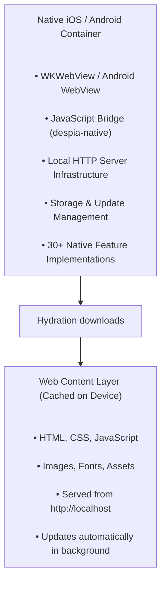

## What does it do?

By default, Despia runs your web app from any URL. The local server takes a different approach: it downloads your web build to the device and serves it from an on-device HTTP server at `http://localhost`.

**Why you'd want this:**

**Instant boot.** Zero network latency. Your app loads in milliseconds.

**Real offline.** Not "works offline sometimes" but actually works without any connectivity, forever.

**OTA updates.** Push changes live. No app store approval needed for web content updates.

**Your hosting.** Keep using Netlify, Vercel, AWS, whatever you already have. No migration, no lock-in.

**No MAU fees.** Most mobile update platforms charge per user. With this, you host your web app yourself and never pay per-user fees. Scale to 10 million users without your costs changing.

**No proprietary lock-in.** Your infrastructure, your database, your API. Despia doesn't insert itself between you and your stack.

**React Router just works.** BrowserRouter, Vue Router, any routing library that expects a real HTTP origin. No hash mode required (but still supported).

<Info>
  The local server is completely optional. Standard Despia runtime works great for most apps. Use this when you need guaranteed offline or that extra performance edge.
</Info>

---

## How it works

<Steps>
  <Step title="App store installation">
    When users install your app, they get a lightweight native container:

    **What's in the binary:**

    - Native iOS (Swift) or Android (Kotlin) code
    - WebView for rendering (WKWebView on iOS, WebView on Android)
    - JavaScript bridge exposing 30+ native features via `despia-native`
    - Local HTTP server infrastructure (runs on-device only)
    - Storage and update management
    - Zero web assets (no HTML, CSS, or JavaScript bundled)

    **Why this matters:**

    - Tiny install size
    - All native code fixed at submission
    - Store compliant (only web content downloads)
    - Iterate on UI without app store resubmission
  </Step>
  <Step title="First launch hydration">
    First time your user opens the app, Despia downloads your web build:

    1. Fetches your latest build (HTML, CSS, JS, images, fonts) from your hosting
    2. Caches everything locally
    3. Starts the HTTP server at `http://localhost`
    4. Loads your app from localhost

    **What gets downloaded:**

    - HTML, CSS, JavaScript
    - Images, fonts, assets
    - NOT native code (already in binary)
    - NOT executables (`.so`, `.dylib`, `.dex`)

    **After hydration:**

    - Instant boot (no network latency)
    - Full offline operation
    - 60fps hardware-accelerated rendering

    <Info>
      Hydration downloads web content only (HTML/CSS/JS), never native code. Same as how browsers cache pages.
    </Info>
  </Step>
  <Step title="Background updates">
    When connectivity is available, Despia checks for new builds and downloads them in the background:

    1. Checks for new build
    2. Downloads complete new version in background
    3. Stores it separately (doesn't affect running app)
    4. Applies on next launch

    **Why this works:**

    - Zero downtime (updates never interrupt users)
    - Atomic updates (no broken states)
    - Push fixes live in seconds
    - No app store review for web UI changes
    - App keeps working offline with last version if device never reconnects

    **What you can update:**

    - Web UI (HTML/CSS/JavaScript)
    - Images, fonts, assets
    - Business logic
    - How you use existing native APIs (e.g., add Face ID to new screen when Face ID already exists in binary)

    **What you cannot update:**

    - Native code
    - App permissions
    - Native API implementations

    **Store compliance note:** You can update how your web UI uses native APIs that already exist in the binary. Example: if Face ID is in the binary, you can update web UI to call it from new screens. That's compliant because the capability already exists.

    Apple's interpretation of "feature changes" (Guideline 3.3.2) is subjective. This approach follows established patterns like Expo, but be conservative with major behavior changes. Test thoroughly and consider normal app store review for big feature additions.
  </Step>
</Steps>

---

## Architecture overview

### Native container (submitted to stores)



<Note>
  **Key principle:** Native functionality is fixed at submission. Web content can use existing native APIs in new ways, but can't add new native capabilities.
</Note>

---

## Why localhost matters

Running from `http://localhost` instead of `file://` or custom schemes solves real problems:

### Real URL routing

Your app runs from `http://localhost`, not `file://`. This means:

**React Router just works.** Use BrowserRouter like on the web. No config, no hash mode needed (though it's still supported).

**Any routing library works.** Vue Router, Svelte routing, Next.js. If it expects a real HTTP origin, it works.

**No hacks.** Your routing code is identical between web and mobile.

### Full web API access

Real HTTP server means full web platform access:

**Service Workers work.** Advanced caching, background sync, push notifications via standard web APIs.

**No CORS issues.** Your app runs from `localhost`, calls to external APIs are straightforward. No cross-origin restrictions.

**Modern APIs work.** IndexedDB, Web Workers, Fetch, WebSockets. Everything works because you have a real origin.

**PWA features enabled.** localhost is a secure context, so PWA capabilities work seamlessly.

### The technical foundation

This was inspired by limitations in frameworks like Capacitor. Capacitor pioneered hybrid apps and is solid for many projects, but `file://` and `capacitor://` schemes have constraints:

**File protocol limits.** `file://` apps face restrictions on Service Workers, certain Web APIs, and modern JavaScript features. Workarounds exist but add complexity.

**Custom schemes and CORS.** `capacitor://` can trigger cross-origin issues when calling APIs or loading external resources, needing extra config and middleware.

**Routing complexity.** Browser routing often needs hash mode or special config, adding friction.

Despia's local server takes a different approach: real HTTP server running locally. Different trade-offs, chosen specifically to eliminate these issues and make web-to-mobile seamless.

### Your hosting, your rules

The real advantage: you keep control of your infrastructure.

**Use your existing hosting.** Netlify, Vercel, AWS S3, your own servers. Keep what you have. No migration, no lock-in.

**No MAU fees.** Most OTA services charge per Monthly Active User. With Despia, you host your web app and never pay per-user. Scale from 100 to 10 million users without mobile update costs changing.

**No proprietary databases.** Your data, your database. Your auth, your provider. Your API, your servers. Despia doesn't insert itself between you and your stack.

**Standard web deployment.** Build, deploy to your host, done. Same CI/CD pipeline for web and mobile. No special tools, no vendor workflows.

This matters long-term. Companies start with convenient platforms, then discover expensive per-user pricing as they scale. Despia avoids this entirely.

---

## Why HTTP on localhost is secure

Why HTTP instead of HTTPS? Because `localhost` has inherent security guarantees:

### Security guarantees

1. **Reserved hostname.** `localhost` maps to `127.0.0.1` (IPv4) or `::1` (IPv6) only. Can't be redirected or spoofed.
2. **Secure context.** Modern browsers treat `http://localhost` as secure, enabling all modern Web APIs (Service Workers, Web Crypto, Geolocation, MediaDevices, etc).
3. **No network exposure.** Traffic never leaves the device. All communication on-device only.
4. **Cannot be spoofed.** Hostname hardcoded to local machine. External attackers can't redirect it.
5. **On-device security.** Combined with WebView sandbox, same-origin policy, and CSP, `localhost` provides secure execution.

### Why HTTP is the right choice

**Protocol flexibility.** HTTP lets you load from both HTTPS (external APIs, CDNs) and HTTP (local) without mixed content warnings. Critical for hybrid apps:

- Load local assets from `http://localhost`
- Call APIs at `https://api.example.com`
- Embed external HTTPS resources
- Work across different network configs

**Simplified development.** No cert management. No SSL certs for localhost.

**Performance.** HTTP has lower overhead than HTTPS, good for local serving where encryption isn't needed since `localhost` is inherently secure.

<Note>
  Security comes from the reserved hostname and on-device execution, not encryption. For most hybrid apps, HTTP with localhost provides the right balance.
</Note>

---

## Store compliance: fully approved

Despia's local server is 100% compliant with both Apple App Store and Google Play Store guidelines.

### Why it's compliant

**Apple App Store (Guideline 3.3.2):**

- No native code execution. Only web content rendering.
- Fixed native functionality. All native capabilities determined at submission.
- Web content updates only. HTML/CSS/JS changes, never native code.
- On-device execution. Local HTTP server runs exclusively on-device.
- Established pattern. Same approach as Safari, Chrome, and Expo.

**Google Play Store (Malicious Behavior Policy):**

- No executable downloads. Never downloads `.dex`, `.jar`, `.so`, or native binaries.
- Sandboxed execution. JavaScript runs in WebView sandbox only.
- Fixed native binary. APK/AAB contains all native code at submission.
- Web content only. Downloads HTML/CSS/JS files, identical to browser caching.

### What cannot change (compliance guarantee)

These remain fixed from your App Store/Play Store submission:

- Native code implementations
- App permissions (Info.plist/AndroidManifest.xml)
- Native API capabilities
- System integration
- App signing and security model

### What can change (compliant updates)

Web UI can be updated to use existing native APIs:

- Add Face ID to new screens when Face ID exists in binary
- Request location in new features when location services are available
- Use camera from new UI when camera access is granted
- Any native capability that exists in the binary can be exposed to new web UI

**The Key Distinction:**

- **Compliant:** Updating web content to use existing native APIs
- **Not Compliant:** Downloading new native code or adding new native capabilities

This follows the same pattern as established frameworks like Expo, which has been widely accepted by app stores.

---

## Setup

Add the `@despia/local` plugin to your build:

### Installation

```shellscript
npm install --save-dev @despia/local
```

### Framework integration

**Vite (React, Vue, Svelte):**

```javascript
// vite.config.js
import { despiaLocalPlugin } from '@despia/local/vite';

export default defineConfig({
  plugins: [
    despiaLocalPlugin()
  ]
});
```

**Webpack (Create React App, Vue CLI):**

```javascript
// webpack.config.js
const DespiaLocalPlugin = require('@despia/local/webpack');

module.exports = {
  plugins: [
    new DespiaLocalPlugin()
  ]
};
```

**Universal (any build system):**

```json
{
  "scripts": {
    "build": "your-build-command",
    "postbuild": "despia-local"
  }
}
```

### What the plugin does

Generates a `despia/local.json` manifest:

```json
{
  "entry": "/index.html",
  "assets": [
    "/assets/app.abc123.css",
    "/assets/app.def456.js",
    "/assets/logo.xyz789.png"
  ]
}
```

This manifest enables Despia to:

- **Discover all assets**. Ensures complete caching
- **Determine changes**. Identifies what needs updating
- **Enable offline operation**. Guarantees all required assets are available
- **Perform atomic updates**. Ensures safe, complete updates

---

## Conditional UI rendering with version guards

For apps that need to maintain compatibility across different runtime versions, consider using `despia-version-guard`:

```tsx
import { VersionGuard } from 'despia-version-guard';

// Only show this feature if version is 21.0.3 or higher
<VersionGuard min_version="21.0.3">
  <NewFeatureComponent />
</VersionGuard>
```

**Why use version guards:**

- **Store compliance**. Version-gate major UI changes
- **Prevent broken UI**. Ensure features work with available runtime
- **Smooth rollouts**. Gradually introduce new capabilities
- **Enterprise reliability**. Maintain stability across deployments

---

## Real-world benefits

### For developers

**Rapid iteration:**

- Push bug fixes live in seconds
- No app store review wait times
- Test changes immediately with TestFlight/internal testing
- Update UI without recompiling native code

**Simplified workflow:**

- Build once, deploy everywhere
- Use your existing web hosting
- No native build complexity
- Standard web development tools

**Cost efficiency:**

- No proprietary mobile app hosting fees
- Scale with your existing infrastructure
- Pay only for standard web hosting
- No per-MAU charges

### For users

**Superior experience:**

- Instant app boot times (milliseconds)
- Full offline functionality
- Smooth 60fps animations
- Native performance and feel
- Automatic updates without interruption

**Reliability:**

- Works offline indefinitely
- No partial states or broken updates
- Consistent experience across devices
- Always uses latest version when online

### For enterprises

**Compliance and security:**

- Store-approved architecture
- Full IP ownership
- Complete source code access
- Transparent update mechanism

**Operational control:**

- Version-gate major changes
- Control rollout timing
- Maintain stability across deployments
- Support multiple runtime versions

---

## Frequently asked questions

<AccordionGroup>
  <Accordion title="Do I need to use Despia's local server?" defaultOpen icon="sparkles">
    No, it's completely optional. Despia can run your web app directly from any URL. Use the local server when you need that extra performance or guaranteed offline functionality.
  </Accordion>
  <Accordion title="Will Apple/Google approve my app?" defaultOpen icon="sparkles">
    Yes. Despia's local server is fully compliant with both stores. It downloads and caches web content (HTML/CSS/JS) for offline viewing, identical to how browsers work. No native code or executables are downloaded.
  </Accordion>
  <Accordion title="Can I update my app without app store review?" defaultOpen>
    Yes, for web UI changes. You can update HTML, CSS, JavaScript, images, and fonts instantly. However, be mindful that dramatic changes to app behavior may require review, especially on iOS. Use good judgment when deploying significant feature changes.
  </Accordion>
  <Accordion title="What happens if the user goes offline permanently?" defaultOpen>
    The app continues to work with the last hydrated version. If the device never regains connectivity, the app remains functional indefinitely with the cached content.
  </Accordion>
  <Accordion title="How do updates work for users?" defaultOpen>
    Updates download automatically in the background when connectivity is available. They're applied on the next app launch, ensuring zero downtime and no broken states.
  </Accordion>
  <Accordion title="Can I add new native features via updates?">
    You can update your web UI to use native APIs that already exist in the binary. For example, if Face ID is already implemented, you can add it to new screens via an update. You cannot add entirely new native capabilities that weren't in the original submission.
  </Accordion>
  <Accordion title="Is the JavaScript bridge secure?" defaultOpen>
    Yes. The JavaScript bridge exposes only the native APIs you included at submission time. All JavaScript executes within the WebView's security sandbox, and native code cannot be modified after submission.
  </Accordion>
</AccordionGroup>

---

## Get started

1. Install the plugin: `npm install --save-dev @despia/local`
2. Add to your build config (see Framework integration above)
3. Connect your app to Despia for compilation
4. Deploy to app stores

**Need help?**

Docs: https://www.npmjs.com/package/@despia/local

Support: [support@despia.com](mailto:support@despia.com)

Native SDK: https://www.npmjs.com/package/despia-native

---

_Despia's local server transforms your web app into a native mobile experience with instant boot times, complete offline functionality, and seamless updates. All while maintaining 100% store compliance._