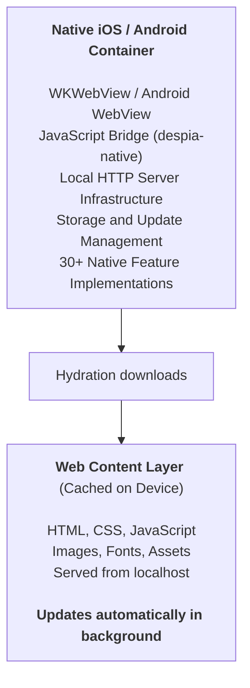

<Info>
  This feature is still in the final beta round. To request access as a beta tester, send an email to [offlinemode@despia.com](mailto:offlinemode@despia.com)
</Info>

Over a decade in the making, Despia is built on a runtime that originated in 2011 as Advanced WebView - a production-proven foundation used across more than 7,500 real-world apps. What exists today is not a new experiment but the evolution of a battle-tested system, refined through years of edge cases, performance challenges, and large-scale deployment, now reimagined as a modern capability-driven platform.

By default, Despia runs your web app from any URL. The local server takes a different approach: it downloads your web build to the device and serves it from an on-device HTTP server at `http://localhost`. This eliminates network latency on boot, enables full offline operation, and keeps your existing hosting infrastructure intact.

<CardGroup cols={2}>
  <Card title="Instant boot" icon="bolt">
    Zero network latency on launch. Your app loads in milliseconds because all assets are served from on-device storage.
  </Card>

  <Card title="Real offline support" icon="wifi-slash">
    Not "works offline sometimes" but actually works without any connectivity, indefinitely. The last cached version is always available.
  </Card>

  <Card title="Live OTA updates" icon="arrow-rotate-right">
    Push web UI changes instantly. No app store approval needed for HTML, CSS, JavaScript, image, or font updates.
  </Card>

  <Card title="No MAU fees or lock-in" icon="building-columns">
    Host your web app on Netlify, Vercel, AWS, or your own servers. Despia never inserts itself between you and your stack, and charges no per-user fees.
  </Card>
</CardGroup>

<Info>
  The local server is completely optional. Standard Despia runtime works well for most apps. Use this when you need guaranteed offline functionality or a performance edge on first load.
</Info>

---

## How it works

When users install your app, they receive a lightweight native container. The binary contains no web assets at submission time.

**What is in the binary:**

- Native iOS (Swift) or Android (Kotlin) code
- WebView for rendering (WKWebView on iOS, WebView on Android)
- JavaScript bridge exposing 30\+ native features via `despia-native`
- Local HTTP server infrastructure (runs on-device only)
- Storage and update management

**Why this matters:**

- Tiny install size
- All native code fixed at submission
- Store compliant - only web content downloads post-install
- Iterate on UI without app store resubmission

---

## First launch hydration

The first time a user opens the app, Despia downloads your web build:

1. Fetches your latest build (HTML, CSS, JS, images, fonts) from your hosting
2. Caches everything locally on the device
3. Starts the HTTP server at `http://localhost`
4. Loads your app from localhost

**What gets downloaded:**

- HTML, CSS, JavaScript
- Images, fonts, and other static assets
- Not native code (already in binary)
- Not executables (`.so`, `.dylib`, `.dex`)

**After hydration:**

- Instant boot on every subsequent launch
- Full offline operation
- 60fps hardware-accelerated rendering

<Info>
  Hydration downloads web content only (HTML, CSS, JS). This is identical to how browsers cache pages and is what enables store compliance.
</Info>

---

## Background updates

When connectivity is available, Despia checks for new builds and downloads them in the background:

1. Fetches `despia/local.json` and compares `deployed_at` with the cached value
2. If `deployed_at` has changed, downloads the complete new version in the background
3. Stores it separately without affecting the running app
4. Applies on next launch

**What you can update:**

- Web UI (HTML, CSS, JavaScript)
- Images, fonts, and other assets
- Business logic
- How your web UI uses existing native APIs (for example, adding Face ID to a new screen when Face ID already exists in the binary)

**What you cannot update:**

- Native code
- App permissions
- Native API implementations

<Warning>
  Apple's interpretation of "feature changes" (Guideline 3.3.2) is subjective. This approach follows patterns established by Expo, but be conservative with major behavior changes. Consider normal app store review for significant feature additions.
</Warning>

---

## Smart OTA cache system

The `deployed_at` field in `despia/local.json` powers efficient conditional update logic. On startup, the client fetches the manifest and compares `deployed_at` with its cached value to determine whether a full asset download is required.

| Scenario | Behavior |
| --- | --- |
| Good connection | Fetch manifest and compare `deployed_at` to cached value |
| `deployed_at` changed | New deployment detected, download all assets, set as active app source |
| `deployed_at` unchanged | Serve from existing local cache with no download |
| Poor or no connection | Serve from offline cache, defer manifest check until connectivity improves |

A complete asset download only happens when `deployed_at` has actually changed, minimising network usage while preserving full OTA update capability.

---

## Architecture overview

<Note>
  Native functionality is fixed at submission. Web content can use existing native APIs in new ways, but cannot add new native capabilities.
</Note>

---

## Why localhost matters

Running from `http://localhost` instead of `file://` or custom schemes solves real problems.

### Real URL routing

Your app runs from a real HTTP origin, which means:

- **React Router just works.** Use BrowserRouter like on the web with no config and no hash mode required.
- **Any routing library works.** Vue Router, Svelte routing, Next.js. If it expects a real HTTP origin, it works.
- **No hacks.** Your routing code is identical between web and mobile.

### Full web API access

- **Service Workers work.** Advanced caching, background sync, and push notifications via standard web APIs.
- **No CORS issues.** Your app runs from `localhost`, so calls to external APIs are straightforward.
- **Modern APIs work.** IndexedDB, Web Workers, Fetch, WebSockets. Everything works because you have a real origin.
- **PWA features enabled.** `localhost` is a secure context, so PWA capabilities work seamlessly.

### Why HTTP and not HTTPS

`localhost` has inherent security guarantees that make HTTPS unnecessary for local serving:

1. **Reserved hostname.** `localhost` maps to `127.0.0.1` or `::1` only. It cannot be redirected or spoofed.
2. **Secure context.** Modern browsers treat `http://localhost` as secure, enabling all modern Web APIs.
3. **No network exposure.** Traffic never leaves the device.
4. **Protocol flexibility.** HTTP lets you load from both `https://` (external APIs, CDNs) and local assets without mixed content warnings.

<Note>
  Security comes from the reserved hostname and on-device execution, not encryption. HTTP with localhost provides the right balance for hybrid apps.
</Note>

---

## Store compliance

Despia's local server is fully compliant with both Apple App Store and Google Play Store guidelines.

**Apple App Store (Guideline 3.3.2):**

- No native code execution - only web content rendering
- Fixed native functionality - all native capabilities determined at submission
- Web content updates only - HTML, CSS, JS changes, never native code
- On-device execution - local HTTP server runs exclusively on-device
- Established pattern - same approach as Safari, Chrome, and Expo

**Google Play Store (Malicious Behavior Policy):**

- No executable downloads - never downloads `.dex`, `.jar`, `.so`, or native binaries
- Sandboxed execution - JavaScript runs in WebView sandbox only
- Fixed native binary - APK/AAB contains all native code at submission
- Web content only - downloads HTML, CSS, and JS files, identical to browser caching

**The key distinction:**

- Compliant: updating web content to use existing native APIs
- Not compliant: downloading new native code or adding new native capabilities

---

## Frequently asked questions

<AccordionGroup>
  <Accordion title="Do I need to use the local server?">
    No, it is completely optional. Despia can run your web app directly from any URL. Use the local server when you need guaranteed offline functionality or maximum first-load performance.
  </Accordion>

  <Accordion title="Will Apple and Google approve my app?">
    Yes. The local server downloads and caches web content (HTML, CSS, JS) for offline use, identical to how browsers work. No native code or executables are downloaded.
  </Accordion>

  <Accordion title="Can I update my app without app store review?">
    Yes, for web UI changes. You can update HTML, CSS, JavaScript, images, and fonts instantly. Be mindful that dramatic changes to app behavior may require review, especially on iOS.
  </Accordion>

  <Accordion title="What happens if a user goes permanently offline?">
    The app continues to work with the last hydrated version indefinitely. If the device never regains connectivity, the cached content remains fully functional.
  </Accordion>

  <Accordion title="How do updates reach users?">
    On startup, Despia fetches your `despia/local.json` manifest and compares the `deployed_at` timestamp with the cached value. If it has changed, the new build downloads in the background and applies on the next launch - zero downtime, no broken states.
  </Accordion>

  <Accordion title="Can I add new native features via OTA updates?">
    You can update your web UI to use native APIs that already exist in the binary. For example, if Face ID is already implemented, you can add it to new screens via an update. You cannot add entirely new native capabilities that were not in the original submission.
  </Accordion>

  <Accordion title="Is the JavaScript bridge secure?">
    Yes. The bridge exposes only the native APIs included at submission time. All JavaScript executes within the WebView's security sandbox, and native code cannot be modified after submission.
  </Accordion>
</AccordionGroup>

---

## Resources

<CardGroup cols={2}>
  <Card title="Plugin on npm" icon="npm" href="https://www.npmjs.com/package/@despia/local">
    Full package documentation and changelog for `@despia/local`.
  </Card>

  <Card title="Native SDK" icon="mobile" href="https://www.npmjs.com/package/despia-native">
    Reference for the `despia-native` JavaScript bridge and its 50\+ native APIs.
  </Card>
</CardGroup>