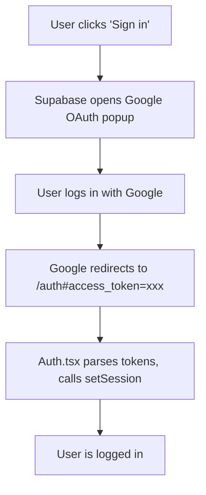
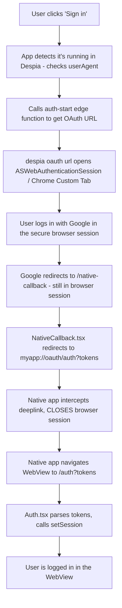

<iframe src="https://www.youtube.com/embed/cudaN9vNF_E" title="YouTube video player" frameborder="0" className="w-full aspect-video rounded-xl" allow="accelerometer; autoplay; clipboard-write; encrypted-media; gyroscope; picture-in-picture; web-share" allowfullscreen />

<Card title="Lovable Prompt" icon="sparkles">
  This setup is more technical and you'll need to paste the following prompt, which includes full scaffolding, into Lovable to get good results:

  ```` expandable
  # Despia Native SDK - OAuth Integration Guide
  
  Production ready implementation for Lovable + Supabase
  
  ---
  
  ## What This Does
  
  This implements Google OAuth login that works in:
  1. Web browsers - Standard OAuth flow
  2. Native mobile apps - When your Lovable web app is wrapped with Despia SDK
  
  ### The Problem
  
  When you wrap a Lovable web app as a native iOS/Android app using Despia:
  - The app runs in a WebView (embedded browser)
  - WebViews cannot handle OAuth redirects properly
  - Google OAuth redirects back to a URL, but the WebView doesn't know what to do
  
  ### The Solution
  
  For native apps, we:
  1. Open OAuth in ASWebAuthenticationSession (iOS) or Chrome Custom Tabs (Android)
  2. After login, redirect to a deeplink to close the session and return to app
  3. The native app intercepts this deeplink, navigates to the correct page, and sets the session
  
  ### How Native OAuth Works
  
  Step 1: Open OAuth in secure browser session
  ```typescript
  despia(`oauth://?url=${encodeURIComponent(oauthUrl)}`);
  ```
  This opens the URL in:
  - iOS: ASWebAuthenticationSession (secure Safari sheet)
  - Android: Chrome Custom Tabs (secure Chrome overlay)
  
  Step 2: User completes OAuth in the browser session
  - User sees Google login inside ASWebAuthenticationSession / Chrome Custom Tab
  - After login, Google redirects to your /native-callback page
  - This page is still inside the ASWebAuthenticationSession / Chrome Custom Tab
  
  Step 3: Close browser session and return to app via deeplink
  ```typescript
  // From NativeCallback.tsx (still in ASWebAuthenticationSession/Chrome Tab)
  window.location.href = `myapp://oauth/auth?access_token=xxx&refresh_token=yyy`;
  ```
  
  Deeplink format: `{scheme}://oauth/{path}?params`
  - `myapp://` - Your app's deeplink scheme
  - `oauth/` - Required prefix - tells native code to close the browser session
  - `{path}` - Where to navigate in your app (e.g., auth, home, profile)
  - `?params` - Query params passed to that page
  
  Examples:
  - `myapp://oauth/auth?access_token=xxx` - Closes browser, opens /auth?access_token=xxx
  - `myapp://oauth/home` - Closes browser, opens /home
  - `myapp://oauth/profile?tab=settings` - Closes browser, opens /profile?tab=settings
  
  Step 4: App receives deeplink, navigates, sets session
  - Native app intercepts myapp://oauth/... deeplink
  - Closes ASWebAuthenticationSession / Chrome Custom Tab
  - Navigates WebView to /{path}?params (e.g., /auth?access_token=xxx)
  - Your Auth.tsx runs, calls setSession(), user is logged in
  
  ---
  
  ## How The Two Flows Work
  
  ### Web Browser Flow
  
  ```
  User clicks "Sign in" 
      -> Supabase opens Google OAuth popup
      -> User logs in with Google
      -> Google redirects to /auth#access_token=xxx
      -> Auth.tsx parses tokens, calls setSession()
      -> User is logged in
  ```
  
  ### Native App Flow (Despia WebView)
  
  ```
  User clicks "Sign in"
      -> App detects it's running in Despia (checks userAgent)
      -> Calls auth-start edge function to get OAuth URL
      -> despia('oauth://?url=...') opens ASWebAuthenticationSession / Chrome Custom Tab
      -> User logs in with Google in the secure browser session
      -> Google redirects to /native-callback (still in browser session)
      -> NativeCallback.tsx redirects to myapp://oauth/auth?tokens
      -> Native app intercepts deeplink, CLOSES browser session
      -> Native app navigates WebView to /auth?tokens
      -> Auth.tsx parses tokens, calls setSession()
      -> User is logged in in the WebView
  ```
  
  Key points:
  - oauth:// prefix in despia() call opens ASWebAuthenticationSession / Chrome Custom Tab
  - myapp://oauth/ prefix in deeplink closes the browser session
  - The path after oauth/ (e.g., /auth) is where the WebView navigates
  - Session is set in the WebView (not the browser session) so cookies persist
  
  ---
  
  ## CRITICAL: You Must Implement These Components
  
  | File | What It Does | Without It |
  |------|--------------|------------|
  | LoginButton.tsx | Detects native vs web, starts OAuth | Nothing happens on click |
  | Auth.tsx | Handles web OAuth callback, sets session | Web login fails |
  | NativeCallback.tsx | Handles native OAuth, closes browser session via deeplink | Native stuck in browser |
  | auth-start/index.ts | Edge function for native OAuth URL | Native flow broken |
  
  Common AI Mistake: Only implementing Auth.tsx. Native flow needs NativeCallback.tsx to close the ASWebAuthenticationSession / Chrome Custom Tab!
  
  ---
  
  ## Complete File List
  
  | # | File Path | Purpose |
  |---|-----------|---------|
  | 1 | src/components/LoginButton.tsx | Login button - handles both flows |
  | 2 | src/pages/Auth.tsx | OAuth callback (web) + login page |
  | 3 | src/pages/NativeCallback.tsx | OAuth callback (native) - closes browser session |
  | 4 | supabase/functions/auth-start/index.ts | Edge function for native OAuth |
  | 5 | src/App.tsx | Add /auth and /native-callback routes |
  | 6 | supabase/config.toml | Edge function config |
  | 7 | public/404.html | SPA fallback (preserves tokens) |
  | 8 | src/components/SpaRedirector.tsx | Handles 404 redirect |
  | 9 | public/_redirects | Netlify/Lovable routing |
  
  ---
  
  ## Step 1: Install Dependencies
  
  ```bash
  npm install despia-native
  ```
  
  Note: @supabase/supabase-js and react-router-dom come with Lovable by default.
  
  ---
  
  ## Step 2: Create Edge Function
  
  File: supabase/functions/auth-start/index.ts
  
  This edge function generates the OAuth URL for native apps. It redirects to /native-callback (not /auth) so the NativeCallback page can close the browser session.
  
  ```typescript
  import { serve } from "https://deno.land/std@0.168.0/http/server.ts";
  
  const corsHeaders = {
    'Access-Control-Allow-Origin': '*',
    'Access-Control-Allow-Headers': 'authorization, x-client-info, apikey, content-type',
  };
  
  serve(async (req) => {
    if (req.method === 'OPTIONS') {
      return new Response(null, { headers: corsHeaders });
    }
  
    try {
      const { provider, deeplink_scheme } = await req.json();
  
      if (!provider || !deeplink_scheme) {
        return new Response(
          JSON.stringify({ error: 'provider and deeplink_scheme required' }),
          { status: 400, headers: { ...corsHeaders, 'Content-Type': 'application/json' } }
        );
      }
  
      const supabaseUrl = Deno.env.get('SUPABASE_URL')!;
      
      // CHANGE THIS to your Lovable app URL
      // Redirects to /native-callback (NOT /auth) so we can close the browser session
      const redirectUrl = `https://YOUR-APP.lovable.app/native-callback?deeplink_scheme=${encodeURIComponent(deeplink_scheme)}`;
      
      const params = new URLSearchParams({
        provider,
        redirect_to: redirectUrl,
        scopes: 'openid email profile',
        flow_type: 'implicit',
      });
  
      const oauthUrl = `${supabaseUrl}/auth/v1/authorize?${params}`;
  
      return new Response(
        JSON.stringify({ url: oauthUrl }),
        { headers: { ...corsHeaders, 'Content-Type': 'application/json' } }
      );
    } catch (error) {
      const message = error instanceof Error ? error.message : 'Unknown error';
      return new Response(
        JSON.stringify({ error: message }),
        { status: 500, headers: { ...corsHeaders, 'Content-Type': 'application/json' } }
      );
    }
  });
  ```
  
  ---
  
  ## Step 3: Configure Edge Function
  
  File: supabase/config.toml
  
  Add this to allow unauthenticated calls (user isn't logged in yet when starting OAuth):
  
  ```toml
  [functions.auth-start]
  verify_jwt = false
  ```
  
  ---
  
  ## Step 4: Create Login Button
  
  File: src/components/LoginButton.tsx
  
  This component detects if running in native app (Despia) or web browser, and uses the appropriate OAuth flow.
  
  ```typescript
  import { useState } from 'react';
  import { supabase } from '@/integrations/supabase/client';
  import despia from 'despia-native';
  import { Button } from '@/components/ui/button';
  
  const LoginButton = () => {
    const [isLoading, setIsLoading] = useState(false);
  
    const handleGoogleLogin = async () => {
      // Despia adds 'despia' to userAgent when running in native app
      const isNative = navigator.userAgent.toLowerCase().includes('despia');
      
      if (isNative) {
        // NATIVE FLOW
        // 1. Get OAuth URL from edge function (includes deeplink_scheme)
        // 2. Open in ASWebAuthenticationSession/Chrome Custom Tab via despia()
        // 3. After OAuth, NativeCallback.tsx redirects to deeplink
        setIsLoading(true);
        
        try {
          const { data, error } = await supabase.functions.invoke('auth-start', {
            body: { 
              provider: 'google',
              deeplink_scheme: 'myapp', // CHANGE to your Despia app scheme
            },
          });
  
          if (error || !data?.url) {
            console.error('Failed to get OAuth URL:', error);
            setIsLoading(false);
            return;
          }
  
          // Opens URL in ASWebAuthenticationSession (iOS) or Chrome Custom Tab (Android)
          despia(`oauth://?url=${encodeURIComponent(data.url)}`);
        } catch (err) {
          console.error('Error starting native auth:', err);
          setIsLoading(false);
        }
      } else {
        // WEB FLOW
        // Standard Supabase OAuth - no edge function needed
        await supabase.auth.signInWithOAuth({
          provider: 'google',
          options: {
            redirectTo: `${window.location.origin}/auth`,
            scopes: 'openid email profile',
          },
        });
      }
    };
  
    return (
      <Button onClick={handleGoogleLogin} variant="default" disabled={isLoading}>
        {isLoading ? 'Opening...' : 'Sign in with Google'}
      </Button>
    );
  };
  
  export default LoginButton;
  ```
  
  ---
  
  ## Step 5: Create Auth Page (Web OAuth Callback)
  
  File: src/pages/Auth.tsx
  
  This page handles WEB OAuth only:
  1. Shows login UI when user visits /auth directly
  2. Handles web OAuth callback - parses tokens and sets session
  
  ```typescript
  import { useEffect, useState, useRef } from 'react';
  import { useNavigate, useSearchParams } from 'react-router-dom';
  import { supabase } from '@/integrations/supabase/client';
  import { Button } from '@/components/ui/button';
  import LoginButton from '@/components/LoginButton';
  
  const Auth = () => {
    const [searchParams] = useSearchParams();
    const navigate = useNavigate();
    const [error, setError] = useState<string | null>(null);
    const [showLogin, setShowLogin] = useState(false);
    const hasRun = useRef(false);
  
    useEffect(() => {
      if (hasRun.current) return;
      hasRun.current = true;
  
      const handleAuth = async () => {
        // Already logged in? Go home
        const { data: { session: existingSession } } = await supabase.auth.getSession();
        if (existingSession) {
          navigate('/', { replace: true });
          return;
        }
  
        // Parse tokens from URL hash (Supabase puts tokens here: /auth#access_token=xxx)
        const hash = window.location.hash.substring(1);
        const hashParams = new URLSearchParams(hash);
        const windowParams = new URLSearchParams(window.location.search);
  
        // Check for OAuth errors
        const errorParam = searchParams.get('error') || hashParams.get('error') || windowParams.get('error');
        const errorDescription = searchParams.get('error_description') || hashParams.get('error_description');
        if (errorParam) {
          setError(errorDescription || errorParam);
          return;
        }
  
        // Get tokens (try all sources)
        const accessToken = hashParams.get('access_token') || searchParams.get('access_token') || windowParams.get('access_token');
        const refreshToken = hashParams.get('refresh_token') || searchParams.get('refresh_token') || windowParams.get('refresh_token');
  
        if (accessToken) {
          // Set session directly (this is web flow or native after deeplink)
          try {
            const { error: sessionError } = await supabase.auth.setSession({
              access_token: accessToken,
              refresh_token: refreshToken || '',
            });
            if (sessionError) {
              setError(sessionError.message);
              return;
            }
            navigate('/', { replace: true });
          } catch (err) {
            setError(err instanceof Error ? err.message : 'Failed to set session');
          }
          return;
        }
  
        // No tokens = user visited /auth directly, show login button
        setShowLogin(true);
      };
  
      handleAuth();
    }, [searchParams, navigate]);
  
    if (error) {
      return (
        <div className="flex min-h-screen items-center justify-center bg-background p-4">
          <div className="w-full max-w-sm space-y-4">
            <div className="rounded-lg border border-destructive/50 bg-destructive/10 p-4 text-center">
              <h2 className="text-lg font-semibold text-destructive">Sign in failed</h2>
              <p className="mt-2 text-sm text-muted-foreground">{error}</p>
            </div>
            <Button onClick={() => navigate('/', { replace: true })} className="w-full">
              Go to home
            </Button>
          </div>
        </div>
      );
    }
  
    if (showLogin) {
      return (
        <div className="flex min-h-screen items-center justify-center bg-background p-4">
          <div className="w-full max-w-sm space-y-6 text-center">
            <div>
              <h1 className="text-2xl font-bold">Welcome</h1>
              <p className="mt-2 text-muted-foreground">Sign in to continue</p>
            </div>
            <LoginButton />
          </div>
        </div>
      );
    }
  
    return (
      <div className="flex min-h-screen items-center justify-center bg-background p-4">
        <div className="text-center">
          <div className="mx-auto h-8 w-8 animate-spin rounded-full border-4 border-primary border-t-transparent" />
          <p className="mt-4 text-sm text-muted-foreground">Signing you in...</p>
        </div>
      </div>
    );
  };
  
  export default Auth;
  ```
  
  ---
  
  ## Step 6: Create Native Callback Page
  
  File: src/pages/NativeCallback.tsx
  
  This page handles NATIVE OAuth callback. It runs inside the ASWebAuthenticationSession / Chrome Custom Tab and:
  1. Parses tokens from URL
  2. Redirects to deeplink to close the browser session and pass tokens to the app
  
  ```typescript
  import { useEffect, useRef } from 'react';
  import { useSearchParams } from 'react-router-dom';
  
  const NativeCallback = () => {
    const [searchParams] = useSearchParams();
    const hasRun = useRef(false);
  
    useEffect(() => {
      if (hasRun.current) return;
      hasRun.current = true;
  
      // Get deeplink scheme from query params (set by edge function)
      const deeplinkScheme = searchParams.get('deeplink_scheme') || 
                             new URLSearchParams(window.location.search).get('deeplink_scheme');
      
      if (!deeplinkScheme) {
        console.error('No deeplink_scheme provided');
        return;
      }
  
      // Parse tokens from URL hash (Supabase implicit flow puts them here)
      const hash = window.location.hash.substring(1);
      const hashParams = new URLSearchParams(hash);
      
      const accessToken = hashParams.get('access_token');
      const refreshToken = hashParams.get('refresh_token');
  
      if (!accessToken) {
        // Check for errors
        const error = hashParams.get('error') || searchParams.get('error');
        const errorDesc = hashParams.get('error_description') || searchParams.get('error_description');
        
        // Redirect to app with error
        const errorUrl = `${deeplinkScheme}://oauth/auth?error=${encodeURIComponent(error || 'unknown')}&error_description=${encodeURIComponent(errorDesc || '')}`;
        window.location.href = errorUrl;
        return;
      }
  
      // Build deeplink URL
      // Format: myapp://oauth/auth?access_token=xxx&refresh_token=yyy
      // - myapp:// = your app's scheme
      // - oauth/ = tells native code to close ASWebAuthenticationSession/Chrome Custom Tab
      // - auth = the path to navigate to in the WebView
      // - ?params = passed to that page
      const params = new URLSearchParams();
      params.set('access_token', accessToken);
      if (refreshToken) {
        params.set('refresh_token', refreshToken);
      }
  
      const deeplinkUrl = `${deeplinkScheme}://oauth/auth?${params.toString()}`;
      
      console.log('Redirecting to deeplink:', deeplinkUrl);
      
      // This closes the ASWebAuthenticationSession / Chrome Custom Tab
      // and opens /auth?access_token=xxx in the WebView
      window.location.href = deeplinkUrl;
    }, [searchParams]);
  
    return (
      <div className="flex min-h-screen items-center justify-center bg-background p-4">
        <div className="text-center">
          <div className="mx-auto h-8 w-8 animate-spin rounded-full border-4 border-primary border-t-transparent" />
          <p className="mt-4 text-sm text-muted-foreground">Completing sign in...</p>
        </div>
      </div>
    );
  };
  
  export default NativeCallback;
  ```
  
  ---
  
  ## Step 7: Add Routes to App.tsx
  
  File: src/App.tsx
  
  Add both /auth and /native-callback routes:
  
  ```typescript
  import { BrowserRouter, Routes, Route } from 'react-router-dom';
  import Index from './pages/Index';
  import Auth from './pages/Auth';
  import NativeCallback from './pages/NativeCallback';
  import NotFound from './pages/NotFound';
  import SpaRedirector from './components/SpaRedirector';
  
  function App() {
    return (
      <BrowserRouter>
        <SpaRedirector />
        <Routes>
          <Route path="/" element={<Index />} />
          <Route path="/auth" element={<Auth />} />
          <Route path="/native-callback" element={<NativeCallback />} />
          <Route path="*" element={<NotFound />} />
        </Routes>
      </BrowserRouter>
    );
  }
  
  export default App;
  ```
  
  ---
  
  ## Step 8: Create SPA Fallback Files
  
  Static hosts (Lovable, Netlify) return 404 for routes like /auth because no file exists. These files preserve the OAuth tokens during the 404 redirect.
  
  File: src/components/SpaRedirector.tsx
  
  ```typescript
  import { useEffect } from "react";
  import { useLocation, useNavigate } from "react-router-dom";
  
  export default function SpaRedirector() {
    const location = useLocation();
    const navigate = useNavigate();
  
    useEffect(() => {
      const params = new URLSearchParams(location.search);
      const redirect = params.get("redirect");
      
      if (!redirect) return;
  
      try {
        const decoded = decodeURIComponent(redirect);
        navigate(`${decoded}${location.hash ?? ""}`, { replace: true });
      } catch {
        console.error('Failed to decode redirect path');
      }
    }, [location.search, location.hash, navigate]);
  
    return null;
  }
  ```
  
  File: public/404.html
  
  ```html
  <!doctype html>
  <html lang="en">
    <head>
      <meta charset="UTF-8" />
      <meta name="viewport" content="width=device-width, initial-scale=1.0" />
      <title>Redirecting</title>
    </head>
    <body>
      <script>
        (function () {
          var redirect = window.location.pathname + window.location.search;
          var target = "/?redirect=" + encodeURIComponent(redirect) + window.location.hash;
          window.location.replace(target);
        })();
      </script>
    </body>
  </html>
  ```
  
  File: public/_redirects
  
  ```
  /* /index.html 200
  ```
  
  ---
  
  ## Step 9: Configure Google OAuth
  
  ### In Lovable Cloud
  
  1. Open your project, click Cloud, then Users, then Auth Settings
  2. Enable Google provider
  3. Add your Client ID and Client Secret from Google Cloud Console
  
  ### In Google Cloud Console
  
  1. Go to https://console.cloud.google.com/
  2. Create OAuth Client ID, select Web application
  3. Authorized JavaScript origins: https://your-app.lovable.app
  4. Authorized redirect URIs: https://YOUR-SUPABASE-ID.supabase.co/auth/v1/callback
  
  ### In Despia Dashboard (for native apps)
  
  1. Set your Deeplink Scheme (e.g., myapp)
  2. This must match the value in LoginButton.tsx
  
  ---
  
  ## Step 10: Update Hardcoded URLs
  
  Change these values to match your app:
  
  | File | Find | Replace With |
  |------|------|--------------|
  | auth-start/index.ts | YOUR-APP.lovable.app | Your Lovable URL |
  | LoginButton.tsx | deeplink_scheme: 'myapp' | Your Despia scheme |
  
  ---
  
  ## Using Login State in Your App
  
  File: src/pages/Index.tsx (example)
  
  ```typescript
  import { useEffect, useState } from 'react';
  import { supabase } from '@/integrations/supabase/client';
  import { User } from '@supabase/supabase-js';
  import LoginButton from '@/components/LoginButton';
  
  const Index = () => {
    const [user, setUser] = useState<User | null>(null);
    const [loading, setLoading] = useState(true);
  
    useEffect(() => {
      supabase.auth.getSession().then(({ data: { session } }) => {
        setUser(session?.user ?? null);
        setLoading(false);
      });
  
      const { data: { subscription } } = supabase.auth.onAuthStateChange(
        (event, session) => setUser(session?.user ?? null)
      );
  
      return () => subscription.unsubscribe();
    }, []);
  
    if (loading) return <p>Loading...</p>;
  
    return user ? (
      <div>
        <p>Welcome, {user.email}!</p>
        <button onClick={() => supabase.auth.signOut()}>Sign Out</button>
      </div>
    ) : (
      <LoginButton />
    );
  };
  
  export default Index;
  ```
  
  ---
  
  ## Verification Checklist
  
  After implementation, verify:
  
  - LoginButton.tsx has despia('oauth://?url=...') for native
  - LoginButton.tsx uses signInWithOAuth() for web (no edge function)
  - Auth.tsx shows LoginButton when no tokens (not an error)
  - Auth.tsx handles web OAuth and native after deeplink redirect
  - NativeCallback.tsx redirects to myapp://oauth/auth?tokens
  - auth-start edge function redirects to /native-callback
  - config.toml has verify_jwt = false
  - /auth AND /native-callback routes exist in App.tsx
  - SpaRedirector is inside BrowserRouter
  
  ---
  
  ## Common Mistakes
  
  | Mistake | Correct Approach |
  |---------|------------------|
  | Only implementing Auth.tsx | Must also implement NativeCallback.tsx for native flow |
  | Using edge function for web flow | Web uses signInWithOAuth() directly |
  | Showing error when no tokens in Auth.tsx | Show LoginButton - user visited /auth directly |
  | Using myapp://auth instead of myapp://oauth/auth | The oauth/ prefix is required to close the browser session |
  | Redirecting native OAuth to /auth | Native OAuth must redirect to /native-callback |
  | Forgetting verify_jwt = false | Edge function needs unauthenticated access |
  
  ---
  
  ## Troubleshooting
  
  | Problem | Solution |
  |---------|----------|
  | Nothing happens on login click | Check LoginButton.tsx has despia() call for native |
  | Browser session doesn't close | Use myapp://oauth/path format (oauth/ prefix required) |
  | Tokens not found | Check 404.html preserves hash fragment |
  | Invalid redirect from Google | Add redirect URL to Google Cloud Console |
  | Edge function 401 error | Add verify_jwt = false to config.toml |
  | Session not persisting | Verify Auth.tsx calls setSession() |
  | Native stuck on loading | Check NativeCallback.tsx redirects to deeplink |
  
  ---
  
  ## How It All Connects
  
  ```
  WEB FLOW:
  LoginButton.tsx -> signInWithOAuth() -> Google -> /auth#tokens
  -> Auth.tsx calls setSession() -> User logged in
  
  NATIVE FLOW:
  
  LoginButton.tsx
    - Detects native: navigator.userAgent.includes('despia')
    - Calls auth-start edge function
    - despia('oauth://?url=...') opens ASWebAuthenticationSession
  
  (In ASWebAuthenticationSession / Chrome Custom Tab)
  
  Google OAuth -> /native-callback?deeplink_scheme=myapp#tokens
  
  NativeCallback.tsx (still in browser session)
    - Parses tokens from URL hash
    - Redirects to: myapp://oauth/auth?access_token=xxx
                    |      |     |
                    scheme |     path to navigate (becomes /auth)
                           closes browser session
  
  (Browser session closes, back in WebView)
  
  WebView navigates to /auth?access_token=xxx
  Auth.tsx calls setSession() -> User logged in
  ```
  
  ---
  
  ## Files Summary
  
  | File | Purpose |
  |------|---------|
  | supabase/functions/auth-start/index.ts | Generate OAuth URL for native |
  | supabase/config.toml | Allow unauthenticated edge function |
  | src/components/LoginButton.tsx | Unified login button |
  | src/pages/Auth.tsx | Web OAuth callback + login page |
  | src/pages/NativeCallback.tsx | Native OAuth - closes browser, deeplinks |
  | src/App.tsx | Route configuration |
  | src/components/SpaRedirector.tsx | Handle 404 fallback |
  | public/404.html | Preserve tokens on 404 |
  | public/_redirects | SPA routing |
  ````
</Card>

## **Setup Requirements**

1. Create a Google OAuth application in Google Cloud Console
2. Configure your Supabase project with Google OAuth credentials
3. Set up your Despia project with a deeplink scheme
4. Important: This works with Lovable + Supabase projects out of the box

## **Understanding the Complete OAuth Flow**

### **The Problem**

When you wrap a Lovable web app as a native iOS/Android app using Despia:

- The app runs in a WebView (embedded browser)
- WebViews cannot handle OAuth redirects properly
- Google OAuth redirects back to a URL, but the WebView doesn't know what to do

### **The Solution**

For native apps, we:

1. Open OAuth in ASWebAuthenticationSession (iOS) or Chrome Custom Tabs (Android)
2. After login, redirect to a deeplink to close the session and return to app
3. The native app intercepts this deeplink, navigates to the correct page, and sets the session

### **How Native OAuth Works**

**Step 1: Detect if running in native app**

When the user clicks "Sign in", your app first checks if it's running inside a Despia native app. Despia automatically adds `despia` to the userAgent string:

```javascript
const isNative = navigator.userAgent.toLowerCase().includes('despia');
```

**Step 2: Get OAuth URL from edge function**

For native apps, you need an edge function to generate the OAuth URL. This is necessary because we need to set a special redirect URL that points to `/native-callback` instead of `/auth`:

```javascript
// supabase/functions/auth-start/index.ts
const { provider, deeplink_scheme } = await req.json();

const supabaseUrl = Deno.env.get('SUPABASE_URL')!;

// Redirects to /native-callback (NOT /auth) so we can close the browser session
const redirectUrl = `https://your-app.lovable.app/native-callback?deeplink_scheme=${encodeURIComponent(deeplink_scheme)}`;

const params = new URLSearchParams({
  provider,
  redirect_to: redirectUrl,
  scopes: 'openid email profile',
  flow_type: 'implicit',
});

const oauthUrl = `${supabaseUrl}/auth/v1/authorize?${params}`;
```

**Step 3: Open OAuth in secure browser session**

Once you have the URL from the edge function, open it using `despia('oauth://?url=...')`. The `oauth://` prefix tells Despia to open the URL in a secure native browser session:

```javascript
despia(`oauth://?url=${encodeURIComponent(oauthUrl)}`);
```

This opens the URL in:

- iOS: ASWebAuthenticationSession (secure Safari sheet)
- Android: Chrome Custom Tabs (secure Chrome overlay)

**Step 4: User completes OAuth in the browser session**

- User sees Google login inside ASWebAuthenticationSession / Chrome Custom Tab
- After login, Google redirects to your /native-callback page
- This page is still inside the ASWebAuthenticationSession / Chrome Custom Tab

**Step 5: Parse tokens from URL**

Supabase uses the implicit OAuth flow, which returns tokens in the URL hash (the part after `#`). The URL looks like `/native-callback?deeplink_scheme=myapp#access_token=xxx&refresh_token=yyy`. Your callback page parses the tokens:

```javascript
// Get the hash fragment (everything after #)
const hash = window.location.hash.substring(1);

// Parse it as URL parameters
const hashParams = new URLSearchParams(hash);

// Extract the tokens
const accessToken = hashParams.get('access_token');
const refreshToken = hashParams.get('refresh_token');
```

**Step 6: Close browser session and return to app via deeplink**

This is the crucial step. You're still inside the ASWebAuthenticationSession or Chrome Custom Tab and need to close it. Despia listens for deeplinks that contain the `oauth/` prefix:

```javascript
// From NativeCallback.tsx (still in ASWebAuthenticationSession/Chrome Tab)
window.location.href = `myapp://oauth/auth?access_token=xxx&refresh_token=yyy`;
```

Deeplink format: `{scheme}://oauth/{path}?params`

- `myapp://` - Your app's deeplink scheme
- `oauth/` - Required prefix - tells native code to close the browser session
- `{path}` - Where to navigate in your app (e.g., auth, home, profile)
- `?params` - Query params passed to that page

Examples:

- `myapp://oauth/auth?access_token=xxx` - Closes browser, opens /auth?access_token=xxx
- `myapp://oauth/home` - Closes browser, opens /home
- `myapp://oauth/profile?tab=settings` - Closes browser, opens /profile?tab=settings

**Step 7: App receives deeplink, navigates, sets session**

- Native app intercepts myapp://oauth/... deeplink
- Closes ASWebAuthenticationSession / Chrome Custom Tab
- Navigates WebView to /path?params (e.g., /auth?access_token=xxx)
- Your Auth.tsx parses tokens and sets the session:

```javascript
const accessToken = searchParams.get('access_token');
const refreshToken = searchParams.get('refresh_token');

await supabase.auth.setSession({
  access_token: accessToken,
  refresh_token: refreshToken || '',
});

// User is now logged in!
navigate('/');
```

### **How The Two Flows Work**

**Web Browser Flow**



**Native App Flow (Despia WebView)**



Key points:

- `oauth://` prefix in despia() call opens ASWebAuthenticationSession / Chrome Custom Tab
- `myapp://oauth/` prefix in deeplink closes the browser session
- The path after `oauth/` (e.g., /auth) is where the WebView navigates
- Session is set in the WebView (not the browser session) so cookies persist

## **Installation**

Install the Despia package from NPM:

```
npm install despia-native
```

## **Usage**

### **Import the SDK:**

```javascript
import despia from 'despia-native';
```

### **Opening the Native OAuth Session:**

```javascript
// Opens OAuth URL in secure native browser session
despia(`oauth://?url=${encodeURIComponent(oauthUrl)}`);
```

### **Exiting the Native Browser Session:**

The native authentication tab (ASWebAuthenticationSession / Chrome Custom Tab) will automatically close when you redirect to a deeplink with the `oauth/` prefix. In your NativeCallback page, call this to exit the browser and return to your app:

```javascript
window.location.href = `myapp://oauth/auth?access_token=${accessToken}&refresh_token=${refreshToken}`;

// This will open /auth?access_token=${accessToken}&refresh_token=${refreshToken} in the WebView - the "oauth/" will be stripped away!
```

The `oauth/` prefix is required - it tells Despia to close the browser session. Without it, the user will be stuck in the native browser tab.

## **Resources**

- [NPM Package](https://www.npmjs.com/package/despia-native)
- View full NPM documentation for additional configuration options

## **Integration**

This SDK is optimized for prompt-based AI builders, enabling quick integration of native OAuth into your generated apps via the master prompt above.

For additional support or questions, please contact our support team at [support@despia.com](mailto:support@despia.com)