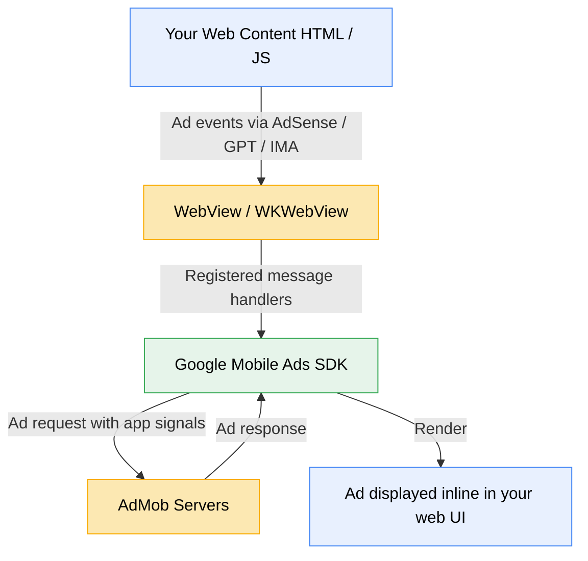
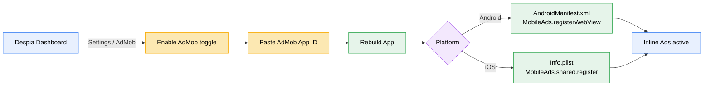
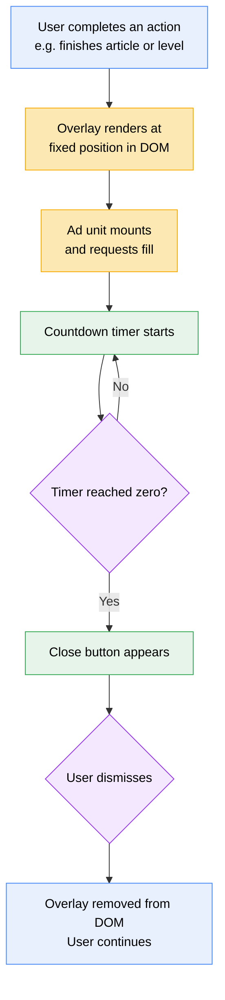
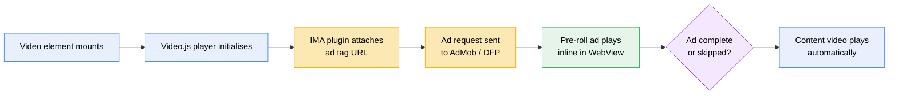
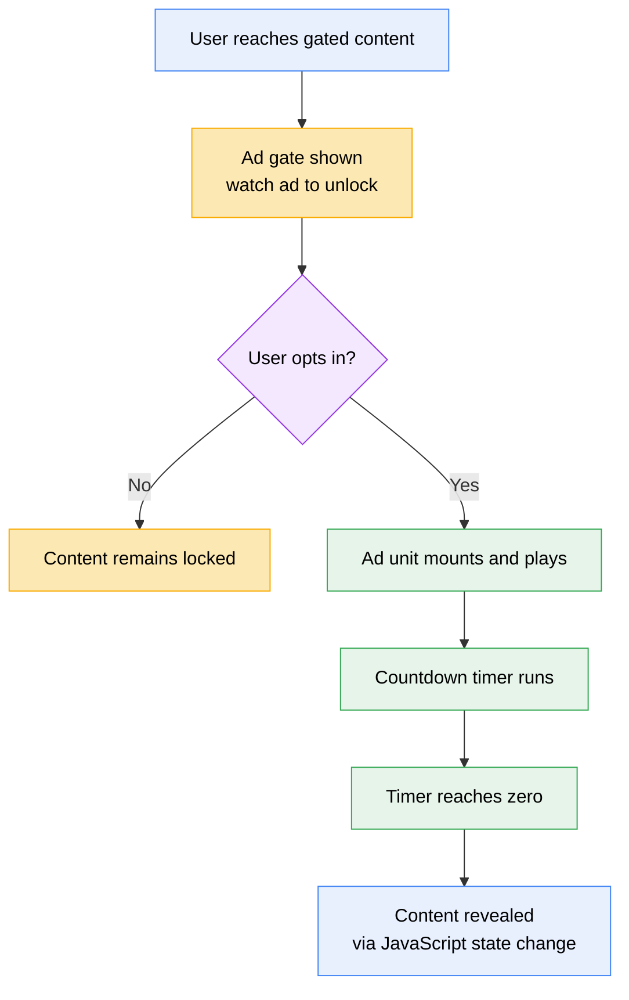
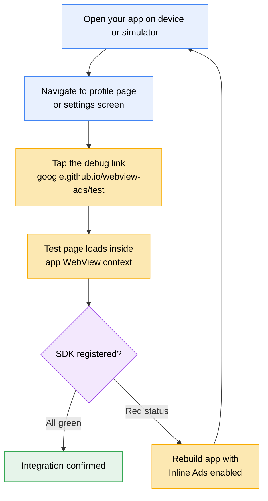

<Note>
  This feature requires a rebuild of your app after enabling Inline Ads in Despia settings. All configuration is handled automatically. No code required.
</Note>

## Overview

Despia's **Inline Ads** feature lets you monetize your in-app web views with AdMob ads rendered **inside** your web UI, not overlaid on top of or injected below it.

This works by connecting Google's Mobile Ads SDK directly to the WebView (Android) or WKWebView (iOS) that Despia bundles inside your app. When your web content loads ad tags via [AdSense](https://support.google.com/adsense/answer/9274634), [Google Publisher Tag (GPT)](https://support.google.com/admanager/answer/181073), or [IMA for HTML5](https://support.google.com/adsense/answer/6391192), the SDK intercepts those events and bridges app-level signals, improving ad relevance, fill rates, and revenue.

<CardGroup cols={2}>
  <Card title="Improved monetization" icon="chart-line">
    App-level signals (device ID, audience data) are passed to ad tags, improving CPMs and fill rates.
  </Card>
  <Card title="Spam protection" icon="shield-check">
    Google's SDK validates ad requests from within the WebView, protecting advertisers and your account standing.
  </Card>
  <Card title="100% NoCode setup" icon="wand-magic-sparkles">
    Enable, configure, and rebuild entirely from the Despia dashboard. No native code needed.
  </Card>
  <Card title="Video ad support" icon="circle-play">
    Inline video ads play automatically without user interaction, fully compatible with AdSense and IMA for HTML5.
  </Card>
</CardGroup>

---

## How it works

The AdMob SDK registers message handlers on your WebView/WKWebView. When your web page fires ad events through AdSense code, Google Publisher Tag, or IMA for HTML5, the SDK listens and bridges those events with native app signals.



<Info>
  Communication with the Google Mobile Ads SDK **only** happens in response to ad events triggered by AdSense code, Google Publisher Tag, or IMA for HTML5. No background tracking occurs outside of these events.
</Info>

---

## Enable Inline Ads in Despia

<Steps>
  <Step title="Open your app settings">
    In the Despia dashboard, navigate to **Your App → Settings → AdMob**.
  </Step>
  <Step title="Enable AdMob">
    Toggle **Enable AdMob** to on.
  </Step>
  <Step title="Add your AdMob App ID">
    Paste your AdMob App ID. You can find this in your [AdMob console](https://apps.admob.com) under **App settings**.

    <Tip>
      Your AdMob App ID looks like `ca-app-pub-XXXXXXXXXXXXXXXX~YYYYYYYYYY`. Make sure you use your **App ID**, not an individual Ad Unit ID.
    </Tip>
  </Step>
  <Step title="Rebuild your app">
    Click **Rebuild App**. Despia automatically bundles the Google Mobile Ads SDK, registers the WebView, and configures all required manifest and plist entries for both Android and iOS.
  </Step>
</Steps>

<Warning>
  You must rebuild your app after enabling Inline Ads. The WebView API for Ads cannot be activated over-the-air. It requires the SDK to be compiled into your app binary.
</Warning>



<Info>
  These steps must be completed manually in the Despia dashboard. They cannot be automated with an AI agent prompt.

  1. Go to **Your App > Settings > AdMob**
  2. Toggle **Enable AdMob** to on
  3. Paste your AdMob App ID (format: `ca-app-pub-XXXXXXXXXXXXXXXX~YYYYYYYYYY`)
  4. Click **Rebuild App**

  Despia handles all Android and iOS native configuration automatically during the rebuild. No code changes are required outside your web UI.
</Info>

---

## What Despia configures automatically

When you enable Inline Ads and rebuild, Despia handles all the native setup behind the scenes so you don't have to touch any code.

<Tabs>
  <Tab title="Android">
    Despia automatically adds the following to your `AndroidManifest.xml`:

    ```xml AndroidManifest.xml
    <!-- Bypass APPLICATION_ID check for WebView APIs for Ads -->
    <meta-data
        android:name="com.google.android.gms.ads.INTEGRATION_MANAGER"
        android:value="webview" />
    ```

    It also configures your WebView with the correct settings and calls `MobileAds.registerWebView()` on the main thread during app startup:

    <Tabs>
      <Tab title="Kotlin">
        ```kotlin MainActivity.kt (auto-generated)
        import android.webkit.CookieManager
        import android.webkit.WebView
        import com.google.android.gms.ads.MobileAds

        // Called in onCreate()
        CookieManager.getInstance().setAcceptThirdPartyCookies(webView, true)
        webView.settings.javaScriptEnabled = true
        webView.settings.domStorageEnabled = true
        webView.settings.mediaPlaybackRequiresUserGesture = false

        MobileAds.registerWebView(webView)
        ```
      </Tab>
      <Tab title="Java">
        ```java MainActivity.java (auto-generated)
        import android.webkit.CookieManager;
        import android.webkit.WebView;
        import com.google.android.gms.ads.MobileAds;

        // Called in onCreate()
        CookieManager.getInstance().setAcceptThirdPartyCookies(webView, true);
        webView.getSettings().setJavaScriptEnabled(true);
        webView.getSettings().setDomStorageEnabled(true);
        webView.getSettings().setMediaPlaybackRequiresUserGesture(false);

        MobileAds.registerWebView(webView);
        ```
      </Tab>
    </Tabs>

    **Requirements met automatically:**
    - Google Mobile Ads SDK ≥ 20.6.0
    - Android API level 21+
    - Third-party cookies enabled
    - JavaScript and DOM storage enabled
  </Tab>
  <Tab title="iOS">
    Despia automatically adds the following key to your `Info.plist`:

    ```xml Info.plist
    <!-- Indicate SDK usage is only for WebView APIs for Ads -->
    <key>GADIntegrationManager</key>
    <string>webview</string>
    ```

    It also initializes your `WKWebView` with the correct configuration and calls `MobileAds.shared.register(webView)` on the main thread in `viewDidLoad`:

    ```swift ViewController.swift (auto-generated)
    import WebKit

    // Called in viewDidLoad()
    let webViewConfiguration = WKWebViewConfiguration()
    webViewConfiguration.allowsInlineMediaPlayback = true
    webViewConfiguration.mediaTypesRequiringUserActionForPlayback = []

    webView = WKWebView(frame: view.frame, configuration: webViewConfiguration)
    view.addSubview(webView)

    MobileAds.shared.register(webView)
    ```

    **Requirements met automatically:**
    - Google Mobile Ads SDK ≥ 9.6.0
    - Inline media playback enabled
    - Autoplay without user gesture enabled
  </Tab>
</Tabs>

---

## Adding ads to your web content

Once Inline Ads is enabled and your app is rebuilt, you serve ads from within your web UI using standard Google ad tags. No special Despia SDK calls are needed on the web side.

<AccordionGroup>
  <Accordion title="AdSense" icon="google">
    Add your AdSense auto ads snippet or individual ad units to your HTML. The SDK will automatically bridge app signals.

    ```html
    <script async src="https://pagead2.googlesyndication.com/pagead/js/adsbygoogle.js"
        data-ad-client="ca-pub-XXXXXXXXXXXXXXXX"></script>
    <ins class="adsbygoogle"
         style="display:block"
         data-ad-client="ca-pub-XXXXXXXXXXXXXXXX"
         data-ad-slot="YYYYYYYYYY"
         data-ad-format="auto"></ins>
    <script>(adsbygoogle = window.adsbygoogle || []).push({});</script>
    ```

    See the [AdSense documentation](https://support.google.com/adsense/answer/9274634) for full setup details.
  </Accordion>

  <Accordion title="Google Publisher Tag (GPT)" icon="tag">
    Use GPT for Ad Manager reservation and auction ads. The SDK bridges automatically once your WebView is registered.

    ```html
    <script async src="https://securepubads.g.doubleclick.net/tag/js/gpt.js"></script>
    <script>
      window.googletag = window.googletag || { cmd: [] };
      googletag.cmd.push(() => {
        googletag
          .defineSlot('/YOUR_NETWORK_CODE/YOUR_AD_UNIT', [300, 250], 'ad-container')
          .addService(googletag.pubads());
        googletag.pubads().enableSingleRequest();
        googletag.enableServices();
        googletag.display('ad-container');
      });
    </script>
    <div id="ad-container" style="width:300px;height:250px;"></div>
    ```

    See the [Google Publisher Tag documentation](https://support.google.com/admanager/answer/181073) for full setup.
  </Accordion>

  <Accordion title="IMA for HTML5 (Video Ads)" icon="film">
    Use the IMA HTML5 SDK for in-stream and outstream video ads. Combined with the Video.js IMA plugin, you can serve pre-roll, mid-roll, and post-roll ads.

    ```html
    <!-- Video.js 8.23.8 -->
    <link href="https://vjs.zencdn.net/8.23.8/video-js.min.css" rel="stylesheet" />
    <script src="https://vjs.zencdn.net/8.23.8/video.min.js"></script>
    <!-- Google IMA SDK -->
    <script src="https://imasdk.googleapis.com/js/sdkloader/ima3.js"></script>
    <!-- videojs-contrib-ads 7.5.2 (required by videojs-ima) -->
    <link href="https://cdnjs.cloudflare.com/ajax/libs/videojs-contrib-ads/7.5.2/videojs.ads.min.css" rel="stylesheet" />
    <script src="https://cdnjs.cloudflare.com/ajax/libs/videojs-contrib-ads/7.5.2/videojs.ads.min.js"></script>
    <!-- videojs-ima 2.4.0 -->
    <link href="https://cdnjs.cloudflare.com/ajax/libs/videojs-ima/2.4.0/videojs.ima.css" rel="stylesheet" />
    <script src="https://cdnjs.cloudflare.com/ajax/libs/videojs-ima/2.4.0/videojs.ima.min.js"></script>

    <video id="my-video" class="video-js vjs-default-skin" controls playsinline>
      <source src="YOUR_VIDEO_URL.mp4" type="video/mp4" />
    </video>

    <script>
      var player = videojs('my-video');
      player.ima({
        adTagUrl: 'YOUR_AD_TAG_URL'
      });
    </script>
    ```

    - Ads play **inline**. no fullscreen takeover.
    - Autoplay is supported because Despia configures the WebView to allow it.
    - See the [videojs-ima plugin](https://github.com/googleads/videojs-ima) and [Video.js docs](https://videojs.com) for advanced options.

    <Info>
      IMA for HTML5 requires `allowsInlineMediaPlayback` and `mediaTypesRequiringUserActionForPlayback = []` on iOS. both are set automatically by Despia.
    </Info>
  </Accordion>
</AccordionGroup>

---

## Safe areas

Despia's native runtime automatically injects two CSS variables into every WebView:

| Variable | What it measures |
|---|---|
| `var(--safe-area-top)` | Status bar, notch, Dynamic Island |
| `var(--safe-area-bottom)` | Home indicator, gesture bar |

These values update in real time when the device orientation changes. No package installation, no native code, and no configuration is required. The variables are available as soon as your web UI loads inside the Despia runtime.

This is directly relevant to Inline Ads because any banner positioned at the top or bottom of the viewport must account for these insets. A bottom banner that ignores `var(--safe-area-bottom)` will be partially hidden behind the home indicator on modern iPhones. A top banner that ignores `var(--safe-area-top)` will render under the status bar.

### Applying safe area insets to ad placements

The correct pattern is to add the safe area inset to the fixed or sticky container that holds the ad unit, not to the ad unit itself.

<Tabs>
  <Tab title="React">
    ```jsx SafeAreaAdLayout.jsx
    export default function SafeAreaAdLayout({ children }) {
      return (
        <div style={{ display: "flex", flexDirection: "column", height: "100vh" }}>

          {/* Top safe area spacer — pushes everything below the status bar / notch */}
          <div style={{ height: "var(--safe-area-top)", flexShrink: 0 }} />

          {/* Navigation bar */}
          <nav style={{
            height: 56,
            background: "#1a1a2e",
            color: "#fff",
            display: "flex",
            alignItems: "center",
            padding: "0 16px",
            flexShrink: 0,
          }}>
            My App
          </nav>

          {/* Top banner — sits below nav, inside the safe area */}
          <div style={{ width: "100%", flexShrink: 0 }}>
            <ins
              className="adsbygoogle"
              style={{ display: "block" }}
              data-ad-client="ca-pub-XXXXXXXXXXXXXXXX"
              data-ad-slot="YYYYYYYYYY"
              data-ad-format="auto"
              data-full-width-responsive="true"
            />
            <script>{`(adsbygoogle = window.adsbygoogle || []).push({});`}</script>
          </div>

          {/* Scrollable content */}
          <main style={{ flex: 1, overflowY: "auto", padding: 16 }}>
            {children}
          </main>

          {/* Bottom banner — sits above the home indicator */}
          <div style={{
            width: "100%",
            background: "#fff",
            borderTop: "1px solid #e0e0e0",
            flexShrink: 0,
            paddingBottom: "var(--safe-area-bottom)",
          }}>
            <ins
              className="adsbygoogle"
              style={{ display: "block" }}
              data-ad-client="ca-pub-XXXXXXXXXXXXXXXX"
              data-ad-slot="ZZZZZZZZZZ"
              data-ad-format="auto"
              data-full-width-responsive="true"
            />
            <script>{`(adsbygoogle = window.adsbygoogle || []).push({});`}</script>
          </div>

        </div>
      );
    }
    ```
  </Tab>
  <Tab title="HTML">
    ```html safe-area-layout.html
    <style>
      body {
        margin: 0;
        display: flex;
        flex-direction: column;
        height: 100vh;
      }

      .safe-top    { height: var(--safe-area-top); flex-shrink: 0; }
      .safe-bottom { height: var(--safe-area-bottom); }

      nav {
        height: 56px;
        background: #1a1a2e;
        color: #fff;
        display: flex;
        align-items: center;
        padding: 0 16px;
        flex-shrink: 0;
      }

      .ad-top    { width: 100%; flex-shrink: 0; }

      .ad-bottom {
        width: 100%;
        background: #fff;
        border-top: 1px solid #e0e0e0;
        flex-shrink: 0;
        padding-bottom: var(--safe-area-bottom);
      }

      main { flex: 1; overflow-y: auto; padding: 16px; }
    </style>

    <script async src="https://pagead2.googlesyndication.com/pagead/js/adsbygoogle.js"
        data-ad-client="ca-pub-XXXXXXXXXXXXXXXX"></script>

    <!-- Pushes everything below the status bar / notch -->
    <div class="safe-top"></div>

    <nav>My App</nav>

    <!-- Top banner — below nav, inside the safe area -->
    <div class="ad-top">
      <ins class="adsbygoogle"
           style="display:block"
           data-ad-client="ca-pub-XXXXXXXXXXXXXXXX"
           data-ad-slot="YYYYYYYYYY"
           data-ad-format="auto"
           data-full-width-responsive="true"></ins>
      <script>(adsbygoogle = window.adsbygoogle || []).push({});</script>
    </div>

    <main>
      <h1>Your content</h1>
    </main>

    <!-- Bottom banner — padding-bottom clears the home indicator -->
    <div class="ad-bottom">
      <ins class="adsbygoogle"
           style="display:block"
           data-ad-client="ca-pub-XXXXXXXXXXXXXXXX"
           data-ad-slot="ZZZZZZZZZZ"
           data-ad-format="auto"
           data-full-width-responsive="true"></ins>
      <script>(adsbygoogle = window.adsbygoogle || []).push({});</script>
      <div class="safe-bottom"></div>
    </div>
    ```
  </Tab>
</Tabs>

<Warning>
  The CSS variables `var(--safe-area-top)` and `var(--safe-area-bottom)` are provided by the Despia runtime only. They will be `0` or undefined when running in a standard desktop browser, so layout will appear unaffected during local development. Always verify safe area behaviour on a physical device or simulator running your Despia-built app.
</Warning>

<Prompt description="**Apply safe area insets to top and bottom ad banners.** Despia injects `var(--safe-area-top)` and `var(--safe-area-bottom)` into every WebView. Any banner at the top or bottom of the viewport must use these values or it will be obscured by the notch, status bar, or home indicator. Apply the inset to the wrapping container, not to the ad unit itself." actions={["copy", "cursor"]}>
## Core context — read this before writing any code

### What Despia Inline Ads is
Despia is a no-code platform that wraps a web app inside a native iOS and Android shell. The app runs in a WebView (Android) or WKWebView (iOS). Inline Ads connects Google's Mobile Ads SDK to that WebView so AdMob ads load as real DOM elements inside the web UI — not as native overlays positioned above or below the WebView.

### How the SDK bridge works
Despia automatically registers the WebView with the Google Mobile Ads SDK during the native app startup. This means:
- `MobileAds.registerWebView(webView)` is called on Android before the page loads
- `MobileAds.shared.register(webView)` is called on iOS before the page loads
- No JavaScript call is needed to activate the bridge — it is always active when the app is running

### Ad tag options

There are three ways to serve ads inside the WebView. Choose one based on your setup.

#### Option 1 — AdSense
The simplest option. Add the AdSense script once in your `<head>`, then place `<ins>` elements wherever you want ads.

```html
<!-- Add once in <head> -->
<script async src="https://pagead2.googlesyndication.com/pagead/js/adsbygoogle.js"
    data-ad-client="ca-pub-XXXXXXXXXXXXXXXX"></script>

<!-- Ad unit — place wherever needed in the body -->
<ins class="adsbygoogle"
     style="display:block"
     data-ad-client="ca-pub-XXXXXXXXXXXXXXXX"
     data-ad-slot="YYYYYYYYYY"
     data-ad-format="auto"
     data-full-width-responsive="true"></ins>
<script>(adsbygoogle = window.adsbygoogle || []).push({});</script>
```

In React, push the ad unit after the component mounts:

```jsx
import { useEffect, useRef } from "react";

function AdUnit({ slot }) {
  const ref = useRef(null);
  useEffect(() => {
    if (ref.current && ref.current.offsetWidth > 0) {
      (window.adsbygoogle = window.adsbygoogle || []).push({});
    }
  }, []);
  return (
    <ins
      ref={ref}
      className="adsbygoogle"
      style={{ display: "block" }}
      data-ad-client="ca-pub-XXXXXXXXXXXXXXXX"
      data-ad-slot={slot}
      data-ad-format="auto"
      data-full-width-responsive="true"
    />
  );
}
```

#### Option 2 — Google Publisher Tag (GPT)
Use GPT for Ad Manager reservation and auction ads. The SDK bridges automatically once the WebView is registered.

```html
<script async src="https://securepubads.g.doubleclick.net/tag/js/gpt.js"></script>
<script>
  window.googletag = window.googletag || { cmd: [] };
  googletag.cmd.push(() => {
    googletag
      .defineSlot('/YOUR_NETWORK_CODE/YOUR_AD_UNIT', [300, 250], 'ad-container')
      .addService(googletag.pubads());
    googletag.pubads().enableSingleRequest();
    googletag.enableServices();
    googletag.display('ad-container');
  });
</script>
<div id="ad-container" style="width:300px;height:250px;"></div>
```

#### Option 3 — IMA for HTML5 (video ads)
Use IMA with Video.js to serve pre-roll, mid-roll, and post-roll video ads. Load dependencies in this exact order:

```html
<!-- Video.js 8.23.8 -->
<link href="https://vjs.zencdn.net/8.23.8/video-js.min.css" rel="stylesheet" />
<script src="https://vjs.zencdn.net/8.23.8/video.min.js"></script>
<!-- Google IMA SDK -->
<script src="https://imasdk.googleapis.com/js/sdkloader/ima3.js"></script>
<!-- videojs-contrib-ads 7.5.2 (required by videojs-ima) -->
<link href="https://cdnjs.cloudflare.com/ajax/libs/videojs-contrib-ads/7.5.2/videojs.ads.min.css" rel="stylesheet" />
<script src="https://cdnjs.cloudflare.com/ajax/libs/videojs-contrib-ads/7.5.2/videojs.ads.min.js"></script>
<!-- videojs-ima 2.4.0 -->
<link href="https://cdnjs.cloudflare.com/ajax/libs/videojs-ima/2.4.0/videojs.ima.css" rel="stylesheet" />
<script src="https://cdnjs.cloudflare.com/ajax/libs/videojs-ima/2.4.0/videojs.ima.min.js"></script>

<video id="my-video" class="video-js vjs-default-skin" controls playsinline>
  <source src="YOUR_VIDEO_URL.mp4" type="video/mp4" />
</video>

<script>
  var player = videojs("my-video");
  player.ima({ adTagUrl: "YOUR_AD_TAG_URL" });
</script>
```

Ads play inline with no fullscreen takeover. The `playsinline` attribute is required for iOS. Despia configures the WebView to allow autoplay without a user gesture on both Android and iOS — `mediaPlaybackRequiresUserGesture = false` on Android and `mediaTypesRequiringUserActionForPlayback = []` on iOS are set automatically.

### Safe area CSS variables
Despia injects two CSS variables into every WebView automatically:
- `var(--safe-area-top)` — height of the status bar, notch, or Dynamic Island
- `var(--safe-area-bottom)` — height of the home indicator or gesture bar

Apply these to the **container** of any top or bottom fixed or sticky element, not to the ad unit itself:

```css
.top-container    { padding-top:    var(--safe-area-top);    }
.bottom-container { padding-bottom: var(--safe-area-bottom); }
```

These variables are `0` in a desktop browser. Test safe area behaviour on a physical device or simulator running the Despia app.

### Framework note
Examples are shown in React and plain HTML. The same patterns apply to Vue (`onMounted`), Svelte (`onMount`), Angular (`ngAfterViewInit`), and any other framework. The key rule: push the ad unit to `window.adsbygoogle` **after** the container element is mounted in the DOM.

---

## Task
Apply Despia safe area insets to the top and bottom ad banners in the layout below.

Apply `padding-top: var(--safe-area-top)` (or a spacer div) above the top navigation and `padding-bottom: var(--safe-area-bottom)` to the bottom banner container. Do not apply safe area values to the `<ins>` element itself.

Replace `ca-pub-XXXXXXXXXXXXXXXX` with [YOUR_PUBLISHER_ID], `YYYYYYYYYY` with [YOUR_TOP_AD_SLOT], and `ZZZZZZZZZZ` with [YOUR_BOTTOM_AD_SLOT].

## React reference implementation

```jsx SafeAreaAdLayout.jsx
export default function SafeAreaAdLayout({ children }) {
  return (
    <div style={{ display: "flex", flexDirection: "column", height: "100vh" }}>

      {/* Top safe area spacer — pushes everything below the status bar / notch */}
      <div style={{ height: "var(--safe-area-top)", flexShrink: 0 }} />

      {/* Navigation bar */}
      <nav style={{
        height: 56,
        background: "#1a1a2e",
        color: "#fff",
        display: "flex",
        alignItems: "center",
        padding: "0 16px",
        flexShrink: 0,
      }}>
        My App
      </nav>

      {/* Top banner — sits below nav, inside the safe area */}
      <div style={{ width: "100%", flexShrink: 0 }}>
        <ins
          className="adsbygoogle"
          style={{ display: "block" }}
          data-ad-client="ca-pub-XXXXXXXXXXXXXXXX"
          data-ad-slot="YYYYYYYYYY"
          data-ad-format="auto"
          data-full-width-responsive="true"
        />
        <script>{`(adsbygoogle = window.adsbygoogle || []).push({});`}</script>
      </div>

      {/* Scrollable content */}
      <main style={{ flex: 1, overflowY: "auto", padding: 16 }}>
        {children}
      </main>

      {/* Bottom banner — sits above the home indicator */}
      <div style={{
        width: "100%",
        background: "#fff",
        borderTop: "1px solid #e0e0e0",
        flexShrink: 0,
        paddingBottom: "var(--safe-area-bottom)",
      }}>
        <ins
          className="adsbygoogle"
          style={{ display: "block" }}
          data-ad-client="ca-pub-XXXXXXXXXXXXXXXX"
          data-ad-slot="ZZZZZZZZZZ"
          data-ad-format="auto"
          data-full-width-responsive="true"
        />
        <script>{`(adsbygoogle = window.adsbygoogle || []).push({});`}</script>
      </div>

    </div>
  );
}
```

## HTML reference implementation

```html safe-area-layout.html
<style>
  body {
    margin: 0;
    display: flex;
    flex-direction: column;
    height: 100vh;
  }

  .safe-top    { height: var(--safe-area-top); flex-shrink: 0; }
  .safe-bottom { height: var(--safe-area-bottom); }

  nav {
    height: 56px;
    background: #1a1a2e;
    color: #fff;
    display: flex;
    align-items: center;
    padding: 0 16px;
    flex-shrink: 0;
  }

  .ad-top    { width: 100%; flex-shrink: 0; }

  .ad-bottom {
    width: 100%;
    background: #fff;
    border-top: 1px solid #e0e0e0;
    flex-shrink: 0;
    padding-bottom: var(--safe-area-bottom);
  }

  main { flex: 1; overflow-y: auto; padding: 16px; }
</style>

<script async src="https://pagead2.googlesyndication.com/pagead/js/adsbygoogle.js"
    data-ad-client="ca-pub-XXXXXXXXXXXXXXXX"></script>

<!-- Pushes everything below the status bar / notch -->
<div class="safe-top"></div>

<nav>My App</nav>

<!-- Top banner — below nav, inside the safe area -->
<div class="ad-top">
  <ins class="adsbygoogle"
       style="display:block"
       data-ad-client="ca-pub-XXXXXXXXXXXXXXXX"
       data-ad-slot="YYYYYYYYYY"
       data-ad-format="auto"
       data-full-width-responsive="true"></ins>
  <script>(adsbygoogle = window.adsbygoogle || []).push({});</script>
</div>

<main>
  <h1>Your content</h1>
</main>

<!-- Bottom banner — padding-bottom clears the home indicator -->
<div class="ad-bottom">
  <ins class="adsbygoogle"
       style="display:block"
       data-ad-client="ca-pub-XXXXXXXXXXXXXXXX"
       data-ad-slot="ZZZZZZZZZZ"
       data-ad-format="auto"
       data-full-width-responsive="true"></ins>
  <script>(adsbygoogle = window.adsbygoogle || []).push({});</script>
  <div class="safe-bottom"></div>
</div>
```
</Prompt>

---

## Ad placement ideas & examples

This is where Inline Ads becomes genuinely powerful. Because ads are rendered **inside your web UI**. as real DOM elements. you can position them anywhere a `<div>` can go. Layouts that are flat-out impossible with native overlay ads become trivial.

<Note>
  All examples below use React and plain HTML. The same patterns adapt directly to **Vue**, **Svelte**, **Angular**, **Astro**, or any other framework. just translate the component structure and lifecycle hooks to your framework of choice.
</Note>

---

### 1. Sticky banner under your navigation bar

In a standard WebView-based app, the native navigation bar sits outside the WebView. meaning you can't place an ad between the nav bar and your web content without a native overlay, which causes z-index fights, safe area headaches, and layout jank. With Inline Ads, you render the banner **inside the WebView** directly beneath your web nav bar, as a real part of your page layout.

<Tabs>
  <Tab title="React">
    ```jsx App.jsx
    export default function App() {
      return (
        <div style={{ display: "flex", flexDirection: "column", height: "100vh" }}>

          {/* Your web navigation bar */}
          <nav style={{
            height: 56,
            background: "#1a1a2e",
            color: "#fff",
            display: "flex",
            alignItems: "center",
            padding: "0 16px",
            flexShrink: 0,
          }}>
            <span>My App</span>
          </nav>

          {/* AdSense banner - sits directly under the nav, inside the WebView */}
          <div style={{ width: "100%", overflow: "hidden", flexShrink: 0 }}>
            <ins
              className="adsbygoogle"
              style={{ display: "block" }}
              data-ad-client="ca-pub-XXXXXXXXXXXXXXXX"
              data-ad-slot="YYYYYYYYYY"
              data-ad-format="auto"
              data-full-width-responsive="true"
            />
            <script>
              {`(adsbygoogle = window.adsbygoogle || []).push({});`}
            </script>
          </div>

          {/* Scrollable page content below the ad */}
          <main style={{ flex: 1, overflowY: "auto", padding: 16 }}>
            <h1>Welcome</h1>
            <p>Your page content here...</p>
          </main>

        </div>
      );
    }
    ```
  </Tab>
  <Tab title="HTML">
    ```html index.html
    <style>
      body { margin: 0; display: flex; flex-direction: column; height: 100vh; }
      nav  { height: 56px; background: #1a1a2e; color: #fff;
             display: flex; align-items: center; padding: 0 16px; flex-shrink: 0; }
      .ad-strip { width: 100%; overflow: hidden; flex-shrink: 0; }
      main { flex: 1; overflow-y: auto; padding: 16px; }
    </style>

    <!-- AdSense script — place once in <head> -->
    <script async src="https://pagead2.googlesyndication.com/pagead/js/adsbygoogle.js"
        data-ad-client="ca-pub-XXXXXXXXXXXXXXXX"></script>

    <nav>My App</nav>

    <!-- Banner lives inside the WebView, flush under the nav -->
    <div class="ad-strip">
      <ins class="adsbygoogle"
           style="display:block"
           data-ad-client="ca-pub-XXXXXXXXXXXXXXXX"
           data-ad-slot="YYYYYYYYYY"
           data-ad-format="auto"
           data-full-width-responsive="true"></ins>
      <script>(adsbygoogle = window.adsbygoogle || []).push({});</script>
    </div>

    <main>
      <h1>Welcome</h1>
      <p>Your page content here...</p>
    </main>
    ```
  </Tab>
</Tabs>

<Tip>
  Use `data-full-width-responsive="true"` so the banner fills the full device width automatically, exactly like a native banner ad unit. If your navigation bar is fixed or the banner sits at the very top of the layout, add a spacer div with `height: var(--safe-area-top)` above the nav to keep content clear of the notch and status bar. See the Safe areas section above.
</Tip>

<Prompt description="**Place a banner ad directly below your navigation bar.** Normally impossible in a WebView app without a native overlay. With Inline Ads the banner is a real DOM element positioned with flexbox below the nav bar and above the scrollable content. Provide your AdSense publisher ID and slot ID." actions={["copy", "cursor"]}>
## Core context — read this before writing any code

### What Despia Inline Ads is
Despia is a no-code platform that wraps a web app inside a native iOS and Android shell. The app runs in a WebView (Android) or WKWebView (iOS). Inline Ads connects Google's Mobile Ads SDK to that WebView so AdMob ads load as real DOM elements inside the web UI — not as native overlays positioned above or below the WebView.

### How the SDK bridge works
Despia automatically registers the WebView with the Google Mobile Ads SDK during the native app startup. This means:
- `MobileAds.registerWebView(webView)` is called on Android before the page loads
- `MobileAds.shared.register(webView)` is called on iOS before the page loads
- No JavaScript call is needed to activate the bridge — it is always active when the app is running

### Ad tag options

There are three ways to serve ads inside the WebView. Choose one based on your setup.

#### Option 1 — AdSense
The simplest option. Add the AdSense script once in your `<head>`, then place `<ins>` elements wherever you want ads.

```html
<!-- Add once in <head> -->
<script async src="https://pagead2.googlesyndication.com/pagead/js/adsbygoogle.js"
    data-ad-client="ca-pub-XXXXXXXXXXXXXXXX"></script>

<!-- Ad unit — place wherever needed in the body -->
<ins class="adsbygoogle"
     style="display:block"
     data-ad-client="ca-pub-XXXXXXXXXXXXXXXX"
     data-ad-slot="YYYYYYYYYY"
     data-ad-format="auto"
     data-full-width-responsive="true"></ins>
<script>(adsbygoogle = window.adsbygoogle || []).push({});</script>
```

In React, push the ad unit after the component mounts:

```jsx
import { useEffect, useRef } from "react";

function AdUnit({ slot }) {
  const ref = useRef(null);
  useEffect(() => {
    if (ref.current && ref.current.offsetWidth > 0) {
      (window.adsbygoogle = window.adsbygoogle || []).push({});
    }
  }, []);
  return (
    <ins
      ref={ref}
      className="adsbygoogle"
      style={{ display: "block" }}
      data-ad-client="ca-pub-XXXXXXXXXXXXXXXX"
      data-ad-slot={slot}
      data-ad-format="auto"
      data-full-width-responsive="true"
    />
  );
}
```

#### Option 2 — Google Publisher Tag (GPT)
Use GPT for Ad Manager reservation and auction ads. The SDK bridges automatically once the WebView is registered.

```html
<script async src="https://securepubads.g.doubleclick.net/tag/js/gpt.js"></script>
<script>
  window.googletag = window.googletag || { cmd: [] };
  googletag.cmd.push(() => {
    googletag
      .defineSlot('/YOUR_NETWORK_CODE/YOUR_AD_UNIT', [300, 250], 'ad-container')
      .addService(googletag.pubads());
    googletag.pubads().enableSingleRequest();
    googletag.enableServices();
    googletag.display('ad-container');
  });
</script>
<div id="ad-container" style="width:300px;height:250px;"></div>
```

#### Option 3 — IMA for HTML5 (video ads)
Use IMA with Video.js to serve pre-roll, mid-roll, and post-roll video ads. Load dependencies in this exact order:

```html
<!-- Video.js 8.23.8 -->
<link href="https://vjs.zencdn.net/8.23.8/video-js.min.css" rel="stylesheet" />
<script src="https://vjs.zencdn.net/8.23.8/video.min.js"></script>
<!-- Google IMA SDK -->
<script src="https://imasdk.googleapis.com/js/sdkloader/ima3.js"></script>
<!-- videojs-contrib-ads 7.5.2 (required by videojs-ima) -->
<link href="https://cdnjs.cloudflare.com/ajax/libs/videojs-contrib-ads/7.5.2/videojs.ads.min.css" rel="stylesheet" />
<script src="https://cdnjs.cloudflare.com/ajax/libs/videojs-contrib-ads/7.5.2/videojs.ads.min.js"></script>
<!-- videojs-ima 2.4.0 -->
<link href="https://cdnjs.cloudflare.com/ajax/libs/videojs-ima/2.4.0/videojs.ima.css" rel="stylesheet" />
<script src="https://cdnjs.cloudflare.com/ajax/libs/videojs-ima/2.4.0/videojs.ima.min.js"></script>

<video id="my-video" class="video-js vjs-default-skin" controls playsinline>
  <source src="YOUR_VIDEO_URL.mp4" type="video/mp4" />
</video>

<script>
  var player = videojs("my-video");
  player.ima({ adTagUrl: "YOUR_AD_TAG_URL" });
</script>
```

Ads play inline with no fullscreen takeover. The `playsinline` attribute is required for iOS. Despia configures the WebView to allow autoplay without a user gesture on both Android and iOS — `mediaPlaybackRequiresUserGesture = false` on Android and `mediaTypesRequiringUserActionForPlayback = []` on iOS are set automatically.

### Safe area CSS variables
Despia injects two CSS variables into every WebView automatically:
- `var(--safe-area-top)` — height of the status bar, notch, or Dynamic Island
- `var(--safe-area-bottom)` — height of the home indicator or gesture bar

Apply these to the **container** of any top or bottom fixed or sticky element, not to the ad unit itself:

```css
.top-container    { padding-top:    var(--safe-area-top);    }
.bottom-container { padding-bottom: var(--safe-area-bottom); }
```

These variables are `0` in a desktop browser. Test safe area behaviour on a physical device or simulator running the Despia app.

### Framework note
Examples are shown in React and plain HTML. The same patterns apply to Vue (`onMounted`), Svelte (`onMount`), Angular (`ngAfterViewInit`), and any other framework. The key rule: push the ad unit to `window.adsbygoogle` **after** the container element is mounted in the DOM.

---

## Task
Add an AdSense banner ad directly below the navigation bar using the layout pattern below.

The banner must be a flex child between the `<nav>` and the scrollable `<main>`, not a native overlay. Include `data-full-width-responsive="true"` so it fills the device width. Add a spacer div with `height: var(--safe-area-top)` above the nav to clear the status bar and notch.

Replace `ca-pub-XXXXXXXXXXXXXXXX` with [YOUR_PUBLISHER_ID] and `YYYYYYYYYY` with [YOUR_AD_SLOT].

## React reference implementation

```jsx App.jsx
export default function App() {
  return (
    <div style={{ display: "flex", flexDirection: "column", height: "100vh" }}>

      {/* Your web navigation bar */}
      <nav style={{
        height: 56,
        background: "#1a1a2e",
        color: "#fff",
        display: "flex",
        alignItems: "center",
        padding: "0 16px",
        flexShrink: 0,
      }}>
        <span>My App</span>
      </nav>

      {/* AdSense banner - sits directly under the nav, inside the WebView */}
      <div style={{ width: "100%", overflow: "hidden", flexShrink: 0 }}>
        <ins
          className="adsbygoogle"
          style={{ display: "block" }}
          data-ad-client="ca-pub-XXXXXXXXXXXXXXXX"
          data-ad-slot="YYYYYYYYYY"
          data-ad-format="auto"
          data-full-width-responsive="true"
        />
        <script>
          {`(adsbygoogle = window.adsbygoogle || []).push({});`}
        </script>
      </div>

      {/* Scrollable page content below the ad */}
      <main style={{ flex: 1, overflowY: "auto", padding: 16 }}>
        <h1>Welcome</h1>
        <p>Your page content here...</p>
      </main>

    </div>
  );
}
```

## HTML reference implementation

```html index.html
<style>
  body { margin: 0; display: flex; flex-direction: column; height: 100vh; }
  nav  { height: 56px; background: #1a1a2e; color: #fff;
         display: flex; align-items: center; padding: 0 16px; flex-shrink: 0; }
  .ad-strip { width: 100%; overflow: hidden; flex-shrink: 0; }
  main { flex: 1; overflow-y: auto; padding: 16px; }
</style>

<!-- AdSense script — place once in <head> -->
<script async src="https://pagead2.googlesyndication.com/pagead/js/adsbygoogle.js"
    data-ad-client="ca-pub-XXXXXXXXXXXXXXXX"></script>

<nav>My App</nav>

<!-- Banner lives inside the WebView, flush under the nav -->
<div class="ad-strip">
  <ins class="adsbygoogle"
       style="display:block"
       data-ad-client="ca-pub-XXXXXXXXXXXXXXXX"
       data-ad-slot="YYYYYYYYYY"
       data-ad-format="auto"
       data-full-width-responsive="true"></ins>
  <script>(adsbygoogle = window.adsbygoogle || []).push({});</script>
</div>

<main>
  <h1>Welcome</h1>
  <p>Your page content here...</p>
</main>
```
</Prompt>

---

### 2. Sticky banner pinned to the bottom of the screen

A classic mobile ad placement. a persistent leaderboard banner anchored to the bottom of the viewport. In pure WebView apps this normally requires a native view rendered outside the WebView. Here it's just CSS.

<Tabs>
  <Tab title="React">
    ```jsx BottomBannerLayout.jsx
    export default function BottomBannerLayout({ children }) {
      return (
        <div style={{ display: "flex", flexDirection: "column", height: "100vh" }}>

          {/* Scrollable content takes all available space */}
          <main style={{ flex: 1, overflowY: "auto", padding: 16 }}>
            {children}
          </main>

          {/* Sticky bottom banner - part of the web layout, not a native overlay */}
          <div style={{
            position: "sticky",
            bottom: 0,
            width: "100%",
            background: "#fff",
            borderTop: "1px solid #e0e0e0",
            flexShrink: 0,
          }}>
            <ins
              className="adsbygoogle"
              style={{ display: "block" }}
              data-ad-client="ca-pub-XXXXXXXXXXXXXXXX"
              data-ad-slot="YYYYYYYYYY"
              data-ad-format="auto"
              data-full-width-responsive="true"
            />
            <script>
              {`(adsbygoogle = window.adsbygoogle || []).push({});`}
            </script>
          </div>

        </div>
      );
    }
    ```
  </Tab>
  <Tab title="HTML">
    ```html index.html
    <style>
      body  { margin: 0; display: flex; flex-direction: column; height: 100vh; }
      main  { flex: 1; overflow-y: auto; padding: 16px; }
      .bottom-banner {
        position: sticky;
        bottom: 0;
        width: 100%;
        background: #fff;
        border-top: 1px solid #e0e0e0;
        flex-shrink: 0;
      }
    </style>

    <script async src="https://pagead2.googlesyndication.com/pagead/js/adsbygoogle.js"
        data-ad-client="ca-pub-XXXXXXXXXXXXXXXX"></script>

    <main>
      <h1>Your content</h1>
      <p>Lots of scrollable content...</p>
    </main>

    <!-- Pinned to the bottom of the WebView viewport -->
    <div class="bottom-banner">
      <ins class="adsbygoogle"
           style="display:block"
           data-ad-client="ca-pub-XXXXXXXXXXXXXXXX"
           data-ad-slot="YYYYYYYYYY"
           data-ad-format="auto"
           data-full-width-responsive="true"></ins>
      <script>(adsbygoogle = window.adsbygoogle || []).push({});</script>
    </div>
    ```
  </Tab>
</Tabs>

<Prompt description="**Pin a persistent banner to the bottom of the viewport.** Implemented as a sticky flex child in CSS with no native overlay required. Apply `padding-bottom: var(--safe-area-bottom)` to the banner container to clear the home indicator on iOS. Provide your AdSense publisher ID and slot ID." actions={["copy", "cursor"]}>
## Core context — read this before writing any code

### What Despia Inline Ads is
Despia is a no-code platform that wraps a web app inside a native iOS and Android shell. The app runs in a WebView (Android) or WKWebView (iOS). Inline Ads connects Google's Mobile Ads SDK to that WebView so AdMob ads load as real DOM elements inside the web UI — not as native overlays positioned above or below the WebView.

### How the SDK bridge works
Despia automatically registers the WebView with the Google Mobile Ads SDK during the native app startup. This means:
- `MobileAds.registerWebView(webView)` is called on Android before the page loads
- `MobileAds.shared.register(webView)` is called on iOS before the page loads
- No JavaScript call is needed to activate the bridge — it is always active when the app is running

### Ad tag options

There are three ways to serve ads inside the WebView. Choose one based on your setup.

#### Option 1 — AdSense
The simplest option. Add the AdSense script once in your `<head>`, then place `<ins>` elements wherever you want ads.

```html
<!-- Add once in <head> -->
<script async src="https://pagead2.googlesyndication.com/pagead/js/adsbygoogle.js"
    data-ad-client="ca-pub-XXXXXXXXXXXXXXXX"></script>

<!-- Ad unit — place wherever needed in the body -->
<ins class="adsbygoogle"
     style="display:block"
     data-ad-client="ca-pub-XXXXXXXXXXXXXXXX"
     data-ad-slot="YYYYYYYYYY"
     data-ad-format="auto"
     data-full-width-responsive="true"></ins>
<script>(adsbygoogle = window.adsbygoogle || []).push({});</script>
```

In React, push the ad unit after the component mounts:

```jsx
import { useEffect, useRef } from "react";

function AdUnit({ slot }) {
  const ref = useRef(null);
  useEffect(() => {
    if (ref.current && ref.current.offsetWidth > 0) {
      (window.adsbygoogle = window.adsbygoogle || []).push({});
    }
  }, []);
  return (
    <ins
      ref={ref}
      className="adsbygoogle"
      style={{ display: "block" }}
      data-ad-client="ca-pub-XXXXXXXXXXXXXXXX"
      data-ad-slot={slot}
      data-ad-format="auto"
      data-full-width-responsive="true"
    />
  );
}
```

#### Option 2 — Google Publisher Tag (GPT)
Use GPT for Ad Manager reservation and auction ads. The SDK bridges automatically once the WebView is registered.

```html
<script async src="https://securepubads.g.doubleclick.net/tag/js/gpt.js"></script>
<script>
  window.googletag = window.googletag || { cmd: [] };
  googletag.cmd.push(() => {
    googletag
      .defineSlot('/YOUR_NETWORK_CODE/YOUR_AD_UNIT', [300, 250], 'ad-container')
      .addService(googletag.pubads());
    googletag.pubads().enableSingleRequest();
    googletag.enableServices();
    googletag.display('ad-container');
  });
</script>
<div id="ad-container" style="width:300px;height:250px;"></div>
```

#### Option 3 — IMA for HTML5 (video ads)
Use IMA with Video.js to serve pre-roll, mid-roll, and post-roll video ads. Load dependencies in this exact order:

```html
<!-- Video.js 8.23.8 -->
<link href="https://vjs.zencdn.net/8.23.8/video-js.min.css" rel="stylesheet" />
<script src="https://vjs.zencdn.net/8.23.8/video.min.js"></script>
<!-- Google IMA SDK -->
<script src="https://imasdk.googleapis.com/js/sdkloader/ima3.js"></script>
<!-- videojs-contrib-ads 7.5.2 (required by videojs-ima) -->
<link href="https://cdnjs.cloudflare.com/ajax/libs/videojs-contrib-ads/7.5.2/videojs.ads.min.css" rel="stylesheet" />
<script src="https://cdnjs.cloudflare.com/ajax/libs/videojs-contrib-ads/7.5.2/videojs.ads.min.js"></script>
<!-- videojs-ima 2.4.0 -->
<link href="https://cdnjs.cloudflare.com/ajax/libs/videojs-ima/2.4.0/videojs.ima.css" rel="stylesheet" />
<script src="https://cdnjs.cloudflare.com/ajax/libs/videojs-ima/2.4.0/videojs.ima.min.js"></script>

<video id="my-video" class="video-js vjs-default-skin" controls playsinline>
  <source src="YOUR_VIDEO_URL.mp4" type="video/mp4" />
</video>

<script>
  var player = videojs("my-video");
  player.ima({ adTagUrl: "YOUR_AD_TAG_URL" });
</script>
```

Ads play inline with no fullscreen takeover. The `playsinline` attribute is required for iOS. Despia configures the WebView to allow autoplay without a user gesture on both Android and iOS — `mediaPlaybackRequiresUserGesture = false` on Android and `mediaTypesRequiringUserActionForPlayback = []` on iOS are set automatically.

### Safe area CSS variables
Despia injects two CSS variables into every WebView automatically:
- `var(--safe-area-top)` — height of the status bar, notch, or Dynamic Island
- `var(--safe-area-bottom)` — height of the home indicator or gesture bar

Apply these to the **container** of any top or bottom fixed or sticky element, not to the ad unit itself:

```css
.top-container    { padding-top:    var(--safe-area-top);    }
.bottom-container { padding-bottom: var(--safe-area-bottom); }
```

These variables are `0` in a desktop browser. Test safe area behaviour on a physical device or simulator running the Despia app.

### Framework note
Examples are shown in React and plain HTML. The same patterns apply to Vue (`onMounted`), Svelte (`onMount`), Angular (`ngAfterViewInit`), and any other framework. The key rule: push the ad unit to `window.adsbygoogle` **after** the container element is mounted in the DOM.

---

## Task
Add a persistent AdSense banner pinned to the bottom of the viewport using the layout pattern below.

The banner must be a sticky flex child at the bottom of a `height: 100vh` flex column. Apply `padding-bottom: var(--safe-area-bottom)` to the banner container to clear the home indicator on iOS. Include `data-full-width-responsive="true"`.

Replace `ca-pub-XXXXXXXXXXXXXXXX` with [YOUR_PUBLISHER_ID] and `YYYYYYYYYY` with [YOUR_AD_SLOT].

## React reference implementation

```jsx BottomBannerLayout.jsx
export default function BottomBannerLayout({ children }) {
  return (
    <div style={{ display: "flex", flexDirection: "column", height: "100vh" }}>

      {/* Scrollable content takes all available space */}
      <main style={{ flex: 1, overflowY: "auto", padding: 16 }}>
        {children}
      </main>

      {/* Sticky bottom banner - part of the web layout, not a native overlay */}
      <div style={{
        position: "sticky",
        bottom: 0,
        width: "100%",
        background: "#fff",
        borderTop: "1px solid #e0e0e0",
        flexShrink: 0,
      }}>
        <ins
          className="adsbygoogle"
          style={{ display: "block" }}
          data-ad-client="ca-pub-XXXXXXXXXXXXXXXX"
          data-ad-slot="YYYYYYYYYY"
          data-ad-format="auto"
          data-full-width-responsive="true"
        />
        <script>
          {`(adsbygoogle = window.adsbygoogle || []).push({});`}
        </script>
      </div>

    </div>
  );
}
```

## HTML reference implementation

```html index.html
<style>
  body  { margin: 0; display: flex; flex-direction: column; height: 100vh; }
  main  { flex: 1; overflow-y: auto; padding: 16px; }
  .bottom-banner {
    position: sticky;
    bottom: 0;
    width: 100%;
    background: #fff;
    border-top: 1px solid #e0e0e0;
    flex-shrink: 0;
  }
</style>

<script async src="https://pagead2.googlesyndication.com/pagead/js/adsbygoogle.js"
    data-ad-client="ca-pub-XXXXXXXXXXXXXXXX"></script>

<main>
  <h1>Your content</h1>
  <p>Lots of scrollable content...</p>
</main>

<!-- Pinned to the bottom of the WebView viewport -->
<div class="bottom-banner">
  <ins class="adsbygoogle"
       style="display:block"
       data-ad-client="ca-pub-XXXXXXXXXXXXXXXX"
       data-ad-slot="YYYYYYYYYY"
       data-ad-format="auto"
       data-full-width-responsive="true"></ins>
  <script>(adsbygoogle = window.adsbygoogle || []).push({});</script>
</div>
```
</Prompt>

---

### 3. In-feed banner between content cards

Ads interspersed between list items or content cards. the same pattern used by Instagram, Twitter, and most news apps. Each nth card is replaced with an ad unit that matches the card dimensions.

<Tabs>
  <Tab title="React">
    ```jsx FeedWithAds.jsx
    const posts = [
      { id: 1, title: "Post one" },
      { id: 2, title: "Post two" },
      { id: 3, title: "Post three" },
      { id: 4, title: "Post four" },
      { id: 5, title: "Post five" },
      { id: 6, title: "Post six" },
    ];

    function AdCard() {
      return (
        <div style={{ margin: "12px 0", background: "#f9f9f9", borderRadius: 8 }}>
          <ins
            className="adsbygoogle"
            style={{ display: "block" }}
            data-ad-client="ca-pub-XXXXXXXXXXXXXXXX"
            data-ad-slot="YYYYYYYYYY"
            data-ad-format="fluid"
            data-ad-layout="in-article"
          />
          <script>
            {`(adsbygoogle = window.adsbygoogle || []).push({});`}
          </script>
        </div>
      );
    }

    export default function Feed() {
      return (
        <div style={{ padding: 16 }}>
          {posts.map((post, index) => (
            <>
              {/* Insert an ad after every 3rd card */}
              {index > 0 && index % 3 === 0 && <AdCard key={`ad-${index}`} />}

              <div key={post.id} style={{
                padding: 16, marginBottom: 12,
                border: "1px solid #e0e0e0", borderRadius: 8,
              }}>
                <h3>{post.title}</h3>
              </div>
            </>
          ))}
        </div>
      );
    }
    ```
  </Tab>
  <Tab title="HTML">
    ```html feed.html
    <script async src="https://pagead2.googlesyndication.com/pagead/js/adsbygoogle.js"
        data-ad-client="ca-pub-XXXXXXXXXXXXXXXX"></script>

    <style>
      .card { padding: 16px; margin-bottom: 12px;
              border: 1px solid #e0e0e0; border-radius: 8px; }
      .ad-card { margin: 12px 0; background: #f9f9f9; border-radius: 8px; }
    </style>

    <div class="card"><h3>Post one</h3></div>
    <div class="card"><h3>Post two</h3></div>
    <div class="card"><h3>Post three</h3></div>

    <!-- Ad after every 3rd item -->
    <div class="ad-card">
      <ins class="adsbygoogle"
           style="display:block"
           data-ad-client="ca-pub-XXXXXXXXXXXXXXXX"
           data-ad-slot="YYYYYYYYYY"
           data-ad-format="fluid"
           data-ad-layout="in-article"></ins>
      <script>(adsbygoogle = window.adsbygoogle || []).push({});</script>
    </div>

    <div class="card"><h3>Post four</h3></div>
    <div class="card"><h3>Post five</h3></div>
    <div class="card"><h3>Post six</h3></div>
    ```
  </Tab>
</Tabs>

<Tip>
  Use `data-ad-format="fluid"` with `data-ad-layout="in-article"` for ads that automatically size themselves to blend naturally between content items.
</Tip>

<Prompt description="**Insert AdSense ads between every nth card in a content feed.** Uses the fluid in-article format so the unit sizes to match surrounding content. Provide your feed array name, AdSense publisher ID, slot ID, and the interval between ads (default: every 3rd item)." actions={["copy", "cursor"]}>
## Core context — read this before writing any code

### What Despia Inline Ads is
Despia is a no-code platform that wraps a web app inside a native iOS and Android shell. The app runs in a WebView (Android) or WKWebView (iOS). Inline Ads connects Google's Mobile Ads SDK to that WebView so AdMob ads load as real DOM elements inside the web UI — not as native overlays positioned above or below the WebView.

### How the SDK bridge works
Despia automatically registers the WebView with the Google Mobile Ads SDK during the native app startup. This means:
- `MobileAds.registerWebView(webView)` is called on Android before the page loads
- `MobileAds.shared.register(webView)` is called on iOS before the page loads
- No JavaScript call is needed to activate the bridge — it is always active when the app is running

### Ad tag options

There are three ways to serve ads inside the WebView. Choose one based on your setup.

#### Option 1 — AdSense
The simplest option. Add the AdSense script once in your `<head>`, then place `<ins>` elements wherever you want ads.

```html
<!-- Add once in <head> -->
<script async src="https://pagead2.googlesyndication.com/pagead/js/adsbygoogle.js"
    data-ad-client="ca-pub-XXXXXXXXXXXXXXXX"></script>

<!-- Ad unit — place wherever needed in the body -->
<ins class="adsbygoogle"
     style="display:block"
     data-ad-client="ca-pub-XXXXXXXXXXXXXXXX"
     data-ad-slot="YYYYYYYYYY"
     data-ad-format="auto"
     data-full-width-responsive="true"></ins>
<script>(adsbygoogle = window.adsbygoogle || []).push({});</script>
```

In React, push the ad unit after the component mounts:

```jsx
import { useEffect, useRef } from "react";

function AdUnit({ slot }) {
  const ref = useRef(null);
  useEffect(() => {
    if (ref.current && ref.current.offsetWidth > 0) {
      (window.adsbygoogle = window.adsbygoogle || []).push({});
    }
  }, []);
  return (
    <ins
      ref={ref}
      className="adsbygoogle"
      style={{ display: "block" }}
      data-ad-client="ca-pub-XXXXXXXXXXXXXXXX"
      data-ad-slot={slot}
      data-ad-format="auto"
      data-full-width-responsive="true"
    />
  );
}
```

#### Option 2 — Google Publisher Tag (GPT)
Use GPT for Ad Manager reservation and auction ads. The SDK bridges automatically once the WebView is registered.

```html
<script async src="https://securepubads.g.doubleclick.net/tag/js/gpt.js"></script>
<script>
  window.googletag = window.googletag || { cmd: [] };
  googletag.cmd.push(() => {
    googletag
      .defineSlot('/YOUR_NETWORK_CODE/YOUR_AD_UNIT', [300, 250], 'ad-container')
      .addService(googletag.pubads());
    googletag.pubads().enableSingleRequest();
    googletag.enableServices();
    googletag.display('ad-container');
  });
</script>
<div id="ad-container" style="width:300px;height:250px;"></div>
```

#### Option 3 — IMA for HTML5 (video ads)
Use IMA with Video.js to serve pre-roll, mid-roll, and post-roll video ads. Load dependencies in this exact order:

```html
<!-- Video.js 8.23.8 -->
<link href="https://vjs.zencdn.net/8.23.8/video-js.min.css" rel="stylesheet" />
<script src="https://vjs.zencdn.net/8.23.8/video.min.js"></script>
<!-- Google IMA SDK -->
<script src="https://imasdk.googleapis.com/js/sdkloader/ima3.js"></script>
<!-- videojs-contrib-ads 7.5.2 (required by videojs-ima) -->
<link href="https://cdnjs.cloudflare.com/ajax/libs/videojs-contrib-ads/7.5.2/videojs.ads.min.css" rel="stylesheet" />
<script src="https://cdnjs.cloudflare.com/ajax/libs/videojs-contrib-ads/7.5.2/videojs.ads.min.js"></script>
<!-- videojs-ima 2.4.0 -->
<link href="https://cdnjs.cloudflare.com/ajax/libs/videojs-ima/2.4.0/videojs.ima.css" rel="stylesheet" />
<script src="https://cdnjs.cloudflare.com/ajax/libs/videojs-ima/2.4.0/videojs.ima.min.js"></script>

<video id="my-video" class="video-js vjs-default-skin" controls playsinline>
  <source src="YOUR_VIDEO_URL.mp4" type="video/mp4" />
</video>

<script>
  var player = videojs("my-video");
  player.ima({ adTagUrl: "YOUR_AD_TAG_URL" });
</script>
```

Ads play inline with no fullscreen takeover. The `playsinline` attribute is required for iOS. Despia configures the WebView to allow autoplay without a user gesture on both Android and iOS — `mediaPlaybackRequiresUserGesture = false` on Android and `mediaTypesRequiringUserActionForPlayback = []` on iOS are set automatically.

### Safe area CSS variables
Despia injects two CSS variables into every WebView automatically:
- `var(--safe-area-top)` — height of the status bar, notch, or Dynamic Island
- `var(--safe-area-bottom)` — height of the home indicator or gesture bar

Apply these to the **container** of any top or bottom fixed or sticky element, not to the ad unit itself:

```css
.top-container    { padding-top:    var(--safe-area-top);    }
.bottom-container { padding-bottom: var(--safe-area-bottom); }
```

These variables are `0` in a desktop browser. Test safe area behaviour on a physical device or simulator running the Despia app.

### Framework note
Examples are shown in React and plain HTML. The same patterns apply to Vue (`onMounted`), Svelte (`onMount`), Angular (`ngAfterViewInit`), and any other framework. The key rule: push the ad unit to `window.adsbygoogle` **after** the container element is mounted in the DOM.

---

## Task
Insert AdSense banner ads between every third card in a content feed using the pattern below.

Use `data-ad-format="fluid"` and `data-ad-layout="in-article"` so the unit sizes to match surrounding content. Insert an ad when `index > 0 && index % 3 === 0`.

Replace `ca-pub-XXXXXXXXXXXXXXXX` with [YOUR_PUBLISHER_ID] and `YYYYYYYYYY` with [YOUR_AD_SLOT]. Replace the `posts` array with [YOUR_DATA_ARRAY]. Adjust the interval if needed.

## React reference implementation

```jsx FeedWithAds.jsx
const posts = [
  { id: 1, title: "Post one" },
  { id: 2, title: "Post two" },
  { id: 3, title: "Post three" },
  { id: 4, title: "Post four" },
  { id: 5, title: "Post five" },
  { id: 6, title: "Post six" },
];

function AdCard() {
  return (
    <div style={{ margin: "12px 0", background: "#f9f9f9", borderRadius: 8 }}>
      <ins
        className="adsbygoogle"
        style={{ display: "block" }}
        data-ad-client="ca-pub-XXXXXXXXXXXXXXXX"
        data-ad-slot="YYYYYYYYYY"
        data-ad-format="fluid"
        data-ad-layout="in-article"
      />
      <script>
        {`(adsbygoogle = window.adsbygoogle || []).push({});`}
      </script>
    </div>
  );
}

export default function Feed() {
  return (
    <div style={{ padding: 16 }}>
      {posts.map((post, index) => (
        <>
          {/* Insert an ad after every 3rd card */}
          {index > 0 && index % 3 === 0 && <AdCard key={`ad-${index}`} />}

          <div key={post.id} style={{
            padding: 16, marginBottom: 12,
            border: "1px solid #e0e0e0", borderRadius: 8,
          }}>
            <h3>{post.title}</h3>
          </div>
        </>
      ))}
    </div>
  );
}
```

## HTML reference implementation

```html feed.html
<script async src="https://pagead2.googlesyndication.com/pagead/js/adsbygoogle.js"
    data-ad-client="ca-pub-XXXXXXXXXXXXXXXX"></script>

<style>
  .card { padding: 16px; margin-bottom: 12px;
          border: 1px solid #e0e0e0; border-radius: 8px; }
  .ad-card { margin: 12px 0; background: #f9f9f9; border-radius: 8px; }
</style>

<div class="card"><h3>Post one</h3></div>
<div class="card"><h3>Post two</h3></div>
<div class="card"><h3>Post three</h3></div>

<!-- Ad after every 3rd item -->
<div class="ad-card">
  <ins class="adsbygoogle"
       style="display:block"
       data-ad-client="ca-pub-XXXXXXXXXXXXXXXX"
       data-ad-slot="YYYYYYYYYY"
       data-ad-format="fluid"
       data-ad-layout="in-article"></ins>
  <script>(adsbygoogle = window.adsbygoogle || []).push({});</script>
</div>

<div class="card"><h3>Post four</h3></div>
<div class="card"><h3>Post five</h3></div>
<div class="card"><h3>Post six</h3></div>
```
</Prompt>

---

### 4. Interstitial-style full-screen overlay ad



A full-screen ad that appears between user actions. e.g., after finishing an article, between levels in a game, or when navigating between pages. This is rendered entirely in your web UI as an overlay `<div>`, triggered by JavaScript. The user dismisses it and continues.

<Tabs>
  <Tab title="React">
    ```jsx InterstitialAd.jsx
    import { useState, useEffect } from "react";

    function InterstitialAd({ onClose }) {
      const [countdown, setCountdown] = useState(5);

      useEffect(() => {
        // Push the ad unit once the overlay mounts
        (window.adsbygoogle = window.adsbygoogle || []).push({});

        const timer = setInterval(() => {
          setCountdown((c) => {
            if (c <= 1) { clearInterval(timer); return 0; }
            return c - 1;
          });
        }, 1000);
        return () => clearInterval(timer);
      }, []);

      return (
        <div style={{
          position: "fixed", inset: 0, zIndex: 9999,
          background: "rgba(0,0,0,0.92)",
          display: "flex", flexDirection: "column",
          alignItems: "center", justifyContent: "center",
        }}>
          <div style={{ position: "absolute", top: 16, right: 16 }}>
            {countdown === 0 ? (
              <button onClick={onClose} style={{
                background: "#fff", border: "none", borderRadius: 4,
                padding: "6px 14px", cursor: "pointer", fontWeight: 600,
              }}>
                Close
              </button>
            ) : (
              <span style={{ color: "#aaa", fontSize: 14 }}>
                Close in {countdown}s
              </span>
            )}
          </div>

          {/* Full-screen ad unit inside the overlay */}
          <ins
            className="adsbygoogle"
            style={{ display: "block", width: 320, height: 480 }}
            data-ad-client="ca-pub-XXXXXXXXXXXXXXXX"
            data-ad-slot="YYYYYYYYYY"
          />
        </div>
      );
    }

    export default function App() {
      const [showAd, setShowAd] = useState(false);

      return (
        <div style={{ padding: 16 }}>
          {showAd && <InterstitialAd onClose={() => setShowAd(false)} />}
          <h1>Article complete!</h1>
          <button onClick={() => setShowAd(true)}>
            Next article →
          </button>
        </div>
      );
    }
    ```
  </Tab>
  <Tab title="HTML">
    ```html interstitial.html
    <script async src="https://pagead2.googlesyndication.com/pagead/js/adsbygoogle.js"
        data-ad-client="ca-pub-XXXXXXXXXXXXXXXX"></script>

    <style>
      #interstitial {
        display: none;
        position: fixed; inset: 0; z-index: 9999;
        background: rgba(0,0,0,0.92);
        flex-direction: column;
        align-items: center; justify-content: center;
      }
      #interstitial.active { display: flex; }
      #close-btn {
        position: absolute; top: 16px; right: 16px;
        background: #fff; border: none; border-radius: 4px;
        padding: 6px 14px; cursor: pointer; font-weight: 600;
        display: none;
      }
    </style>

    <button onclick="showInterstitial()">Next article →</button>

    <!-- Full-screen overlay ad - entirely inside the WebView -->
    <div id="interstitial">
      <span id="countdown" style="color:#aaa;font-size:14px;position:absolute;top:20px;right:16px">
        Close in 5s
      </span>
      <button id="close-btn" onclick="closeInterstitial()">Close</button>

      <ins class="adsbygoogle"
           style="display:block;width:320px;height:480px;"
           data-ad-client="ca-pub-XXXXXXXXXXXXXXXX"
           data-ad-slot="YYYYYYYYYY"></ins>
    </div>

    <script>
      function showInterstitial() {
        document.getElementById("interstitial").classList.add("active");
        (adsbygoogle = window.adsbygoogle || []).push({});

        let n = 5;
        const el = document.getElementById("countdown");
        const btn = document.getElementById("close-btn");
        const interval = setInterval(() => {
          n--;
          if (n <= 0) {
            clearInterval(interval);
            el.style.display = "none";
            btn.style.display = "block";
          } else {
            el.textContent = `Close in ${n}s`;
          }
        }, 1000);
      }

      function closeInterstitial() {
        document.getElementById("interstitial").classList.remove("active");
      }
    </script>
    ```
  </Tab>
</Tabs>

<Warning>
  AdSense and Ad Manager policies require that interstitial-style placements must be clearly dismissible and must not trap users. Always include a visible close mechanism. Review [AdSense program policies](https://support.google.com/adsense/answer/48182) before deploying.
</Warning>

<Prompt description="**Show a full-screen ad overlay between user actions.** Renders a fixed-position overlay inside the WebView triggered by JavaScript. A countdown runs before the close button appears. Subject to AdSense interstitial policy: the overlay must be dismissible. Provide your publisher ID, slot ID, trigger action, and countdown duration." actions={["copy", "cursor"]}>
## Core context — read this before writing any code

### What Despia Inline Ads is
Despia is a no-code platform that wraps a web app inside a native iOS and Android shell. The app runs in a WebView (Android) or WKWebView (iOS). Inline Ads connects Google's Mobile Ads SDK to that WebView so AdMob ads load as real DOM elements inside the web UI — not as native overlays positioned above or below the WebView.

### How the SDK bridge works
Despia automatically registers the WebView with the Google Mobile Ads SDK during the native app startup. This means:
- `MobileAds.registerWebView(webView)` is called on Android before the page loads
- `MobileAds.shared.register(webView)` is called on iOS before the page loads
- No JavaScript call is needed to activate the bridge — it is always active when the app is running

### Ad tag options

There are three ways to serve ads inside the WebView. Choose one based on your setup.

#### Option 1 — AdSense
The simplest option. Add the AdSense script once in your `<head>`, then place `<ins>` elements wherever you want ads.

```html
<!-- Add once in <head> -->
<script async src="https://pagead2.googlesyndication.com/pagead/js/adsbygoogle.js"
    data-ad-client="ca-pub-XXXXXXXXXXXXXXXX"></script>

<!-- Ad unit — place wherever needed in the body -->
<ins class="adsbygoogle"
     style="display:block"
     data-ad-client="ca-pub-XXXXXXXXXXXXXXXX"
     data-ad-slot="YYYYYYYYYY"
     data-ad-format="auto"
     data-full-width-responsive="true"></ins>
<script>(adsbygoogle = window.adsbygoogle || []).push({});</script>
```

In React, push the ad unit after the component mounts:

```jsx
import { useEffect, useRef } from "react";

function AdUnit({ slot }) {
  const ref = useRef(null);
  useEffect(() => {
    if (ref.current && ref.current.offsetWidth > 0) {
      (window.adsbygoogle = window.adsbygoogle || []).push({});
    }
  }, []);
  return (
    <ins
      ref={ref}
      className="adsbygoogle"
      style={{ display: "block" }}
      data-ad-client="ca-pub-XXXXXXXXXXXXXXXX"
      data-ad-slot={slot}
      data-ad-format="auto"
      data-full-width-responsive="true"
    />
  );
}
```

#### Option 2 — Google Publisher Tag (GPT)
Use GPT for Ad Manager reservation and auction ads. The SDK bridges automatically once the WebView is registered.

```html
<script async src="https://securepubads.g.doubleclick.net/tag/js/gpt.js"></script>
<script>
  window.googletag = window.googletag || { cmd: [] };
  googletag.cmd.push(() => {
    googletag
      .defineSlot('/YOUR_NETWORK_CODE/YOUR_AD_UNIT', [300, 250], 'ad-container')
      .addService(googletag.pubads());
    googletag.pubads().enableSingleRequest();
    googletag.enableServices();
    googletag.display('ad-container');
  });
</script>
<div id="ad-container" style="width:300px;height:250px;"></div>
```

#### Option 3 — IMA for HTML5 (video ads)
Use IMA with Video.js to serve pre-roll, mid-roll, and post-roll video ads. Load dependencies in this exact order:

```html
<!-- Video.js 8.23.8 -->
<link href="https://vjs.zencdn.net/8.23.8/video-js.min.css" rel="stylesheet" />
<script src="https://vjs.zencdn.net/8.23.8/video.min.js"></script>
<!-- Google IMA SDK -->
<script src="https://imasdk.googleapis.com/js/sdkloader/ima3.js"></script>
<!-- videojs-contrib-ads 7.5.2 (required by videojs-ima) -->
<link href="https://cdnjs.cloudflare.com/ajax/libs/videojs-contrib-ads/7.5.2/videojs.ads.min.css" rel="stylesheet" />
<script src="https://cdnjs.cloudflare.com/ajax/libs/videojs-contrib-ads/7.5.2/videojs.ads.min.js"></script>
<!-- videojs-ima 2.4.0 -->
<link href="https://cdnjs.cloudflare.com/ajax/libs/videojs-ima/2.4.0/videojs.ima.css" rel="stylesheet" />
<script src="https://cdnjs.cloudflare.com/ajax/libs/videojs-ima/2.4.0/videojs.ima.min.js"></script>

<video id="my-video" class="video-js vjs-default-skin" controls playsinline>
  <source src="YOUR_VIDEO_URL.mp4" type="video/mp4" />
</video>

<script>
  var player = videojs("my-video");
  player.ima({ adTagUrl: "YOUR_AD_TAG_URL" });
</script>
```

Ads play inline with no fullscreen takeover. The `playsinline` attribute is required for iOS. Despia configures the WebView to allow autoplay without a user gesture on both Android and iOS — `mediaPlaybackRequiresUserGesture = false` on Android and `mediaTypesRequiringUserActionForPlayback = []` on iOS are set automatically.

### Safe area CSS variables
Despia injects two CSS variables into every WebView automatically:
- `var(--safe-area-top)` — height of the status bar, notch, or Dynamic Island
- `var(--safe-area-bottom)` — height of the home indicator or gesture bar

Apply these to the **container** of any top or bottom fixed or sticky element, not to the ad unit itself:

```css
.top-container    { padding-top:    var(--safe-area-top);    }
.bottom-container { padding-bottom: var(--safe-area-bottom); }
```

These variables are `0` in a desktop browser. Test safe area behaviour on a physical device or simulator running the Despia app.

### Framework note
Examples are shown in React and plain HTML. The same patterns apply to Vue (`onMounted`), Svelte (`onMount`), Angular (`ngAfterViewInit`), and any other framework. The key rule: push the ad unit to `window.adsbygoogle` **after** the container element is mounted in the DOM.

---

## Task
Add a full-screen interstitial ad overlay using the pattern below.

The overlay must be a `position: fixed` div covering the full viewport, triggered by a JavaScript state change. A countdown must run before the close button appears. The overlay must always be dismissible after the countdown to comply with AdSense interstitial policy.

Replace `ca-pub-XXXXXXXXXXXXXXXX` with [YOUR_PUBLISHER_ID] and `YYYYYYYYYY` with [YOUR_AD_SLOT]. Replace the trigger (`setShowAd(true)` or `showInterstitial()`) with [YOUR_TRIGGER_ACTION].

## React reference implementation

```jsx InterstitialAd.jsx
import { useState, useEffect } from "react";

function InterstitialAd({ onClose }) {
  const [countdown, setCountdown] = useState(5);

  useEffect(() => {
    // Push the ad unit once the overlay mounts
    (window.adsbygoogle = window.adsbygoogle || []).push({});

    const timer = setInterval(() => {
      setCountdown((c) => {
        if (c <= 1) { clearInterval(timer); return 0; }
        return c - 1;
      });
    }, 1000);
    return () => clearInterval(timer);
  }, []);

  return (
    <div style={{
      position: "fixed", inset: 0, zIndex: 9999,
      background: "rgba(0,0,0,0.92)",
      display: "flex", flexDirection: "column",
      alignItems: "center", justifyContent: "center",
    }}>
      <div style={{ position: "absolute", top: 16, right: 16 }}>
        {countdown === 0 ? (
          <button onClick={onClose} style={{
            background: "#fff", border: "none", borderRadius: 4,
            padding: "6px 14px", cursor: "pointer", fontWeight: 600,
          }}>
            Close
          </button>
        ) : (
          <span style={{ color: "#aaa", fontSize: 14 }}>
            Close in {countdown}s
          </span>
        )}
      </div>

      {/* Full-screen ad unit inside the overlay */}
      <ins
        className="adsbygoogle"
        style={{ display: "block", width: 320, height: 480 }}
        data-ad-client="ca-pub-XXXXXXXXXXXXXXXX"
        data-ad-slot="YYYYYYYYYY"
      />
    </div>
  );
}

export default function App() {
  const [showAd, setShowAd] = useState(false);

  return (
    <div style={{ padding: 16 }}>
      {showAd && <InterstitialAd onClose={() => setShowAd(false)} />}
      <h1>Article complete!</h1>
      <button onClick={() => setShowAd(true)}>
        Next article →
      </button>
    </div>
  );
}
```

## HTML reference implementation

```html interstitial.html
<script async src="https://pagead2.googlesyndication.com/pagead/js/adsbygoogle.js"
    data-ad-client="ca-pub-XXXXXXXXXXXXXXXX"></script>

<style>
  #interstitial {
    display: none;
    position: fixed; inset: 0; z-index: 9999;
    background: rgba(0,0,0,0.92);
    flex-direction: column;
    align-items: center; justify-content: center;
  }
  #interstitial.active { display: flex; }
  #close-btn {
    position: absolute; top: 16px; right: 16px;
    background: #fff; border: none; border-radius: 4px;
    padding: 6px 14px; cursor: pointer; font-weight: 600;
    display: none;
  }
</style>

<button onclick="showInterstitial()">Next article →</button>

<!-- Full-screen overlay ad - entirely inside the WebView -->
<div id="interstitial">
  <span id="countdown" style="color:#aaa;font-size:14px;position:absolute;top:20px;right:16px">
    Close in 5s
  </span>
  <button id="close-btn" onclick="closeInterstitial()">Close</button>

  <ins class="adsbygoogle"
       style="display:block;width:320px;height:480px;"
       data-ad-client="ca-pub-XXXXXXXXXXXXXXXX"
       data-ad-slot="YYYYYYYYYY"></ins>
</div>

<script>
  function showInterstitial() {
    document.getElementById("interstitial").classList.add("active");
    (adsbygoogle = window.adsbygoogle || []).push({});

    let n = 5;
    const el = document.getElementById("countdown");
    const btn = document.getElementById("close-btn");
    const interval = setInterval(() => {
      n--;
      if (n <= 0) {
        clearInterval(interval);
        el.style.display = "none";
        btn.style.display = "block";
      } else {
        el.textContent = `Close in ${n}s`;
      }
    }, 1000);
  }

  function closeInterstitial() {
    document.getElementById("interstitial").classList.remove("active");
  }
</script>
```
</Prompt>

---

### 5. In-article / mid-content banner

An ad unit that sits naturally between paragraphs of an article or long-form content page. the format used by major publishers. It scrolls with the content and loads only when it enters the viewport.

<Tabs>
  <Tab title="React">
    ```jsx Article.jsx
    function InArticleAd() {
      return (
        <div style={{ margin: "24px 0", textAlign: "center" }}>
          <p style={{ fontSize: 10, color: "#999", marginBottom: 4 }}>Advertisement</p>
          <ins
            className="adsbygoogle"
            style={{ display: "block", textAlign: "center" }}
            data-ad-client="ca-pub-XXXXXXXXXXXXXXXX"
            data-ad-slot="YYYYYYYYYY"
            data-ad-format="fluid"
            data-ad-layout="in-article"
          />
          <script>
            {`(adsbygoogle = window.adsbygoogle || []).push({});`}
          </script>
        </div>
      );
    }

    export default function Article() {
      return (
        <article style={{ maxWidth: 680, margin: "0 auto", padding: 16 }}>
          <h1>The Future of Mobile Apps</h1>

          <p>Lorem ipsum dolor sit amet, consectetur adipiscing elit.
          Sed do eiusmod tempor incididunt ut labore et dolore magna aliqua.</p>

          <p>Ut enim ad minim veniam, quis nostrud exercitation ullamco
          laboris nisi ut aliquip ex ea commodo consequat.</p>

          {/* Ad sits naturally between paragraphs, scrolls with content */}
          <InArticleAd />

          <p>Duis aute irure dolor in reprehenderit in voluptate velit esse
          cillum dolore eu fugiat nulla pariatur.</p>

          <p>Excepteur sint occaecat cupidatat non proident, sunt in culpa
          qui officia deserunt mollit anim id est laborum.</p>
        </article>
      );
    }
    ```
  </Tab>
  <Tab title="HTML">
    ```html article.html
    <script async src="https://pagead2.googlesyndication.com/pagead/js/adsbygoogle.js"
        data-ad-client="ca-pub-XXXXXXXXXXXXXXXX"></script>

    <style>
      article { max-width: 680px; margin: 0 auto; padding: 16px; }
      .in-article-ad { margin: 24px 0; text-align: center; }
      .ad-label { font-size: 10px; color: #999; margin-bottom: 4px; }
    </style>

    <article>
      <h1>The Future of Mobile Apps</h1>

      <p>Lorem ipsum dolor sit amet, consectetur adipiscing elit.
      Sed do eiusmod tempor incididunt ut labore et dolore magna aliqua.</p>

      <p>Ut enim ad minim veniam, quis nostrud exercitation ullamco
      laboris nisi ut aliquip ex ea commodo consequat.</p>

      <!-- Mid-article ad - scrolls with content, loads on scroll into view -->
      <div class="in-article-ad">
        <p class="ad-label">Advertisement</p>
        <ins class="adsbygoogle"
             style="display:block;text-align:center"
             data-ad-client="ca-pub-XXXXXXXXXXXXXXXX"
             data-ad-slot="YYYYYYYYYY"
             data-ad-format="fluid"
             data-ad-layout="in-article"></ins>
        <script>(adsbygoogle = window.adsbygoogle || []).push({});</script>
      </div>

      <p>Duis aute irure dolor in reprehenderit in voluptate velit esse
      cillum dolore eu fugiat nulla pariatur.</p>
    </article>
    ```
  </Tab>
</Tabs>

<Prompt description="**Inject a fluid banner between paragraphs of an article.** Uses `data-ad-format` set to `fluid` and `data-ad-layout` set to `in-article` so the unit sizes automatically to the reading column and loads on scroll. Specify the paragraph position and provide your AdSense publisher ID and slot ID." actions={["copy", "cursor"]}>
## Core context — read this before writing any code

### What Despia Inline Ads is
Despia is a no-code platform that wraps a web app inside a native iOS and Android shell. The app runs in a WebView (Android) or WKWebView (iOS). Inline Ads connects Google's Mobile Ads SDK to that WebView so AdMob ads load as real DOM elements inside the web UI — not as native overlays positioned above or below the WebView.

### How the SDK bridge works
Despia automatically registers the WebView with the Google Mobile Ads SDK during the native app startup. This means:
- `MobileAds.registerWebView(webView)` is called on Android before the page loads
- `MobileAds.shared.register(webView)` is called on iOS before the page loads
- No JavaScript call is needed to activate the bridge — it is always active when the app is running

### Ad tag options

There are three ways to serve ads inside the WebView. Choose one based on your setup.

#### Option 1 — AdSense
The simplest option. Add the AdSense script once in your `<head>`, then place `<ins>` elements wherever you want ads.

```html
<!-- Add once in <head> -->
<script async src="https://pagead2.googlesyndication.com/pagead/js/adsbygoogle.js"
    data-ad-client="ca-pub-XXXXXXXXXXXXXXXX"></script>

<!-- Ad unit — place wherever needed in the body -->
<ins class="adsbygoogle"
     style="display:block"
     data-ad-client="ca-pub-XXXXXXXXXXXXXXXX"
     data-ad-slot="YYYYYYYYYY"
     data-ad-format="auto"
     data-full-width-responsive="true"></ins>
<script>(adsbygoogle = window.adsbygoogle || []).push({});</script>
```

In React, push the ad unit after the component mounts:

```jsx
import { useEffect, useRef } from "react";

function AdUnit({ slot }) {
  const ref = useRef(null);
  useEffect(() => {
    if (ref.current && ref.current.offsetWidth > 0) {
      (window.adsbygoogle = window.adsbygoogle || []).push({});
    }
  }, []);
  return (
    <ins
      ref={ref}
      className="adsbygoogle"
      style={{ display: "block" }}
      data-ad-client="ca-pub-XXXXXXXXXXXXXXXX"
      data-ad-slot={slot}
      data-ad-format="auto"
      data-full-width-responsive="true"
    />
  );
}
```

#### Option 2 — Google Publisher Tag (GPT)
Use GPT for Ad Manager reservation and auction ads. The SDK bridges automatically once the WebView is registered.

```html
<script async src="https://securepubads.g.doubleclick.net/tag/js/gpt.js"></script>
<script>
  window.googletag = window.googletag || { cmd: [] };
  googletag.cmd.push(() => {
    googletag
      .defineSlot('/YOUR_NETWORK_CODE/YOUR_AD_UNIT', [300, 250], 'ad-container')
      .addService(googletag.pubads());
    googletag.pubads().enableSingleRequest();
    googletag.enableServices();
    googletag.display('ad-container');
  });
</script>
<div id="ad-container" style="width:300px;height:250px;"></div>
```

#### Option 3 — IMA for HTML5 (video ads)
Use IMA with Video.js to serve pre-roll, mid-roll, and post-roll video ads. Load dependencies in this exact order:

```html
<!-- Video.js 8.23.8 -->
<link href="https://vjs.zencdn.net/8.23.8/video-js.min.css" rel="stylesheet" />
<script src="https://vjs.zencdn.net/8.23.8/video.min.js"></script>
<!-- Google IMA SDK -->
<script src="https://imasdk.googleapis.com/js/sdkloader/ima3.js"></script>
<!-- videojs-contrib-ads 7.5.2 (required by videojs-ima) -->
<link href="https://cdnjs.cloudflare.com/ajax/libs/videojs-contrib-ads/7.5.2/videojs.ads.min.css" rel="stylesheet" />
<script src="https://cdnjs.cloudflare.com/ajax/libs/videojs-contrib-ads/7.5.2/videojs.ads.min.js"></script>
<!-- videojs-ima 2.4.0 -->
<link href="https://cdnjs.cloudflare.com/ajax/libs/videojs-ima/2.4.0/videojs.ima.css" rel="stylesheet" />
<script src="https://cdnjs.cloudflare.com/ajax/libs/videojs-ima/2.4.0/videojs.ima.min.js"></script>

<video id="my-video" class="video-js vjs-default-skin" controls playsinline>
  <source src="YOUR_VIDEO_URL.mp4" type="video/mp4" />
</video>

<script>
  var player = videojs("my-video");
  player.ima({ adTagUrl: "YOUR_AD_TAG_URL" });
</script>
```

Ads play inline with no fullscreen takeover. The `playsinline` attribute is required for iOS. Despia configures the WebView to allow autoplay without a user gesture on both Android and iOS — `mediaPlaybackRequiresUserGesture = false` on Android and `mediaTypesRequiringUserActionForPlayback = []` on iOS are set automatically.

### Safe area CSS variables
Despia injects two CSS variables into every WebView automatically:
- `var(--safe-area-top)` — height of the status bar, notch, or Dynamic Island
- `var(--safe-area-bottom)` — height of the home indicator or gesture bar

Apply these to the **container** of any top or bottom fixed or sticky element, not to the ad unit itself:

```css
.top-container    { padding-top:    var(--safe-area-top);    }
.bottom-container { padding-bottom: var(--safe-area-bottom); }
```

These variables are `0` in a desktop browser. Test safe area behaviour on a physical device or simulator running the Despia app.

### Framework note
Examples are shown in React and plain HTML. The same patterns apply to Vue (`onMounted`), Svelte (`onMount`), Angular (`ngAfterViewInit`), and any other framework. The key rule: push the ad unit to `window.adsbygoogle` **after** the container element is mounted in the DOM.

---

## Task
Add an AdSense in-article banner between two specific paragraphs of an article using the pattern below.

Use `data-ad-format="fluid"` and `data-ad-layout="in-article"`. Add a small "Advertisement" label in a muted colour above the unit. The ad should load lazily as the user scrolls to it.

Replace `ca-pub-XXXXXXXXXXXXXXXX` with [YOUR_PUBLISHER_ID] and `YYYYYYYYYY` with [YOUR_AD_SLOT]. Insert the ad component or div after [YOUR_TARGET_PARAGRAPH].

## React reference implementation

```jsx Article.jsx
function InArticleAd() {
  return (
    <div style={{ margin: "24px 0", textAlign: "center" }}>
      <p style={{ fontSize: 10, color: "#999", marginBottom: 4 }}>Advertisement</p>
      <ins
        className="adsbygoogle"
        style={{ display: "block", textAlign: "center" }}
        data-ad-client="ca-pub-XXXXXXXXXXXXXXXX"
        data-ad-slot="YYYYYYYYYY"
        data-ad-format="fluid"
        data-ad-layout="in-article"
      />
      <script>
        {`(adsbygoogle = window.adsbygoogle || []).push({});`}
      </script>
    </div>
  );
}

export default function Article() {
  return (
    <article style={{ maxWidth: 680, margin: "0 auto", padding: 16 }}>
      <h1>The Future of Mobile Apps</h1>

      <p>Lorem ipsum dolor sit amet, consectetur adipiscing elit.
      Sed do eiusmod tempor incididunt ut labore et dolore magna aliqua.</p>

      <p>Ut enim ad minim veniam, quis nostrud exercitation ullamco
      laboris nisi ut aliquip ex ea commodo consequat.</p>

      {/* Ad sits naturally between paragraphs, scrolls with content */}
      <InArticleAd />

      <p>Duis aute irure dolor in reprehenderit in voluptate velit esse
      cillum dolore eu fugiat nulla pariatur.</p>

      <p>Excepteur sint occaecat cupidatat non proident, sunt in culpa
      qui officia deserunt mollit anim id est laborum.</p>
    </article>
  );
}
```

## HTML reference implementation

```html article.html
<script async src="https://pagead2.googlesyndication.com/pagead/js/adsbygoogle.js"
    data-ad-client="ca-pub-XXXXXXXXXXXXXXXX"></script>

<style>
  article { max-width: 680px; margin: 0 auto; padding: 16px; }
  .in-article-ad { margin: 24px 0; text-align: center; }
  .ad-label { font-size: 10px; color: #999; margin-bottom: 4px; }
</style>

<article>
  <h1>The Future of Mobile Apps</h1>

  <p>Lorem ipsum dolor sit amet, consectetur adipiscing elit.
  Sed do eiusmod tempor incididunt ut labore et dolore magna aliqua.</p>

  <p>Ut enim ad minim veniam, quis nostrud exercitation ullamco
  laboris nisi ut aliquip ex ea commodo consequat.</p>

  <!-- Mid-article ad - scrolls with content, loads on scroll into view -->
  <div class="in-article-ad">
    <p class="ad-label">Advertisement</p>
    <ins class="adsbygoogle"
         style="display:block;text-align:center"
         data-ad-client="ca-pub-XXXXXXXXXXXXXXXX"
         data-ad-slot="YYYYYYYYYY"
         data-ad-format="fluid"
         data-ad-layout="in-article"></ins>
    <script>(adsbygoogle = window.adsbygoogle || []).push({});</script>
  </div>

  <p>Duis aute irure dolor in reprehenderit in voluptate velit esse
  cillum dolore eu fugiat nulla pariatur.</p>
</article>
```
</Prompt>

---

### 6. Pre-roll video ad before content video



A video ad that plays before your main content video. the same pattern used by YouTube. Using Video.js + the IMA plugin, the ad plays inline within your web UI, the user can skip after 5 seconds (if configured), and then your content video starts automatically.

<Tabs>
  <Tab title="React">
    ```jsx VideoWithPreroll.jsx
    import { useEffect, useRef } from "react";

    export default function VideoWithPreroll() {
      const videoRef = useRef(null);

      useEffect(() => {
        if (!videoRef.current) return;

        // videojs and videojs-ima are loaded via <script> tags in your HTML <head>
        const player = window.videojs(videoRef.current, {
          controls: true,
          autoplay: true,
          muted: true,         // Required for autoplay on most browsers
          playsinline: true,   // Required for inline playback in iOS WebView
        });

        // Attach the IMA plugin - pre-roll ad plays before content
        player.ima({
          adTagUrl:
            "https://pubads.g.doubleclick.net/gampad/ads?YOUR_AD_TAG_PARAMS",
        });

        return () => player.dispose();
      }, []);

      return (
        <div style={{ padding: 16 }}>
          <h2>Watch: Product Overview</h2>

          {/* Video.js + IMA handles the pre-roll ad automatically */}
          <div data-vjs-player>
            <video
              ref={videoRef}
              className="video-js vjs-default-skin vjs-big-play-centered"
              style={{ width: "100%", borderRadius: 8 }}
              playsinline
            >
              <source src="https://example.com/your-content-video.mp4" type="video/mp4" />
            </video>
          </div>
        </div>
      );
    }
    ```
  </Tab>
  <Tab title="HTML">
    ```html video.html
    <!-- Load Video.js and IMA plugin in <head> -->
    <link href="https://vjs.zencdn.net/8.23.8/video-js.min.css" rel="stylesheet" />
    <script src="https://vjs.zencdn.net/8.23.8/video.min.js"></script>
    <script src="https://imasdk.googleapis.com/js/sdkloader/ima3.js"></script>
    <link href="https://cdnjs.cloudflare.com/ajax/libs/videojs-contrib-ads/7.5.2/videojs.ads.min.css" rel="stylesheet" />
    <script src="https://cdnjs.cloudflare.com/ajax/libs/videojs-contrib-ads/7.5.2/videojs.ads.min.js"></script>
    <link href="https://cdnjs.cloudflare.com/ajax/libs/videojs-ima/2.4.0/videojs.ima.css" rel="stylesheet" />
    <script src="https://cdnjs.cloudflare.com/ajax/libs/videojs-ima/2.4.0/videojs.ima.min.js"></script>

    <style>
      .video-wrap { padding: 16px; }
      video { width: 100%; border-radius: 8px; }
    </style>

    <div class="video-wrap">
      <h2>Watch: Product Overview</h2>

      <!-- Pre-roll ad plays inline before the content video -->
      <video
        id="content-video"
        class="video-js vjs-default-skin vjs-big-play-centered"
        controls
        autoplay
        muted
        playsinline
      >
        <source src="https://example.com/your-content-video.mp4" type="video/mp4" />
      </video>
    </div>

    <script>
      var player = videojs("content-video");

      player.ima({
        adTagUrl:
          "https://pubads.g.doubleclick.net/gampad/ads?YOUR_AD_TAG_PARAMS",
      });
    </script>
    ```
  </Tab>
</Tabs>

<Info>
  Despia configures the WebView with `mediaPlaybackRequiresUserGesture = false` (Android) and `mediaTypesRequiringUserActionForPlayback = []` (iOS), so video ads autoplay without requiring a tap. exactly as you'd expect from a native video ad.
</Info>

<Prompt description="**Play a pre-roll video ad before a content video.** Uses Video.js 8.23.8, the Google IMA SDK, videojs-contrib-ads 7.5.2, and videojs-ima 2.4.0. Despia configures the WebView so the ad autoplays without a user tap on both Android and iOS. Provide your ad tag URL and content video URL." actions={["copy", "cursor"]}>
## Core context — read this before writing any code

### What Despia Inline Ads is
Despia is a no-code platform that wraps a web app inside a native iOS and Android shell. The app runs in a WebView (Android) or WKWebView (iOS). Inline Ads connects Google's Mobile Ads SDK to that WebView so AdMob ads load as real DOM elements inside the web UI — not as native overlays positioned above or below the WebView.

### How the SDK bridge works
Despia automatically registers the WebView with the Google Mobile Ads SDK during the native app startup. This means:
- `MobileAds.registerWebView(webView)` is called on Android before the page loads
- `MobileAds.shared.register(webView)` is called on iOS before the page loads
- No JavaScript call is needed to activate the bridge — it is always active when the app is running

### Ad tag options

There are three ways to serve ads inside the WebView. Choose one based on your setup.

#### Option 1 — AdSense
The simplest option. Add the AdSense script once in your `<head>`, then place `<ins>` elements wherever you want ads.

```html
<!-- Add once in <head> -->
<script async src="https://pagead2.googlesyndication.com/pagead/js/adsbygoogle.js"
    data-ad-client="ca-pub-XXXXXXXXXXXXXXXX"></script>

<!-- Ad unit — place wherever needed in the body -->
<ins class="adsbygoogle"
     style="display:block"
     data-ad-client="ca-pub-XXXXXXXXXXXXXXXX"
     data-ad-slot="YYYYYYYYYY"
     data-ad-format="auto"
     data-full-width-responsive="true"></ins>
<script>(adsbygoogle = window.adsbygoogle || []).push({});</script>
```

In React, push the ad unit after the component mounts:

```jsx
import { useEffect, useRef } from "react";

function AdUnit({ slot }) {
  const ref = useRef(null);
  useEffect(() => {
    if (ref.current && ref.current.offsetWidth > 0) {
      (window.adsbygoogle = window.adsbygoogle || []).push({});
    }
  }, []);
  return (
    <ins
      ref={ref}
      className="adsbygoogle"
      style={{ display: "block" }}
      data-ad-client="ca-pub-XXXXXXXXXXXXXXXX"
      data-ad-slot={slot}
      data-ad-format="auto"
      data-full-width-responsive="true"
    />
  );
}
```

#### Option 2 — Google Publisher Tag (GPT)
Use GPT for Ad Manager reservation and auction ads. The SDK bridges automatically once the WebView is registered.

```html
<script async src="https://securepubads.g.doubleclick.net/tag/js/gpt.js"></script>
<script>
  window.googletag = window.googletag || { cmd: [] };
  googletag.cmd.push(() => {
    googletag
      .defineSlot('/YOUR_NETWORK_CODE/YOUR_AD_UNIT', [300, 250], 'ad-container')
      .addService(googletag.pubads());
    googletag.pubads().enableSingleRequest();
    googletag.enableServices();
    googletag.display('ad-container');
  });
</script>
<div id="ad-container" style="width:300px;height:250px;"></div>
```

#### Option 3 — IMA for HTML5 (video ads)
Use IMA with Video.js to serve pre-roll, mid-roll, and post-roll video ads. Load dependencies in this exact order:

```html
<!-- Video.js 8.23.8 -->
<link href="https://vjs.zencdn.net/8.23.8/video-js.min.css" rel="stylesheet" />
<script src="https://vjs.zencdn.net/8.23.8/video.min.js"></script>
<!-- Google IMA SDK -->
<script src="https://imasdk.googleapis.com/js/sdkloader/ima3.js"></script>
<!-- videojs-contrib-ads 7.5.2 (required by videojs-ima) -->
<link href="https://cdnjs.cloudflare.com/ajax/libs/videojs-contrib-ads/7.5.2/videojs.ads.min.css" rel="stylesheet" />
<script src="https://cdnjs.cloudflare.com/ajax/libs/videojs-contrib-ads/7.5.2/videojs.ads.min.js"></script>
<!-- videojs-ima 2.4.0 -->
<link href="https://cdnjs.cloudflare.com/ajax/libs/videojs-ima/2.4.0/videojs.ima.css" rel="stylesheet" />
<script src="https://cdnjs.cloudflare.com/ajax/libs/videojs-ima/2.4.0/videojs.ima.min.js"></script>

<video id="my-video" class="video-js vjs-default-skin" controls playsinline>
  <source src="YOUR_VIDEO_URL.mp4" type="video/mp4" />
</video>

<script>
  var player = videojs("my-video");
  player.ima({ adTagUrl: "YOUR_AD_TAG_URL" });
</script>
```

Ads play inline with no fullscreen takeover. The `playsinline` attribute is required for iOS. Despia configures the WebView to allow autoplay without a user gesture on both Android and iOS — `mediaPlaybackRequiresUserGesture = false` on Android and `mediaTypesRequiringUserActionForPlayback = []` on iOS are set automatically.

### Safe area CSS variables
Despia injects two CSS variables into every WebView automatically:
- `var(--safe-area-top)` — height of the status bar, notch, or Dynamic Island
- `var(--safe-area-bottom)` — height of the home indicator or gesture bar

Apply these to the **container** of any top or bottom fixed or sticky element, not to the ad unit itself:

```css
.top-container    { padding-top:    var(--safe-area-top);    }
.bottom-container { padding-bottom: var(--safe-area-bottom); }
```

These variables are `0` in a desktop browser. Test safe area behaviour on a physical device or simulator running the Despia app.

### Framework note
Examples are shown in React and plain HTML. The same patterns apply to Vue (`onMounted`), Svelte (`onMount`), Angular (`ngAfterViewInit`), and any other framework. The key rule: push the ad unit to `window.adsbygoogle` **after** the container element is mounted in the DOM.

---

## Task
Add a pre-roll video ad to a Video.js player using the IMA SDK, following the setup below exactly.

Load dependencies in this order: Video.js 8.23.8, Google IMA SDK, videojs-contrib-ads 7.5.2, videojs-ima 2.4.0. The `playsinline` attribute is required for inline playback in the iOS WebView. The Despia runtime disables the autoplay restriction so no user gesture is needed.

CDN URLs to use:
- `https://vjs.zencdn.net/8.23.8/video-js.min.css`
- `https://vjs.zencdn.net/8.23.8/video.min.js`
- `https://imasdk.googleapis.com/js/sdkloader/ima3.js`
- `https://cdnjs.cloudflare.com/ajax/libs/videojs-contrib-ads/7.5.2/videojs.ads.min.css`
- `https://cdnjs.cloudflare.com/ajax/libs/videojs-contrib-ads/7.5.2/videojs.ads.min.js`
- `https://cdnjs.cloudflare.com/ajax/libs/videojs-ima/2.4.0/videojs.ima.css`
- `https://cdnjs.cloudflare.com/ajax/libs/videojs-ima/2.4.0/videojs.ima.min.js`

Replace the `adTagUrl` value with [YOUR_AD_TAG_URL] and the `src` value with [YOUR_CONTENT_VIDEO_URL].

## React reference implementation

```jsx VideoWithPreroll.jsx
import { useEffect, useRef } from "react";

export default function VideoWithPreroll() {
  const videoRef = useRef(null);

  useEffect(() => {
    if (!videoRef.current) return;

    // videojs and videojs-ima are loaded via <script> tags in your HTML <head>
    const player = window.videojs(videoRef.current, {
      controls: true,
      autoplay: true,
      muted: true,         // Required for autoplay on most browsers
      playsinline: true,   // Required for inline playback in iOS WebView
    });

    // Attach the IMA plugin - pre-roll ad plays before content
    player.ima({
      adTagUrl:
        "https://pubads.g.doubleclick.net/gampad/ads?YOUR_AD_TAG_PARAMS",
    });

    return () => player.dispose();
  }, []);

  return (
    <div style={{ padding: 16 }}>
      <h2>Watch: Product Overview</h2>

      {/* Video.js + IMA handles the pre-roll ad automatically */}
      <div data-vjs-player>
        <video
          ref={videoRef}
          className="video-js vjs-default-skin vjs-big-play-centered"
          style={{ width: "100%", borderRadius: 8 }}
          playsinline
        >
          <source src="https://example.com/your-content-video.mp4" type="video/mp4" />
        </video>
      </div>
    </div>
  );
}
```

## HTML reference implementation

```html video.html
<!-- Load Video.js and IMA plugin in <head> -->
<link href="https://vjs.zencdn.net/8.23.8/video-js.min.css" rel="stylesheet" />
<script src="https://vjs.zencdn.net/8.23.8/video.min.js"></script>
<script src="https://imasdk.googleapis.com/js/sdkloader/ima3.js"></script>
<link href="https://cdnjs.cloudflare.com/ajax/libs/videojs-contrib-ads/7.5.2/videojs.ads.min.css" rel="stylesheet" />
<script src="https://cdnjs.cloudflare.com/ajax/libs/videojs-contrib-ads/7.5.2/videojs.ads.min.js"></script>
<link href="https://cdnjs.cloudflare.com/ajax/libs/videojs-ima/2.4.0/videojs.ima.css" rel="stylesheet" />
<script src="https://cdnjs.cloudflare.com/ajax/libs/videojs-ima/2.4.0/videojs.ima.min.js"></script>

<style>
  .video-wrap { padding: 16px; }
  video { width: 100%; border-radius: 8px; }
</style>

<div class="video-wrap">
  <h2>Watch: Product Overview</h2>

  <!-- Pre-roll ad plays inline before the content video -->
  <video
    id="content-video"
    class="video-js vjs-default-skin vjs-big-play-centered"
    controls
    autoplay
    muted
    playsinline
  >
    <source src="https://example.com/your-content-video.mp4" type="video/mp4" />
  </video>
</div>

<script>
  var player = videojs("content-video");

  player.ima({
    adTagUrl:
      "https://pubads.g.doubleclick.net/gampad/ads?YOUR_AD_TAG_PARAMS",
  });
</script>
```
</Prompt>

---

### 7. Rewarded-style "unlock content" ad



Show an ad in exchange for unlocking gated content. a premium article, extra lives in a game, a discount code, or a download. The user opts in, watches the ad, and your UI programmatically reveals the content. This entire flow runs in your web UI with no native layer involvement.

<Tabs>
  <Tab title="React">
    ```jsx RewardedContent.jsx
    import { useState } from "react";

    function AdGate({ onUnlock }) {
      const [watching, setWatching] = useState(false);
      const [countdown, setCountdown] = useState(null);

      function startAd() {
        setWatching(true);
        // Push the ad unit
        (window.adsbygoogle = window.adsbygoogle || []).push({});

        // Simulate a 10s ad view then unlock
        let n = 10;
        setCountdown(n);
        const timer = setInterval(() => {
          n--;
          setCountdown(n);
          if (n <= 0) { clearInterval(timer); onUnlock(); }
        }, 1000);
      }

      return (
        <div style={{
          border: "2px dashed #ccc", borderRadius: 12,
          padding: 24, textAlign: "center",
        }}>
          <p style={{ fontSize: 18, fontWeight: 600 }}>Premium content (locked)</p>
          <p style={{ color: "#666" }}>Watch a short ad to read this article for free.</p>

          {!watching ? (
            <button onClick={startAd} style={{
              background: "#4CAF50", color: "#fff",
              border: "none", borderRadius: 6,
              padding: "10px 24px", fontSize: 16, cursor: "pointer",
            }}>
              Watch ad to unlock
            </button>
          ) : (
            <div>
              <ins
                className="adsbygoogle"
                style={{ display: "block", width: 320, height: 250, margin: "16px auto" }}
                data-ad-client="ca-pub-XXXXXXXXXXXXXXXX"
                data-ad-slot="YYYYYYYYYY"
              />
              <p style={{ color: "#666" }}>
                {countdown > 0 ? `Unlocking in ${countdown}s` : "Unlocked"}
              </p>
            </div>
          )}
        </div>
      );
    }

    export default function PremiumArticle() {
      const [unlocked, setUnlocked] = useState(false);

      return (
        <article style={{ maxWidth: 680, margin: "0 auto", padding: 16 }}>
          <h1>The Secret to 10x Growth</h1>
          <p>Here's the introduction everyone can read...</p>

          {/* The rest of the article is gated behind the ad */}
          {unlocked ? (
            <p>Here is all the premium content, now fully visible after watching the ad.</p>
          ) : (
            <AdGate onUnlock={() => setUnlocked(true)} />
          )}
        </article>
      );
    }
    ```
  </Tab>
  <Tab title="HTML">
    ```html rewarded.html
    <script async src="https://pagead2.googlesyndication.com/pagead/js/adsbygoogle.js"
        data-ad-client="ca-pub-XXXXXXXXXXXXXXXX"></script>

    <style>
      article { max-width: 680px; margin: 0 auto; padding: 16px; }
      #ad-gate {
        border: 2px dashed #ccc; border-radius: 12px;
        padding: 24px; text-align: center;
      }
      #premium-content { display: none; }
      #ad-unit { display: none; margin: 16px auto; width: 320px; height: 250px; }
      #unlock-btn {
        background: #4CAF50; color: #fff; border: none;
        border-radius: 6px; padding: 10px 24px;
        font-size: 16px; cursor: pointer;
      }
    </style>

    <article>
      <h1>The Secret to 10x Growth</h1>
      <p>Here's the introduction everyone can read...</p>

      <!-- Ad gate - entirely inside the WebView -->
      <div id="ad-gate">
        <p style="font-size:18px;font-weight:600">Premium content (locked)</p>
        <p style="color:#666">Watch a short ad to read this article for free.</p>
        <button id="unlock-btn" onclick="startAd()">Watch ad to unlock</button>

        <ins id="ad-unit"
             class="adsbygoogle"
             style="display:block"
             data-ad-client="ca-pub-XXXXXXXXXXXXXXXX"
             data-ad-slot="YYYYYYYYYY"></ins>
        <p id="countdown-label" style="color:#666;display:none"></p>
      </div>

      <div id="premium-content">
        <p>Here is all the premium content, now fully visible after watching the ad.</p>
      </div>
    </article>

    <script>
      function startAd() {
        document.getElementById("unlock-btn").style.display = "none";
        const adUnit = document.getElementById("ad-unit");
        adUnit.style.display = "block";
        (adsbygoogle = window.adsbygoogle || []).push({});

        let n = 10;
        const label = document.getElementById("countdown-label");
        label.style.display = "block";
        label.textContent = `Unlocking in ${n}s…`;
        const timer = setInterval(() => {
          n--;
          if (n <= 0) {
            clearInterval(timer);
            label.textContent = "Unlocked";
            setTimeout(unlock, 500);
          } else {
            label.textContent = `Unlocking in ${n}s…`;
          }
        }, 1000);
      }

      function unlock() {
        document.getElementById("ad-gate").style.display = "none";
        document.getElementById("premium-content").style.display = "block";
      }
    </script>
    ```
  </Tab>
</Tabs>

<Prompt description="**Gate premium content behind a watched ad.** The user opts in, an AdSense unit mounts inside the WebView, a countdown runs, and JavaScript reveals the locked content automatically on completion. No native layer involved. Provide your publisher ID, slot ID, what is being unlocked, and the countdown duration." actions={["copy", "cursor"]}>
## Core context — read this before writing any code

### What Despia Inline Ads is
Despia is a no-code platform that wraps a web app inside a native iOS and Android shell. The app runs in a WebView (Android) or WKWebView (iOS). Inline Ads connects Google's Mobile Ads SDK to that WebView so AdMob ads load as real DOM elements inside the web UI — not as native overlays positioned above or below the WebView.

### How the SDK bridge works
Despia automatically registers the WebView with the Google Mobile Ads SDK during the native app startup. This means:
- `MobileAds.registerWebView(webView)` is called on Android before the page loads
- `MobileAds.shared.register(webView)` is called on iOS before the page loads
- No JavaScript call is needed to activate the bridge — it is always active when the app is running

### Ad tag options

There are three ways to serve ads inside the WebView. Choose one based on your setup.

#### Option 1 — AdSense
The simplest option. Add the AdSense script once in your `<head>`, then place `<ins>` elements wherever you want ads.

```html
<!-- Add once in <head> -->
<script async src="https://pagead2.googlesyndication.com/pagead/js/adsbygoogle.js"
    data-ad-client="ca-pub-XXXXXXXXXXXXXXXX"></script>

<!-- Ad unit — place wherever needed in the body -->
<ins class="adsbygoogle"
     style="display:block"
     data-ad-client="ca-pub-XXXXXXXXXXXXXXXX"
     data-ad-slot="YYYYYYYYYY"
     data-ad-format="auto"
     data-full-width-responsive="true"></ins>
<script>(adsbygoogle = window.adsbygoogle || []).push({});</script>
```

In React, push the ad unit after the component mounts:

```jsx
import { useEffect, useRef } from "react";

function AdUnit({ slot }) {
  const ref = useRef(null);
  useEffect(() => {
    if (ref.current && ref.current.offsetWidth > 0) {
      (window.adsbygoogle = window.adsbygoogle || []).push({});
    }
  }, []);
  return (
    <ins
      ref={ref}
      className="adsbygoogle"
      style={{ display: "block" }}
      data-ad-client="ca-pub-XXXXXXXXXXXXXXXX"
      data-ad-slot={slot}
      data-ad-format="auto"
      data-full-width-responsive="true"
    />
  );
}
```

#### Option 2 — Google Publisher Tag (GPT)
Use GPT for Ad Manager reservation and auction ads. The SDK bridges automatically once the WebView is registered.

```html
<script async src="https://securepubads.g.doubleclick.net/tag/js/gpt.js"></script>
<script>
  window.googletag = window.googletag || { cmd: [] };
  googletag.cmd.push(() => {
    googletag
      .defineSlot('/YOUR_NETWORK_CODE/YOUR_AD_UNIT', [300, 250], 'ad-container')
      .addService(googletag.pubads());
    googletag.pubads().enableSingleRequest();
    googletag.enableServices();
    googletag.display('ad-container');
  });
</script>
<div id="ad-container" style="width:300px;height:250px;"></div>
```

#### Option 3 — IMA for HTML5 (video ads)
Use IMA with Video.js to serve pre-roll, mid-roll, and post-roll video ads. Load dependencies in this exact order:

```html
<!-- Video.js 8.23.8 -->
<link href="https://vjs.zencdn.net/8.23.8/video-js.min.css" rel="stylesheet" />
<script src="https://vjs.zencdn.net/8.23.8/video.min.js"></script>
<!-- Google IMA SDK -->
<script src="https://imasdk.googleapis.com/js/sdkloader/ima3.js"></script>
<!-- videojs-contrib-ads 7.5.2 (required by videojs-ima) -->
<link href="https://cdnjs.cloudflare.com/ajax/libs/videojs-contrib-ads/7.5.2/videojs.ads.min.css" rel="stylesheet" />
<script src="https://cdnjs.cloudflare.com/ajax/libs/videojs-contrib-ads/7.5.2/videojs.ads.min.js"></script>
<!-- videojs-ima 2.4.0 -->
<link href="https://cdnjs.cloudflare.com/ajax/libs/videojs-ima/2.4.0/videojs.ima.css" rel="stylesheet" />
<script src="https://cdnjs.cloudflare.com/ajax/libs/videojs-ima/2.4.0/videojs.ima.min.js"></script>

<video id="my-video" class="video-js vjs-default-skin" controls playsinline>
  <source src="YOUR_VIDEO_URL.mp4" type="video/mp4" />
</video>

<script>
  var player = videojs("my-video");
  player.ima({ adTagUrl: "YOUR_AD_TAG_URL" });
</script>
```

Ads play inline with no fullscreen takeover. The `playsinline` attribute is required for iOS. Despia configures the WebView to allow autoplay without a user gesture on both Android and iOS — `mediaPlaybackRequiresUserGesture = false` on Android and `mediaTypesRequiringUserActionForPlayback = []` on iOS are set automatically.

### Safe area CSS variables
Despia injects two CSS variables into every WebView automatically:
- `var(--safe-area-top)` — height of the status bar, notch, or Dynamic Island
- `var(--safe-area-bottom)` — height of the home indicator or gesture bar

Apply these to the **container** of any top or bottom fixed or sticky element, not to the ad unit itself:

```css
.top-container    { padding-top:    var(--safe-area-top);    }
.bottom-container { padding-bottom: var(--safe-area-bottom); }
```

These variables are `0` in a desktop browser. Test safe area behaviour on a physical device or simulator running the Despia app.

### Framework note
Examples are shown in React and plain HTML. The same patterns apply to Vue (`onMounted`), Svelte (`onMount`), Angular (`ngAfterViewInit`), and any other framework. The key rule: push the ad unit to `window.adsbygoogle` **after** the container element is mounted in the DOM.

---

## Task
Add a rewarded ad gate that locks content until the user watches an ad, using the pattern below.

The gate should show a clear opt-in prompt. Once the user taps the button, mount the ad unit and start a countdown. Reveal the locked content automatically when the countdown reaches zero with no further user action.

Replace `ca-pub-XXXXXXXXXXXXXXXX` with [YOUR_PUBLISHER_ID] and `YYYYYYYYYY` with [YOUR_AD_SLOT]. Replace the gated content with [YOUR_PREMIUM_CONTENT]. Adjust the countdown duration (default 10 seconds) if needed.

## React reference implementation

```jsx RewardedContent.jsx
import { useState } from "react";

function AdGate({ onUnlock }) {
  const [watching, setWatching] = useState(false);
  const [countdown, setCountdown] = useState(null);

  function startAd() {
    setWatching(true);
    // Push the ad unit
    (window.adsbygoogle = window.adsbygoogle || []).push({});

    // Simulate a 10s ad view then unlock
    let n = 10;
    setCountdown(n);
    const timer = setInterval(() => {
      n--;
      setCountdown(n);
      if (n <= 0) { clearInterval(timer); onUnlock(); }
    }, 1000);
  }

  return (
    <div style={{
      border: "2px dashed #ccc", borderRadius: 12,
      padding: 24, textAlign: "center",
    }}>
      <p style={{ fontSize: 18, fontWeight: 600 }}>Premium content (locked)</p>
      <p style={{ color: "#666" }}>Watch a short ad to read this article for free.</p>

      {!watching ? (
        <button onClick={startAd} style={{
          background: "#4CAF50", color: "#fff",
          border: "none", borderRadius: 6,
          padding: "10px 24px", fontSize: 16, cursor: "pointer",
        }}>
          Watch ad to unlock
        </button>
      ) : (
        <div>
          <ins
            className="adsbygoogle"
            style={{ display: "block", width: 320, height: 250, margin: "16px auto" }}
            data-ad-client="ca-pub-XXXXXXXXXXXXXXXX"
            data-ad-slot="YYYYYYYYYY"
          />
          <p style={{ color: "#666" }}>
            {countdown > 0 ? `Unlocking in ${countdown}s` : "Unlocked"}
          </p>
        </div>
      )}
    </div>
  );
}

export default function PremiumArticle() {
  const [unlocked, setUnlocked] = useState(false);

  return (
    <article style={{ maxWidth: 680, margin: "0 auto", padding: 16 }}>
      <h1>The Secret to 10x Growth</h1>
      <p>Here's the introduction everyone can read...</p>

      {/* The rest of the article is gated behind the ad */}
      {unlocked ? (
        <p>Here is all the premium content, now fully visible after watching the ad.</p>
      ) : (
        <AdGate onUnlock={() => setUnlocked(true)} />
      )}
    </article>
  );
}
```

## HTML reference implementation

```html rewarded.html
<script async src="https://pagead2.googlesyndication.com/pagead/js/adsbygoogle.js"
    data-ad-client="ca-pub-XXXXXXXXXXXXXXXX"></script>

<style>
  article { max-width: 680px; margin: 0 auto; padding: 16px; }
  #ad-gate {
    border: 2px dashed #ccc; border-radius: 12px;
    padding: 24px; text-align: center;
  }
  #premium-content { display: none; }
  #ad-unit { display: none; margin: 16px auto; width: 320px; height: 250px; }
  #unlock-btn {
    background: #4CAF50; color: #fff; border: none;
    border-radius: 6px; padding: 10px 24px;
    font-size: 16px; cursor: pointer;
  }
</style>

<article>
  <h1>The Secret to 10x Growth</h1>
  <p>Here's the introduction everyone can read...</p>

  <!-- Ad gate - entirely inside the WebView -->
  <div id="ad-gate">
    <p style="font-size:18px;font-weight:600">Premium content (locked)</p>
    <p style="color:#666">Watch a short ad to read this article for free.</p>
    <button id="unlock-btn" onclick="startAd()">Watch ad to unlock</button>

    <ins id="ad-unit"
         class="adsbygoogle"
         style="display:block"
         data-ad-client="ca-pub-XXXXXXXXXXXXXXXX"
         data-ad-slot="YYYYYYYYYY"></ins>
    <p id="countdown-label" style="color:#666;display:none"></p>
  </div>

  <div id="premium-content">
    <p>Here is all the premium content, now fully visible after watching the ad.</p>
  </div>
</article>

<script>
  function startAd() {
    document.getElementById("unlock-btn").style.display = "none";
    const adUnit = document.getElementById("ad-unit");
    adUnit.style.display = "block";
    (adsbygoogle = window.adsbygoogle || []).push({});

    let n = 10;
    const label = document.getElementById("countdown-label");
    label.style.display = "block";
    label.textContent = `Unlocking in ${n}s…`;
    const timer = setInterval(() => {
      n--;
      if (n <= 0) {
        clearInterval(timer);
        label.textContent = "Unlocked";
        setTimeout(unlock, 500);
      } else {
        label.textContent = `Unlocking in ${n}s…`;
      }
    }, 1000);
  }

  function unlock() {
    document.getElementById("ad-gate").style.display = "none";
    document.getElementById("premium-content").style.display = "block";
  }
</script>
```
</Prompt>

---

### 8. Sidebar / floating rail ad

On tablet-sized screens or landscape layouts, render a persistent ad in a side rail next to your content , a format common on desktop web but rare in mobile apps. With Inline Ads it is just a flexbox column.

<Tabs>
  <Tab title="React">
    ```jsx SidebarLayout.jsx
    function SidebarAd() {
      return (
        <aside style={{
          width: 160,
          flexShrink: 0,
          marginLeft: 16,
          position: "sticky",
          top: 16,
          alignSelf: "flex-start",
        }}>
          <p style={{ fontSize: 10, color: "#999", marginBottom: 4 }}>Ad</p>
          <ins
            className="adsbygoogle"
            style={{ display: "block", width: 160, height: 600 }}
            data-ad-client="ca-pub-XXXXXXXXXXXXXXXX"
            data-ad-slot="YYYYYYYYYY"
          />
          <script>
            {`(adsbygoogle = window.adsbygoogle || []).push({});`}
          </script>
        </aside>
      );
    }

    export default function TabletLayout({ children }) {
      return (
        <div style={{ display: "flex", padding: 16, maxWidth: 960, margin: "0 auto" }}>

          {/* Main content */}
          <main style={{ flex: 1, minWidth: 0 }}>
            {children}
          </main>

          {/* Sticky sidebar ad - only show on wider screens */}
          <SidebarAd />

        </div>
      );
    }
    ```
  </Tab>
  <Tab title="HTML">
    ```html sidebar.html
    <script async src="https://pagead2.googlesyndication.com/pagead/js/adsbygoogle.js"
        data-ad-client="ca-pub-XXXXXXXXXXXXXXXX"></script>

    <style>
      .layout { display: flex; padding: 16px; max-width: 960px; margin: 0 auto; }
      main { flex: 1; min-width: 0; }
      .sidebar-ad {
        width: 160px;
        flex-shrink: 0;
        margin-left: 16px;
        position: sticky;
        top: 16px;
        align-self: flex-start;
      }
      .sidebar-ad .label { font-size: 10px; color: #999; margin-bottom: 4px; }
    </style>

    <div class="layout">
      <main>
        <h1>Main content</h1>
        <p>Your article or app content here. It scrolls while the ad stays fixed in the rail.</p>
      </main>

      <!-- Sticky sidebar ad - inside the WebView, no native layer needed -->
      <div class="sidebar-ad">
        <p class="label">Ad</p>
        <ins class="adsbygoogle"
             style="display:block;width:160px;height:600px;"
             data-ad-client="ca-pub-XXXXXXXXXXXXXXXX"
             data-ad-slot="YYYYYYYYYY"></ins>
        <script>(adsbygoogle = window.adsbygoogle || []).push({});</script>
      </div>
    </div>
    ```
  </Tab>
</Tabs>

<Tip>
  Combine this with a CSS media query (`@media (min-width: 600px)`) to only show the sidebar ad on tablets and landscape phones, and fall back to a banner ad on portrait mobile.
</Tip>

<Prompt description="**Add a sticky 160x600 sidebar ad for tablet and landscape layouts.** A two-column flex layout where the ad sits in a sticky right rail. Hidden below 600px viewport width via a CSS media query to avoid the ad appearing on portrait phones. Provide your AdSense publisher ID and slot ID." actions={["copy", "cursor"]}>
## Core context — read this before writing any code

### What Despia Inline Ads is
Despia is a no-code platform that wraps a web app inside a native iOS and Android shell. The app runs in a WebView (Android) or WKWebView (iOS). Inline Ads connects Google's Mobile Ads SDK to that WebView so AdMob ads load as real DOM elements inside the web UI — not as native overlays positioned above or below the WebView.

### How the SDK bridge works
Despia automatically registers the WebView with the Google Mobile Ads SDK during the native app startup. This means:
- `MobileAds.registerWebView(webView)` is called on Android before the page loads
- `MobileAds.shared.register(webView)` is called on iOS before the page loads
- No JavaScript call is needed to activate the bridge — it is always active when the app is running

### Ad tag options

There are three ways to serve ads inside the WebView. Choose one based on your setup.

#### Option 1 — AdSense
The simplest option. Add the AdSense script once in your `<head>`, then place `<ins>` elements wherever you want ads.

```html
<!-- Add once in <head> -->
<script async src="https://pagead2.googlesyndication.com/pagead/js/adsbygoogle.js"
    data-ad-client="ca-pub-XXXXXXXXXXXXXXXX"></script>

<!-- Ad unit — place wherever needed in the body -->
<ins class="adsbygoogle"
     style="display:block"
     data-ad-client="ca-pub-XXXXXXXXXXXXXXXX"
     data-ad-slot="YYYYYYYYYY"
     data-ad-format="auto"
     data-full-width-responsive="true"></ins>
<script>(adsbygoogle = window.adsbygoogle || []).push({});</script>
```

In React, push the ad unit after the component mounts:

```jsx
import { useEffect, useRef } from "react";

function AdUnit({ slot }) {
  const ref = useRef(null);
  useEffect(() => {
    if (ref.current && ref.current.offsetWidth > 0) {
      (window.adsbygoogle = window.adsbygoogle || []).push({});
    }
  }, []);
  return (
    <ins
      ref={ref}
      className="adsbygoogle"
      style={{ display: "block" }}
      data-ad-client="ca-pub-XXXXXXXXXXXXXXXX"
      data-ad-slot={slot}
      data-ad-format="auto"
      data-full-width-responsive="true"
    />
  );
}
```

#### Option 2 — Google Publisher Tag (GPT)
Use GPT for Ad Manager reservation and auction ads. The SDK bridges automatically once the WebView is registered.

```html
<script async src="https://securepubads.g.doubleclick.net/tag/js/gpt.js"></script>
<script>
  window.googletag = window.googletag || { cmd: [] };
  googletag.cmd.push(() => {
    googletag
      .defineSlot('/YOUR_NETWORK_CODE/YOUR_AD_UNIT', [300, 250], 'ad-container')
      .addService(googletag.pubads());
    googletag.pubads().enableSingleRequest();
    googletag.enableServices();
    googletag.display('ad-container');
  });
</script>
<div id="ad-container" style="width:300px;height:250px;"></div>
```

#### Option 3 — IMA for HTML5 (video ads)
Use IMA with Video.js to serve pre-roll, mid-roll, and post-roll video ads. Load dependencies in this exact order:

```html
<!-- Video.js 8.23.8 -->
<link href="https://vjs.zencdn.net/8.23.8/video-js.min.css" rel="stylesheet" />
<script src="https://vjs.zencdn.net/8.23.8/video.min.js"></script>
<!-- Google IMA SDK -->
<script src="https://imasdk.googleapis.com/js/sdkloader/ima3.js"></script>
<!-- videojs-contrib-ads 7.5.2 (required by videojs-ima) -->
<link href="https://cdnjs.cloudflare.com/ajax/libs/videojs-contrib-ads/7.5.2/videojs.ads.min.css" rel="stylesheet" />
<script src="https://cdnjs.cloudflare.com/ajax/libs/videojs-contrib-ads/7.5.2/videojs.ads.min.js"></script>
<!-- videojs-ima 2.4.0 -->
<link href="https://cdnjs.cloudflare.com/ajax/libs/videojs-ima/2.4.0/videojs.ima.css" rel="stylesheet" />
<script src="https://cdnjs.cloudflare.com/ajax/libs/videojs-ima/2.4.0/videojs.ima.min.js"></script>

<video id="my-video" class="video-js vjs-default-skin" controls playsinline>
  <source src="YOUR_VIDEO_URL.mp4" type="video/mp4" />
</video>

<script>
  var player = videojs("my-video");
  player.ima({ adTagUrl: "YOUR_AD_TAG_URL" });
</script>
```

Ads play inline with no fullscreen takeover. The `playsinline` attribute is required for iOS. Despia configures the WebView to allow autoplay without a user gesture on both Android and iOS — `mediaPlaybackRequiresUserGesture = false` on Android and `mediaTypesRequiringUserActionForPlayback = []` on iOS are set automatically.

### Safe area CSS variables
Despia injects two CSS variables into every WebView automatically:
- `var(--safe-area-top)` — height of the status bar, notch, or Dynamic Island
- `var(--safe-area-bottom)` — height of the home indicator or gesture bar

Apply these to the **container** of any top or bottom fixed or sticky element, not to the ad unit itself:

```css
.top-container    { padding-top:    var(--safe-area-top);    }
.bottom-container { padding-bottom: var(--safe-area-bottom); }
```

These variables are `0` in a desktop browser. Test safe area behaviour on a physical device or simulator running the Despia app.

### Framework note
Examples are shown in React and plain HTML. The same patterns apply to Vue (`onMounted`), Svelte (`onMount`), Angular (`ngAfterViewInit`), and any other framework. The key rule: push the ad unit to `window.adsbygoogle` **after** the container element is mounted in the DOM.

---

## Task
Add a sticky 160x600 AdSense sidebar ad in a two-column layout using the pattern below.

The sidebar must be hidden below 600px using a CSS media query. Use `position: sticky` with `top: 16px` and `align-self: flex-start` so the ad stays visible while content scrolls. The main content column must use `flex: 1` and `min-width: 0`.

Replace `ca-pub-XXXXXXXXXXXXXXXX` with [YOUR_PUBLISHER_ID] and `YYYYYYYYYY` with [YOUR_AD_SLOT].

## React reference implementation

```jsx SidebarLayout.jsx
function SidebarAd() {
  return (
    <aside style={{
      width: 160,
      flexShrink: 0,
      marginLeft: 16,
      position: "sticky",
      top: 16,
      alignSelf: "flex-start",
    }}>
      <p style={{ fontSize: 10, color: "#999", marginBottom: 4 }}>Ad</p>
      <ins
        className="adsbygoogle"
        style={{ display: "block", width: 160, height: 600 }}
        data-ad-client="ca-pub-XXXXXXXXXXXXXXXX"
        data-ad-slot="YYYYYYYYYY"
      />
      <script>
        {`(adsbygoogle = window.adsbygoogle || []).push({});`}
      </script>
    </aside>
  );
}

export default function TabletLayout({ children }) {
  return (
    <div style={{ display: "flex", padding: 16, maxWidth: 960, margin: "0 auto" }}>

      {/* Main content */}
      <main style={{ flex: 1, minWidth: 0 }}>
        {children}
      </main>

      {/* Sticky sidebar ad - only show on wider screens */}
      <SidebarAd />

    </div>
  );
}
```

## HTML reference implementation

```html sidebar.html
<script async src="https://pagead2.googlesyndication.com/pagead/js/adsbygoogle.js"
    data-ad-client="ca-pub-XXXXXXXXXXXXXXXX"></script>

<style>
  .layout { display: flex; padding: 16px; max-width: 960px; margin: 0 auto; }
  main { flex: 1; min-width: 0; }
  .sidebar-ad {
    width: 160px;
    flex-shrink: 0;
    margin-left: 16px;
    position: sticky;
    top: 16px;
    align-self: flex-start;
  }
  .sidebar-ad .label { font-size: 10px; color: #999; margin-bottom: 4px; }
</style>

<div class="layout">
  <main>
    <h1>Main content</h1>
    <p>Your article or app content here. It scrolls while the ad stays fixed in the rail.</p>
  </main>

  <!-- Sticky sidebar ad - inside the WebView, no native layer needed -->
  <div class="sidebar-ad">
    <p class="label">Ad</p>
    <ins class="adsbygoogle"
         style="display:block;width:160px;height:600px;"
         data-ad-client="ca-pub-XXXXXXXXXXXXXXXX"
         data-ad-slot="YYYYYYYYYY"></ins>
    <script>(adsbygoogle = window.adsbygoogle || []).push({});</script>
  </div>
</div>
```
</Prompt>

---

<Note>
  **Framework note:** All examples above are written in React and plain HTML. The exact same patterns work in **Vue** (use `onMounted` to push the ad unit), **Svelte** (use `onMount`), **Angular** (use `ngAfterViewInit`), **Astro**, **Solid**, and any other framework. The key rule in every case is the same: push the ad unit to `window.adsbygoogle` **after** the container element is mounted in the DOM.
</Note>

---

## Testing your integration

The Google WebView Ads test page verifies that your WebView is correctly registered with the Google Mobile Ads SDK. Because the test must run inside your app's WebView context, you cannot simply open it in a desktop browser.

### How to open the test page in your app

The recommended approach is to add a hidden link to an existing page in your app, such as a profile page or settings screen, and tap it during development. Despia allows the test URL to load inside the WebView context specifically for this purpose.



Add a link like the following to any page in your web UI. Keep it discreet or remove it before releasing to production.

<Tabs>
  <Tab title="React">
    ```jsx DebugLink.jsx
    // Add to your profile page or settings screen during development
    // Remove or hide behind an admin flag before releasing to production
    export default function DebugAdLink() {
      return (
        <a
          href="https://google.github.io/webview-ads/test/#api-for-ads-tests"
          style={{ fontSize: 11, color: "#999" }}
        >
          Ad SDK debug
        </a>
      );
    }
    ```
  </Tab>
  <Tab title="HTML">
    ```html
    <!-- Add to your profile page or settings screen during development -->
    <!-- Remove or hide behind an admin flag before releasing to production -->
    <a
      href="https://google.github.io/webview-ads/test/#api-for-ads-tests"
      style="font-size:11px;color:#999;"
    >
      Ad SDK debug
    </a>
    ```
  </Tab>
</Tabs>

Tapping the link loads the test page inside your app's WebView, which means the Google Mobile Ads SDK is active and the test results reflect your real integration.

### What the test page checks

A green status bar for each item confirms a successful integration.

| Test | What it verifies |
|------|-----------------|
| WebView connected to GMA SDK | Core SDK registration is successful |
| JavaScript enabled | JS is enabled in the WebView |
| DOM storage enabled | `localStorage` is available |
| First-party cookies | 1P cookies are set and readable |
| Third-party cookies | 3P cookies work (Android) |
| Google Publisher Tag connected | GPT → SDK bridge is active |

<Warning>
  Opening the test URL in a desktop browser or a standard browser tab will always show a failed connection. The SDK bridge only exists inside the Despia-built app WebView. Always test on a physical device or simulator running your rebuilt app.
</Warning>

<Tip>
  If the WebView connected status shows as failed, confirm you rebuilt your app after enabling Inline Ads in Despia. The SDK registration requires a native rebuild and cannot be applied over-the-air.
</Tip>

---

## Privacy & consent

Inline Ads does **not** automatically propagate consent signals collected in the mobile app context (IAB TCF v2.0 or IAB CCPA) to the tags running inside your web view.

If you need a unified consent flow across your native app and web content:

- Work with your Consent Management Platform (CMP) to gather consent directly in the WebView context.
- Alternatively, implement a consent bridge that passes TCF/CCPA strings from your native app into the WebView via JavaScript before ads load.

<Warning>
  For users in the EEA (GDPR) or US states with privacy laws, you must ensure your web-based ad tags collect consent independently. Despia's native UMP consent flow does not automatically extend into WebView contexts.
</Warning>

---

## Frequently asked questions

<AccordionGroup>
  <Accordion title="Do I need a separate AdMob App ID for iOS and Android?">
    Yes. AdMob requires separate App IDs for each platform. Add both in **Despia → Settings → AdMob**. Despia will use the correct one for each platform when building.
  </Accordion>

  <Accordion title="Can I use Ad Manager (GAM) instead of AdSense?">
    Yes. Inline Ads supports Google Publisher Tag, which works with both AdSense and Google Ad Manager. Simply use your GAM ad unit paths when defining slots with GPT.
  </Accordion>

  <Accordion title="Will ads affect my app's WebView performance?">
    Minimal impact. The SDK only communicates with AdMob servers in response to ad events. There is no background polling or persistent connection. Standard WebView performance best practices (caching, lazy loading) apply as normal.
  </Accordion>

  <Accordion title="Can I show rewarded or interstitial ads from inside the web view?">
    Inline Ads is designed for display, banner, and video ad formats embedded in web content (via AdSense, GPT, or IMA). For rewarded and interstitial formats, those need to be triggered from the native app layer, not from within the WebView.
  </Accordion>

  <Accordion title="Why do I need to rebuild the app?">
    The AdMob SDK must be compiled into your app binary and registered with the WebView during app startup. This cannot be done over-the-air. Despia handles all the native code. You just trigger the rebuild.
  </Accordion>
</AccordionGroup>

---

## External resources

<CardGroup cols={2}>
  <Card title="AdSense setup" icon="circle-dollar-to-slot" href="https://support.google.com/adsense/answer/9274634">
    Official AdSense code setup guide for web content.
  </Card>
  <Card title="Google Publisher Tag" icon="tag" href="https://support.google.com/admanager/answer/181073">
    GPT reference for Ad Manager publishers.
  </Card>
  <Card title="IMA for HTML5" icon="film" href="https://support.google.com/adsense/answer/6391192">
    Interactive Media Ads SDK for HTML5 video.
  </Card>
  <Card title="videojs-ima plugin" icon="github" href="https://github.com/googleads/videojs-ima">
    Open-source plugin for IMA + Video.js integration.
  </Card>
  <Card title="AdMob WebView API. iOS" icon="apple" href="https://developers.google.com/admob/ios/browser/webview/api-for-ads">
    Google's official iOS WebView API for Ads docs.
  </Card>
  <Card title="AdMob WebView API. Android" icon="android" href="https://developers.google.com/admob/android/browser/webview/api-for-ads">
    Google's official Android WebView API for Ads docs.
  </Card>
</CardGroup>