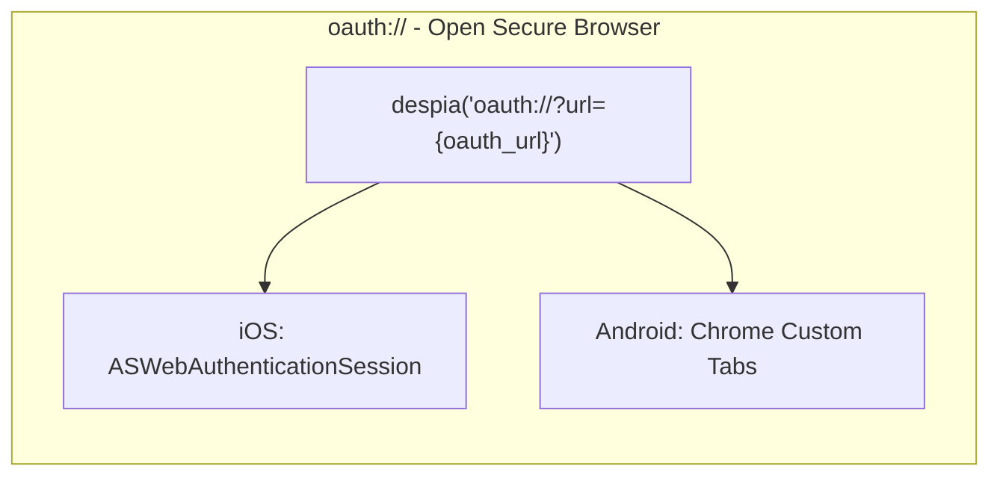
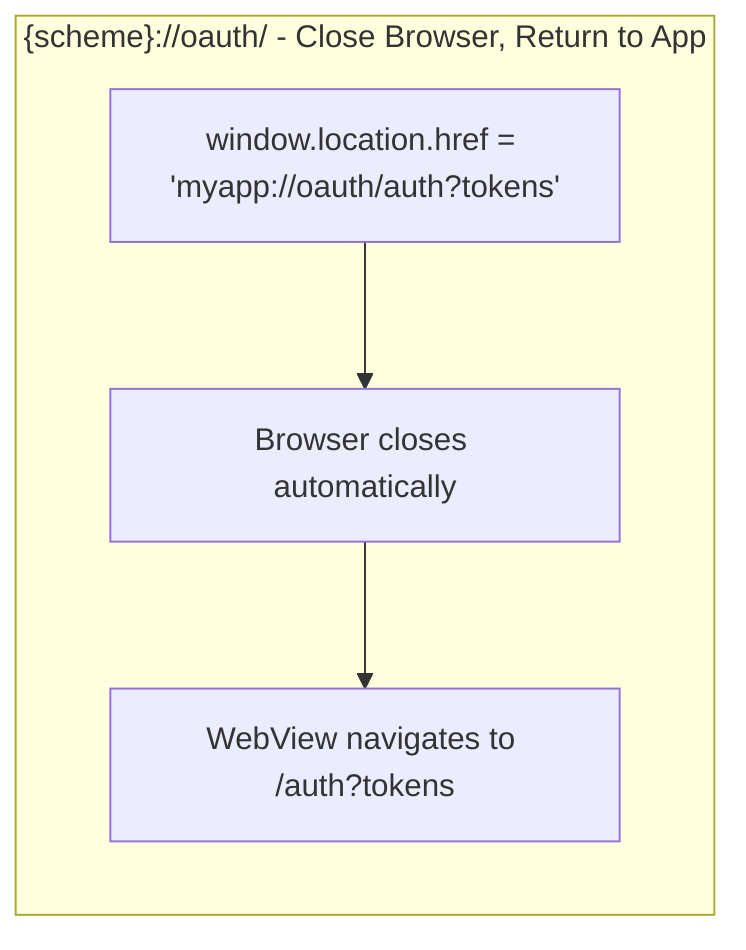
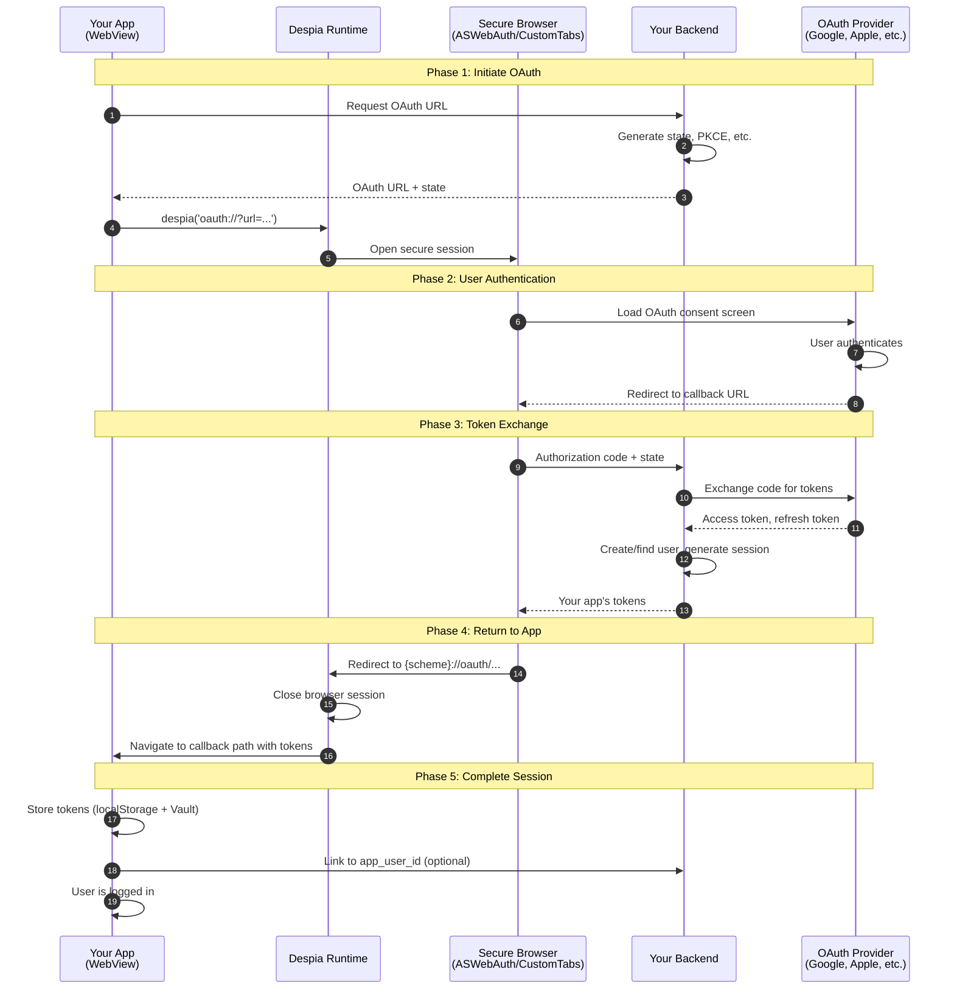
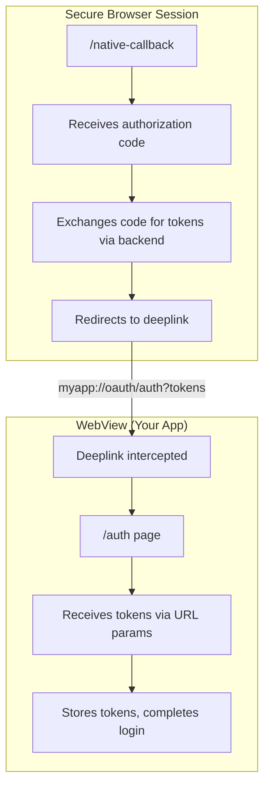
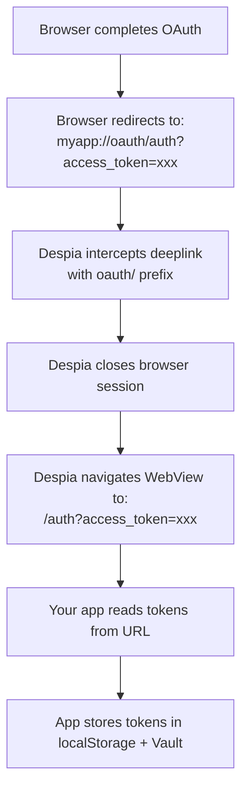
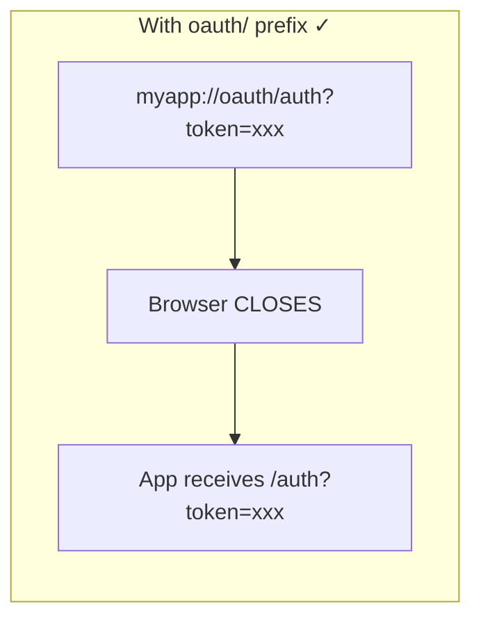
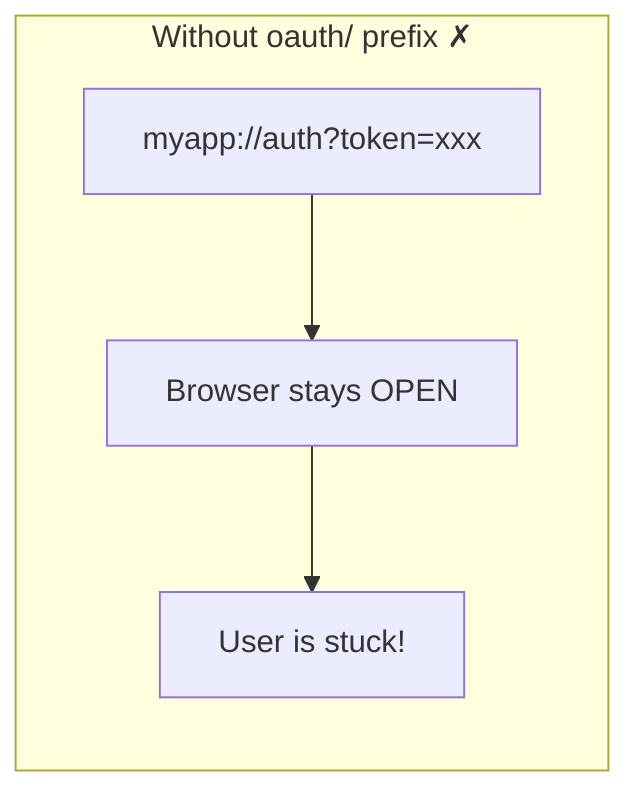
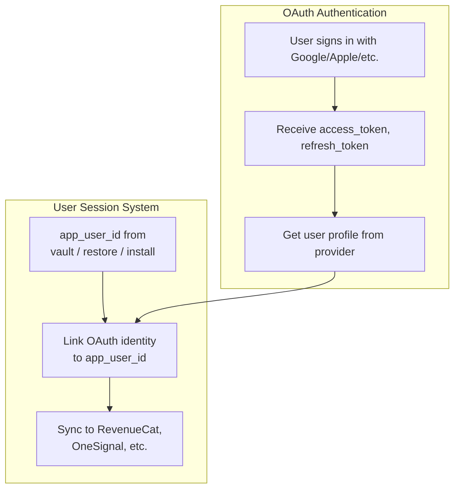
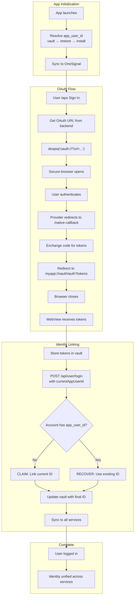

## Why Native Apps Need Special OAuth Handling

Web apps handle OAuth simply: redirect to provider → user authenticates → redirect back with tokens. But native apps face challenges:

| Challenge              | Why it matters                                                               |
| :--------------------- | :--------------------------------------------------------------------------- |
| No browser address bar | Users can't verify they're on the real provider's site (phishing risk)       |
| WebView restrictions   | Google and Apple block OAuth in embedded WebViews for security               |
| App Store requirements | iOS and Android require secure browser sessions for OAuth                    |
| Session isolation      | Tokens obtained in a browser session can't automatically transfer to the app |

**Solution:** Despia uses the platform's secure browser APIs:

- **iOS:** ASWebAuthenticationSession
- **Android:** Chrome Custom Tabs

These provide a trusted, isolated browser session that users recognize as secure.

## The Two Despia URL Protocols

Despia's OAuth mechanism relies on just two URL protocols:





**Everything else is standard OAuth.** Despia doesn't modify the OAuth protocol - it just provides secure transport.

## The Universal OAuth Flow



## Key Concepts

### 1. The Callback URL Split

In standard web OAuth, the callback URL is a single endpoint. In Despia, you need **two callback paths**:



### 2. State Preservation

The OAuth `state` parameter serves double duty:

1. **CSRF protection** (standard OAuth)
2. **Deeplink scheme** (Despia-specific)

Your backend should encode both:

```javascript
const state = {
  csrf: randomToken(),
  deeplink_scheme: 'myapp',  // Passed back to close browser correctly
  // ... any other data you need
};
```

### 3. Token Handoff

The secure browser and your WebView are **isolated**. Tokens obtained in the browser cannot be directly accessed by your app. The handoff happens via URL:



### 4. The oauth/ Prefix Requirement

The `oauth/` segment in the deeplink is **not just a path** - it's a signal to Despia:





| Deeplink                         | Result                                             |
| :------------------------------- | :------------------------------------------------- |
| `myapp://oauth/auth?token=xxx`   | ✓ Browser closes, app receives `/auth?token=xxx`   |
| `myapp://oauth/home`             | ✓ Browser closes, app receives `/home`             |
| `myapp://oauth/callback?foo=bar` | ✓ Browser closes, app receives `/callback?foo=bar` |
| `myapp://auth?token=xxx`         | ✗ Browser stays open (user stuck)                  |
| `myapp://home`                   | ✗ Browser stays open (user stuck)                  |

## Provider-Specific Considerations

While the Despia mechanism is universal, providers have quirks:

### Implicit vs Authorization Code Flow

| Flow               | How tokens arrive                  | Used by                  |
| :----------------- | :--------------------------------- | :----------------------- |
| Implicit           | URL fragment (`#access_token=xxx`) | Supabase/Google (legacy) |
| Authorization Code | Query param (`?code=xxx`)          | Most modern OAuth        |

Your `/native-callback` page must handle both:

```javascript
// Check for authorization code (standard)
const code = new URLSearchParams(window.location.search).get('code');

// Check for implicit flow tokens (URL fragment)
const hash = new URLSearchParams(window.location.hash.substring(1));
const accessToken = hash.get('access_token');
```

### Apple Sign In Differences

Apple has platform-specific behavior:

| Platform | Best approach                                            |
| :------- | :------------------------------------------------------- |
| iOS      | Apple JS SDK → Native Face ID dialog (no browser needed) |
| Android  | `oauth://` protocol → ASWebAuthenticationSession         |
| Web      | Apple JS SDK → Browser dialog                            |

On iOS, you can skip the `oauth://` flow entirely and use Apple's native dialog for instant authentication.

### Response Mode: form_post

Some providers (Apple on Android) use `response_mode=form_post`, which POSTs data to your backend instead of redirecting. Your backend then redirects to the deeplink:

```
Provider → POST to your backend → 302 redirect to myapp://oauth/auth?tokens
```

## Integration with User Session System

OAuth provides authentication. The Despia User Session system provides **identity persistence**. They work together:



The key integration point is the **login endpoint**:

```
sequenceDiagram
    participant App
    participant Backend
    
    App->>Backend: POST /api/user/login
    Note over App,Backend: accountId: "google_user_123"<br/>currentAppUserId: "device_abc"
    
    alt Account has no app_user_id
        Backend->>Backend: Link device_abc to account
        Backend-->>App: { appUserId: "device_abc", action: "claimed" }
    else Account already has app_user_id
        Backend-->>App: { appUserId: "existing_xyz", action: "recovered" }
    end
    
    App->>App: Update vault with final appUserId
    App->>App: Sync to OneSignal, RevenueCat
```

This links the OAuth identity to your `app_user_id`, ensuring RevenueCat purchases, OneSignal notifications, and other services follow the user across devices.

## Flow Diagram: Complete Picture



## Summary

| Concept              | What to remember                                           |
| :------------------- | :--------------------------------------------------------- |
| `oauth://`           | Opens secure browser (ASWebAuth / CustomTabs)              |
| `{scheme}://oauth/`  | Closes browser, the `oauth/` prefix is required            |
| `/native-callback`   | Runs in browser, exchanges code, redirects to deeplink     |
| `/auth` (or similar) | Runs in WebView, receives tokens, completes login          |
| State parameter      | Include deeplink scheme for proper browser closing         |
| Token handoff        | Via URL params in the deeplink redirect                    |
| Identity linking     | Connect OAuth identity to `app_user_id` via login endpoint |

The Despia OAuth mechanism is a **transport layer** - it securely moves the user through the OAuth flow and returns tokens to your app. What you do with those tokens (which provider, which backend, which database) is entirely up to you.