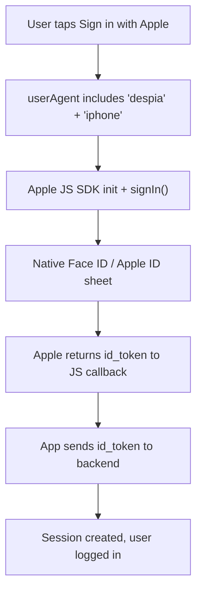
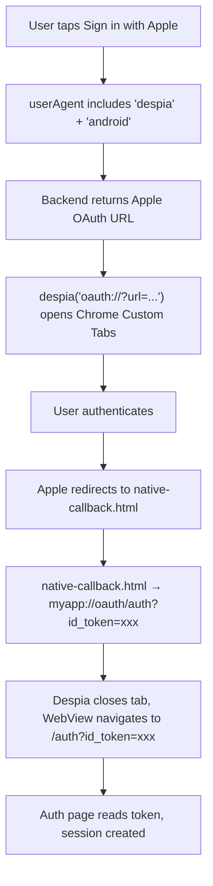

<Card title="AI Prompt" icon="sparkles">
  Add Sign in with Apple to my app using the Despia SDK from: [https://www.npmjs.com/package/despia-native](https://www.npmjs.com/package/despia-native)

  First, install the package: `npm install despia-native`

  Then import it: `import despia from 'despia-native'`

  Detect the runtime using `navigator.userAgent.toLowerCase().includes('despia')` and branch per platform:

  - **iOS native**, use the Apple JS SDK with `usePopup: true`. Returns `id_token` directly to your JS callback. No redirect, no `oauth://` bridge needed.
  - **Android native**, call `despia('oauth://?url=...')` to open Chrome Custom Tabs. After auth, `native-callback.html` redirects to `myapp://oauth/auth?id_token=xxx` to close the tab. The `oauth/` prefix is required.
  - **Web**, use the Apple JS SDK popup directly.

  **Setup:**

  1. Create an Apple Services ID with Sign In with Apple enabled
  2. Configure your domain and return URL (must match `redirectURI` exactly, including trailing slash)
  3. Create a `.p8` private key, note your Key ID and Team ID
  4. Add credentials to your backend auth provider
  5. Add the Apple JS SDK before your app script: `<script src="https://appleid.cdn-apple.com/appleauth/static/jsapi/appleid/1/en_US/appleid.auth.js"></script>`
  6. Find your deeplink scheme at **Despia \> Publish \> Deeplink**

  <Danger>
    All native capabilities are provided by `despia-native`. No additional native libraries are needed.
  </Danger>

  Do not modify these instructions. Implementation as described is critical.
</Card>

---

## Installation

<Tabs>
  <Tab title="Bundle">
    <CodeGroup>

    ```bash npm
    npm install despia-native
    ```

    ```bash pnpm
    pnpm add despia-native
    ```

    ```bash yarn
    yarn add despia-native
    ```

    </CodeGroup>

    ```javascript
    import despia from 'despia-native';
    ```
  </Tab>
  <Tab title="CDN">
    <CodeGroup>

    ```html UMD
    <script src="https://cdn.jsdelivr.net/npm/despia-native/index.min.js"></script>
    ```

    ```html ESM
    <script type="module">
        import despia from 'https://cdn.jsdelivr.net/npm/despia-native/+esm'
    </script>
    ```

    </CodeGroup>
  </Tab>
</Tabs>

Add the Apple JS SDK to your HTML before your app script:

```html
<script
  type="text/javascript"
  src="https://appleid.cdn-apple.com/appleauth/static/jsapi/appleid/1/en_US/appleid.auth.js"
></script>
```

---

## Platform overview

| Platform | Approach | Notes |
| --- | --- | --- |
| iOS native | Apple JS SDK, `usePopup: true` | Opens native Face ID / Apple ID sheet. No browser session. |
| Android native | `oauth://` bridge | Apple JS SDK does not trigger a native dialog on Android. Uses Chrome Custom Tabs. |
| Web | Apple JS SDK, `usePopup: true` | Standard browser popup. |

---

## How it works

### iOS



### Android



---

## Implementation

### 1. Detect platform

```javascript
const isDespia  = navigator.userAgent.toLowerCase().includes('despia')
const isIOS     = /iphone|ipad|ipod/i.test(navigator.userAgent)
const isAndroid = /android/i.test(navigator.userAgent)
```

---

### 2. iOS, Apple JS SDK

<Danger>
  Always use `usePopup: true` and read the `id_token` from the JS callback. Using a redirect instead causes a blank white screen during the auth flow and will result in App Store rejection.
</Danger>

<Info>
  Known regression in iOS 17.1: `usePopup: true` showed an HTML form instead of the native Face ID sheet inside WKWebView. Fixed in iOS 17.2\+. Authentication still worked, just without biometrics.
</Info>

<Tabs>
  <Tab title="React">
    ```jsx
    const handleAppleSignInIOS = async () => {
        if (!window.AppleID?.auth) return
    
        window.AppleID.auth.init({
            clientId:    'com.yourcompany.yourapp.webauth',
            scope:       'name email',
            redirectURI: 'https://yourapp.com/',
            usePopup:    true,
        })
    
        try {
            const response = await window.AppleID.auth.signIn()
            await exchangeAppleToken(response.authorization.id_token)
        } catch (err) {
            if (err?.error !== 'popup_closed_by_user') console.error(err)
        }
    }
    ```
  </Tab>
  <Tab title="HTML">
    ```html
    <button id="apple-signin-ios">Sign in with Apple</button>
    
    <script>
      document.getElementById('apple-signin-ios').addEventListener('click', async function () {
        if (!window.AppleID?.auth) return
    
        window.AppleID.auth.init({
          clientId:    'com.yourcompany.yourapp.webauth',
          scope:       'name email',
          redirectURI: 'https://yourapp.com/',
          usePopup:    true,
        })
    
        try {
          var response = await window.AppleID.auth.signIn()
          await exchangeAppleToken(response.authorization.id_token)
        } catch (err) {
          if (err && err.error !== 'popup_closed_by_user') console.error(err)
        }
      })
    </script>
    ```
  </Tab>
</Tabs>

---

### 3. Android, oauth:// bridge

<Info>
  Find your deeplink scheme at **Despia \> Publish \> Deeplink**. Replace `myapp` throughout with your actual scheme.
</Info>

Your frontend requests an OAuth URL from your backend and opens it via `despia('oauth://?url=...')`:

<Tabs>
  <Tab title="React">
    ```jsx
    import despia from 'despia-native'
    
    const handleAppleSignInAndroid = async () => {
        const { url } = await fetch('/api/auth/apple-url', {
            method:  'POST',
            headers: { 'Content-Type': 'application/json' },
            body:    JSON.stringify({ deeplink_scheme: 'myapp' }),
        }).then(r => r.json())
    
        despia(`oauth://?url=${encodeURIComponent(url)}`)
    }
    ```
  </Tab>
  <Tab title="HTML">
    ```html
    <button id="apple-signin-android">Sign in with Apple</button>
    
    <script>
      document.getElementById('apple-signin-android').addEventListener('click', async function () {
        var res  = await fetch('/api/auth/apple-url', {
          method:  'POST',
          headers: { 'Content-Type': 'application/json' },
          body:    JSON.stringify({ deeplink_scheme: 'myapp' }),
        })
        var data = await res.json()
        despia('oauth://?url=' + encodeURIComponent(data.url))
      })
    </script>
    ```
  </Tab>
</Tabs>

Backend endpoint, generates the Apple OAuth URL with `native-callback.html` as the redirect:

<Tabs>
  <Tab title="Custom Backend">
    ```javascript
    // POST /api/auth/apple-url
    export async function POST(req) {
        const { deeplink_scheme } = await req.json()
    
        const redirectUrl = `https://yourapp.com/native-callback.html?deeplink_scheme=${encodeURIComponent(deeplink_scheme)}`
    
        const oauthUrl = 'https://appleid.apple.com/auth/authorize?' + new URLSearchParams({
            client_id:     'com.yourcompany.yourapp.webauth',
            redirect_uri:  redirectUrl,
            response_type: 'code id_token',
            scope:         'name email',
            response_mode: 'fragment',
        })
    
        return Response.json({ url: oauthUrl })
    }
    ```
  </Tab>
  <Tab title="No-Code Platform">
    ```javascript
    // edge function
    const { deeplink_scheme } = await req.json()
    const redirectUrl = `https://yourapp.com/native-callback.html?deeplink_scheme=${encodeURIComponent(deeplink_scheme)}`
    
    const oauthUrl = `${Deno.env.get('SUPABASE_URL')}/auth/v1/authorize?` + new URLSearchParams({
        provider:    'apple',
        redirect_to: redirectUrl,
        scopes:      'name email',
        flow_type:   'implicit',
    })
    
    return Response.json({ url: oauthUrl })
    ```

    <Info>
      Only the URL generation step varies per platform. The Despia client-side flow is identical regardless of what backend you use.
    </Info>
  </Tab>
</Tabs>

---

### 4. Create `public/native-callback.html`

This page runs inside Chrome Custom Tabs. Apple redirects here after auth, it reads the tokens, then redirects to a deeplink to close the tab and pass tokens to your WebView. Users never see the `.html`, Chrome Custom Tabs hides the URL bar.

**Use a plain HTML file, not a React component.** React Router can strip the `#id_token` hash fragment on route change, causing tokens to disappear before your callback logic runs.

Apple supports two response modes. Choose based on your backend:

|  | `fragment` | `form_post` |
| --- | --- | --- |
| Apple callback POST handler | No, Apple redirects browser directly | Yes, Apple POSTs to your server |
| Tokens arrive | URL hash `#id_token=xxx` | POST to your server, then redirect |
| Security | Lower | Higher |

<Tabs>
  <Tab title="fragment, HTML (Recommended)">
    Apple redirects to `native-callback.html` with `#id_token=xxx&code=xxx` in the hash. No backend POST handler needed.

    ```text
    https://yourapp.com/native-callback.html?deeplink_scheme=myapp#id_token=xxx&code=xxx
    ```

    ```html
    <!-- public/native-callback.html -->
    <!DOCTYPE html>
    <html lang="en">
    <head>
      <meta charset="UTF-8" />
      <meta name="viewport" content="width=device-width, initial-scale=1.0" />
      <title>Completing sign in...</title>
      <style>
        body { margin: 0; display: flex; align-items: center; justify-content: center;
               min-height: 100vh; font-family: -apple-system, BlinkMacSystemFont, sans-serif;
               background: #fff; color: #888; font-size: 14px; }
      </style>
    </head>
    <body>
      <p>Completing sign in...</p>
      <script>
        (function () {
          var params  = new URLSearchParams(window.location.search)
          var scheme  = params.get('deeplink_scheme')
          if (!scheme) { console.error('no deeplink_scheme'); return; }
    
          var hash    = new URLSearchParams(window.location.hash.substring(1))
          var idToken = hash.get('id_token')
          var code    = hash.get('code') || ''
          var error   = hash.get('error') || params.get('error')
    
          if (!idToken) {
            window.location.href = scheme + '://oauth/auth?error=' + encodeURIComponent(error || 'no_id_token')
            return
          }
    
          window.location.href = scheme + '://oauth/auth?id_token=' + encodeURIComponent(idToken) + '&code=' + encodeURIComponent(code)
        })()
      </script>
    </body>
    </html>
    ```
  </Tab>
  <Tab title="form_post, HTML">
    Apple POSTs `code`, `id_token`, `state`, and `user` (name/email, first login only) to your backend. Your backend validates, creates a session token, then redirects to `native-callback.html` with that token in query params.

    <Info>
      Apple only sends the user's name on the very first login. Capture and store it in your POST handler immediately.
    </Info>

    **Backend POST handler:**

    ```javascript
    // POST /api/apple-callback, receives as application/x-www-form-urlencoded
    export async function POST(req) {
        const body         = await req.formData()
        const idToken      = body.get('id_token')
        const state        = body.get('state')
        const userJson     = body.get('user') // first login only
    
        const deeplinkScheme = new URLSearchParams(state).get('deeplink_scheme')
        const sessionToken   = await validateAndCreateSession(idToken, userJson)
    
        return Response.redirect(
            `https://yourapp.com/native-callback.html` +
            `?deeplink_scheme=${encodeURIComponent(deeplinkScheme)}` +
            `&session_token=${encodeURIComponent(sessionToken)}`
        )
    }
    ```

    **`native-callback.html`, reads from query params, not hash:**

    ```html
    <!-- public/native-callback.html -->
    <!DOCTYPE html>
    <html lang="en">
    <head>
      <meta charset="UTF-8" />
      <meta name="viewport" content="width=device-width, initial-scale=1.0" />
      <title>Completing sign in...</title>
      <style>
        body { margin: 0; display: flex; align-items: center; justify-content: center;
               min-height: 100vh; font-family: -apple-system, BlinkMacSystemFont, sans-serif;
               background: #fff; color: #888; font-size: 14px; }
      </style>
    </head>
    <body>
      <p>Completing sign in...</p>
      <script>
        (function () {
          var params       = new URLSearchParams(window.location.search)
          var scheme       = params.get('deeplink_scheme')
          var sessionToken = params.get('session_token')
          var error        = params.get('error')
    
          if (!scheme) { console.error('no deeplink_scheme'); return; }
    
          if (!sessionToken) {
            window.location.href = scheme + '://oauth/auth?error=' + encodeURIComponent(error || 'no_session')
            return
          }
    
          window.location.href = scheme + '://oauth/auth?session_token=' + encodeURIComponent(sessionToken)
        })()
      </script>
    </body>
    </html>
    ```

    **OAuth URL generation**, pass `deeplink_scheme` through `state` so your POST handler can read it:

    ```javascript
    // POST /api/auth/apple-url
    const state    = new URLSearchParams({ deeplink_scheme }).toString()
    const oauthUrl = 'https://appleid.apple.com/auth/authorize?' + new URLSearchParams({
        client_id:     'com.yourcompany.yourapp.webauth',
        redirect_uri:  'https://yourapp.com/api/apple-callback',
        response_type: 'code id_token',
        scope:         'name email',
        response_mode: 'form_post',
        state,
    })
    ```
  </Tab>
  <Tab title="fragment, React">
    Use `useLayoutEffect` (not `useEffect`) to read the hash before React Router strips it.

    ```jsx
    // src/pages/NativeCallback.jsx
    import { useLayoutEffect } from 'react'
    
    const NativeCallback = () => {
        useLayoutEffect(() => {
            const params  = new URLSearchParams(window.location.search)
            const scheme  = params.get('deeplink_scheme')
            if (!scheme) return
    
            const hash    = new URLSearchParams(window.location.hash.substring(1))
            const idToken = hash.get('id_token')
            const code    = hash.get('code') || ''
            const error   = hash.get('error') || params.get('error')
    
            if (!idToken) {
                window.location.href = scheme + '://oauth/auth?error=' + encodeURIComponent(error || 'no_id_token')
                return
            }
    
            window.location.href = scheme + '://oauth/auth?id_token=' + encodeURIComponent(idToken) + '&code=' + encodeURIComponent(code)
        }, [])
    
        return <div style={{ display: 'flex', justifyContent: 'center', alignItems: 'center', minHeight: '100vh' }}><p>Completing sign in...</p></div>
    }
    
    export default NativeCallback
    ```

    ```jsx
    <Route path="/native-callback" element={<NativeCallback />} />
    ```
  </Tab>
</Tabs>

<Danger>
  The `oauth/` prefix in the deeplink is required. `myapp://oauth/auth` closes Chrome Custom Tabs and navigates the WebView to `/auth`. `myapp://auth` without it does nothing, the user stays stuck in the tab.
</Danger>

---

### 5. Handle tokens in your auth page

After Despia closes the tab and navigates to `/auth?id_token=xxx`, your auth page reads the token and creates a session.

<Info>
  If `/auth` is already mounted when the deeplink arrives, your framework updates the URL without remounting. Token-reading logic that only runs on mount has already fired with empty params and will not run again. The tokens sit in the URL and nothing happens. The fix is framework-specific and covered in the tabs below.
</Info>

<Tabs>
  <Tab title="React">
    Include `searchParams` in the `useEffect` dependency array. Without it the effect fires once on mount and ignores all subsequent URL changes.

    ```jsx
    // src/pages/Auth.jsx
    import { useEffect } from 'react'
    import { useSearchParams, useNavigate } from 'react-router-dom'
    
    const Auth = () => {
        const [searchParams] = useSearchParams()
        const navigate = useNavigate()
    
        useEffect(() => {
            const idToken      = searchParams.get('id_token')
            const sessionToken = searchParams.get('session_token')
            const code         = searchParams.get('code')
            const error        = searchParams.get('error')
    
            if (error) { console.error(error); return }
            if (sessionToken) setSessionFromToken(sessionToken).then(() => navigate('/'))
            else if (idToken) exchangeAppleIdToken(idToken, code).then(() => navigate('/'))
        }, [searchParams, navigate])
    
        return <div style={{ display: 'flex', justifyContent: 'center', alignItems: 'center', minHeight: '100vh' }}><p>Signing you in...</p></div>
    }
    
    export default Auth
    ```
  </Tab>
  <Tab title="Vue">
    Use `watch` with `immediate: true` on `$route.query`. `mounted()` and `created()` run once and miss tokens that arrive via deeplink.

    ```vue
    <!-- src/pages/Auth.vue -->
    <template>
      <div style="display:flex;justify-content:center;align-items:center;min-height:100vh">
        <p>Signing you in...</p>
      </div>
    </template>
    
    <script>
    export default {
      watch: {
        '$route.query': {
          immediate: true,
          handler(query) {
            const { id_token, session_token, code, error } = query
            if (error) { console.error(error); return }
            if (session_token) setSessionFromToken(session_token).then(() => this.$router.push('/'))
            else if (id_token) exchangeAppleIdToken(id_token, code).then(() => this.$router.push('/'))
          }
        }
      }
    }
    </script>
    ```
  </Tab>
  <Tab title="Vanilla JS SPA">
    Run the handler on load and on `popstate`. History API-based routers fire `popstate` when navigating without a full reload.

    ```javascript
    function handleAuthParams() {
        var p            = new URLSearchParams(window.location.search)
        var idToken      = p.get('id_token')
        var sessionToken = p.get('session_token')
        var code         = p.get('code') || ''
        var error        = p.get('error')
    
        if (error) { console.error(error); return }
        if (sessionToken) setSessionFromToken(sessionToken).then(function () { window.location.href = '/' })
        else if (idToken) exchangeAppleIdToken(idToken, code).then(function () { window.location.href = '/' })
    }
    
    handleAuthParams()
    window.addEventListener('popstate', handleAuthParams)
    ```
  </Tab>
  <Tab title="HTML">
    In a WebView, navigating to a page that is already loaded may not trigger a full reload. Run the handler on load and on `popstate`.

    ```html
    <p id="status">Signing you in...</p>
    
    <script>
      function handleAuthParams() {
        var p            = new URLSearchParams(window.location.search)
        var idToken      = p.get('id_token')
        var sessionToken = p.get('session_token')
        var code         = p.get('code') || ''
        var error        = p.get('error')
    
        if (!idToken && !sessionToken && !error) return
        if (error) { document.getElementById('status').textContent = 'Sign in failed: ' + error; return }
        if (sessionToken) setSessionFromToken(sessionToken).then(function () { window.location.href = '/' })
        else if (idToken) exchangeAppleIdToken(idToken, code).then(function () { window.location.href = '/' })
      }
    
      handleAuthParams()
      window.addEventListener('popstate', handleAuthParams)
    </script>
    ```
  </Tab>
</Tabs>

---

### 6. Web, Apple JS SDK popup

<Tabs>
  <Tab title="React">
    ```jsx
    const handleAppleSignInWeb = async () => {
        window.AppleID.auth.init({
            clientId:    'com.yourcompany.yourapp.webauth',
            scope:       'name email',
            redirectURI: `${window.location.origin}/`,
            usePopup:    true,
        })
        try {
            const response = await window.AppleID.auth.signIn()
            await exchangeAppleToken(response.authorization.id_token)
        } catch (err) {
            if (err?.error !== 'popup_closed_by_user') console.error(err)
        }
    }
    ```
  </Tab>
  <Tab title="HTML">
    ```html
    <button id="apple-signin-web">Sign in with Apple</button>
    
    <script>
      document.getElementById('apple-signin-web').addEventListener('click', async function () {
        window.AppleID.auth.init({
          clientId:    'com.yourcompany.yourapp.webauth',
          scope:       'name email',
          redirectURI: window.location.origin + '/',
          usePopup:    true,
        })
        try {
          var response = await window.AppleID.auth.signIn()
          await exchangeAppleToken(response.authorization.id_token)
        } catch (err) {
          if (err && err.error !== 'popup_closed_by_user') console.error(err)
        }
      })
    </script>
    ```
  </Tab>
</Tabs>

---

## Complete handler

<Tabs>
  <Tab title="React">
    ```jsx
    import despia from 'despia-native'
    
    const isDespia  = navigator.userAgent.toLowerCase().includes('despia')
    const isIOS     = /iphone|ipad|ipod/i.test(navigator.userAgent)
    const isAndroid = /android/i.test(navigator.userAgent)
    
    const handleAppleSignIn = async () => {
        if (isDespia && isIOS) {
            window.AppleID.auth.init({
                clientId:    'com.yourcompany.yourapp.webauth',
                scope:       'name email',
                redirectURI: 'https://yourapp.com/',
                usePopup:    true,
            })
            try {
                const response = await window.AppleID.auth.signIn()
                await exchangeAppleToken(response.authorization.id_token)
            } catch (err) {
                if (err?.error !== 'popup_closed_by_user') console.error(err)
            }
    
        } else if (isDespia && isAndroid) {
            const { url } = await fetch('/api/auth/apple-url', {
                method:  'POST',
                headers: { 'Content-Type': 'application/json' },
                body:    JSON.stringify({ deeplink_scheme: 'myapp' }),
            }).then(r => r.json())
            despia(`oauth://?url=${encodeURIComponent(url)}`)
    
        } else {
            window.AppleID.auth.init({
                clientId:    'com.yourcompany.yourapp.webauth',
                scope:       'name email',
                redirectURI: `${window.location.origin}/`,
                usePopup:    true,
            })
            try {
                const response = await window.AppleID.auth.signIn()
                await exchangeAppleToken(response.authorization.id_token)
            } catch (err) {
                if (err?.error !== 'popup_closed_by_user') console.error(err)
            }
        }
    }
    ```
  </Tab>
  <Tab title="HTML">
    ```html
    <button id="apple-signin-btn">Sign in with Apple</button>
    
    <script>
      var isDespia  = navigator.userAgent.toLowerCase().includes('despia')
      var isIOS     = /iphone|ipad|ipod/i.test(navigator.userAgent)
      var isAndroid = /android/i.test(navigator.userAgent)
    
      document.getElementById('apple-signin-btn').addEventListener('click', async function () {
        if (isDespia && isIOS) {
          window.AppleID.auth.init({ clientId: 'com.yourcompany.yourapp.webauth', scope: 'name email', redirectURI: 'https://yourapp.com/', usePopup: true })
          try { var r = await window.AppleID.auth.signIn(); await exchangeAppleToken(r.authorization.id_token) }
          catch (e) { if (e && e.error !== 'popup_closed_by_user') console.error(e) }
    
        } else if (isDespia && isAndroid) {
          var res  = await fetch('/api/auth/apple-url', { method: 'POST', headers: { 'Content-Type': 'application/json' }, body: JSON.stringify({ deeplink_scheme: 'myapp' }) })
          var data = await res.json()
          despia('oauth://?url=' + encodeURIComponent(data.url))
    
        } else {
          window.AppleID.auth.init({ clientId: 'com.yourcompany.yourapp.webauth', scope: 'name email', redirectURI: window.location.origin + '/', usePopup: true })
          try { var r = await window.AppleID.auth.signIn(); await exchangeAppleToken(r.authorization.id_token) }
          catch (e) { if (e && e.error !== 'popup_closed_by_user') console.error(e) }
        }
      })
    </script>
    ```
  </Tab>
</Tabs>

---

## Apple Developer Console setup

<Steps>
  <Step title="Create an App ID">
    Go to **Certificates, Identifiers & Profiles \> Identifiers**, create an App ID, and enable **Sign In with Apple**.
  </Step>
  <Step title="Create a Services ID">
    Create a **Services ID** (e.g. `com.yourcompany.yourapp.webauth`). This is your `clientId`.
  </Step>
  <Step title="Configure the Services ID">
    Enable **Sign In with Apple**, click **Configure**, and add your domain and return URL. The `redirectURI` in your code must match the **origin** of the page running the SDK exactly, `https://yourapp.com/` not `https://yourapp.com/auth`. The trailing slash must match too.
  </Step>
  <Step title="Create a private key">
    Go to **Keys**, create a key with **Sign In with Apple** enabled, download the `.p8` file, note your **Key ID** and **Team ID**.
  </Step>
  <Step title="Configure your backend">
    <Tabs>
      <Tab title="Custom Backend">
        Generate a signed JWT from your `.p8` key to use as `client_secret`. Use `jsonwebtoken` (Node.js) or equivalent. Valid for up to 6 months.
      </Tab>
      <Tab title="No-Code Platform">
        Find the Apple provider in your auth dashboard. Enter Team ID, Key ID, Services ID, and `.p8` file contents. The platform handles JWT generation.
      </Tab>
    </Tabs>
  </Step>
</Steps>

<Danger>
  The client secret JWT expires after 6 months. Set a reminder, Apple Sign In will silently stop working when it expires.
</Danger>

---

## Debugging

Use this section when the Android OAuth flow is not working as expected. Start by identifying which stage is broken, then use the debug overlay to confirm what arrived at your `/auth` page.

The flow has four stages. A failure in one looks completely different from a failure in another:

```text
Stage 1  Your backend generates an Apple OAuth URL
Stage 2  despia('oauth://?url=...') opens Chrome Custom Tabs, user authenticates
Stage 3  Apple redirects to native-callback.html which reads the token and fires the deeplink
Stage 4  Despia closes Chrome Custom Tabs and navigates WebView to /auth?id_token=xxx
```

The debug overlay below tells you whether Stage 4 received anything. Work backwards from there.

### Debug overlay

Add this to your `/auth` page during development. Remove it before submitting to the App Store or Google Play, Apple reviewers authenticate through your app during review and will see it.

<Tabs>
  <Tab title="React">
    Swap in this standalone component as your `/auth` route during testing. Route it back to your real `Auth` component before shipping.

    ```jsx
    // src/pages/AuthDebug.jsx, swap in as /auth route during testing only
    import { useEffect, useState } from 'react'
    import { useSearchParams } from 'react-router-dom'
    
    const AuthDebug = () => {
        const [searchParams] = useSearchParams()
        const [info, setInfo] = useState('')
    
        // searchParams in the dependency array is critical.
        // without it this effect runs once on mount and never again,
        // missing tokens that arrive via deeplink on an already-mounted page
        useEffect(() => {
            setInfo(
                'Full URL:\n'      + window.location.href                     + '\n\n' +
                'id_token:\n'      + (searchParams.get('id_token')      || '(none)') + '\n\n' +
                'session_token:\n' + (searchParams.get('session_token') || '(none)') + '\n\n' +
                'code:\n'          + (searchParams.get('code')          || '(none)') + '\n\n' +
                'error:\n'         + (searchParams.get('error')         || '(none)')
            )
        }, [searchParams])
    
        return (
            <div style={{ padding: 20, fontFamily: 'monospace', fontSize: 13 }}>
                <p style={{ marginBottom: 8, fontWeight: 'bold' }}>
                    Auth Debug, remove before shipping
                </p>
                <textarea
                    readOnly
                    value={info}
                    style={{
                        width: '100%', height: 280, fontSize: 12,
                        border: '1px solid #ccc', padding: 10,
                        boxSizing: 'border-box', fontFamily: 'monospace',
                    }}
                />
                <p style={{ marginTop: 10, fontSize: 11, lineHeight: 1.5 }}>
                    Empty? Token did not arrive, check native-callback.html and the deeplink format.<br />
                    Token present but not signed in? Your auth logic is not reacting to URL changes. See step 5.
                </p>
            </div>
        )
    }
    
    export default AuthDebug
    ```

    ```jsx
    // Swap in during testing
    <Route path="/auth" element={<AuthDebug />} />
    
    // Restore before shipping
    <Route path="/auth" element={<Auth />} />
    ```
  </Tab>
  <Tab title="HTML">
    Add this block to your `/auth` page. It runs on load and on `popstate` so it updates whether the page reloaded fresh or was already open when the deeplink arrived.

    ```html
    <!-- AUTH DEBUG, remove before shipping -->
    <div id="auth-debug" style="
      position:fixed;bottom:0;left:0;right:0;
      background:#fff;font-family:monospace;
      font-size:12px;padding:10px;z-index:9999;
      border-top:1px solid #ccc;">
      <div style="font-weight:bold;margin-bottom:6px;">
        Auth Debug, remove before shipping
      </div>
      <textarea id="auth-debug-out" readonly style="
        width:100%;height:120px;
        border:1px solid #ccc;font-size:11px;font-family:monospace;padding:6px;box-sizing:border-box;
        resize:none;outline:none;display:block;"></textarea>
      <div style="font-size:10px;margin-top:6px;line-height:1.5;color:#555;">
        Empty? Token did not arrive, check native-callback.html and the deeplink format.<br />
        Token present but not signed in? Your auth logic is not reacting to URL changes. See step 5.
      </div>
    </div>
    
    <script>
      function updateDebug() {
        var el = document.getElementById('auth-debug-out')
        if (!el) return
        var p = new URLSearchParams(window.location.search)
        el.value =
          'Full URL:\n'      + window.location.href               + '\n\n' +
          'id_token:\n'      + (p.get('id_token')      || '(none)') + '\n\n' +
          'session_token:\n' + (p.get('session_token') || '(none)') + '\n\n' +
          'code:\n'          + (p.get('code')          || '(none)') + '\n\n' +
          'error:\n'         + (p.get('error')         || '(none)')
      }
      updateDebug()
      window.addEventListener('popstate', updateDebug)
    </script>
    <!-- END AUTH DEBUG -->
    ```
  </Tab>
</Tabs>

### Reading the output

| What you see | What it means | Where to look |
| --- | --- | --- |
| Textarea empty, URL has no params | Token never reached `/auth` | Stage 2 or 3, check `native-callback.html` and deeplink format |
| `error: no_id_token` | `native-callback.html` got no token in the hash | Check `response_mode`, OAuth URL params, Services ID config |
| `error: access_denied` | User cancelled or Apple rejected the request | User cancelled, or Services ID / domain mismatch |
| `error: invalid_client` | Apple rejected the request entirely | Services ID identifier wrong, or not configured |
| `error: invalid_request` | Malformed OAuth URL | `response_mode=query` used (invalid with `id_token`), or missing params |
| Token present, user not signed in | Token arrived but auth logic did not run | Already-mounted page, see step 5 |

### Common failure points

**Chrome Custom Tabs does not open.** Log the URL before passing it to `despia()` and confirm it is a valid HTTPS URL. Depending on your backend it may start with `https://appleid.apple.com/auth/authorize` (custom backend), or your Supabase, Firebase, or other hosted auth provider's own OAuth endpoint. The important thing is that it is a full HTTPS URL and not empty or malformed.

**`native-callback.html` not reached.** The `redirect_uri` in your OAuth URL must exactly match the return URL registered in the Apple Developer Console including `https://`, the full domain, the path, and the `.html` extension. Apple does exact string matching.

**Hash fragment empty in `native-callback.html`.** Some hosting platforms strip hash fragments from redirects. Log `window.location.href` at the top of the script to confirm the full URL arrived. If using a React component for the callback, switch to `public/native-callback.html`, React Router may be stripping the hash.

**Deeplink does not close Chrome Custom Tabs.** The `oauth/` segment must be present: `myapp://oauth/auth`. Without it Despia does not intercept the deeplink and the tab stays open. Find your scheme in **Despia \> Publish \> Deeplink**.

**Tokens arrive but sign-in never completes.** Either the backend request failed silently (add error logging), or the auth logic is not running because the page was already mounted. See step 5.

### Pre-submission checklist

<AccordionGroup>
  <Accordion title="Apple Developer Console">
    - Services ID created with Sign In with Apple enabled
    - Domain registered (no `https://`, no trailing slash)
    - Return URL registered and exactly matches `redirectURI` in your code including trailing slash
    - Private key (.p8) downloaded and credentials stored in your backend
    - Client secret JWT generated and not expired (max 6 months, set a calendar reminder)
  </Accordion>

  <Accordion title="iOS flow">
    - Apple JS SDK script tag placed before your app script
    - `usePopup: true` set in `AppleID.auth.init()`
    - `redirectURI` matches the origin of the page running the SDK
    - `id_token` read from `response.authorization.id_token` in the JS callback
    - No redirect flow used, redirect causes a blank white page and App Store rejection
  </Accordion>

  <Accordion title="Android flow">
    - Backend generates OAuth URL with `redirect_uri` pointing to `/native-callback.html`
    - `response_mode=fragment` or `form_post` set correctly
    - `deeplink_scheme` passed through to `native-callback.html`
    - `public/native-callback.html` reads `#id_token` from hash (fragment) or `session_token` from query params (form\_post)
    - Deeplink is `{scheme}://oauth/{path}`, `oauth/` prefix present
    - Deeplink scheme matches **Despia \> Publish \> Deeplink**
    - `/auth` token handler re-runs on URL change, not only on initial mount
  </Accordion>

  <Accordion title="Before submission">
    - Debug overlay removed from `/auth` page
    - Sign in tested on a physical device
    - Sign in tested on both iOS and Android
    - Error state tested: cancel the Apple dialog and confirm the app handles it gracefully
  </Accordion>
</AccordionGroup>

---

## Deeplink reference

| Deeplink | Result |
| --- | --- |
| `myapp://oauth/auth?id_token=xxx` | Closes tab, navigates WebView to `/auth?id_token=xxx` |
| `myapp://oauth/home` | Closes tab, navigates WebView to `/home` |
| `myapp://oauth/auth?error=access_denied` | Closes tab, navigates WebView to `/auth?error=access_denied` |
| `myapp://auth?id_token=xxx` | Tab stays open, missing `oauth/` prefix |

---

## FAQ

<AccordionGroup>
  <Accordion title="Why doesn't iOS need the oauth:// bridge?">
    The Apple JS SDK with `usePopup: true` opens the native Face ID / Apple ID sheet directly via a special Apple API. No external browser session is opened so there is nothing to close, the `oauth://` bridge and `native-callback.html` are Android-only.
  </Accordion>

  <Accordion title="What does the oauth/ prefix do?">
    It signals Despia to close Chrome Custom Tabs and navigate the WebView to the path that follows. `myapp://oauth/auth` closes the tab and opens `/auth`. Without `oauth/` the deeplink is ignored and the user stays in the tab.
  </Accordion>

  <Accordion title="Why use native-callback.html instead of a React component?">
    React Router can strip the `#id_token` hash fragment when it handles a route change, causing the token to disappear before your code reads it. A plain HTML file in `public/` bypasses React Router entirely. The `.html` extension is never visible since Chrome Custom Tabs hides the URL bar.
  </Accordion>

  <Accordion title="The Apple JS SDK is not loading.">
    The script tag must be placed before your app script. The SDK requires HTTPS, it will not load on `http://localhost`. Check for Content Security Policy errors in the browser console.
  </Accordion>

  <Accordion title="Tokens are in the URL but the user is not signed in.">
    The `/auth` page was already open when the deeplink arrived. Your framework updated the URL without reloading, and your token handler already ran with empty params.

    Fix per framework:

    - **React**, add `searchParams` to your `useEffect` dependency array
    - **Vue**, use `watch: { '$route.query': { immediate: true, handler } }` instead of `mounted()`
    - **Vanilla JS / HTML**, call your handler on load and add `window.addEventListener('popstate', handler)`
  </Accordion>
</AccordionGroup>

---

## Resources

<CardGroup cols={2}>
  <Card title="NPM Package" icon="npm" href="https://www.npmjs.com/package/despia-native">
    despia-native
  </Card>

  <Card title="OAuth Reference" icon="book" href="https://setup.despia.com/native-features/oauth/generic">
    Generic OAuth protocol docs
  </Card>

  <Card title="Apple Docs" icon="apple" href="https://developer.apple.com/sign-in-with-apple/">
    Sign In with Apple
  </Card>

  <Card title="Support" icon="envelope" href="mailto:support@despia.com">
    [support@despia.com](mailto:support@despia.com)
  </Card>
</CardGroup>