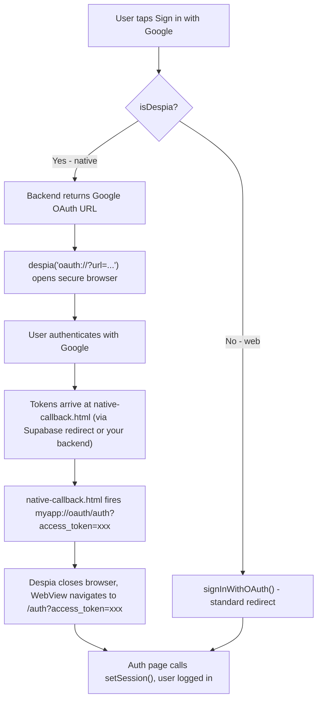

<Card title="AI Prompt" icon="sparkles">
  Add Sign in with Google to my app using the Despia SDK from: [https://www.npmjs.com/package/despia-native](https://www.npmjs.com/package/despia-native)

  First, install the package: `npm install despia-native`

  Then import it: `import despia from 'despia-native'`

  Detect the runtime using `navigator.userAgent.toLowerCase().includes('despia')` and branch per platform:

  - **Native (iOS and Android)**, call `despia('oauth://?url=...')` to open the OAuth flow in a secure browser session. On iOS this opens ASWebAuthenticationSession, on Android Chrome Custom Tabs. After auth, `native-callback.html` reads `#access_token` from the URL hash and redirects to `myapp://oauth/auth?access_token=xxx` to close the session. The `oauth/` prefix is required.
  - **Web**, use `signInWithOAuth()` from your auth provider directly. No edge function or `oauth://` bridge needed.

  **Setup:**

  1. Create a Google OAuth application in Google Cloud Console
  2. Add your Google Client ID and Client Secret to your auth provider (Supabase, Firebase, etc.)
  3. Add your app domain and auth callback URL to the allowed redirect URIs in Google Cloud Console
  4. Find your deeplink scheme at **Despia \> Publish \> Deeplink**

  <Danger>
    All native capabilities are provided by `despia-native`. No additional native libraries are needed.
  </Danger>

  Do not modify these instructions. Implementation as described is critical.
</Card>

---

## Installation

<Tabs>
  <Tab title="Bundle">
    <CodeGroup>

    ```bash npm
    npm install despia-native
    ```

    ```bash pnpm
    pnpm add despia-native
    ```

    ```bash yarn
    yarn add despia-native
    ```

    </CodeGroup>

    ```javascript
    import despia from 'despia-native';
    ```
  </Tab>
  <Tab title="CDN">
    <CodeGroup>

    ```html UMD
    <script src="https://cdn.jsdelivr.net/npm/despia-native/index.min.js"></script>
    ```

    ```html ESM
    <script type="module">
        import despia from 'https://cdn.jsdelivr.net/npm/despia-native/+esm'
    </script>
    ```

    </CodeGroup>
  </Tab>
</Tabs>

---

## Platform overview

| Platform | Approach | Notes |
| --- | --- | --- |
| iOS native | `oauth://` bridge | Opens ASWebAuthenticationSession |
| Android native | `oauth://` bridge | Opens Chrome Custom Tabs |
| Web | `signInWithOAuth()` | Standard browser redirect, no bridge needed |

Unlike Apple Sign In, Google uses the same `oauth://` bridge on both iOS and Android. There is no platform split in your sign-in code.

---

## How it works



---

## Implementation

### 1. Detect platform

```javascript
const isDespia = navigator.userAgent.toLowerCase().includes('despia')
```

---

### 2. Sign in button

<Tabs>
  <Tab title="React">
    ```jsx
    import despia from 'despia-native'
    
    const handleGoogleSignIn = async () => {
        const isDespia = navigator.userAgent.toLowerCase().includes('despia')
    
        if (isDespia) {
            // Native: get OAuth URL from your backend and open in secure browser
            const { url } = await fetch('/api/auth/google-url', {
                method:  'POST',
                headers: { 'Content-Type': 'application/json' },
                body:    JSON.stringify({ deeplink_scheme: 'myapp' }), // Despia > Publish > Deeplink
            }).then(r => r.json())
    
            despia(`oauth://?url=${encodeURIComponent(url)}`)
    
        } else {
            // Web: standard OAuth redirect, no bridge needed
            // Call your auth provider's OAuth method e.g. supabase.auth.signInWithOAuth(), firebase signInWithPopup(), auth0.loginWithRedirect()
            await yourAuthProvider.signInWithGoogle({ redirectTo: window.location.origin + '/auth' })
        }
    }
    ```
  </Tab>
  <Tab title="HTML">
    ```html
    <button id="google-signin-btn">Sign in with Google</button>
    
    <script>
      document.getElementById('google-signin-btn').addEventListener('click', async function () {
        var isDespia = navigator.userAgent.toLowerCase().includes('despia')
    
        if (isDespia) {
          var res  = await fetch('/api/auth/google-url', {
            method:  'POST',
            headers: { 'Content-Type': 'application/json' },
            body:    JSON.stringify({ deeplink_scheme: 'myapp' }), // Despia > Publish > Deeplink
          })
          var data = await res.json()
          despia('oauth://?url=' + encodeURIComponent(data.url))
    
        } else {
          // Web: standard OAuth redirect
          // Call your auth provider's OAuth method e.g. supabase.auth.signInWithOAuth(), firebase signInWithPopup(), auth0.loginWithRedirect()
          yourAuthProvider.signInWithGoogle({ redirectTo: window.location.origin + '/auth' })
        }
      })
    </script>
    ```
  </Tab>
</Tabs>

---

### 3. Backend: generate OAuth URL

Your backend generates a Google OAuth URL with `native-callback.html` as the redirect target. How you do this depends on your setup:

<Info>
  Find your deeplink scheme at **Despia \> Publish \> Deeplink**. Replace `myapp` throughout with your actual scheme.
</Info>

<Tabs>
  <Tab title="Custom Backend">
    For a fully custom backend, use the **authorization code flow with PKCE**. Do not use `response_type=token` (the OAuth implicit grant), which is deprecated and rejected by Google for security reasons.

    This flow is compatible with `native-callback.html`. Chrome Custom Tabs follows the full redirect chain inside the same session: Google redirects to your backend callback, your backend exchanges the code for tokens, then your backend redirects the browser to `native-callback.html` with the tokens. `native-callback.html` fires the deeplink to close the tab exactly the same way.

    ```text
    Chrome Custom Tabs:
      Google → /api/auth/google-callback?code=xxx (your backend)
             → backend exchanges code for tokens
             → backend redirects to native-callback.html with tokens in hash
             → native-callback.html fires myapp://oauth/auth?access_token=xxx
             → Despia closes Chrome Custom Tabs
    ```

    ```javascript
    // POST /api/auth/google-url
    // Returns a Google OAuth URL using authorization code + PKCE
    import crypto from 'crypto'
    
    export async function POST(req) {
        const { deeplink_scheme } = await req.json()
    
        // Generate PKCE values
        const codeVerifier  = crypto.randomBytes(32).toString('base64url')
        const codeChallenge = crypto.createHash('sha256').update(codeVerifier).digest('base64url')
    
        // Store codeVerifier and deeplink_scheme server-side (session, cache, etc.)
        // You will need them in your callback handler to exchange the code for tokens
        await storeOAuthState({ codeVerifier, deeplink_scheme })
    
        const redirectUri = 'https://yourapp.com/api/auth/google-callback'
    
        const oauthUrl = 'https://accounts.google.com/o/oauth2/v2/auth?' + new URLSearchParams({
            client_id:             process.env.GOOGLE_CLIENT_ID,
            redirect_uri:          redirectUri,
            response_type:         'code',
            scope:                 'openid email profile',
            code_challenge:        codeChallenge,
            code_challenge_method: 'S256',
        })
    
        return Response.json({ url: oauthUrl })
    }
    
    // GET /api/auth/google-callback
    // Google redirects here with ?code=xxx after authentication
    export async function GET(req) {
        const { searchParams } = new URL(req.url)
        const code = searchParams.get('code')
    
        const { codeVerifier, deeplink_scheme } = await retrieveOAuthState()
    
        // Exchange code for tokens
        const tokenRes = await fetch('https://oauth2.googleapis.com/token', {
            method: 'POST',
            headers: { 'Content-Type': 'application/x-www-form-urlencoded' },
            body: new URLSearchParams({
                code,
                client_id:     process.env.GOOGLE_CLIENT_ID,
                client_secret: process.env.GOOGLE_CLIENT_SECRET,
                redirect_uri:  'https://yourapp.com/api/auth/google-callback',
                grant_type:    'authorization_code',
                code_verifier: codeVerifier,
            }),
        })
        const { access_token, refresh_token } = await tokenRes.json()
    
        // Redirect browser to native-callback.html with tokens
        return Response.redirect(
            `https://yourapp.com/native-callback.html` +
            `?deeplink_scheme=${encodeURIComponent(deeplink_scheme)}` +
            `#access_token=${encodeURIComponent(access_token)}` +
            `&refresh_token=${encodeURIComponent(refresh_token || '')}`
        )
    }
    ```
  </Tab>
  <Tab title="No-Code Platform">
    ```javascript
    // edge function example (Supabase)
    const { deeplink_scheme } = await req.json()
    const redirectUrl = `https://yourapp.com/native-callback.html?deeplink_scheme=${encodeURIComponent(deeplink_scheme)}`
    
    const oauthUrl = `${Deno.env.get('SUPABASE_URL')}/auth/v1/authorize?` + new URLSearchParams({
        provider:    'google',
        redirect_to: redirectUrl,
        scopes:      'openid email profile',
        flow_type:   'implicit',   // tokens arrive in URL hash at native-callback.html
    })
    
    return Response.json({ url: oauthUrl })
    ```

    <Info>
      Only the URL generation step varies per platform. The Despia client-side flow is identical regardless of what backend you use.
    </Info>
  </Tab>
</Tabs>

---

### 4. Create `public/native-callback.html`

This page runs inside the secure browser session. It receives tokens in the URL hash and fires a deeplink to close the session and pass them to your WebView. For the Supabase/no-code flow, Supabase redirects directly here with tokens in the hash. For a custom PKCE backend, your backend callback exchanges the code and redirects here with the tokens.

Place it at `public/native-callback.html`. Users never see the `.html`, the secure browser hides the URL bar.

<Info>
  A plain HTML file is strongly recommended over a React component. React Router can strip hash fragments on route change, causing tokens to disappear. A plain HTML file bypasses React Router entirely.
</Info>

```html
<!-- public/native-callback.html -->
<!DOCTYPE html>
<html lang="en">
<head>
  <meta charset="UTF-8" />
  <meta name="viewport" content="width=device-width, initial-scale=1.0" />
  <title>Completing sign in...</title>
  <style>
    body { margin: 0; display: flex; align-items: center; justify-content: center;
           min-height: 100vh; font-family: -apple-system, BlinkMacSystemFont, sans-serif;
           background: #fff; color: #888; font-size: 14px; }
  </style>
</head>
<body>
  <p>Completing sign in...</p>
  <script>
    (function () {
      var params       = new URLSearchParams(window.location.search)
      var scheme       = params.get('deeplink_scheme')
      if (!scheme) { console.error('no deeplink_scheme'); return; }

      // Google/Supabase implicit flow returns tokens in the URL hash
      var hash         = new URLSearchParams(window.location.hash.substring(1))
      var accessToken  = hash.get('access_token')
      var refreshToken = hash.get('refresh_token') || ''
      var error        = hash.get('error') || params.get('error')

      if (!accessToken) {
        window.location.href = scheme + '://oauth/auth?error=' + encodeURIComponent(error || 'no_access_token')
        return
      }

      // The oauth/ prefix tells Despia to close the secure browser session
      // and navigate the WebView to /auth?access_token=xxx
      window.location.href =
        scheme + '://oauth/auth' +
        '?access_token='  + encodeURIComponent(accessToken) +
        '&refresh_token=' + encodeURIComponent(refreshToken)
    })()
  </script>
</body>
</html>
```

If you prefer a React component, use `useLayoutEffect` to read the hash before React Router can strip it:

```jsx
// src/pages/NativeCallback.jsx
import { useLayoutEffect } from 'react'

const NativeCallback = () => {
    useLayoutEffect(() => {
        const params       = new URLSearchParams(window.location.search)
        const scheme       = params.get('deeplink_scheme')
        if (!scheme) return

        const hash         = new URLSearchParams(window.location.hash.substring(1))
        const accessToken  = hash.get('access_token')
        const refreshToken = hash.get('refresh_token') || ''
        const error        = hash.get('error') || params.get('error')

        if (!accessToken) {
            window.location.href = scheme + '://oauth/auth?error=' + encodeURIComponent(error || 'no_access_token')
            return
        }

        window.location.href =
            scheme + '://oauth/auth' +
            '?access_token='  + encodeURIComponent(accessToken) +
            '&refresh_token=' + encodeURIComponent(refreshToken)
    }, [])

    return (
        <div style={{ display: 'flex', justifyContent: 'center', alignItems: 'center', minHeight: '100vh' }}>
            <p>Completing sign in...</p>
        </div>
    )
}

export default NativeCallback
```

```jsx
<Route path="/native-callback" element={<NativeCallback />} />
```

<Danger>
  The `oauth/` prefix in the deeplink is required. `myapp://oauth/auth` closes the browser session and navigates the WebView to `/auth`. `myapp://auth` without it does nothing and the user stays stuck in the browser.
</Danger>

---

### 5. Handle tokens in your auth page

After Despia closes the session and navigates to `/auth?access_token=xxx`, your auth page reads the token and creates a session. The web flow also lands here after the standard redirect.

<Info>
  The `setSession()` call in the examples below is a placeholder. Replace it with your auth provider's equivalent: `supabase.auth.setSession()` for Supabase, `signInWithCredential()` for Firebase, or a call to your own session endpoint for a custom backend.
</Info>

<Info>
  If `/auth` is already mounted when the deeplink arrives, your framework updates the URL without remounting. Token-reading logic that only runs on mount has already fired with empty params and will not run again. The fix is framework-specific and covered in the tabs below.
</Info>

<Tabs>
  <Tab title="React">
    Include `searchParams` in the `useEffect` dependency array. Without it the effect fires once on mount and misses tokens that arrive via deeplink.

    ```jsx
    // src/pages/Auth.jsx
    import { useEffect } from 'react'
    import { useSearchParams, useNavigate } from 'react-router-dom'
    
    const Auth = () => {
        const [searchParams] = useSearchParams()
        const navigate = useNavigate()
    
        useEffect(() => {
            // Also check hash for web flow (Supabase puts tokens in hash on web)
            const hash         = new URLSearchParams(window.location.hash.substring(1))
            const accessToken  = searchParams.get('access_token')  || hash.get('access_token')
            const refreshToken = searchParams.get('refresh_token') || hash.get('refresh_token') || ''
            const error        = searchParams.get('error')         || hash.get('error')
    
            if (error) { console.error(error); return }
    
            if (accessToken) {
                // setSession: Supabase = supabase.auth.setSession(), Firebase = signInWithCredential(), custom = your session endpoint
                setSession({ access_token: accessToken, refresh_token: refreshToken })
                    .then(() => navigate('/'))
            }
        }, [searchParams, navigate])
    
        return (
            <div style={{ display: 'flex', justifyContent: 'center', alignItems: 'center', minHeight: '100vh' }}>
                <p>Signing you in...</p>
            </div>
        )
    }
    
    export default Auth
    ```
  </Tab>
  <Tab title="Vue">
    ```vue
    <!-- src/pages/Auth.vue -->
    <template>
      <div style="display:flex;justify-content:center;align-items:center;min-height:100vh">
        <p>Signing you in...</p>
      </div>
    </template>
    
    <script>
    export default {
      watch: {
        '$route.query': {
          immediate: true,
          handler(query) {
            const hash         = new URLSearchParams(window.location.hash.substring(1))
            const accessToken  = query.access_token  || hash.get('access_token')
            const refreshToken = query.refresh_token || hash.get('refresh_token') || ''
            const error        = query.error         || hash.get('error')
    
            if (error) { console.error(error); return }
            if (accessToken) {
              // setSession: Supabase = supabase.auth.setSession(), Firebase = signInWithCredential(), custom = your session endpoint
              setSession({ access_token: accessToken, refresh_token: refreshToken })
                .then(() => this.$router.push('/'))
            }
          }
        }
      }
    }
    </script>
    ```
  </Tab>
  <Tab title="Vanilla JS SPA">
    ```javascript
    function handleAuthParams() {
        var hash         = new URLSearchParams(window.location.hash.substring(1))
        var p            = new URLSearchParams(window.location.search)
        var accessToken  = p.get('access_token')  || hash.get('access_token')
        var refreshToken = p.get('refresh_token') || hash.get('refresh_token') || ''
        var error        = p.get('error')         || hash.get('error')
    
        if (error) { console.error(error); return }
        if (accessToken) {
            // setSession: Supabase = supabase.auth.setSession(), Firebase = signInWithCredential(), custom = your session endpoint
            setSession({ access_token: accessToken, refresh_token: refreshToken })
                .then(function () { window.location.href = '/' })
        }
    }
    
    handleAuthParams()
    window.addEventListener('popstate', handleAuthParams)
    ```
  </Tab>
  <Tab title="HTML">
    ```html
    <p id="status">Signing you in...</p>
    
    <script>
      function handleAuthParams() {
        var hash         = new URLSearchParams(window.location.hash.substring(1))
        var p            = new URLSearchParams(window.location.search)
        var accessToken  = p.get('access_token')  || hash.get('access_token')
        var refreshToken = p.get('refresh_token') || hash.get('refresh_token') || ''
        var error        = p.get('error')         || hash.get('error')
    
        if (!accessToken && !error) return
        if (error) { document.getElementById('status').textContent = 'Sign in failed: ' + error; return }
    
        // setSession: Supabase = supabase.auth.setSession(), Firebase = signInWithCredential(), custom = your session endpoint
        setSession({ access_token: accessToken, refresh_token: refreshToken })
          .then(function () { window.location.href = '/' })
      }
    
      handleAuthParams()
      window.addEventListener('popstate', handleAuthParams)
    </script>
    ```
  </Tab>
</Tabs>

---

### 6. Complete handler

<Tabs>
  <Tab title="React">
    ```jsx
    import despia from 'despia-native'
    
    const isDespia = navigator.userAgent.toLowerCase().includes('despia')
    
    const handleGoogleSignIn = async () => {
        if (isDespia) {
            // Native: open secure browser via oauth:// bridge
            const { url } = await fetch('/api/auth/google-url', {
                method:  'POST',
                headers: { 'Content-Type': 'application/json' },
                body:    JSON.stringify({ deeplink_scheme: 'myapp' }), // Despia > Publish > Deeplink
            }).then(r => r.json())
    
            despia(`oauth://?url=${encodeURIComponent(url)}`)
    
        } else {
            // Web: standard OAuth redirect
            // Call your auth provider's OAuth method
            await yourAuthProvider.signInWithGoogle({ redirectTo: window.location.origin + '/auth' })
        }
    }
    ```
  </Tab>
  <Tab title="HTML">
    ```html
    <button id="google-signin-btn">Sign in with Google</button>
    
    <script>
      var isDespia = navigator.userAgent.toLowerCase().includes('despia')
    
      document.getElementById('google-signin-btn').addEventListener('click', async function () {
        if (isDespia) {
          var res  = await fetch('/api/auth/google-url', {
            method:  'POST',
            headers: { 'Content-Type': 'application/json' },
            body:    JSON.stringify({ deeplink_scheme: 'myapp' }),
          })
          var data = await res.json()
          despia('oauth://?url=' + encodeURIComponent(data.url))
    
        } else {
          // Call your auth provider's OAuth method
          yourAuthProvider.signInWithGoogle({ redirectTo: window.location.origin + '/auth' })
        }
      })
    </script>
    ```
  </Tab>
</Tabs>

---

## Google Cloud Console setup

<Steps>
  <Step title="Create an OAuth application">
    Go to [console.cloud.google.com](https://console.cloud.google.com), open **APIs & Services \> Credentials**, and create an **OAuth 2.0 Client ID**. Select **Web application**.
  </Step>
  <Step title="Add authorized origins and redirect URIs">
    Under **Authorized JavaScript origins**, add your app domain (e.g. `https://yourapp.com`).

    Under **Authorized redirect URIs**, add your auth provider's callback URL. For Supabase this is `https://YOUR-PROJECT-ID.supabase.co/auth/v1/callback`. For other platforms check your auth provider's documentation for the correct redirect URI.
  </Step>
  <Step title="Copy credentials to your auth provider">
    Copy the **Client ID** and **Client Secret** into your auth provider's Google configuration. For Supabase: **Authentication \> Providers \> Google**.
  </Step>
  <Step title="Configure your deeplink scheme">
    Find your scheme at **Despia \> Publish \> Deeplink** and replace `myapp` in your code with the actual value.
  </Step>
</Steps>

---

## Debugging

Use this section when the native OAuth flow is not working. Start by identifying which stage is broken:

```text
Stage 1  Your backend generates a Google OAuth URL
Stage 2  despia('oauth://?url=...') opens the secure browser session
Stage 3  Tokens arrive at native-callback.html in the hash (via Supabase or your backend redirect)
Stage 4  Despia closes the session and navigates WebView to /auth?access_token=xxx
```

### Debug overlay

Add this to your `/auth` page during development. Remove it before submitting to the App Store or Google Play.

<Tabs>
  <Tab title="React">
    ```jsx
    // src/pages/AuthDebug.jsx, swap in as /auth route during testing only
    import { useEffect, useState } from 'react'
    import { useSearchParams } from 'react-router-dom'
    
    const AuthDebug = () => {
        const [searchParams] = useSearchParams()
        const [info, setInfo] = useState('')
    
        useEffect(() => {
            const hash = new URLSearchParams(window.location.hash.substring(1))
            setInfo(
                'Full URL:\n'      + window.location.href                                           + '\n\n' +
                'access_token:\n'  + (searchParams.get('access_token')  || hash.get('access_token')  || '(none)') + '\n\n' +
                'refresh_token:\n' + (searchParams.get('refresh_token') || hash.get('refresh_token') || '(none)') + '\n\n' +
                'error:\n'         + (searchParams.get('error')         || hash.get('error')         || '(none)')
            )
        }, [searchParams])
    
        return (
            <div style={{ padding: 20, fontFamily: 'monospace', fontSize: 12 }}>
                <p style={{ marginBottom: 8, fontWeight: 'bold' }}>Auth Debug, remove before shipping</p>
                <textarea readOnly value={info} style={{ width: '100%', height: 240, fontSize: 12, border: '1px solid #ccc', padding: 10, boxSizing: 'border-box', fontFamily: 'monospace' }} />
                <p style={{ marginTop: 8, fontSize: 11 }}>
                    Empty? Token did not arrive. Check native-callback.html and the deeplink format.<br />
                    Token present but not signed in? Your auth logic is not reacting to URL changes. See step 5.
                </p>
            </div>
        )
    }
    
    export default AuthDebug
    ```

    ```jsx
    <Route path="/auth" element={<AuthDebug />} /> // testing
    <Route path="/auth" element={<Auth />} />       // production
    ```
  </Tab>
  <Tab title="HTML">
    ```html
    <!-- AUTH DEBUG, remove before shipping -->
    <div id="auth-debug" style="position:fixed;bottom:0;left:0;right:0;background:#fff;font-family:monospace;font-size:12px;padding:10px;z-index:9999;border-top:1px solid #ccc;">
      <div style="font-weight:bold;margin-bottom:6px;">Auth Debug, remove before shipping</div>
      <textarea id="auth-debug-out" readonly style="width:100%;height:120px;border:1px solid #ccc;font-size:11px;font-family:monospace;padding:6px;box-sizing:border-box;resize:none;outline:none;display:block;"></textarea>
      <div style="font-size:10px;margin-top:6px;color:#555;">
        Empty? Token did not arrive. Check native-callback.html and the deeplink format.<br />
        Token present but not signed in? Your auth logic is not reacting to URL changes. See step 5.
      </div>
    </div>
    <script>
      function updateDebug() {
        var el   = document.getElementById('auth-debug-out')
        if (!el) return
        var p    = new URLSearchParams(window.location.search)
        var hash = new URLSearchParams(window.location.hash.substring(1))
        el.value =
          'Full URL:\n'      + window.location.href                                      + '\n\n' +
          'access_token:\n'  + (p.get('access_token')  || hash.get('access_token')  || '(none)') + '\n\n' +
          'refresh_token:\n' + (p.get('refresh_token') || hash.get('refresh_token') || '(none)') + '\n\n' +
          'error:\n'         + (p.get('error')         || hash.get('error')         || '(none)')
      }
      updateDebug()
      window.addEventListener('popstate', updateDebug)
    </script>
    <!-- END AUTH DEBUG -->
    ```
  </Tab>
</Tabs>

### Reading the output

| What you see | What it means | Where to look |
| --- | --- | --- |
| Textarea empty, URL has no params | Token never reached `/auth` | Stage 2 or 3, check `native-callback.html` and deeplink format |
| `error: no_access_token` | `native-callback.html` got no token in the hash | Check `flow_type: 'implicit'` is set and redirect URI is correct |
| `error: access_denied` | User cancelled or provider rejected the request | User cancelled, or OAuth app not configured correctly |
| `error: redirect_uri_mismatch` | Redirect URI mismatch between your OAuth URL and Google Cloud Console | For Supabase: add `https://YOUR-PROJECT.supabase.co/auth/v1/callback` to Google Cloud Console (not your app URL). For a custom backend: add `https://yourapp.com/api/auth/google-callback` to Google Cloud Console. |
| Token present, user not signed in | Token arrived but auth logic did not run | Already-mounted page, see step 5 |

### Common failure points

**Secure browser session does not open.** Log the URL before passing it to `despia()` and confirm it is a valid HTTPS URL pointing to your auth provider's OAuth endpoint (e.g. a Supabase, Firebase, or Google authorize URL).

**`native-callback.html` not reached.** The `redirect_uri` registered in Google Cloud Console must match the redirect URL your backend generates exactly, including `https://`, the full domain, path, and `.html` extension.

**Hash fragment empty in `native-callback.html`.** Log `window.location.href` at the top of the script. If using a React component instead of the HTML file, React Router may be stripping the hash. Switch to `public/native-callback.html`.

**Deeplink does not close the browser session.** `oauth/` must be present: `myapp://oauth/auth`. Without it Despia does not intercept the deeplink and the session stays open. Find your scheme at **Despia \> Publish \> Deeplink**.

**Tokens arrive but sign-in never completes.** Either the backend call failed silently (add error logging), or the auth page was already mounted and is not reacting to URL changes. See step 5.

### Pre-submission checklist

<AccordionGroup>
  <Accordion title="Google Cloud Console">
    - OAuth 2.0 Client ID created (Web application type)
    - App domain added to Authorized JavaScript origins
    - Auth provider callback URL added to Authorized redirect URIs
    - Client ID and Client Secret saved to your auth provider
  </Accordion>

  <Accordion title="Native flow">
    - For Supabase: backend generates OAuth URL with `redirect_to` pointing to `/native-callback.html` and `flow_type: 'implicit'`
    - For custom backend: `redirect_uri` points to your backend callback (`/api/auth/google-callback`), which exchanges the code and redirects to `/native-callback.html`
    - `public/native-callback.html` reads `#access_token` and `#refresh_token` from the hash
    - Deeplink is `{scheme}://oauth/{path}`, `oauth/` prefix present
    - Deeplink scheme matches **Despia \> Publish \> Deeplink**
    - `/auth` token handler re-runs on URL change, not only on initial mount
  </Accordion>

  <Accordion title="Web flow">
    - `signInWithOAuth()` used directly, no edge function or bridge
    - `/auth` page reads tokens from both query params (native deeplink) and hash (web redirect)
  </Accordion>

  <Accordion title="Before submission">
    - Debug overlay removed from `/auth` page
    - Sign in tested on a physical device
    - Sign in tested on both iOS and Android
    - Error state tested: cancel the Google dialog and confirm the app handles it gracefully
  </Accordion>
</AccordionGroup>

---

## Deeplink reference

| Deeplink | Result |
| --- | --- |
| `myapp://oauth/auth?access_token=xxx` | Closes session, WebView navigates to `/auth?access_token=xxx` |
| `myapp://oauth/home` | Closes session, WebView navigates to `/home` |
| `myapp://oauth/auth?error=access_denied` | Closes session, WebView navigates to `/auth?error=access_denied` |
| `myapp://auth?access_token=xxx` | Session stays open, user is stuck |

---

## FAQ

<AccordionGroup>
  <Accordion title="Why does Google use the oauth:// bridge on both iOS and Android?">
    Unlike Apple Sign In which has a native JS SDK that works directly in WKWebView on iOS, Google does not provide an equivalent. The `oauth://` bridge is needed on both platforms to open a secure browser session outside the WebView, which is required by Google and the App Store guidelines.
  </Accordion>

  <Accordion title="What does the oauth/ prefix do?">
    It signals Despia to close the secure browser session (ASWebAuthenticationSession on iOS, Chrome Custom Tabs on Android) and navigate the WebView to the path that follows. `myapp://oauth/auth` closes the session and opens `/auth`. Without `oauth/` the deeplink is ignored and the user stays in the browser.
  </Accordion>

  <Accordion title="Why use native-callback.html instead of a React component?">
    React Router can strip the `#access_token` hash fragment when it handles a route change, causing the token to disappear before your code reads it. A plain HTML file in `public/` bypasses React Router entirely. The `.html` extension is never visible since the secure browser hides the URL bar.
  </Accordion>

  <Accordion title="Why does the auth page need to check both query params and the hash?">
    The native flow passes tokens as query params (`/auth?access_token=xxx`) via the deeplink. The web flow uses Supabase's implicit redirect which puts tokens in the hash (`/auth#access_token=xxx`). Checking both ensures the same `/auth` page handles both flows correctly.
  </Accordion>

  <Accordion title="Tokens are in the URL but the user is not signed in.">
    The `/auth` page was already open when the deeplink arrived. Your framework updated the URL without reloading and your token handler already ran with empty params.

    Fix per framework:

    - **React**, add `searchParams` to your `useEffect` dependency array
    - **Vue**, use `watch: { '$route.query': { immediate: true, handler } }` instead of `mounted()`
    - **Vanilla JS / HTML**, call your handler on load and add `window.addEventListener('popstate', handler)`
  </Accordion>
</AccordionGroup>

---

## Resources

<CardGroup cols={2}>
  <Card title="NPM Package" icon="npm" href="https://www.npmjs.com/package/despia-native">
    despia-native
  </Card>

  <Card title="OAuth Reference" icon="book" href="https://setup.despia.com/native-features/oauth/generic">
    Generic OAuth protocol docs
  </Card>

  <Card title="Google Cloud Console" icon="google" href="https://console.cloud.google.com/">
    Configure your Google OAuth app
  </Card>

  <Card title="Support" icon="envelope" href="mailto:support@despia.com">
    [support@despia.com](mailto:support@despia.com)
  </Card>
</CardGroup>