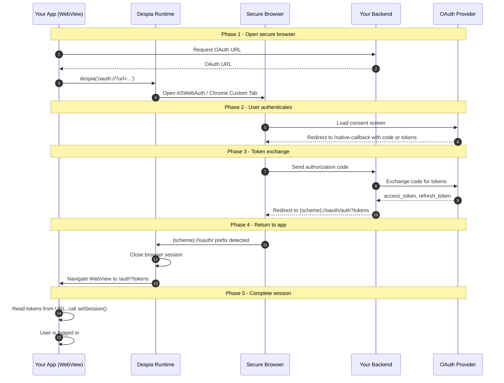

Native apps cannot handle OAuth redirects the way browsers do. Despia solves this with two URL protocols that together handle opening a secure browser session, returning the user to your app, and passing tokens back to your WebView, without any native code changes on your part.

---

## Installation

The `despia()` function is only available after importing `despia-native` via npm or CDN. Calling it without importing will throw a reference error.

<Tabs>
  <Tab title="Bundle">
    <CodeGroup>

    ```bash npm
    npm install despia-native
    ```

    ```bash pnpm
    pnpm add despia-native
    ```

    ```bash yarn
    yarn add despia-native
    ```

    </CodeGroup>

    ```javascript
    import despia from 'despia-native';
    ```
  </Tab>
  <Tab title="CDN">
    <CodeGroup>

    ```html UMD
    <script src="https://cdn.jsdelivr.net/npm/despia-native/index.min.js"></script>
    ```

    ```html ESM
    <script type="module">
        import despia from 'https://cdn.jsdelivr.net/npm/despia-native/+esm'
    </script>
    ```

    </CodeGroup>
  </Tab>
</Tabs>

When a user taps "Sign in", OAuth requires opening a provider's login page, authenticating, then redirecting back with tokens. In a browser this is straightforward. In a native app running a WebView it breaks down:

| Problem | Why it matters |
| --- | --- |
| No visible address bar | Users cannot verify they are on the real provider's site |
| WebView restrictions | Google and Apple block OAuth inside embedded WebViews for security |
| App Store requirements | Both platforms require OAuth to happen in a trusted browser session |
| Session isolation | Tokens obtained in the browser session cannot transfer directly to your WebView |

Despia solves this by opening the OAuth flow in the platform's secure browser APIs: **ASWebAuthenticationSession on iOS** and **Chrome Custom Tabs on Android**. Both provide a trusted, isolated browser session the user recognises as secure. Your WebView never handles the redirect.

---

## The two Despia URL protocols

Everything in Despia's OAuth mechanism comes down to two URL protocols:

| Protocol | What it does |
| --- | --- |
| `oauth://` | Opens a secure browser session with the URL you provide |
| `{scheme}://oauth/` | Closes the secure browser session and navigates your WebView to the path that follows |

```javascript
// Open a native secure browser session
despia(`oauth://?url=${encodeURIComponent(oauthUrl)}`)

// Close it and return to your app (fires from inside the browser session)
window.location.href = `myapp://oauth/auth?access_token=xxx`
```

Everything else is standard OAuth. Despia does not modify the protocol, it provides the secure transport.

---

## The full native flow



---

## Key concepts

### The callback URL split

In standard web OAuth you have one callback URL. In Despia you need two:

**`/native-callback`** runs inside the secure browser session, receives the authorization code or tokens from the provider, does the code exchange if needed, then fires the deeplink to close the session.

**`/auth`** runs in your WebView, receives tokens via URL params from the deeplink, calls `setSession()`, and completes login.

```text
Secure browser session:
  Provider → /native-callback?code=xxx
           → calls backend to exchange code
           → fires myapp://oauth/auth?access_token=xxx

WebView:
  myapp://oauth/auth?access_token=xxx
  → Despia closes browser, navigates WebView to /auth?access_token=xxx
  → /auth reads token, calls setSession()
```

### The `oauth/` prefix requirement

The `oauth/` segment in the deeplink is not a path. It is a signal to Despia to close the secure browser session. Everything after `oauth/` becomes the path Despia navigates your WebView to.

| Deeplink | Result |
| --- | --- |
| `myapp://oauth/auth?token=xxx` | Browser closes, WebView navigates to `/auth?token=xxx` |
| `myapp://oauth/home` | Browser closes, WebView navigates to `/home` |
| `myapp://auth?token=xxx` | Browser stays open, user is stuck |

### Passing `deeplink_scheme` through `state`

Once the secure browser session opens, your `/native-callback` page has no direct access to the Despia context that opened it. The OAuth `state` parameter is the correct way to carry anything the callback needs, including the deeplink scheme. The provider echoes `state` back unchanged.

```javascript
// When generating the OAuth URL
const state = `${crypto.randomUUID()}|myapp`  // uuid|deeplink_scheme

// In native-callback
const state  = new URLSearchParams(window.location.search).get('state')
const scheme = state.includes('|') ? state.split('|')[1] : 'myapp'

window.location.href = scheme + '://oauth/auth?access_token=' + encodeURIComponent(token)
```

The `state` parameter also serves as CSRF protection in the standard OAuth sense. Both uses are compatible.

### Token handoff

The secure browser and your WebView are isolated. Tokens obtained in the browser cannot be accessed by your app directly. They must be passed via URL:

```text
Browser fires:   myapp://oauth/auth?access_token=xxx&refresh_token=yyy
Despia intercepts, closes browser, navigates WebView to:
                 /auth?access_token=xxx&refresh_token=yyy
Your /auth page reads the params and calls setSession()
```

---

## Implicit vs authorization code flow

Different providers return tokens differently from the callback. Your `/native-callback` page needs to handle whichever your provider uses.

| Flow | How tokens arrive | Examples |
| --- | --- | --- |
| Implicit | URL hash `#access_token=xxx` | Supabase Google (legacy), some OIDC providers |
| Authorization code | Query param `?code=xxx`, then backend exchange | TikTok, GitHub, most modern providers |

```javascript
// In native-callback, handle both
var params      = new URLSearchParams(window.location.search)
var hash        = new URLSearchParams(window.location.hash.substring(1))

var code        = params.get('code')         // authorization code flow
var accessToken = hash.get('access_token')   // implicit flow

if (code) {
    // exchange code via backend, then fire deeplink with tokens
} else if (accessToken) {
    // fire deeplink directly with token from hash
}
```

---

## Provider quirks

### Apple Sign In on iOS

Apple Sign In on iOS is special. The Apple JS SDK with `usePopup: true` opens the native Face ID / Apple ID sheet directly inside WKWebView without needing the `oauth://` bridge. The `id_token` is returned to your JavaScript callback with no browser session opened or closed.

On Android, Apple Sign In still uses the `oauth://` bridge.

See the [Apple Sign In](/native-features/o-auth-2-0/apple-auth) page for full details.

### `response_mode=form_post`

Some providers (Apple on Android, some enterprise IdPs) POST tokens directly to your backend instead of redirecting the browser. Your backend receives the POST, validates, then redirects the browser to `/native-callback` or directly to the deeplink:

```text
Provider → POST to your backend → backend redirects to myapp://oauth/auth?tokens
```

### `response_mode=query` is invalid with `id_token`

If you are requesting an `id_token`, Apple and some OIDC providers will reject `response_mode=query`. Use `fragment` or `form_post` instead.

---

## `native-callback.html` vs React component

**Recommendation: use `public/native-callback.html`.**

React Router can strip the `#access_token` hash fragment when handling a route change, causing tokens to disappear before your callback logic runs. A plain HTML file in your `public/` folder completely bypasses React Router and reads the hash directly from the browser.

The `.html` extension is never visible, the secure browser hides the URL bar during OAuth flows.

If you use a React component, use `useLayoutEffect` (not `useEffect`) to read the hash before React re-renders, and make sure React Router does not treat the fragment as part of the route.

---

## The already-mounted `/auth` page problem

When Despia navigates the WebView to `/auth?access_token=xxx`, if `/auth` is already the active route, your framework does not remount the component. It updates the URL and re-renders. If your token-reading logic only runs on mount, it already fired with empty params and will not run again. Tokens sit in the URL, the user sees a loading state forever.

Fix per framework:

**React**: include `searchParams` in your `useEffect` dependency array.

**Vue**: use `watch: { '$route.query': { immediate: true, handler } }` instead of reading params in `mounted()`.

**Vanilla JS / HTML**: call your handler on load and add `window.addEventListener('popstate', handler)`.

Note that this also affects plain HTML pages inside a WebView. If the page was already loaded when Despia navigates to it, the browser may focus the existing page rather than reloading it. Run the handler on both `load` and `popstate`.

---

## Flow comparison by provider

| Provider | Token flow | Tokens arrive via | Backend needed |
| --- | --- | --- | --- |
| Google (Supabase) | Implicit | `#access_token` in hash | No (Supabase handles exchange) |
| Google (custom) | Authorization code \+ PKCE | `?code=xxx`, backend exchanges | Yes |
| Apple (iOS) | JS SDK callback | `response.authorization.id_token` | Yes (validate `id_token`) |
| Apple (Android) | Implicit or form\_post | `#id_token` in hash or POST to backend | No for fragment, yes for form\_post |
| TikTok | Authorization code | `?code=xxx`, backend exchanges | Yes, always |
| GitHub | Authorization code | `?code=xxx`, backend exchanges | Yes |

---

## Deeplink reference

| Deeplink | Result |
| --- | --- |
| `myapp://oauth/auth?access_token=xxx` | Closes browser, WebView navigates to `/auth?access_token=xxx` |
| `myapp://oauth/auth?id_token=xxx` | Closes browser, WebView navigates to `/auth?id_token=xxx` |
| `myapp://oauth/home` | Closes browser, WebView navigates to `/home` |
| `myapp://oauth/auth?error=access_denied` | Closes browser, WebView navigates to `/auth?error=access_denied` |
| `myapp://auth?access_token=xxx` | Browser stays open, user is stuck |

---

## Summary

| Concept | What to remember |
| --- | --- |
| `despia('oauth://?url=...')` | Opens ASWebAuth on iOS, Chrome Custom Tabs on Android |
| `{scheme}://oauth/` prefix | Closes the browser session, path after becomes WebView destination |
| `/native-callback` | Runs in browser: receives code/tokens, fires deeplink |
| `/auth` | Runs in WebView: receives tokens via URL params, calls setSession |
| `state` parameter | Carry `deeplink_scheme` plus CSRF token through the OAuth flow |
| Already-mounted page | Add `searchParams` to deps (React), watch `$route.query` (Vue), use `popstate` (HTML/vanilla) |
| `usePopup: true` (Apple iOS) | Skips the browser session entirely, returns `id_token` directly to JS |

---

## Provider guides

<CardGroup cols={2}>
  <Card title="Google Auth" icon="google" href="/native-features/oauth/google">
    Implicit flow via Supabase or PKCE with custom backend
  </Card>

  <Card title="Apple Sign In" icon="apple" href="/native-features/auth/apple">
    Native Face ID on iOS, Chrome Custom Tabs on Android
  </Card>

  <Card title="TikTok Auth" icon="tiktok" href="/native-features/oauth/tiktok">
    Authorization code flow with edge function
  </Card>

  <Card title="More providers" icon="book" href="https://setup.despia.com">
    The same pattern works for GitHub, LinkedIn, and any OAuth 2.0 provider
  </Card>
</CardGroup>