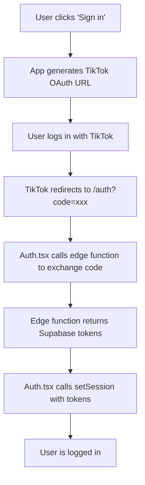
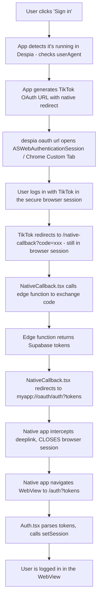

<iframe src="https://www.youtube.com/embed/cFXTMf_kgY4" title="YouTube video player" frameborder="0" className="w-full aspect-video rounded-xl" allow="accelerometer; autoplay; clipboard-write; encrypted-media; gyroscope; picture-in-picture; web-share" allowfullscreen />

<Card title="AI Prompt" icon="sparkles">
  This setup is more technical and you'll need to paste the following prompt, which includes full scaffolding, into Lovable to get good results:

  ````expandable expandable
  # Despia Native SDK - TikTok OAuth Integration Guide
  
  Production ready implementation for Lovable + Supabase (Custom Provider)
  
  ---
  
  ## IMPORTANT: User Must Provide Credentials
  
  Before implementing this guide, you MUST collect the following from the user:
  
  | Required Value | Where to Get It | Example |
  |----------------|-----------------|---------|
  | TikTok Client Key | TikTok Developer Portal > Your App > App Info | `sbaw471ke91ficgwnn` |
  | TikTok Client Secret | TikTok Developer Portal > Your App > App Info | `xxxxxxxxxxxxxxxxxxx` |
  | App URL | Your Lovable project URL | `https://myapp.lovable.app` |
  | Deeplink Scheme (native only) | Despia Dashboard | `myapp` |
  
  **ASK THE USER FOR THESE VALUES BEFORE GENERATING ANY CODE.**
  
  Without these values, the implementation will fail with errors like:
  - "TikTok not configured"
  - "client_key" error from TikTok
  - Invalid redirect URI
  
  Once the user provides these values:
  1. Hardcode `TIKTOK_CLIENT_KEY` and `APP_URL` in `src/lib/tiktok-auth.ts`
  2. Add `TIKTOK_CLIENT_KEY` and `TIKTOK_CLIENT_SECRET` to Supabase Edge Function secrets
  3. Update the deeplink scheme in `LoginButton.tsx` and `NativeCallback.tsx`
  
  ---
  
  ## What This Does
  
  This implements TikTok OAuth login that works in:
  1. Web browsers - Standard OAuth flow
  2. Native mobile apps - When your Lovable web app is wrapped with Despia SDK
  
  ### Why Custom Implementation?
  
  TikTok is not natively supported by Supabase, so we need to:
  1. Handle TikTok OAuth flow ourselves
  2. Exchange authorization codes for tokens server-side
  3. Create/authenticate Supabase users using TikTok identity
  
  ### TikTok OAuth Flow Overview
  
  ```
  User clicks "Sign in with TikTok"
      -> Redirect to TikTok authorization page
      -> User authorizes your app
      -> TikTok redirects back with authorization code
      -> Server exchanges code for access token
      -> Server fetches TikTok user info
      -> Server creates/signs in Supabase user
      -> Return session tokens to client
  ```
  
  ---
  
  ## Architecture
  
  ### Web Flow
  
  ```
  LoginButton.tsx
      -> getTikTokOAuthUrl() (frontend, uses hardcoded client key)
      -> Redirect to TikTok
      -> TikTok redirects to /auth?code=xxx
      -> Auth.tsx calls auth-tiktok-callback edge function
      -> Edge function does EVERYTHING:
         1. Exchange code for TikTok access token
         2. Fetch TikTok user info
         3. Create/find Supabase user
         4. Generate magic link + verify OTP = real session
         5. Return Supabase tokens
      -> Auth.tsx calls setSession() with tokens
      -> User logged in
  ```
  
  ### Native Flow (Despia WebView)
  
  ```
  LoginButton.tsx
      -> getTikTokOAuthUrl() with is_native=true
      -> despia('oauth://?url=...') opens ASWebAuthenticationSession
      -> TikTok redirects to /native-callback?code=xxx
      -> NativeCallback.tsx calls auth-tiktok-callback edge function
      -> Edge function returns Supabase tokens
      -> NativeCallback.tsx redirects to deeplink with tokens
      -> Native app navigates to /auth?tokens
      -> Auth.tsx calls setSession() with tokens
      -> User logged in
  ```
  
  ---
  
  ## CRITICAL: Why This Works (Lessons Learned)
  
  ### WRONG: Manual JWT Creation
  
  ```typescript
  // This WILL NOT WORK - creates "bad_jwt" errors
  import * as jose from "jose";
  const jwt = await new jose.SignJWT({ sub: userId, ... }).sign(secret);
  ```
  
  Supabase tokens have specific claims, signatures, and internal state that manual JWTs don't have.
  
  ### CORRECT: Magic Link + OTP Verification
  
  ```typescript
  // This creates REAL Supabase tokens that work everywhere
  const { data: linkData } = await supabaseAdmin.auth.admin.generateLink({
    type: 'magiclink',
    email: userEmail,
  });
  
  const { data: sessionData } = await supabasePublic.auth.verifyOtp({
    token_hash: linkData.properties.hashed_token,
    type: 'email',  // Use 'email' type for verification (works with Supabase 2.39+)
  });
  // sessionData.session.access_token = real, working token!
  ```
  
  **Note on verifyOtp type:** Use `type: 'email'` for Supabase JS v2.39+. Older versions may require `type: 'magiclink'`. If you get type errors, try switching between these values.
  
  ### Key Requirements
  
  1. **Two Supabase clients** in the edge function:
     - `supabaseAdmin` (SUPABASE_SERVICE_ROLE_KEY) - for creating users, generating links
     - `supabasePublic` (SUPABASE_ANON_KEY) - for verifying OTP to create session
     - NOTE: Use `SUPABASE_ANON_KEY` not `SUPABASE_PUBLISHABLE_KEY`
  
  2. **Always set `email_confirm: true`** when creating OAuth users
  
  3. **Use `setSession()`** on the frontend, not just storing tokens
  
  4. **Single edge function** - faster than multiple calls
  
  ---
  
  ## CRITICAL: Required Components
  
  **FIRST: Ask the user for their TikTok credentials before generating any code.**
  
  | Component | What It Does | Without It |
  |-----------|--------------|------------|
  | **User's TIKTOK_CLIENT_KEY** | Hardcoded in tiktok-auth.ts | "TikTok credentials not configured" error |
  | **User's APP_URL** | Hardcoded in tiktok-auth.ts | Wrong redirect URI |
  | auth-tiktok-callback | Single edge function - does everything | Can't complete login |
  | LoginButton.tsx | Starts TikTok OAuth flow | Nothing happens on click |
  | Auth.tsx | Handles web callback, sets session | Web login fails |
  | NativeCallback.tsx | Handles native callback, closes browser | Native stuck in browser |
  
  **Architecture simplified!** Only ONE edge function needed. It uses `generateLink()` + `verifyOtp()` to create real Supabase sessions.
  
  ---
  
  ## Complete File List
  
  | # | File Path | Purpose |
  |---|-----------|---------|
  | 1 | supabase/functions/auth-tiktok-callback/index.ts | Single edge function - handles everything |
  | 2 | src/lib/tiktok-auth.ts | TikTok auth helper functions + shared config |
  | 3 | src/components/LoginButton.tsx | Login button - handles both flows |
  | 4 | src/pages/Auth.tsx | OAuth callback (web) + login page |
  | 5 | src/pages/NativeCallback.tsx | OAuth callback (native) |
  | 6 | src/pages/NotFound.tsx | 404 page |
  | 7 | src/App.tsx | Route configuration |
  | 8 | supabase/config.toml | Edge function config |
  | 9 | public/404.html | SPA fallback |
  | 10 | src/components/SpaRedirector.tsx | Handle 404 redirect |
  | 11 | public/_redirects | SPA routing (Netlify/Lovable) |
  
  **Simplified!** Only ONE edge function needed - it handles code exchange, user creation, AND session generation in a single call.
  
  ---
  
  ## Step 1: Set Up TikTok Developer App
  
  ### In TikTok Developer Portal
  
  1. Go to https://developers.tiktok.com/
  2. Create a new app or use existing
  3. Add "Login Kit" product
  4. Configure OAuth settings:
     - **Redirect URI (Web)**: `https://YOUR-APP.lovable.app/auth`
     - **Redirect URI (Native)**: `https://YOUR-APP.lovable.app/native-callback`
  5. Note your **Client Key** and **Client Secret**
  6. Request scopes: `user.info.basic` (minimum required)
  
  ### Required Scopes
  
  | Scope | What It Provides |
  |-------|------------------|
  | user.info.basic | Open ID, avatar, display name |
  | user.info.profile | Bio, profile deep link (optional) |
  | user.info.stats | Follower/following counts (optional) |
  
  ---
  
  ## Step 2: Add Environment Variables
  
  ### Frontend Configuration (Hardcoded)
  
  The TikTok client key and APP_URL are configured directly in `src/lib/tiktok-auth.ts`. All other files import from there for consistency.
  
  **You must ask the user for their TikTok Client Key and App URL, then hardcode them:**
  
  ```typescript
  const TIKTOK_CLIENT_KEY = 'user_provided_key_here'; // e.g., 'sbaw471ke91ficgwnn'
  const APP_URL = 'https://user-app.lovable.app';     // e.g., 'https://myapp.lovable.app'
  ```
  
  **This is safe** because the client_key is public (it's visible in the OAuth URL that users see anyway).
  
  ### In Supabase Dashboard (Server-side Secrets)
  
  Go to Project Settings > Edge Functions > Add secrets:
  
  ```
  TIKTOK_CLIENT_KEY=user_provided_key
  TIKTOK_CLIENT_SECRET=user_provided_secret
  ```
  
  **Lovable Cloud automatically provides these Supabase secrets** - do NOT add them manually:
  
  | Auto-provided Secret | Purpose |
  |---------------------|---------|
  | `SUPABASE_URL` | Your project's API URL |
  | `SUPABASE_ANON_KEY` | Public key for client operations |
  | `SUPABASE_SERVICE_ROLE_KEY` | Admin key for privileged operations |
  
  **Common mistake**: Using `SUPABASE_PUBLISHABLE_KEY` instead of `SUPABASE_ANON_KEY` will cause "supabaseKey is required" errors.
  
  ---
  
  ## Step 3: Install Dependencies
  
  ```bash
  npm install despia-native
  ```
  
  ---
  
  ## Step 4: Create TikTok Auth Callback Edge Function
  
  File: `supabase/functions/auth-tiktok-callback/index.ts`
  
  This single edge function handles EVERYTHING:
  1. Exchanges the authorization code for TikTok tokens
  2. Fetches user info from TikTok
  3. Creates or finds the Supabase user
  4. Generates a real Supabase session using magic link + OTP verification
  
  **CRITICAL**: We use `generateLink()` + `verifyOtp()` instead of manual JWT creation. Manual JWTs will fail with "bad_jwt" errors!
  
  ```typescript
  import { serve } from "https://deno.land/std@0.168.0/http/server.ts";
  import { createClient } from "https://esm.sh/@supabase/supabase-js@2.39.0";
  
  const corsHeaders = {
    'Access-Control-Allow-Origin': '*',
    'Access-Control-Allow-Headers': 'authorization, x-client-info, apikey, content-type',
  };
  
  serve(async (req) => {
    // Handle CORS preflight
    if (req.method === 'OPTIONS') {
      return new Response(null, { headers: corsHeaders });
    }
  
    try {
      const { code, redirect_uri } = await req.json();
  
      if (!code) {
        return new Response(
          JSON.stringify({ error: 'Authorization code required' }),
          { status: 400, headers: { ...corsHeaders, 'Content-Type': 'application/json' } }
        );
      }
  
      const clientKey = Deno.env.get('TIKTOK_CLIENT_KEY')!;
      const clientSecret = Deno.env.get('TIKTOK_CLIENT_SECRET')!;
      const supabaseUrl = Deno.env.get('SUPABASE_URL')!;
      const serviceRoleKey = Deno.env.get('SUPABASE_SERVICE_ROLE_KEY')!;
      const anonKey = Deno.env.get('SUPABASE_ANON_KEY')!;
      
      // IMPORTANT: Lovable Cloud provides these automatically:
      // - SUPABASE_URL
      // - SUPABASE_ANON_KEY (NOT "SUPABASE_PUBLISHABLE_KEY")
      // - SUPABASE_SERVICE_ROLE_KEY
      // Using the wrong variable name will cause "supabaseKey is required" errors
  
      console.log('Step 1: Exchanging code for TikTok access token...');
  
      // ============================================
      // STEP 1: Exchange code for TikTok access token
      // ============================================
      const tokenResponse = await fetch('https://open.tiktokapis.com/v2/oauth/token/', {
        method: 'POST',
        headers: {
          'Content-Type': 'application/x-www-form-urlencoded',
        },
        body: new URLSearchParams({
          client_key: clientKey,
          client_secret: clientSecret,
          code: code,
          grant_type: 'authorization_code',
          redirect_uri: redirect_uri,
        }),
      });
  
      if (!tokenResponse.ok) {
        const errorText = await tokenResponse.text();
        console.error('TikTok token error:', errorText);
        return new Response(
          JSON.stringify({ error: 'Failed to exchange code', details: errorText }),
          { status: 400, headers: { ...corsHeaders, 'Content-Type': 'application/json' } }
        );
      }
  
      const tokenData = await tokenResponse.json();
      const accessToken = tokenData.access_token;
      const openId = tokenData.open_id;
  
      console.log('Step 2: Fetching TikTok user info...');
  
      // ============================================
      // STEP 2: Fetch user info from TikTok
      // ============================================
      const userInfoResponse = await fetch(
        'https://open.tiktokapis.com/v2/user/info/?fields=open_id,union_id,avatar_url,display_name',
        {
          headers: {
            'Authorization': `Bearer ${accessToken}`,
          },
        }
      );
  
      if (!userInfoResponse.ok) {
        const errorText = await userInfoResponse.text();
        console.error('TikTok user info error:', errorText);
        return new Response(
          JSON.stringify({ error: 'Failed to fetch user info' }),
          { status: 400, headers: { ...corsHeaders, 'Content-Type': 'application/json' } }
        );
      }
  
      const userInfoData = await userInfoResponse.json();
      const tiktokUser = userInfoData.data?.user;
      const displayName = tiktokUser?.display_name || 'TikTok User';
      const avatarUrl = tiktokUser?.avatar_url || '';
  
      console.log('Step 3: Creating/finding Supabase user...');
  
      // ============================================
      // STEP 3: Create or find Supabase user
      // ============================================
      
      // Admin client for privileged operations
      const supabaseAdmin = createClient(supabaseUrl, serviceRoleKey, {
        auth: { autoRefreshToken: false, persistSession: false }
      });
  
      // Public client for session verification
      const supabasePublic = createClient(supabaseUrl, anonKey);
  
      // Create deterministic email from TikTok's unique identifier
      const tiktokEmail = `${openId.toLowerCase()}@tiktok.oauth`;
  
      let userId: string;
  
      // Try to create user first
      const { data: createData, error: createError } = await supabaseAdmin.auth.admin.createUser({
        email: tiktokEmail,
        email_confirm: true,  // CRITICAL: Auto-confirm for OAuth users
        user_metadata: {
          tiktok_open_id: openId,
          display_name: displayName,
          avatar_url: avatarUrl,
          full_name: displayName,
          provider: 'tiktok'
        }
      });
  
      if (createError) {
        // User already exists - find them
        if (createError.message?.includes('already been registered')) {
          console.log('User exists, fetching...');
          const { data: existingUsers } = await supabaseAdmin.auth.admin.listUsers();
          const existingUser = existingUsers?.users.find(u => u.email === tiktokEmail);
          
          if (!existingUser) {
            return new Response(
              JSON.stringify({ error: 'User not found' }),
              { status: 400, headers: { ...corsHeaders, 'Content-Type': 'application/json' } }
            );
          }
          
          userId = existingUser.id;
  
          // Update user metadata with latest TikTok info
          await supabaseAdmin.auth.admin.updateUserById(userId, {
            user_metadata: {
              tiktok_open_id: openId,
              display_name: displayName,
              avatar_url: avatarUrl,
              full_name: displayName,
              provider: 'tiktok'
            }
          });
        } else {
          console.error('Failed to create user:', createError);
          return new Response(
            JSON.stringify({ error: 'Failed to create user', details: createError.message }),
            { status: 500, headers: { ...corsHeaders, 'Content-Type': 'application/json' } }
          );
        }
      } else {
        userId = createData.user.id;
      }
  
      console.log('Step 4: Generating Supabase session via magic link + OTP verification...');
  
      // ============================================
      // STEP 4: Generate real Supabase session
      // ============================================
      // 
      // CRITICAL: We use generateLink() + verifyOtp() instead of manual JWT creation
      // Manual JWTs will fail with "bad_jwt" errors!
      //
  
      const { data: linkData, error: linkError } = await supabaseAdmin.auth.admin.generateLink({
        type: 'magiclink',
        email: tiktokEmail,
      });
  
      if (linkError || !linkData) {
        console.error('Failed to generate magic link:', linkError);
        return new Response(
          JSON.stringify({ error: 'Failed to generate session' }),
          { status: 500, headers: { ...corsHeaders, 'Content-Type': 'application/json' } }
        );
      }
  
      // Verify the magic link token to create a real session
      // NOTE: Use 'email' type for Supabase 2.39+. If you get errors, try 'magiclink' instead.
      const { data: sessionData, error: sessionError } = await supabasePublic.auth.verifyOtp({
        token_hash: linkData.properties.hashed_token,
        type: 'email',
      });
  
      if (sessionError || !sessionData.session) {
        console.error('Failed to verify OTP:', sessionError);
        return new Response(
          JSON.stringify({ error: 'Failed to create session' }),
          { status: 500, headers: { ...corsHeaders, 'Content-Type': 'application/json' } }
        );
      }
  
      console.log('Success! User logged in:', userId);
  
      // Return tokens to frontend
      return new Response(
        JSON.stringify({
          access_token: sessionData.session.access_token,
          refresh_token: sessionData.session.refresh_token,
          expires_in: sessionData.session.expires_in,
          user: sessionData.user,
        }),
        { headers: { ...corsHeaders, 'Content-Type': 'application/json' } }
      );
  
    } catch (error) {
      console.error('Error:', error);
      const message = error instanceof Error ? error.message : 'Unknown error';
      return new Response(
        JSON.stringify({ error: message }),
        { status: 500, headers: { ...corsHeaders, 'Content-Type': 'application/json' } }
      );
    }
  });
  ```
  
  ---
  
  ## Step 5: Configure Edge Function
  
  File: `supabase/config.toml`
  
  ```toml
  [functions.auth-tiktok-callback]
  verify_jwt = false
  ```
  
  **Note**: We only need ONE edge function now. The `auth-tiktok-callback` function handles everything (code exchange, user creation, AND session generation) in a single call.
  
  ---
  
  ## Step 6: Create Database Tables (Optional)
  
  Run this SQL in Supabase SQL Editor if you want to store TikTok profile data:
  
  ```sql
  -- Optional: Profiles table for TikTok user data
  CREATE TABLE IF NOT EXISTS profiles (
    id UUID PRIMARY KEY REFERENCES auth.users(id) ON DELETE CASCADE,
    tiktok_id TEXT UNIQUE,
    display_name TEXT,
    avatar_url TEXT,
    created_at TIMESTAMPTZ DEFAULT NOW(),
    updated_at TIMESTAMPTZ DEFAULT NOW()
  );
  
  -- RLS Policies
  ALTER TABLE profiles ENABLE ROW LEVEL SECURITY;
  
  CREATE POLICY "Users can view own profile"
    ON profiles FOR SELECT
    USING (auth.uid() = id);
  
  CREATE POLICY "Users can update own profile"
    ON profiles FOR UPDATE
    USING (auth.uid() = id);
  ```
  
  **Note**: The profiles table is optional. User data is also stored in `auth.users.user_metadata`.
  
  ---
  
  ## Step 7: Create TikTok Auth Helper
  
  File: `src/lib/tiktok-auth.ts`
  
  **IMPORTANT**: Replace the placeholder values below with the actual credentials provided by the user. This file exports `APP_URL` for use by other components.
  
  ```typescript
  import { supabase } from '@/integrations/supabase/client';
  
  // ============================================
  // CONFIGURATION - REPLACE WITH USER'S VALUES
  // ============================================
  // ASK THE USER FOR THESE VALUES BEFORE IMPLEMENTING
  export const TIKTOK_CLIENT_KEY = 'USER_PROVIDED_CLIENT_KEY'; // Get from user
  export const APP_URL = 'https://USER_PROVIDED_APP.lovable.app'; // Get from user
  // ============================================
  
  export interface TikTokAuthResult {
    success: boolean;
    access_token?: string;
    refresh_token?: string;
    user?: any;
    error?: string;
  }
  
  /**
   * Generate TikTok OAuth URL
   * Client key is public (visible in OAuth URL anyway)
   */
  export function getTikTokOAuthUrl(isNative: boolean, deeplinkScheme?: string): string | null {
    if (!TIKTOK_CLIENT_KEY || TIKTOK_CLIENT_KEY === 'USER_PROVIDED_CLIENT_KEY') {
      console.error('TikTok client key not configured. The developer must set the actual client key in src/lib/tiktok-auth.ts');
      return null;
    }
  
    // Generate state for CSRF protection
    const state = crypto.randomUUID();
    
    // Store state in sessionStorage for verification on callback
    // Wrapped in try-catch for private browsing mode compatibility
    try {
      sessionStorage.setItem(`tiktok_oauth_state_${state}`, JSON.stringify({
        state,
        is_native: isNative,
        deeplink_scheme: deeplinkScheme || null,
        created_at: new Date().toISOString(),
      }));
    } catch (e) {
      console.warn('sessionStorage not available (private browsing?), state validation will be skipped');
    }
  
    // Determine redirect URI based on flow type
    const redirectUri = isNative 
      ? `${APP_URL}/native-callback`
      : `${APP_URL}/auth`;
  
    // Build TikTok OAuth URL
    const params = new URLSearchParams({
      client_key: TIKTOK_CLIENT_KEY,
      response_type: 'code',
      scope: 'user.info.basic',
      redirect_uri: redirectUri,
      state: isNative && deeplinkScheme ? `${state}|${deeplinkScheme}` : state,
    });
  
    return `https://www.tiktok.com/v2/auth/authorize/?${params.toString()}`;
  }
  
  /**
   * Validate OAuth state parameter against stored value
   * Returns true if valid or if sessionStorage is unavailable
   */
  export function validateOAuthState(state: string | null): boolean {
    if (!state) return false;
    
    // Extract the UUID part (before | if present)
    const stateParts = state.split('|');
    const stateUuid = stateParts[0];
    
    try {
      const stored = sessionStorage.getItem(`tiktok_oauth_state_${stateUuid}`);
      if (!stored) {
        console.warn('No stored state found - may have expired or sessionStorage unavailable');
        return true; // Allow if sessionStorage unavailable (private browsing)
      }
      
      const storedData = JSON.parse(stored);
      
      // Clean up the stored state
      sessionStorage.removeItem(`tiktok_oauth_state_${stateUuid}`);
      
      // Check if state is too old (10 minutes max)
      const createdAt = new Date(storedData.created_at);
      const now = new Date();
      const ageMinutes = (now.getTime() - createdAt.getTime()) / 1000 / 60;
      
      if (ageMinutes > 10) {
        console.error('OAuth state expired');
        return false;
      }
      
      return storedData.state === stateUuid;
    } catch (e) {
      console.warn('sessionStorage not available, skipping state validation');
      return true; // Allow if sessionStorage unavailable
    }
  }
  
  /**
   * Exchange authorization code for Supabase session
   * Single edge function call - handles everything server-side
   */
  export async function exchangeTikTokCode(
    code: string,
    redirectUri: string
  ): Promise<TikTokAuthResult> {
    try {
      const { data, error } = await supabase.functions.invoke('auth-tiktok-callback', {
        body: { code, redirect_uri: redirectUri },
      });
  
      if (error) {
        console.error('Edge function error:', error);
        return { success: false, error: error.message };
      }
  
      if (!data?.access_token) {
        return { success: false, error: data?.error || 'No access token returned' };
      }
  
      return {
        success: true,
        access_token: data.access_token,
        refresh_token: data.refresh_token,
        user: data.user,
      };
    } catch (err) {
      console.error('Error exchanging TikTok code:', err);
      return {
        success: false,
        error: err instanceof Error ? err.message : 'Unknown error',
      };
    }
  }
  
  /**
   * Set Supabase session from tokens
   */
  export async function setTikTokSession(
    accessToken: string,
    refreshToken: string
  ): Promise<boolean> {
    try {
      const { error } = await supabase.auth.setSession({
        access_token: accessToken,
        refresh_token: refreshToken,
      });
  
      if (error) {
        console.error('Failed to set session:', error);
        return false;
      }
  
      return true;
    } catch (err) {
      console.error('Error setting session:', err);
      return false;
    }
  }
  ```
  
  ---
  
  ## Step 8: Create Login Button
  
  File: `src/components/LoginButton.tsx`
  
  ```typescript
  import { useState } from 'react';
  import { Button } from '@/components/ui/button';
  import despia from 'despia-native';
  import { getTikTokOAuthUrl } from '@/lib/tiktok-auth';
  
  interface LoginButtonProps {
    onError?: (error: string) => void;
  }
  
  const LoginButton = ({ onError }: LoginButtonProps) => {
    const [isLoading, setIsLoading] = useState(false);
  
    const handleTikTokLogin = async () => {
      // Detect if running in Despia native app
      const isNative = navigator.userAgent.toLowerCase().includes('despia');
      
      setIsLoading(true);
  
      try {
        // Generate TikTok OAuth URL (uses hardcoded client key)
        const oauthUrl = getTikTokOAuthUrl(
          isNative,
          isNative ? 'myapp' : undefined // CHANGE 'myapp' to your Despia app scheme
        );
  
        if (!oauthUrl) {
          onError?.('TikTok credentials not configured. Please provide your TikTok Client Key.');
          setIsLoading(false);
          return;
        }
  
        if (isNative) {
          // NATIVE FLOW
          // Open in ASWebAuthenticationSession (iOS) or Chrome Custom Tab (Android)
          // oauth:// prefix tells Despia to use secure browser session
          despia(`oauth://?url=${encodeURIComponent(oauthUrl)}`);
          // Note: Loading state will persist until user returns or cancels
        } else {
          // WEB FLOW
          // Redirect to TikTok in same window
          window.location.href = oauthUrl;
        }
      } catch (err) {
        console.error('Login error:', err);
        onError?.(err instanceof Error ? err.message : 'Login failed');
        setIsLoading(false);
      }
    };
  
    return (
      <Button
        onClick={handleTikTokLogin}
        disabled={isLoading}
        className="w-full bg-black hover:bg-gray-800 text-white"
      >
        {isLoading ? (
          <span className="flex items-center gap-2">
            <svg className="animate-spin h-4 w-4" viewBox="0 0 24 24">
              <circle
                className="opacity-25"
                cx="12"
                cy="12"
                r="10"
                stroke="currentColor"
                strokeWidth="4"
                fill="none"
              />
              <path
                className="opacity-75"
                fill="currentColor"
                d="M4 12a8 8 0 018-8V0C5.373 0 0 5.373 0 12h4z"
              />
            </svg>
            Connecting...
          </span>
        ) : (
          <span className="flex items-center gap-2">
            {/* TikTok Icon */}
            <svg className="h-5 w-5" viewBox="0 0 24 24" fill="currentColor">
              <path d="M19.59 6.69a4.83 4.83 0 01-3.77-4.25V2h-3.45v13.67a2.89 2.89 0 01-5.2 1.74 2.89 2.89 0 012.31-4.64 2.93 2.93 0 01.88.13V9.4a6.84 6.84 0 00-1-.05A6.33 6.33 0 005 20.1a6.34 6.34 0 0010.86-4.43v-7a8.16 8.16 0 004.77 1.52v-3.4a4.85 4.85 0 01-1-.1z" />
            </svg>
            Sign in with TikTok
          </span>
        )}
      </Button>
    );
  };
  
  export default LoginButton;
  ```
  
  ---
  
  ## Step 9: Create Auth Page (Web Callback)
  
  File: `src/pages/Auth.tsx`
  
  ```typescript
  import { useEffect, useState, useRef } from 'react';
  import { useNavigate, useSearchParams } from 'react-router-dom';
  import { supabase } from '@/integrations/supabase/client';
  import { Button } from '@/components/ui/button';
  import LoginButton from '@/components/LoginButton';
  import { APP_URL, exchangeTikTokCode, setTikTokSession, validateOAuthState } from '@/lib/tiktok-auth';
  
  const Auth = () => {
    const [searchParams] = useSearchParams();
    const navigate = useNavigate();
    const [error, setError] = useState<string | null>(null);
    const [showLogin, setShowLogin] = useState(false);
    const [isProcessing, setIsProcessing] = useState(false);
    const hasRun = useRef(false);
  
    useEffect(() => {
      if (hasRun.current) return;
      hasRun.current = true;
  
      const handleAuth = async () => {
        // Check if already logged in
        const { data: { session: existingSession } } = await supabase.auth.getSession();
        if (existingSession) {
          navigate('/', { replace: true });
          return;
        }
  
        // Check for TikTok authorization code
        const code = searchParams.get('code');
        const state = searchParams.get('state');
        const errorParam = searchParams.get('error');
        const errorDescription = searchParams.get('error_description');
  
        // Check for direct token params (from native callback deeplink)
        const accessToken = searchParams.get('access_token');
        const refreshToken = searchParams.get('refresh_token');
  
        // Handle errors
        if (errorParam) {
          setError(errorDescription || errorParam);
          return;
        }
  
        // Handle direct tokens (from native flow)
        if (accessToken) {
          setIsProcessing(true);
          const success = await setTikTokSession(accessToken, refreshToken || '');
          if (success) {
            navigate('/', { replace: true });
          } else {
            setError('Failed to set session');
          }
          return;
        }
  
        // Handle authorization code (web flow)
        if (code) {
          setIsProcessing(true);
          
          // Validate state parameter to prevent CSRF attacks
          if (!validateOAuthState(state)) {
            setError('Invalid or expired OAuth state. Please try again.');
            setIsProcessing(false);
            return;
          }
          
          const result = await exchangeTikTokCode(code, `${APP_URL}/auth`);
          
          if (!result.success) {
            setError(result.error || 'Authentication failed');
            setIsProcessing(false);
            return;
          }
  
          // Set session
          const success = await setTikTokSession(
            result.access_token!,
            result.refresh_token!
          );
  
          if (success) {
            navigate('/', { replace: true });
          } else {
            setError('Failed to complete login');
            setIsProcessing(false);
          }
          return;
        }
  
        // No code or tokens - show login button
        setShowLogin(true);
      };
  
      handleAuth();
    }, [searchParams, navigate]);
  
    if (error) {
      return (
        <div className="flex min-h-screen items-center justify-center bg-background p-4">
          <div className="w-full max-w-sm space-y-4">
            <div className="rounded-lg border border-destructive/50 bg-destructive/10 p-4 text-center">
              <h2 className="text-lg font-semibold text-destructive">Sign in failed</h2>
              <p className="mt-2 text-sm text-muted-foreground">{error}</p>
            </div>
            <Button onClick={() => { setError(null); setShowLogin(true); }} className="w-full">
              Try again
            </Button>
            <Button 
              variant="outline" 
              onClick={() => navigate('/', { replace: true })} 
              className="w-full"
            >
              Go to home
            </Button>
          </div>
        </div>
      );
    }
  
    if (showLogin) {
      return (
        <div className="flex min-h-screen items-center justify-center bg-background p-4">
          <div className="w-full max-w-sm space-y-6 text-center">
            <div>
              <h1 className="text-2xl font-bold">Welcome</h1>
              <p className="mt-2 text-muted-foreground">Sign in to continue</p>
            </div>
            <LoginButton onError={setError} />
          </div>
        </div>
      );
    }
  
    return (
      <div className="flex min-h-screen items-center justify-center bg-background p-4">
        <div className="text-center">
          <div className="mx-auto h-8 w-8 animate-spin rounded-full border-4 border-primary border-t-transparent" />
          <p className="mt-4 text-sm text-muted-foreground">
            {isProcessing ? 'Completing sign in...' : 'Loading...'}
          </p>
        </div>
      </div>
    );
  };
  
  export default Auth;
  ```
  
  ---
  
  ## Step 10: Create Native Callback Page
  
  File: `src/pages/NativeCallback.tsx`
  
  ```typescript
  import { useEffect, useRef, useState } from 'react';
  import { useSearchParams } from 'react-router-dom';
  import { APP_URL, exchangeTikTokCode } from '@/lib/tiktok-auth';
  
  const NativeCallback = () => {
    const [searchParams] = useSearchParams();
    const [error, setError] = useState<string | null>(null);
    const hasRun = useRef(false);
  
    useEffect(() => {
      if (hasRun.current) return;
      hasRun.current = true;
  
      const handleNativeCallback = async () => {
        // Get code and state from TikTok redirect
        const code = searchParams.get('code');
        const state = searchParams.get('state');
        const errorParam = searchParams.get('error');
        const errorDescription = searchParams.get('error_description');
  
        // Parse deeplink scheme from state (format: "uuid|scheme" or just "uuid")
        let deeplinkScheme = 'myapp'; // Default scheme - CHANGE to your Despia app scheme
        if (state && state.includes('|')) {
          const parts = state.split('|');
          deeplinkScheme = parts[1] || deeplinkScheme;
        }
  
        // Handle TikTok errors
        if (errorParam) {
          const errorUrl = `${deeplinkScheme}://oauth/auth?error=${encodeURIComponent(errorParam)}&error_description=${encodeURIComponent(errorDescription || '')}`;
          window.location.href = errorUrl;
          return;
        }
  
        if (!code) {
          setError('No authorization code received');
          return;
        }
  
        // Exchange code for tokens
        const result = await exchangeTikTokCode(code, `${APP_URL}/native-callback`);
  
        if (!result.success) {
          // Redirect to app with error
          const errorUrl = `${deeplinkScheme}://oauth/auth?error=${encodeURIComponent(result.error || 'unknown')}`;
          window.location.href = errorUrl;
          return;
        }
  
        // Build deeplink URL with tokens
        // Format: myapp://oauth/auth?access_token=xxx&refresh_token=yyy
        // - myapp:// = your app's deeplink scheme
        // - oauth/ = tells native code to close ASWebAuthenticationSession/Chrome Custom Tab
        // - auth = the path to navigate to in the WebView
        const params = new URLSearchParams();
        params.set('access_token', result.access_token!);
        if (result.refresh_token) {
          params.set('refresh_token', result.refresh_token);
        }
  
        const deeplinkUrl = `${deeplinkScheme}://oauth/auth?${params.toString()}`;
  
        console.log('Redirecting to deeplink:', deeplinkUrl);
  
        // This closes the ASWebAuthenticationSession / Chrome Custom Tab
        // and opens /auth?access_token=xxx in the WebView
        window.location.href = deeplinkUrl;
      };
  
      handleNativeCallback();
    }, [searchParams]);
  
    if (error) {
      return (
        <div className="flex min-h-screen items-center justify-center bg-background p-4">
          <div className="text-center">
            <p className="text-destructive">{error}</p>
          </div>
        </div>
      );
    }
  
    return (
      <div className="flex min-h-screen items-center justify-center bg-background p-4">
        <div className="text-center">
          <div className="mx-auto h-8 w-8 animate-spin rounded-full border-4 border-primary border-t-transparent" />
          <p className="mt-4 text-sm text-muted-foreground">Completing sign in...</p>
        </div>
      </div>
    );
  };
  
  export default NativeCallback;
  ```
  
  ---
  
  ## Step 11: Create NotFound Page
  
  File: `src/pages/NotFound.tsx`
  
  ```typescript
  import { useLocation, Link } from 'react-router-dom';
  import { Button } from '@/components/ui/button';
  
  const NotFound = () => {
    const location = useLocation();
  
    return (
      <div className="flex min-h-screen items-center justify-center bg-background p-4">
        <div className="w-full max-w-sm space-y-6 text-center">
          <div>
            <h1 className="text-6xl font-bold text-muted-foreground">404</h1>
            <h2 className="mt-4 text-xl font-semibold">Page not found</h2>
            <p className="mt-2 text-sm text-muted-foreground">
              The page "{location.pathname}" doesn't exist.
            </p>
          </div>
          <Button asChild className="w-full">
            <Link to="/">Go to home</Link>
          </Button>
        </div>
      </div>
    );
  };
  
  export default NotFound;
  ```
  
  ---
  
  ## Step 12: Add Routes to App.tsx
  
  File: `src/App.tsx`
  
  ```typescript
  import { BrowserRouter, Routes, Route } from 'react-router-dom';
  import Index from './pages/Index';
  import Auth from './pages/Auth';
  import NativeCallback from './pages/NativeCallback';
  import NotFound from './pages/NotFound';
  import SpaRedirector from './components/SpaRedirector';
  
  function App() {
    return (
      <BrowserRouter>
        <SpaRedirector />
        <Routes>
          <Route path="/" element={<Index />} />
          <Route path="/auth" element={<Auth />} />
          <Route path="/native-callback" element={<NativeCallback />} />
          <Route path="*" element={<NotFound />} />
        </Routes>
      </BrowserRouter>
    );
  }
  
  export default App;
  ```
  
  ---
  
  ## Step 13: Create SPA Fallback Files
  
  File: `src/components/SpaRedirector.tsx`
  
  ```typescript
  import { useEffect } from "react";
  import { useLocation, useNavigate } from "react-router-dom";
  
  export default function SpaRedirector() {
    const location = useLocation();
    const navigate = useNavigate();
  
    useEffect(() => {
      const params = new URLSearchParams(location.search);
      const redirect = params.get("redirect");
      
      if (!redirect) return;
  
      try {
        const decoded = decodeURIComponent(redirect);
        // Preserve any hash or additional query params
        navigate(`${decoded}${location.hash ?? ""}`, { replace: true });
      } catch {
        console.error('Failed to decode redirect path');
      }
    }, [location.search, location.hash, navigate]);
  
    return null;
  }
  ```
  
  File: `public/404.html`
  
  ```html
  <!doctype html>
  <html lang="en">
    <head>
      <meta charset="UTF-8" />
      <meta name="viewport" content="width=device-width, initial-scale=1.0" />
      <title>Redirecting</title>
    </head>
    <body>
      <script>
        (function () {
          // Preserve the full path including query params
          var redirect = window.location.pathname + window.location.search;
          var target = "/?redirect=" + encodeURIComponent(redirect);
          window.location.replace(target);
        })();
      </script>
    </body>
  </html>
  ```
  
  File: `public/_redirects`
  
  ```
  /* /index.html 200
  ```
  
  **Note on `_redirects`:** This file is for Netlify and Lovable hosting. If using a different hosting platform:
  - **Vercel**: Create `vercel.json` with `{"rewrites": [{"source": "/(.*)", "destination": "/index.html"}]}`
  - **Apache**: Use `.htaccess` with rewrite rules
  - **Nginx**: Configure `try_files $uri /index.html`
  
  ---
  
  ## Step 14: Configuration Summary
  
  **Before implementing, collect these from the user:**
  
  1. TikTok Client Key (from TikTok Developer Portal)
  2. TikTok Client Secret (from TikTok Developer Portal)
  3. Lovable App URL (e.g., https://myapp.lovable.app)
  4. Despia Deeplink Scheme (for native apps, e.g., myapp)
  
  ### Frontend (Hardcoded in src/lib/tiktok-auth.ts)
  
  ```typescript
  export const TIKTOK_CLIENT_KEY = 'user_provided_key';      // FROM USER
  export const APP_URL = 'https://user-app.lovable.app';     // FROM USER
  ```
  
  ### Backend (Supabase Edge Function Secrets)
  
  Set these in Supabase Dashboard > Project Settings > Edge Functions > Secrets:
  
  ```
  TIKTOK_CLIENT_KEY=user_provided_key
  TIKTOK_CLIENT_SECRET=user_provided_secret
  ```
  
  **Note**: The user must add these secrets manually. Lovable Cloud auto-provides `SUPABASE_URL`, `SUPABASE_ANON_KEY`, and `SUPABASE_SERVICE_ROLE_KEY`.
  
  ---
  
  ## Step 15: Using Login State in Your App
  
  File: `src/pages/Index.tsx` (example)
  
  ```typescript
  import { useEffect, useState } from 'react';
  import { supabase } from '@/integrations/supabase/client';
  import { User } from '@supabase/supabase-js';
  import LoginButton from '@/components/LoginButton';
  import { Button } from '@/components/ui/button';
  import { Avatar, AvatarFallback, AvatarImage } from '@/components/ui/avatar';
  
  const Index = () => {
    const [user, setUser] = useState<User | null>(null);
    const [loading, setLoading] = useState(true);
  
    useEffect(() => {
      // Get initial session
      supabase.auth.getSession().then(({ data: { session } }) => {
        setUser(session?.user ?? null);
        setLoading(false);
      });
  
      // Listen for auth changes
      const { data: { subscription } } = supabase.auth.onAuthStateChange(
        (event, session) => {
          setUser(session?.user ?? null);
        }
      );
  
      return () => subscription.unsubscribe();
    }, []);
  
    const handleSignOut = async () => {
      await supabase.auth.signOut();
    };
  
    if (loading) {
      return (
        <div className="flex min-h-screen items-center justify-center">
          <div className="h-8 w-8 animate-spin rounded-full border-4 border-primary border-t-transparent" />
        </div>
      );
    }
  
    if (!user) {
      return (
        <div className="flex min-h-screen items-center justify-center p-4">
          <div className="w-full max-w-sm space-y-6 text-center">
            <h1 className="text-2xl font-bold">Welcome</h1>
            <p className="text-muted-foreground">Sign in with TikTok to continue</p>
            <LoginButton />
          </div>
        </div>
      );
    }
  
    // User is logged in
    const metadata = user.user_metadata;
  
    return (
      <div className="flex min-h-screen items-center justify-center p-4">
        <div className="w-full max-w-sm space-y-6 text-center">
          <Avatar className="mx-auto h-20 w-20">
            <AvatarImage src={metadata.avatar_url} alt={metadata.display_name} />
            <AvatarFallback>
              {metadata.display_name?.charAt(0) || 'U'}
            </AvatarFallback>
          </Avatar>
          
          <div>
            <h1 className="text-2xl font-bold">{metadata.display_name || 'TikTok User'}</h1>
            <p className="text-sm text-muted-foreground">
              TikTok ID: {metadata.tiktok_open_id}
            </p>
          </div>
  
          <Button onClick={handleSignOut} variant="outline" className="w-full">
            Sign Out
          </Button>
        </div>
      </div>
    );
  };
  
  export default Index;
  ```
  
  ---
  
  ## Configuration Checklist
  
  ### Credentials to Collect from User (REQUIRED FIRST)
  
  - [ ] TikTok Client Key
  - [ ] TikTok Client Secret
  - [ ] Lovable App URL
  - [ ] Despia Deeplink Scheme (for native apps)
  
  ### TikTok Developer Portal
  
  - [ ] Created app with Login Kit enabled
  - [ ] Added redirect URIs:
    - `https://{USER_APP_URL}/auth` (web)
    - `https://{USER_APP_URL}/native-callback` (native)
  - [ ] Requested `user.info.basic` scope
  - [ ] Noted Client Key and Client Secret
  
  ### Frontend Configuration (in src/lib/tiktok-auth.ts)
  
  - [ ] Set `TIKTOK_CLIENT_KEY` to user's TikTok client key
  - [ ] Set `APP_URL` to user's Lovable app URL
  
  ### Supabase
  
  - [ ] Added edge function secrets (manually):
    - `TIKTOK_CLIENT_KEY`
    - `TIKTOK_CLIENT_SECRET`
  - [ ] Verified auto-provided secrets exist:
    - `SUPABASE_URL` (auto)
    - `SUPABASE_ANON_KEY` (auto) - NOT "SUPABASE_PUBLISHABLE_KEY"
    - `SUPABASE_SERVICE_ROLE_KEY` (auto)
  - [ ] Deployed `auth-tiktok-callback` edge function
  - [ ] Set `verify_jwt = false` in config.toml
  
  ### Despia (for native apps)
  
  - [ ] Set deeplink scheme in Despia Dashboard
  - [ ] Updated `LoginButton.tsx` with user's scheme
  - [ ] Updated `NativeCallback.tsx` with user's scheme
  
  ### App Code
  
  - [ ] All files created and added to project
  - [ ] Routes added to `App.tsx`
  
  ---
  
  ## Update Checklist
  
  These values must be provided by the user before implementation:
  
  | File | Placeholder | Replace With |
  |------|-------------|--------------|
  | src/lib/tiktok-auth.ts | `'USER_PROVIDED_CLIENT_KEY'` | User's TikTok client key |
  | src/lib/tiktok-auth.ts | `'https://USER_PROVIDED_APP.lovable.app'` | User's Lovable app URL |
  | LoginButton.tsx | `'myapp'` | User's Despia deeplink scheme |
  | NativeCallback.tsx | `'myapp'` | User's Despia deeplink scheme |
  | Supabase Secrets | - | `TIKTOK_CLIENT_KEY` and `TIKTOK_CLIENT_SECRET` |
  
  ---
  
  ## How It All Connects
  
  ```
  WEB FLOW:
  LoginButton -> getTikTokOAuthUrl() (frontend) -> TikTok OAuth Page
  -> /auth?code=xxx -> auth-tiktok-callback (exchanges code + creates session)
  -> setSession() -> Logged in
  
  NATIVE FLOW:
  LoginButton -> getTikTokOAuthUrl() (frontend) -> despia('oauth://?url=...')
  -> ASWebAuthenticationSession opens -> TikTok OAuth
  -> /native-callback?code=xxx -> auth-tiktok-callback (exchanges code + creates session)
  -> myapp://oauth/auth?tokens (deeplink closes browser)
  -> /auth?tokens -> setSession() -> Logged in
  ```
  
  ---
  
  ## Troubleshooting
  
  | Problem | Solution |
  |---------|----------|
  | "supabaseKey is required" | Use `SUPABASE_ANON_KEY` not `` in edge function |
  | "TikTok credentials not configured" | User has not provided their TikTok Client Key - ask them for it |
  | "client_key" error from TikTok | The TIKTOK_CLIENT_KEY in tiktok-auth.ts is incorrect or placeholder |
  | Invalid redirect URI | APP_URL in tiktok-auth.ts doesn't match TikTok Developer Portal settings |
  | "bad_jwt" error | You're using manual JWT creation - use magic link + verifyOtp instead |
  | Code exchange fails | Check TIKTOK_CLIENT_SECRET is correct in Supabase secrets |
  | User can't log in | Make sure `email_confirm: true` when creating users |
  | Session not persisting | Use `setSession()` on frontend, not just storing tokens |
  | Native browser doesn't close | Use `myapp://oauth/...` format (oauth/ prefix required) |
  | 401 on edge functions | Add `verify_jwt = false` to config.toml |
  | verifyOtp type error | Try changing `type: 'email'` to `type: 'magiclink'` (version dependent) |
  | Invalid OAuth state | State expired (>10 min) or sessionStorage unavailable (private browsing) |
  
  ---
  
  ## Security Considerations
  
  1. **State Parameter**: The `validateOAuthState()` function validates the state parameter against stored values to prevent CSRF attacks. States expire after 10 minutes.
  2. **Token Storage**: Tokens are stored temporarily in sessionStorage and cleaned up after use
  3. **Server-side Exchange**: Authorization code exchange happens server-side, keeping client secret secure
  4. **JWT Signing**: Uses Supabase's internal session generation for consistent, valid tokens
  5. **Expiry**: OAuth states expire after 10 minutes, sessions follow Supabase defaults
  6. **Private Browsing**: Gracefully handles sessionStorage unavailability in private browsing mode
  
  ---
  
  ## Files Summary
  
  | File | Purpose |
  |------|---------|
  | supabase/functions/auth-tiktok-callback/index.ts | Single edge function - exchanges code, creates user, generates session |
  | supabase/config.toml | Edge function configuration |
  | src/lib/tiktok-auth.ts | Client-side auth helpers + shared APP_URL config |
  | src/components/LoginButton.tsx | Unified login button |
  | src/pages/Auth.tsx | Web OAuth callback + login page |
  | src/pages/NativeCallback.tsx | Native OAuth callback |
  | src/pages/NotFound.tsx | 404 error page |
  | src/App.tsx | Route configuration |
  | src/components/SpaRedirector.tsx | Handle 404 fallback |
  | public/404.html | Preserve params on 404 |
  | public/_redirects | SPA routing (Netlify/Lovable) |
  ````
</Card>

## Setup Requirements

- Create a TikTok OAuth application in TikTok Developer Portal
- Configure your Supabase project with TikTok OAuth credentials (custom provider - requires edge function)
- Set up your Despia project with a deeplink scheme

<Danger>
  **Important:** This works with Lovable + Supabase projects but requires a custom edge function since TikTok is not natively supported by Supabase
</Danger>

## Understanding the Complete OAuth Flow

### The Problem

When you wrap a Lovable web app as a native iOS/Android app using Despia:

- The app runs in a WebView (embedded browser)
- WebViews cannot handle OAuth redirects properly
- TikTok OAuth redirects back to a URL, but the WebView doesn't know what to do

### The Solution

**For native apps, we:**

- Open OAuth in ASWebAuthenticationSession (iOS) or Chrome Custom Tabs (Android)
- After login, exchange the authorization code for tokens via edge function
- Redirect to a deeplink to close the session and return to app
- The native app intercepts this deeplink, navigates to the correct page, and sets the session

## How Native OAuth Works

**Step 1: Detect if running in native app**

When the user clicks "Sign in", your app first checks if it's running inside a Despia native app. Despia automatically adds `despia` to the userAgent string:

```javascript
const isNative = navigator.userAgent.toLowerCase().includes('despia');
```

**Step 2: Generate TikTok OAuth URL**

For TikTok, we generate the OAuth URL on the frontend. The client key is public (visible in the OAuth URL anyway). We set a special redirect URL that points to `/native-callback` instead of `/auth`:

```javascript
// src/lib/tiktok-auth.ts
const TIKTOK_CLIENT_KEY = 'your_client_key';
const APP_URL = 'https://your-app.lovable.app';

const redirectUri = isNative 
  ? `${APP_URL}/native-callback`
  : `${APP_URL}/auth`;

const params = new URLSearchParams({
  client_key: TIKTOK_CLIENT_KEY,
  response_type: 'code',
  scope: 'user.info.basic',
  redirect_uri: redirectUri,
  state: isNative ? `${uuid}|${deeplinkScheme}` : uuid,
});

const oauthUrl = `https://www.tiktok.com/v2/auth/authorize/?${params}`;
```

**Step 3: Open OAuth in secure browser session**

Once you have the OAuth URL, open it using `despia('oauth://?url=...')`. The `oauth://` prefix tells Despia to open the URL in a secure native browser session:

```javascript
despia(`oauth://?url=${encodeURIComponent(oauthUrl)}`);
```

This opens the URL in:

- **iOS:** ASWebAuthenticationSession (secure Safari sheet)
- **Android:** Chrome Custom Tabs (secure Chrome overlay)

**Step 4: User completes OAuth in the browser session**

- User sees TikTok login inside ASWebAuthenticationSession / Chrome Custom Tab
- After login, TikTok redirects to your `/native-callback` page with an authorization code
- This page is still inside the ASWebAuthenticationSession / Chrome Custom Tab

**Step 5: Exchange code for tokens via edge function**

TikTok uses authorization code flow (not implicit like Google), so we need an edge function to exchange the code for Supabase tokens. The URL looks like `/native-callback?code=xxx&state=yyy`. Your callback page calls the edge function:

```javascript
// Get the authorization code from URL
const code = searchParams.get('code');

// Call edge function to exchange code for Supabase tokens
const result = await supabase.functions.invoke('auth-tiktok-callback', {
  body: { code, redirect_uri: `${APP_URL}/native-callback` },
});

// Extract the tokens
const accessToken = result.data.access_token;
const refreshToken = result.data.refresh_token;
```

**Step 6: Close browser session and return to app via deeplink**

This is the crucial step. You're still inside the ASWebAuthenticationSession or Chrome Custom Tab and need to close it. Despia listens for deeplinks that contain the `oauth/` prefix:

```javascript
// From NativeCallback.tsx (still in ASWebAuthenticationSession/Chrome Tab)
window.location.href = `myapp://oauth/auth?access_token=xxx&refresh_token=yyy`;
```

**Deeplink format:** `{scheme}://oauth/{path}?params`

- `myapp://` - Your app's deeplink scheme
- `oauth/` - Required prefix - tells native code to close the browser session
- `{path}` - Where to navigate in your app (e.g., auth, home, profile)
- `?params` - Query params passed to that page

**Examples:**

- `myapp://oauth/auth?access_token=xxx` - Closes browser, opens `/auth?access_token=xxx`
- `myapp://oauth/home` - Closes browser, opens `/home`
- `myapp://oauth/profile?tab=settings` - Closes browser, opens `/profile?tab=settings`

**Step 7: App receives deeplink, navigates, sets session**

- Native app intercepts `myapp://oauth/...` deeplink
- Closes ASWebAuthenticationSession / Chrome Custom Tab
- Navigates WebView to `/{path}?params` (e.g., `/auth?access_token=xxx`)
- Your Auth.tsx parses tokens and sets the session:

```javascript
const accessToken = searchParams.get('access_token');
const refreshToken = searchParams.get('refresh_token');

await supabase.auth.setSession({
  access_token: accessToken,
  refresh_token: refreshToken || '',
});

// User is now logged in!
navigate('/');
```

## How The Two Flows Work

### Web Browser Flow



### Native App Flow (Despia WebView)



**Key points:**

- `oauth://` prefix in `despia()` call opens ASWebAuthenticationSession / Chrome Custom Tab
- `myapp://oauth/` prefix in deeplink closes the browser session
- The path after `oauth/` (e.g., `/auth`) is where the WebView navigates
- Session is set in the WebView (not the browser session) so cookies persist
- TikTok uses authorization code flow, requiring an edge function to exchange the code

# Installation

Install the Despia package from NPM:

```
npm install despia-native
```

# Usage

Import the SDK:

```javascript
import despia from 'despia-native';
```

**Opening the Native OAuth Session:**

```javascript
// Opens OAuth URL in secure native browser session
despia(`oauth://?url=${encodeURIComponent(oauthUrl)}`);
```

**Exiting the Native Browser Session:**

The native authentication tab (ASWebAuthenticationSession / Chrome Custom Tab) will automatically close when you redirect to a deeplink with the `oauth/` prefix. In your NativeCallback page, call this to exit the browser and return to your app:

```javascript
window.location.href = `myapp://oauth/auth?access_token=${accessToken}&refresh_token=${refreshToken}`;

// This will open /auth?access_token=${accessToken}&refresh_token=${refreshToken} in the WebView - the "oauth/" will be stripped away!
```

The `oauth/` prefix is required - it tells Despia to close the browser session. Without it, the user will be stuck in the native browser tab.

## Resources

- [NPM Package](https://www.npmjs.com/package/despia-native)
- View full NPM documentation for additional configuration options

For additional support or questions, please contact our support team at [**support@despia.com**](mailto:support@despia.com)