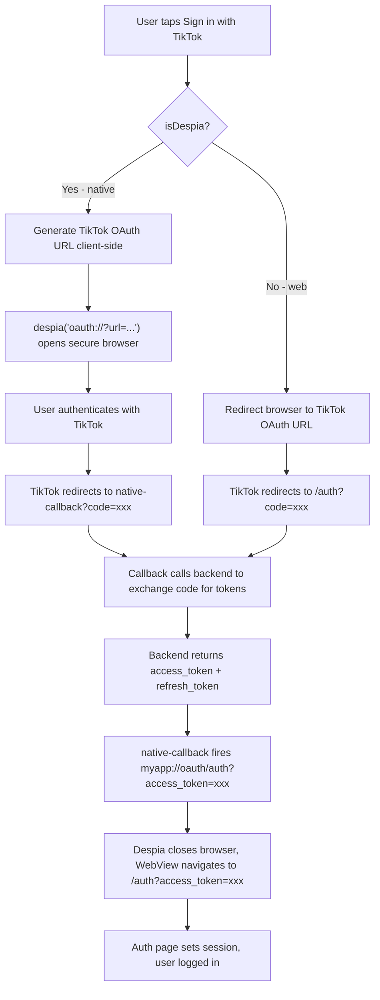

Sign In with TikTok using authorization code flow through the Despia OAuth bridge. Native opens a secure browser session via `oauth://`, web uses a standard redirect, and the code-to-token exchange always runs server-side because TikTok's Client Secret cannot be exposed client-side.

<Info>
  All native capabilities here come from `despia-native`. No additional native libraries are needed.
</Info>

---

## Installation

<Tabs>
  <Tab title="Bundle">
    <CodeGroup>

    ```bash npm
    npm install despia-native
    ```

    ```bash pnpm
    pnpm add despia-native
    ```

    ```bash yarn
    yarn add despia-native
    ```

    </CodeGroup>

    ```javascript
    import despia from 'despia-native';
    ```
  </Tab>
  <Tab title="CDN">
    <CodeGroup>

    ```html UMD
    <script src="https://cdn.jsdelivr.net/npm/despia-native/index.min.js"></script>
    ```

    ```html ESM
    <script type="module">
        import despia from 'https://cdn.jsdelivr.net/npm/despia-native/+esm'
    </script>
    ```

    </CodeGroup>
  </Tab>
</Tabs>

---

## How TikTok OAuth differs from Google

TikTok uses the **authorization code flow**. This means tokens never arrive in the URL hash. Instead:

1. TikTok redirects to your callback with `?code=xxx` as a query param
2. Your backend exchanges the code for tokens using your Client Secret
3. Your backend returns the tokens to the callback page
4. The callback page fires the deeplink with the tokens

This is more secure than the implicit flow because your Client Secret never leaves your server. It also means you need a backend endpoint, so there is no hash-based shortcut.

|  | Google (Supabase implicit) | TikTok (authorization code) |
| --- | --- | --- |
| Tokens arrive via | URL hash `#access_token=xxx` | Query param `?code=xxx`, then backend exchange |
| Backend needed | No (Supabase handles it) | Yes, always |
| Client Secret exposed | No | Never (server-side only) |

---

## How it works


```mermaid placement="bottom"
flowchart TD
    A["User taps Sign in with TikTok"] --> B{"isDespia?"}
    B -->|"Yes - native"| C["Generate TikTok OAuth URL client-side"]
    B -->|"No - web"| W["Redirect browser to TikTok OAuth URL"]
    C --> D["despia('oauth://?url=...') opens secure browser"]
    D --> E["User authenticates with TikTok"]
    E --> F["TikTok redirects to native-callback?code=xxx"]
    F --> G["Callback calls backend to exchange code for tokens"]
    G --> H["Backend returns access_token + refresh_token"]
    H --> I["native-callback fires myapp://oauth/auth?access_token=xxx"]
    I --> J["Despia closes browser, WebView navigates to /auth?access_token=xxx"]
    J --> K["Auth page sets session, user logged in"]
    W --> L["TikTok redirects to /auth?code=xxx"]
    L --> G
```

---

## Platform detection

```javascript
const isDespia = navigator.userAgent.toLowerCase().includes('despia')
```

---

## Generating the TikTok OAuth URL

TikTok's Client Key is public, it is visible in the OAuth URL the user sees. You can generate the OAuth URL client-side. The Client Secret is never needed here.

Pass `deeplink_scheme` through the `state` parameter so your callback knows how to build the deeplink. TikTok echoes `state` back unchanged after auth.

<Info>
  Find your deeplink scheme at **Despia \> Publish \> Deeplink**. Replace `myapp` throughout with your actual scheme.
</Info>

```javascript
function getTikTokOAuthUrl(isNative, deeplinkScheme) {
    const TIKTOK_CLIENT_KEY = 'your_tiktok_client_key'  // public, safe client-side
    const APP_URL           = 'https://yourapp.com'

    const state       = crypto.randomUUID()
    const redirectUri = isNative
        ? `${APP_URL}/native-callback`
        : `${APP_URL}/auth`

    // Encode deeplink_scheme into state so the callback can read it
    const stateParam = isNative ? `${state}|${deeplinkScheme}` : state

    return 'https://www.tiktok.com/v2/auth/authorize/?' + new URLSearchParams({
        client_key:    TIKTOK_CLIENT_KEY,
        response_type: 'code',
        scope:         'user.info.basic',
        redirect_uri:  redirectUri,
        state:         stateParam,
    })
}
```

---

## Sign in button

<Tabs>
  <Tab title="React">
    ```jsx
    import despia from 'despia-native'
    
    const handleTikTokSignIn = () => {
        const isDespia = navigator.userAgent.toLowerCase().includes('despia')
        const oauthUrl = getTikTokOAuthUrl(isDespia, 'myapp') // Despia > Publish > Deeplink
    
        if (isDespia) {
            // Native: open secure browser session
            despia(`oauth://?url=${encodeURIComponent(oauthUrl)}`)
        } else {
            // Web: standard redirect
            window.location.href = oauthUrl
        }
    }
    ```
  </Tab>
  <Tab title="HTML">
    ```html
    <button id="tiktok-signin-btn">Sign in with TikTok</button>
    
    <script>
      document.getElementById('tiktok-signin-btn').addEventListener('click', function () {
        var isDespia = navigator.userAgent.toLowerCase().includes('despia')
        var oauthUrl = getTikTokOAuthUrl(isDespia, 'myapp') // Despia > Publish > Deeplink
    
        if (isDespia) {
          despia('oauth://?url=' + encodeURIComponent(oauthUrl))
        } else {
          window.location.href = oauthUrl
        }
      })
    </script>
    ```
  </Tab>
</Tabs>

---

## Backend, exchange the authorization code

Your backend receives the `code` from the callback page, exchanges it with TikTok for tokens, optionally fetches the user profile, then returns the tokens to the client. The Client Secret is only ever used server-side.

<Tabs>
  <Tab title="Custom Backend">
    ```javascript
    // POST /api/auth/tiktok-callback
    export async function POST(req) {
        const { code, redirect_uri } = await req.json()
    
        // Exchange code for TikTok access token
        const tokenRes = await fetch('https://open.tiktokapis.com/v2/oauth/token/', {
            method:  'POST',
            headers: { 'Content-Type': 'application/x-www-form-urlencoded' },
            body: new URLSearchParams({
                client_key:    process.env.TIKTOK_CLIENT_KEY,
                client_secret: process.env.TIKTOK_CLIENT_SECRET,
                code,
                grant_type:    'authorization_code',
                redirect_uri,
            }),
        })
        const tokenData = await tokenRes.json()
    
        if (!tokenData.access_token) {
            return Response.json({ error: 'Token exchange failed' }, { status: 400 })
        }
    
        // Optionally fetch TikTok user profile
        const userRes = await fetch(
            'https://open.tiktokapis.com/v2/user/info/?fields=open_id,display_name,avatar_url',
            { headers: { Authorization: `Bearer ${tokenData.access_token}` } }
        )
        const userData = await userRes.json()
    
        // Create or sign in the user in your own system, return your own session tokens
        const session = await createOrSignInUser({
            tiktokOpenId:  tokenData.open_id,
            displayName:   userData.data?.user?.display_name,
            avatarUrl:     userData.data?.user?.avatar_url,
            tiktokToken:   tokenData.access_token,
        })
    
        return Response.json({
            access_token:  session.access_token,
            refresh_token: session.refresh_token,
        })
    }
    ```
  </Tab>
  <Tab title="No-Code Platform (Supabase)">
    TikTok is not a native Supabase auth provider. Use a Supabase Edge Function to exchange the code, create or find the Supabase user, and generate a real session using `generateLink()` and `verifyOtp()`. Do not attempt to create JWTs manually, they will fail with `bad_jwt` errors.

    ```typescript
    // supabase/functions/auth-tiktok-callback/index.ts
    import { serve } from 'https://deno.land/std@0.168.0/http/server.ts'
    import { createClient } from 'https://esm.sh/@supabase/supabase-js@2'
    
    serve(async (req) => {
        if (req.method === 'OPTIONS') return new Response(null, { headers: corsHeaders })
    
        const { code, redirect_uri } = await req.json()
    
        const clientKey    = Deno.env.get('TIKTOK_CLIENT_KEY')
        const clientSecret = Deno.env.get('TIKTOK_CLIENT_SECRET')
        const supabaseUrl  = Deno.env.get('SUPABASE_URL')
    
        // Exchange code for TikTok tokens
        const tokenRes = await fetch('https://open.tiktokapis.com/v2/oauth/token/', {
            method:  'POST',
            headers: { 'Content-Type': 'application/x-www-form-urlencoded' },
            body: new URLSearchParams({
                client_key: clientKey, client_secret: clientSecret,
                code, grant_type: 'authorization_code', redirect_uri,
            }),
        })
        const { access_token, open_id } = await tokenRes.json()
    
        // Fetch TikTok user info
        const userRes  = await fetch(
            'https://open.tiktokapis.com/v2/user/info/?fields=open_id,display_name,avatar_url',
            { headers: { Authorization: `Bearer ${access_token}` } }
        )
        const tiktokUser = (await userRes.json()).data?.user
    
        // Use admin client to create/find the user
        const admin   = createClient(supabaseUrl, Deno.env.get('SUPABASE_SERVICE_ROLE_KEY'))
        const public_ = createClient(supabaseUrl, Deno.env.get('SUPABASE_ANON_KEY'))
    
        const email = `${open_id.toLowerCase()}@tiktok.oauth`
    
        let { error: createErr } = await admin.auth.admin.createUser({
            email, email_confirm: true,
            user_metadata: { tiktok_open_id: open_id, display_name: tiktokUser?.display_name, avatar_url: tiktokUser?.avatar_url },
        })
    
        // If user already exists that is fine, continue
    
        // Generate a real Supabase session via magic link + verifyOtp
        // Do NOT create JWTs manually, this is the correct approach
        const { data: link } = await admin.auth.admin.generateLink({ type: 'magiclink', email })
        const { data: session } = await public_.auth.verifyOtp({
            token_hash: link.properties.hashed_token,
            type: 'email',  // use 'magiclink' for Supabase JS < 2.39
        })
    
        return new Response(
            JSON.stringify({ access_token: session.session.access_token, refresh_token: session.session.refresh_token }),
            { headers: { ...corsHeaders, 'Content-Type': 'application/json' } }
        )
    })
    ```

    Add to `supabase/config.toml`:

    ```toml
    [functions.auth-tiktok-callback]
    verify_jwt = false
    ```

    Add secrets in Supabase Dashboard under **Project Settings \> Edge Functions**:

    ```text
    TIKTOK_CLIENT_KEY=your_client_key
    TIKTOK_CLIENT_SECRET=your_client_secret
    ```

    <Info>
      `SUPABASE_URL`, `SUPABASE_ANON_KEY`, and `SUPABASE_SERVICE_ROLE_KEY` are provided automatically. Use `SUPABASE_ANON_KEY` not `SUPABASE_PUBLISHABLE_KEY` or you will get a "supabaseKey is required" error.
    </Info>
  </Tab>
</Tabs>

---

## The native-callback.html bridge

This page runs inside the secure browser session. TikTok redirects here with `?code=xxx`. Unlike Google's implicit flow, the code arrives as a **query param, not a hash fragment**, so React Router stripping the hash is not a concern here. A plain HTML file is still recommended to keep it simple and ensure it always runs fresh.

<Info>
  The code exchange happens inside this page via a `fetch` call to your backend. The page stays open while the exchange happens, then fires the deeplink to close the session.
</Info>

```html
<!-- public/native-callback.html -->
<!DOCTYPE html>
<html lang="en">
<head>
  <meta charset="UTF-8" />
  <meta name="viewport" content="width=device-width, initial-scale=1.0" />
  <title>Completing sign in...</title>
  <style>
    body { margin: 0; display: flex; align-items: center; justify-content: center;
           min-height: 100vh; font-family: -apple-system, BlinkMacSystemFont, sans-serif;
           background: #fff; color: #888; font-size: 14px; }
  </style>
</head>
<body>
  <p>Completing sign in...</p>
  <script>
    (function () {
      var params = new URLSearchParams(window.location.search)
      var code   = params.get('code')
      var state  = params.get('state')
      var error  = params.get('error')

      // Extract deeplink_scheme from state (format: "uuid|scheme" or just "uuid")
      var scheme = 'myapp' // fallback - replace with your scheme
      if (state && state.includes('|')) {
        scheme = state.split('|')[1] || scheme
      }

      if (error || !code) {
        window.location.href = scheme + '://oauth/auth?error=' + encodeURIComponent(error || 'no_code')
        return
      }

      // Exchange code for tokens via your backend
      fetch('/api/auth/tiktok-callback', {
        method:  'POST',
        headers: { 'Content-Type': 'application/json' },
        body:    JSON.stringify({
          code,
          redirect_uri: window.location.origin + '/native-callback',
        }),
      })
        .then(function (r) { return r.json() })
        .then(function (data) {
          if (!data.access_token) {
            window.location.href = scheme + '://oauth/auth?error=' + encodeURIComponent(data.error || 'exchange_failed')
            return
          }
          // The oauth/ prefix tells Despia to close the secure browser session
          window.location.href =
            scheme + '://oauth/auth' +
            '?access_token='  + encodeURIComponent(data.access_token) +
            '&refresh_token=' + encodeURIComponent(data.refresh_token || '')
        })
        .catch(function (err) {
          window.location.href = scheme + '://oauth/auth?error=' + encodeURIComponent('network_error')
        })
    })()
  </script>
</body>
</html>
```

If you prefer a React component:

```jsx
// src/pages/NativeCallback.jsx
import { useEffect } from 'react'
import { useSearchParams } from 'react-router-dom'

const NativeCallback = () => {
    useEffect(() => {
        const params = new URLSearchParams(window.location.search)
        const code   = params.get('code')
        const state  = params.get('state')
        const error  = params.get('error')

        let scheme = 'myapp'
        if (state && state.includes('|')) scheme = state.split('|')[1] || scheme

        if (error || !code) {
            window.location.href = scheme + '://oauth/auth?error=' + encodeURIComponent(error || 'no_code')
            return
        }

        fetch('/api/auth/tiktok-callback', {
            method:  'POST',
            headers: { 'Content-Type': 'application/json' },
            body:    JSON.stringify({ code, redirect_uri: window.location.origin + '/native-callback' }),
        })
            .then(r => r.json())
            .then(data => {
                if (!data.access_token) {
                    window.location.href = scheme + '://oauth/auth?error=' + encodeURIComponent(data.error || 'exchange_failed')
                    return
                }
                window.location.href =
                    scheme + '://oauth/auth' +
                    '?access_token='  + encodeURIComponent(data.access_token) +
                    '&refresh_token=' + encodeURIComponent(data.refresh_token || '')
            })
    }, [])

    return (
        <div style={{ display: 'flex', justifyContent: 'center', alignItems: 'center', minHeight: '100vh' }}>
            <p>Completing sign in...</p>
        </div>
    )
}

export default NativeCallback
```

```jsx
<Route path="/native-callback" element={<NativeCallback />} />
```

<Danger>
  The `oauth/` prefix in the deeplink is required. `myapp://oauth/auth` closes the browser session and navigates the WebView to `/auth`. `myapp://auth` without it does nothing and the user stays stuck in the browser.
</Danger>

---

## Handling tokens at /auth

After Despia closes the session and navigates to `/auth?access_token=xxx`, your auth page reads the token and sets the session. The web flow also lands here after exchanging the code.

<Info>
  If `/auth` is already mounted when the deeplink arrives, your framework updates the URL without remounting. Token-reading logic that only runs on mount has already fired with empty params and will not run again. The fix is framework-specific and covered in the tabs below.
</Info>

<Tabs>
  <Tab title="React">
    ```jsx
    // src/pages/Auth.jsx
    import { useEffect } from 'react'
    import { useSearchParams, useNavigate } from 'react-router-dom'
    
    const Auth = () => {
        const [searchParams] = useSearchParams()
        const navigate = useNavigate()
    
        useEffect(() => {
            const code         = searchParams.get('code')         // web flow
            const accessToken  = searchParams.get('access_token') // native deeplink flow
            const refreshToken = searchParams.get('refresh_token') || ''
            const error        = searchParams.get('error')
    
            if (error) { console.error(error); return }
    
            if (accessToken) {
                // Native flow: tokens already exchanged in native-callback
                setSession({ access_token: accessToken, refresh_token: refreshToken })
                    .then(() => navigate('/'))
    
            } else if (code) {
                // Web flow: exchange code now
                fetch('/api/auth/tiktok-callback', {
                    method:  'POST',
                    headers: { 'Content-Type': 'application/json' },
                    body:    JSON.stringify({ code, redirect_uri: window.location.origin + '/auth' }),
                })
                    .then(r => r.json())
                    .then(data => {
                        if (data.access_token) {
                            setSession({ access_token: data.access_token, refresh_token: data.refresh_token || '' })
                                .then(() => navigate('/'))
                        }
                    })
            }
        }, [searchParams, navigate]) // searchParams in deps is critical for already-mounted pages
    
        return (
            <div style={{ display: 'flex', justifyContent: 'center', alignItems: 'center', minHeight: '100vh' }}>
                <p>Signing you in...</p>
            </div>
        )
    }
    
    export default Auth
    ```
  </Tab>
  <Tab title="Vue">
    ```vue
    <template>
      <div style="display:flex;justify-content:center;align-items:center;min-height:100vh">
        <p>Signing you in...</p>
      </div>
    </template>
    
    <script>
    export default {
      watch: {
        '$route.query': {
          immediate: true,
          async handler(query) {
            const { code, access_token, refresh_token, error } = query
            if (error) { console.error(error); return }
    
            if (access_token) {
                await setSession({ access_token, refresh_token: refresh_token || '' })
                this.$router.push('/')
            } else if (code) {
                const res  = await fetch('/api/auth/tiktok-callback', {
                    method: 'POST', headers: { 'Content-Type': 'application/json' },
                    body: JSON.stringify({ code, redirect_uri: window.location.origin + '/auth' }),
                })
                const data = await res.json()
                if (data.access_token) {
                    await setSession({ access_token: data.access_token, refresh_token: data.refresh_token || '' })
                    this.$router.push('/')
                }
            }
          }
        }
      }
    }
    </script>
    ```
  </Tab>
  <Tab title="Vanilla JS SPA">
    ```javascript
    function handleAuthParams() {
        var p            = new URLSearchParams(window.location.search)
        var code         = p.get('code')
        var accessToken  = p.get('access_token')
        var refreshToken = p.get('refresh_token') || ''
        var error        = p.get('error')
    
        if (error) { console.error(error); return }
    
        if (accessToken) {
            setSession({ access_token: accessToken, refresh_token: refreshToken })
                .then(function () { window.location.href = '/' })
        } else if (code) {
            fetch('/api/auth/tiktok-callback', {
                method: 'POST', headers: { 'Content-Type': 'application/json' },
                body: JSON.stringify({ code, redirect_uri: window.location.origin + '/auth' }),
            })
                .then(function (r) { return r.json() })
                .then(function (data) {
                    if (data.access_token) {
                        setSession({ access_token: data.access_token, refresh_token: data.refresh_token || '' })
                            .then(function () { window.location.href = '/' })
                    }
                })
        }
    }
    
    handleAuthParams()
    window.addEventListener('popstate', handleAuthParams)
    ```
  </Tab>
  <Tab title="HTML">
    ```html
    <p id="status">Signing you in...</p>
    
    <script>
      function handleAuthParams() {
        var p            = new URLSearchParams(window.location.search)
        var code         = p.get('code')
        var accessToken  = p.get('access_token')
        var refreshToken = p.get('refresh_token') || ''
        var error        = p.get('error')
    
        if (!code && !accessToken && !error) return
        if (error) { document.getElementById('status').textContent = 'Sign in failed: ' + error; return }
    
        if (accessToken) {
          setSession({ access_token: accessToken, refresh_token: refreshToken })
            .then(function () { window.location.href = '/' })
    
        } else if (code) {
          fetch('/api/auth/tiktok-callback', {
            method: 'POST', headers: { 'Content-Type': 'application/json' },
            body: JSON.stringify({ code, redirect_uri: window.location.origin + '/auth' }),
          })
            .then(function (r) { return r.json() })
            .then(function (data) {
              if (data.access_token) {
                setSession({ access_token: data.access_token, refresh_token: data.refresh_token || '' })
                  .then(function () { window.location.href = '/' })
              }
            })
        }
      }
    
      handleAuthParams()
      window.addEventListener('popstate', handleAuthParams)
    </script>
    ```
  </Tab>
</Tabs>

<Info>
  `setSession()` is a placeholder. Replace with your auth provider's equivalent: `supabase.auth.setSession()` for Supabase, your own session management for a custom backend.
</Info>

---

## Complete cross-platform handler

<Tabs>
  <Tab title="React">
    ```jsx
    import despia from 'despia-native'
    
    const isDespia = navigator.userAgent.toLowerCase().includes('despia')
    
    const handleTikTokSignIn = () => {
        const oauthUrl = getTikTokOAuthUrl(isDespia, 'myapp') // Despia > Publish > Deeplink
    
        if (isDespia) {
            despia(`oauth://?url=${encodeURIComponent(oauthUrl)}`)
        } else {
            window.location.href = oauthUrl
        }
    }
    ```
  </Tab>
  <Tab title="HTML">
    ```html
    <button id="tiktok-signin-btn">Sign in with TikTok</button>
    
    <script>
      var isDespia = navigator.userAgent.toLowerCase().includes('despia')
    
      document.getElementById('tiktok-signin-btn').addEventListener('click', function () {
        var oauthUrl = getTikTokOAuthUrl(isDespia, 'myapp') // Despia > Publish > Deeplink
    
        if (isDespia) {
          despia('oauth://?url=' + encodeURIComponent(oauthUrl))
        } else {
          window.location.href = oauthUrl
        }
      })
    </script>
    ```
  </Tab>
</Tabs>

---

## TikTok Developer Portal setup

<Steps>
  <Step title="Create an app">
    Go to [developers.tiktok.com](https://developers.tiktok.com), create an app, and add the **Login Kit** product.
  </Step>
  <Step title="Configure redirect URIs">
    Under Login Kit settings, add both redirect URIs:

    - `https://yourapp.com/auth` for the web flow
    - `https://yourapp.com/native-callback` for the native flow

    Both must be registered exactly as they appear in your code.
  </Step>
  <Step title="Request scopes">
    Request at minimum `user.info.basic`. This provides `open_id`, `display_name`, and `avatar_url`. Additional scopes (`user.info.profile`, `user.info.stats`) are optional.
  </Step>
  <Step title="Note your credentials">
    Copy your **Client Key** (public, used client-side) and **Client Secret** (private, server-side only). Store the Client Secret in your backend environment variables only. Never expose it client-side.
  </Step>
  <Step title="Configure your deeplink scheme">
    Find your scheme at **Despia \> Publish \> Deeplink** and replace `myapp` in your code with the actual value.
  </Step>
</Steps>

---

## Debugging

Use this section when the native OAuth flow is not working. Start by identifying which stage is broken:

```text
Stage 1  Client generates TikTok OAuth URL
Stage 2  despia('oauth://?url=...') opens the secure browser session
Stage 3  TikTok redirects to native-callback with ?code=xxx
Stage 4  native-callback calls your backend to exchange the code
Stage 5  Backend returns tokens, native-callback fires deeplink
Stage 6  Despia closes browser, WebView navigates to /auth?access_token=xxx
```

### Debug overlay

Add this to your `/auth` page during development. Remove it before submitting to the App Store or Google Play.

<Tabs>
  <Tab title="React">
    ```jsx
    // src/pages/AuthDebug.jsx, swap in as /auth route during testing only
    import { useEffect, useState } from 'react'
    import { useSearchParams } from 'react-router-dom'
    
    const AuthDebug = () => {
        const [searchParams] = useSearchParams()
        const [info, setInfo] = useState('')
    
        useEffect(() => {
            setInfo(
                'Full URL:\n'      + window.location.href                         + '\n\n' +
                'code:\n'          + (searchParams.get('code')          || '(none)') + '\n\n' +
                'access_token:\n'  + (searchParams.get('access_token')  || '(none)') + '\n\n' +
                'refresh_token:\n' + (searchParams.get('refresh_token') || '(none)') + '\n\n' +
                'error:\n'         + (searchParams.get('error')         || '(none)')
            )
        }, [searchParams])
    
        return (
            <div style={{ padding: 20, fontFamily: 'monospace', fontSize: 12 }}>
                <p style={{ marginBottom: 8, fontWeight: 'bold' }}>Auth Debug, remove before shipping</p>
                <textarea readOnly value={info} style={{ width: '100%', height: 260, fontSize: 12, border: '1px solid #ccc', padding: 10, boxSizing: 'border-box', fontFamily: 'monospace' }} />
                <p style={{ marginTop: 8, fontSize: 11 }}>
                    code present, no access_token? The code exchange in native-callback failed or did not happen.<br />
                    access_token present but not signed in? Your auth logic is not reacting to URL changes. See Handling tokens at /auth.
                </p>
            </div>
        )
    }
    
    export default AuthDebug
    ```

    ```jsx
    <Route path="/auth" element={<AuthDebug />} /> // testing
    <Route path="/auth" element={<Auth />} />       // production
    ```
  </Tab>
  <Tab title="HTML">
    ```html
    <!-- AUTH DEBUG, remove before shipping -->
    <div id="auth-debug" style="position:fixed;bottom:0;left:0;right:0;background:#fff;font-family:monospace;font-size:12px;padding:10px;z-index:9999;border-top:1px solid #ccc;">
      <div style="font-weight:bold;margin-bottom:6px;">Auth Debug, remove before shipping</div>
      <textarea id="auth-debug-out" readonly style="width:100%;height:120px;border:1px solid #ccc;font-size:11px;font-family:monospace;padding:6px;box-sizing:border-box;resize:none;outline:none;display:block;"></textarea>
      <div style="font-size:10px;margin-top:6px;color:#555;">
        code present, no access_token? The code exchange in native-callback failed.<br />
        access_token present but not signed in? Your auth logic is not reacting to URL changes. See Handling tokens at /auth.
      </div>
    </div>
    <script>
      function updateDebug() {
        var el = document.getElementById('auth-debug-out')
        if (!el) return
        var p  = new URLSearchParams(window.location.search)
        el.value =
          'Full URL:\n'      + window.location.href          + '\n\n' +
          'code:\n'          + (p.get('code')          || '(none)') + '\n\n' +
          'access_token:\n'  + (p.get('access_token')  || '(none)') + '\n\n' +
          'refresh_token:\n' + (p.get('refresh_token') || '(none)') + '\n\n' +
          'error:\n'         + (p.get('error')         || '(none)')
      }
      updateDebug()
      window.addEventListener('popstate', updateDebug)
    </script>
    <!-- END AUTH DEBUG -->
    ```
  </Tab>
</Tabs>

### Reading the output

| What you see | What it means | Where to look |
| --- | --- | --- |
| Textarea empty, URL has no params | Token never reached `/auth` | Stage 2-5, check native-callback and deeplink |
| `code` present, no `access_token` | Code arrived but exchange did not happen or failed | native-callback code exchange, check your backend endpoint |
| `error: no_code` | native-callback received no code from TikTok | Check TikTok redirect URI matches exactly |
| `error: exchange_failed` | Backend rejected the code exchange | Check Client Secret is correct and redirect\_uri matches |
| `error: access_denied` | User cancelled or TikTok rejected the request | User cancelled, or app not approved for requested scopes |
| Token present, user not signed in | Token arrived but auth logic did not run | Already-mounted page, see Handling tokens at /auth |

### Common failure points

**Secure browser session does not open.** Log the URL before passing to `despia()` and confirm it starts with `https://www.tiktok.com/v2/auth/authorize/`.

**TikTok redirects to wrong URL.** Both `https://yourapp.com/auth` and `https://yourapp.com/native-callback` must be registered in the TikTok Developer Portal under Login Kit. The redirect URI in your code must match exactly including the protocol and no trailing slash.

**Code exchange fails.** The `redirect_uri` sent to your backend must exactly match what was used in the original OAuth URL. A mismatch will cause TikTok to reject the exchange even if the code is valid.

**Deeplink does not close the browser session.** `oauth/` must be present, `myapp://oauth/auth`. Without it Despia does not intercept the deeplink. Find your scheme at **Despia \> Publish \> Deeplink**.

**Tokens arrive but sign-in never completes.** The auth page was already mounted when the deeplink arrived. See Handling tokens at /auth for framework-specific fixes.

**Supabase `bad_jwt` error.** You are creating JWTs manually. Use `generateLink()` and `verifyOtp()` instead to generate real Supabase sessions.

### Pre-submission checklist

<AccordionGroup>
  <Accordion title="TikTok Developer Portal">
    - App created with Login Kit enabled
    - Redirect URI `https://yourapp.com/auth` registered
    - Redirect URI `https://yourapp.com/native-callback` registered
    - `user.info.basic` scope requested
    - Client Key and Client Secret noted
  </Accordion>

  <Accordion title="Native flow">
    - OAuth URL generated client-side with correct Client Key
    - `deeplink_scheme` passed through `state` param as `uuid|scheme`
    - `native-callback` page calls backend to exchange `code`, fires deeplink with tokens
    - Deeplink is `{scheme}://oauth/{path}`, `oauth/` prefix present
    - Deeplink scheme matches **Despia \> Publish \> Deeplink**
    - `/auth` token handler re-runs on URL change, not only on initial mount
  </Accordion>

  <Accordion title="Backend">
    - `TIKTOK_CLIENT_SECRET` stored in environment variables only, never client-side
    - Code exchange uses matching `redirect_uri` in both the OAuth URL and the token request
    - For Supabase, `generateLink()` and `verifyOtp()` used, not manual JWTs
  </Accordion>

  <Accordion title="Before submission">
    - Debug overlay removed from `/auth` page
    - Sign in tested on a physical device
    - Sign in tested on both iOS and Android
    - Error state tested, cancel the TikTok dialog and confirm the app handles it gracefully
  </Accordion>
</AccordionGroup>

---

## Deeplink reference

| Deeplink | Result |
| --- | --- |
| `myapp://oauth/auth?access_token=xxx` | Closes session, WebView navigates to `/auth?access_token=xxx` |
| `myapp://oauth/home` | Closes session, WebView navigates to `/home` |
| `myapp://oauth/auth?error=access_denied` | Closes session, WebView navigates to `/auth?error=access_denied` |
| `myapp://auth?access_token=xxx` | Session stays open, user is stuck |

---

## FAQ

<AccordionGroup>
  <Accordion title="Why does TikTok need a backend but Google does not (with Supabase)?">
    TikTok uses authorization code flow, which requires exchanging a short-lived code for tokens using your Client Secret. The Client Secret must never be exposed client-side. Supabase handles Google's exchange internally, which is why the Google flow appears to not need a backend. For TikTok you always need a backend endpoint to do the exchange.
  </Accordion>

  <Accordion title="Why is the code exchanged in native-callback, not in /auth?">
    The native-callback page runs inside the secure browser session (Chrome Custom Tabs / ASWebAuthenticationSession). Doing the exchange here means the tokens are ready before the deeplink fires. If you waited until `/auth`, you would need to carry the raw `code` through the deeplink instead of the tokens, which is possible but adds an extra round trip after the browser closes.
  </Accordion>

  <Accordion title="What does the oauth/ prefix do?">
    It signals Despia to close the secure browser session and navigate the WebView to the path that follows. `myapp://oauth/auth` closes the session and opens `/auth`. Without `oauth/` the deeplink is ignored and the user stays in the browser.
  </Accordion>

  <Accordion title="Why pass deeplink_scheme through state?">
    Once TikTok opens the secure browser session, your native-callback page has no direct access to the original Despia context. The `state` parameter is the only value TikTok echoes back unchanged, making it the correct carrier for anything your callback needs to know about the original request.
  </Accordion>

  <Accordion title="Tokens are in the URL but the user is not signed in.">
    The `/auth` page was already open when the deeplink arrived. Your framework updated the URL without reloading.

    Fix per framework:

    - **React**, add `searchParams` to your `useEffect` dependency array
    - **Vue**, use `watch: { '$route.query': { immediate: true, handler } }` instead of `mounted()`
    - **Vanilla JS / HTML**, call your handler on load and add `window.addEventListener('popstate', handler)`
  </Accordion>
</AccordionGroup>

---

## Resources

<CardGroup cols={2}>
  <Card title="NPM Package" icon="npm" href="https://www.npmjs.com/package/despia-native">
    despia-native
  </Card>

  <Card title="OAuth Reference" icon="book" href="https://setup.despia.com/native-features/oauth/generic">
    Generic OAuth protocol docs
  </Card>

  <Card title="TikTok Developer Portal" icon="link" href="https://developers.tiktok.com/">
    Configure your TikTok OAuth app
  </Card>

  <Card title="Support" icon="envelope" href="mailto:support@despia.com">
    [support@despia.com](mailto:support@despia.com)
  </Card>
</CardGroup>